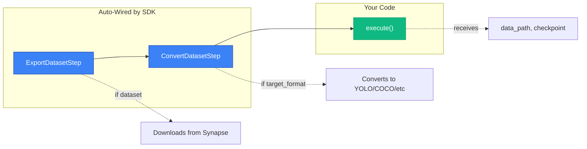

# Train Actions

Train actions provide a base class for building model training workflows. Extend `BaseTrainAction` to create custom training plugins with automatic dataset handling, checkpoint management, and model uploads.

## Overview

`BaseTrainAction` simplifies training workflows by **automatically handling**:
- Dataset export from Synapse
- Dataset conversion to your target format (YOLO, COCO, etc.)
- Checkpoint resolution
- Step orchestration and progress tracking

You only need to set `target_format` and implement `execute()`.

### At a Glance

| Feature | Description |
|---------|-------------|
| Auto dataset export | Automatically downloads dataset if `dataset` in params |
| Auto conversion | Converts to `target_format` (yolo, coco, etc.) |
| Checkpoint support | Resolved and passed to `execute()` |
| Progress tracking | Built-in step-based progress |
| Customizable | Override `setup_steps()` for full control |

## Quick Start

The simplest way to create a training action:

```python
from pathlib import Path
from synapse_sdk.plugins.actions.train import BaseTrainAction, BaseTrainParams

class TrainParams(BaseTrainParams):
    dataset: int  # Dataset is always from Synapse
    epochs: int = 100

class TrainAction(BaseTrainAction[TrainParams]):
    target_format = 'yolo'  # Auto-converts dataset to YOLO format

    def execute(self, data_path: Path, checkpoint: dict | None) -> dict:
        # data_path: resolved path to dataset.yaml
        # checkpoint: resolved checkpoint dict with 'path' and 'category'
        
        model = YOLO(checkpoint['path'] / 'best.pt')
        model.train(data=str(data_path), epochs=self.params.epochs)
        return {'weights_path': './weights'}
```

That's it. The SDK handles everything else.

## How It Works



When you provide `dataset` in params:
1. **ExportDatasetStep** downloads the dataset from Synapse
2. **ConvertDatasetStep** converts it to your `target_format`
3. Your **`execute()`** receives the resolved `data_path` and `checkpoint`

If you provide `data_path` instead of `dataset`, steps 1-2 are skipped.

## Configuration

### target_format

Set the `target_format` class attribute to specify dataset conversion:

```python
class TrainAction(BaseTrainAction[TrainParams]):
    target_format = 'yolo'  # Converts to YOLO format with dataset.yaml
```

| Format | Description | Config File |
|--------|-------------|-------------|
| `'yolo'` | YOLO format | `dataset.yaml` |
| `'coco'` | COCO JSON format | `annotations.json` |
| `None` | No conversion (raw Datamaker) | - |

### execute() Signature

The SDK resolves data path and checkpoint for you:

```python
def execute(self, data_path: Path, checkpoint: dict | None) -> Any:
    """
    Args:
        data_path: Path to dataset config (e.g., dataset.yaml for YOLO).
                   Resolved from export/convert steps or params.data_path.
        checkpoint: Dict with 'path', 'category', 'id', 'name', or None.
                   Resolved from params.checkpoint or ctx.checkpoint.
    
    Returns:
        Training result (dict or result_model instance).
    """
```

### Params

Extend `BaseTrainParams` with your training parameters:

```python
from pydantic import Field
from synapse_sdk.plugins.actions.train import BaseTrainParams

class TrainParams(BaseTrainParams):
    # Dataset source - always from Synapse
    dataset: int = Field(description='Synapse dataset ID')
    splits: dict | None = Field(default=None, description='Split definitions')
    
    # Training params
    epochs: int = Field(default=100)
    batch_size: int = Field(default=16)
    learning_rate: float = Field(default=0.001)
    
    # checkpoint is inherited from BaseTrainParams
```

## Complete Example

```python
from pathlib import Path
from typing import Any

from pydantic import BaseModel, Field
from synapse_sdk.plugins.actions.train import BaseTrainAction, BaseTrainParams


class TrainParams(BaseTrainParams):
    """YOLO training parameters."""
    dataset: int = Field(description='Synapse dataset ID')
    splits: dict[str, Any] | None = Field(default=None, description='Split definitions')
    epochs: int = Field(default=100, ge=1, le=1000)
    batch_size: int = Field(default=16, ge=1)
    image_size: int = Field(default=640)


class TrainResult(BaseModel):
    """Training result."""
    weights_path: str
    final_mAP: float | None = None


class YOLOTrainAction(BaseTrainAction[TrainParams]):
    """YOLO training with auto dataset handling."""
    
    action_name = 'train'
    target_format = 'yolo'
    result_model = TrainResult

    def execute(self, data_path: Path, checkpoint: dict[str, Any] | None) -> TrainResult:
        from ultralytics import YOLO
        
        self.autolog('ultralytics')  # Enable metric logging
        
        if checkpoint is None:
            raise ValueError('Checkpoint required')
        
        # Load model from checkpoint
        model = YOLO(checkpoint['path'] / 'best.pt')
        
        # Train
        results = model.train(
            data=str(data_path),
            epochs=self.params.epochs,
            batch=self.params.batch_size,
            imgsz=self.params.image_size,
        )
        
        return TrainResult(
            weights_path=str(results.save_dir / 'weights'),
            final_mAP=results.results_dict.get('metrics/mAP50-95(B)'),
        )
```

## Advanced: Custom Steps

Override `setup_steps()` when you need full control over the pipeline:

```python
from synapse_sdk.plugins.steps import StepRegistry, ExportDatasetStep, ConvertDatasetStep
from synapse_sdk.plugins.actions.train import TrainContext

class CustomTrainAction(BaseTrainAction[TrainParams]):
    
    def setup_steps(self, registry: StepRegistry[TrainContext]) -> None:
        # Custom pipeline - auto-wiring is disabled when you override this
        registry.register(ExportDatasetStep())
        registry.register(MyCustomPreprocessStep())  # Your custom step
        registry.register(ConvertDatasetStep(target_format='yolo'))
        registry.register(MyTrainStep())  # Your custom training step
```

### Built-in Steps

The SDK provides reusable steps you can use in custom pipelines:

| Step | Description |
|------|-------------|
| `ExportDatasetStep` | Downloads dataset from Synapse using `dataset` |
| `ConvertDatasetStep(target_format)` | Converts dataset to target format |

```python
from synapse_sdk.plugins.steps import ExportDatasetStep, ConvertDatasetStep

# Use in custom setup_steps()
registry.register(ExportDatasetStep())
registry.register(ConvertDatasetStep(target_format='coco'))
```

### Creating Custom Steps

```python
from synapse_sdk.plugins.steps import BaseStep, StepResult
from synapse_sdk.plugins.actions.train import TrainContext

class MyPreprocessStep(BaseStep[TrainContext]):
    @property
    def name(self) -> str:
        return 'preprocess'
    
    @property
    def progress_weight(self) -> float:
        return 0.1  # 10% of total progress
    
    def execute(self, context: TrainContext) -> StepResult:
        # Access dataset from previous step
        dataset_path = context.dataset['path']
        
        # Do preprocessing...
        processed_path = preprocess(dataset_path)
        
        # Update context for next step
        context.dataset['path'] = processed_path
        
        return StepResult(success=True)
```

## Helper Methods

Available on your action instance:

| Method | Description |
|--------|-------------|
| `self.autolog(framework)` | Enable automatic metric logging (e.g., `'ultralytics'`) |
| `self.get_checkpoint()` | Manually get checkpoint (usually not needed) |
| `self.create_model(path, **kwargs)` | Upload trained model to backend |
| `self.set_progress(curr, total, category)` | Report progress |

## TrainContext

For step-based workflows, `TrainContext` carries state between steps:

| Field | Type | Description |
|-------|------|-------------|
| `params` | `dict[str, Any]` | Training parameters |
| `dataset` | `dict` | Dataset info from export/convert steps |
| `model_path` | `str \| None` | Path to trained model |
| `client` | `BackendClient` | Backend API client |
| `runtime_ctx` | `RuntimeContext` | Parent runtime context |

## Migration from Old API

If you were using the old step-based approach:

**Before:**
```python
class TrainAction(BaseTrainAction[TrainParams]):
    def setup_steps(self, registry):
        registry.register(ExportStep())
        registry.register(ConvertStep())
        registry.register(TrainStep())
```

**After:**
```python
class TrainAction(BaseTrainAction[TrainParams]):
    target_format = 'yolo'  # Replaces ExportStep + ConvertStep
    
    def execute(self, data_path, checkpoint):
        # Your training logic (replaces TrainStep)
        ...
```

## Related

- [Step-Based Workflows](/plugins/steps-workflow) - Full step system documentation
- [Dataset Conversion](/plugins/dataset-conversion) - Supported formats
- [BaseAction](/plugins/defining-actions) - Parent class for all actions
