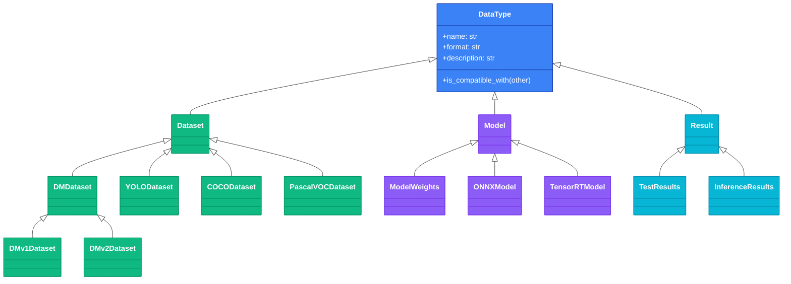

# Data Types

DataType defines semantic types for data flow between actions. When connecting actions in a pipeline, type compatibility is validated to prevent invalid data flows at construction time.

## Overview

### At a Glance

| Category | Purpose | Examples |
|----------|---------|----------|
| **Dataset** | Training and inference data | `YOLODataset`, `COCODataset`, `DMv2Dataset` |
| **Model** | Models and weights | `ModelWeights`, `ONNXModel`, `TensorRTModel` |
| **Result** | Execution results | `TestResults`, `InferenceResults` |

> **Good to know**: All types can be imported from `synapse_sdk.plugins.types`.

## DataType Base Class

`DataType` is the base class for all semantic types. It provides type compatibility checking and metadata definitions.

```python filename="synapse_sdk/plugins/types.py"
class DataType:
    """Base class for action input/output type declarations."""

    name: ClassVar[str] = 'data'
    format: ClassVar[str | None] = None
    description: ClassVar[str] = ''

    @classmethod
    def is_compatible_with(cls, other: type[DataType]) -> bool:
        """Check if this type is compatible with another type."""
        return issubclass(cls, other) or issubclass(other, cls)
```

### Class Attributes

| Attribute | Type | Description |
|-----------|------|-------------|
| `name` | `str` | Unique identifier for the type |
| `format` | `str \| None` | Data format (e.g., `'yolo'`, `'coco'`) |
| `description` | `str` | Human-readable description |

## Dataset Types

Dataset types define data formats used for training and inference.

| Type | Name | Format | Description |
|------|------|--------|-------------|
| `Dataset` | `dataset` | - | Generic dataset base type |
| `DMDataset` | `dm_dataset` | `dm` | Datamaker format dataset |
| `DMv1Dataset` | `dm_v1_dataset` | `dm_v1` | Datamaker v1 format |
| `DMv2Dataset` | `dm_v2_dataset` | `dm_v2` | Datamaker v2 format |
| `YOLODataset` | `yolo_dataset` | `yolo` | YOLO format with dataset.yaml |
| `COCODataset` | `coco_dataset` | `coco` | COCO format |
| `PascalVOCDataset` | `pascal_voc_dataset` | `pascal` | Pascal VOC format |

```python filename="example.py"
from synapse_sdk.plugins.types import (
    Dataset,
    DMDataset,
    DMv1Dataset,
    DMv2Dataset,
    YOLODataset,
    COCODataset,
    PascalVOCDataset,
)
```

## Model Types

Model types define trained models and converted model formats.

| Type | Name | Format | Description |
|------|------|--------|-------------|
| `Model` | `model` | - | Generic model base type |
| `ModelWeights` | `model_weights` | `weights` | Trained model weights |
| `ONNXModel` | `onnx_model` | `onnx` | ONNX format model |
| `TensorRTModel` | `tensorrt_model` | `tensorrt` | TensorRT format model |

```python filename="example.py"
from synapse_sdk.plugins.types import (
    Model,
    ModelWeights,
    ONNXModel,
    TensorRTModel,
)
```

## Result Types

Result types define categories of action execution results.

| Type | Name | Format | Description |
|------|------|--------|-------------|
| `Result` | `result` | - | Generic result base type |
| `TestResults` | `test_results` | `metrics` | Test/evaluation results with metrics |
| `InferenceResults` | `inference_results` | `predictions` | Inference predictions |

```python filename="example.py"
from synapse_sdk.plugins.types import (
    Result,
    TestResults,
    InferenceResults,
)
```

## Type Compatibility

Type compatibility is checked using the `is_compatible_with()` method. Two types are compatible if they share an inheritance relationship.

### Compatibility Rules

| Rule | Description | Example |
|------|-------------|---------|
| **Same class** | Identical types are compatible | `YOLODataset ↔ YOLODataset` |
| **Subclass** | Subtypes are compatible with parent types | `YOLODataset ↔ Dataset` |
| **Sibling** | Sibling types are incompatible | `YOLODataset ✗ COCODataset` |

```python filename="examples/compatibility.py"
from synapse_sdk.plugins.types import Dataset, YOLODataset, COCODataset

# Same class - compatible
YOLODataset.is_compatible_with(YOLODataset)  # True

# Subclass relationship - compatible
YOLODataset.is_compatible_with(Dataset)  # True
Dataset.is_compatible_with(YOLODataset)  # True

# Sibling classes - incompatible
YOLODataset.is_compatible_with(COCODataset)  # False
```

### Pipeline Validation

`ActionPipeline` automatically validates type compatibility between connected actions. The `output_type` of the previous action must be compatible with the `input_type` of the next action.

```python filename="examples/pipeline_validation.py"
from synapse_sdk.plugins.pipelines import ActionPipeline

# Type validation occurs during pipeline creation
pipeline = ActionPipeline(
    [DownloadAction, ConvertAction, TrainAction],
    validate_schemas=True,  # Enable schema validation
    strict=True,  # Raise error on incompatibility
)
```

> **Good to know**: Set `strict=False` to emit warnings instead of errors on type mismatch.

## Using Types in Actions

Declare `input_type` and `output_type` in action classes to specify what data types the action processes.

```python filename="my_plugin/actions/train.py"
from synapse_sdk.plugins.action import BaseAction
from synapse_sdk.plugins.types import YOLODataset, ModelWeights
from pydantic import BaseModel


class TrainParams(BaseModel):
    epochs: int = 10
    batch_size: int = 32


class TrainResult(BaseModel):
    weights_path: str
    final_loss: float


class TrainAction(BaseAction[TrainParams]):
    """Training action with type declarations."""

    input_type = YOLODataset      # Expects YOLO format dataset
    output_type = ModelWeights    # Produces trained model weights
    result_model = TrainResult

    def execute(self) -> TrainResult:
        # Training logic here
        return TrainResult(
            weights_path='/path/to/model.pt',
            final_loss=0.05
        )
```

### Action with No Input Type

Actions that don't receive external input, like dataset downloads, set `input_type = None`.

```python filename="my_plugin/actions/dataset.py"
from synapse_sdk.plugins.action import BaseAction
from synapse_sdk.plugins.types import YOLODataset


class DatasetAction(BaseAction[DatasetParams]):
    """Dataset download action."""

    input_type = None           # No input required
    output_type = YOLODataset   # Produces YOLO dataset

    def execute(self) -> DatasetResult:
        # Download and convert dataset
        ...
```

## Type Hierarchy



## Creating Custom Types

Define project-specific custom types by subclassing `DataType` or existing types.

```python filename="my_plugin/types.py"
from synapse_sdk.plugins.types import Dataset


class ImageDataset(Dataset):
    """Custom image dataset type."""

    name = 'image_dataset'
    format = 'images'
    description = 'Raw image files in a directory'


class SegmentationDataset(ImageDataset):
    """Segmentation dataset with masks."""

    name = 'segmentation_dataset'
    format = 'segmentation'
    description = 'Image dataset with segmentation masks'
```

> **Tip**: Custom types that inherit from existing types are automatically compatible with their parent types.

## Best Practices

- **Use specific types**: Prefer `YOLODataset` over `Dataset` when the format is known
- **Enable pipeline validation**: Set `validate_schemas=True` when using `ActionPipeline`
- **Inherit for custom types**: Subclass existing types to maintain compatibility
- **Use the format field**: Distinguish different formats within the same category using the `format` field

## Related

- [Defining Actions](./defining-actions) - Defining and implementing action classes
- [Pipelines](./pipelines) - Configuring and executing action pipelines
