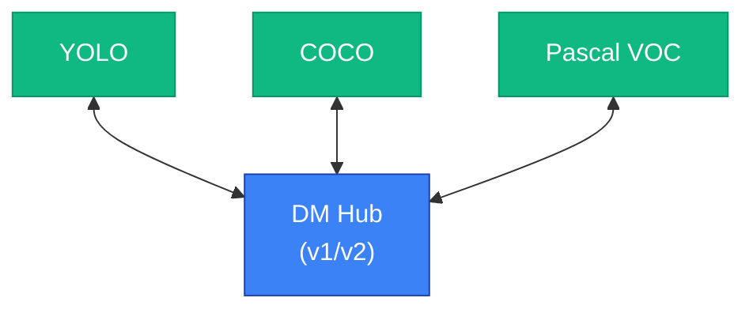

# Dataset Conversion

Use the hub-based architecture to convert your datasets between annotation formats. The DM (Datamaker) format serves as the central hub, enabling bidirectional conversion with external formats like YOLO.

## Overview

Dataset converters transform annotations between different ML framework formats. All conversions route through the DM format, simplifying the conversion matrix and ensuring consistent data handling.

### At a Glance

| Feature | Value |
|---------|-------|
| Hub Format | DM (Datamaker v1/v2) |
| Implemented | YOLO, COCO, Pascal VOC |
| Supported Annotations | Bounding box, Polygon, Keypoint, Segmentation |
| Bidirectional | Yes (DM ↔ YOLO, COCO, Pascal VOC) |

## Supported Formats

`DatasetFormat` enum defines all supported annotation formats.

```python filename="synapse_sdk/utils/converters/base.py"
from enum import StrEnum

class DatasetFormat(StrEnum):
    DM_V1 = 'dm_v1'    # Datamaker v1 format
    DM_V2 = 'dm_v2'    # Datamaker v2 format (default)
    YOLO = 'yolo'      # YOLO format
    COCO = 'coco'      # COCO format
    PASCAL = 'pascal'  # Pascal VOC format
```

| Format | Value | Description | Status |
|--------|-------|-------------|--------|
| `DM_V1` | `dm_v1` | Datamaker v1 schema (event-based) | Implemented |
| `DM_V2` | `dm_v2` | Datamaker v2 schema (collection-based) | Implemented |
| `YOLO` | `yolo` | YOLO detection/segmentation format | Implemented |
| `COCO` | `coco` | COCO JSON format | Implemented |
| `PASCAL` | `pascal` | Pascal VOC XML format | Implemented |

> **Note**: All converters use Pydantic models for type-safe data handling and validation.

### Conversion Matrix

| Source → Target | DM_V1 | DM_V2 | YOLO | COCO | PASCAL |
|-----------------|-------|-------|------|------|--------|
| **DM_V1** | - | ✓ | ✓ | ✓ | ✓ |
| **DM_V2** | ✓ | - | ✓ | ✓ | ✓ |
| **YOLO** | ✓ | ✓ | - | - | - |
| **COCO** | ✓ | ✓ | - | - | - |
| **PASCAL** | ✓ | ✓ | - | - | - |

## Converter Architecture

The converter system uses a hub-and-spoke architecture with DM format as the central hub.



1. **DM Hub**: All external formats convert to/from DM format
2. **Bidirectional**: Each format pair supports both directions
3. **Version Support**: DM v1 and v2 schemas are both supported

### Class Hierarchy

```python filename="synapse_sdk/utils/converters/base.py"
class BaseConverter:
    """Abstract base class for all converters."""
    def convert(self) -> Any: ...
    def save_to_folder(self, output_dir: str | Path) -> None: ...
    def convert_single_file(self, data: Any, original_file: IO, **kwargs) -> Any: ...

class FromDMConverter(BaseConverter):
    """Base class for DM → external format conversion."""
    source_format: DatasetFormat = DatasetFormat.DM_V2  # Set dynamically from dm_version
    target_format: DatasetFormat  # Set by subclass

    def __init__(self, ..., dm_version: DMVersion = DMVersion.V2):
        # source_format is set based on dm_version (V1 → DM_V1, V2 → DM_V2)
        ...

class ToDMConverter(BaseConverter):
    """Base class for external format → DM conversion."""
    source_format: DatasetFormat  # Set by subclass
    target_format: DatasetFormat = DatasetFormat.DM_V2  # Set dynamically from dm_version

    def __init__(self, ..., dm_version: DMVersion = DMVersion.V2):
        # target_format is set based on dm_version (V1 → DM_V1, V2 → DM_V2)
        ...
```

| Class | Direction | Purpose |
|-------|-----------|---------|
| `BaseConverter` | - | Abstract base with common utilities |
| `FromDMConverter` | DM → External | Converts from Datamaker to target format |
| `ToDMConverter` | External → DM | Converts from source format to Datamaker |
| `FromDMToYOLOConverter` | DM → YOLO | Datamaker to YOLO conversion |
| `YOLOToDMConverter` | YOLO → DM | YOLO to Datamaker conversion |

## YOLO Conversion

### DM to YOLO

`FromDMToYOLOConverter` transforms Datamaker annotations to YOLO format. It handles coordinate normalization and supports multiple annotation types.

#### Supported Annotation Types

| Type | DM Format | YOLO Format |
|------|-----------|-------------|
| Bounding Box | `[x, y, w, h]` (pixels) | `class_id cx cy w h` (normalized 0-1) |
| Polygon | `[[x1, y1], [x2, y2], ...]` | `class_id x1 y1 x2 y2 ...` (normalized) |
| Keypoint | `[[x, y, v], ...]` + bbox | `class_id cx cy w h x1 y1 v1 ...` |

#### Coordinate Conversion

```text
DM (absolute pixels, top-left origin):
┌───────────────────────┐
│ (x, y)                │
│   ┌─────────┐         │
│   │         │ h       │
│   │   bbox  │         │
│   └────w────┘         │
└───────────────────────┘

YOLO (normalized 0-1, center):
┌───────────────────────┐
│                       │
│      (cx, cy)         │
│         ●             │
│     ◄── w ──►         │
│         ▲ h ▼         │
└───────────────────────┘

Conversion formula:
cx = (x + w/2) / image_width
cy = (y + h/2) / image_height
w_norm = w / image_width
h_norm = h / image_height
```

#### Class Discovery

Use `get_all_classes()` to collect unique class names from multiple directories before conversion. This is useful when you need consistent class ordering across train/valid/test splits.

```python filename="examples/class_discovery.py"
from pathlib import Path
from synapse_sdk.utils.converters import FromDMToYOLOConverter
from synapse_sdk.utils.annotation_models import DMVersion

# Collect classes from multiple split directories
split_dirs = [
    Path('/data/dm_dataset/train'),
    Path('/data/dm_dataset/valid'),
    Path('/data/dm_dataset/test'),
]

# Get sorted unique class names from all directories
class_names = FromDMToYOLOConverter.get_all_classes(
    list_of_dirs=split_dirs,
    dm_version=DMVersion.V2,
)
print(f"Found classes: {class_names}")
# Found classes: ['bicycle', 'car', 'person', 'truck']
```

**Parameters:**

- `list_of_dirs` (list[Path]): List of directories to scan for JSON files
- `dm_version` (DMVersion): Schema version (V1 or V2)

**Returns:**

- `list[str]`: Sorted list of unique class names

> **Note**: The method handles `None` values in the directory list gracefully, making it safe to use with optional split directories.

#### Example: DM to YOLO

```python filename="examples/dm_to_yolo.py"
from synapse_sdk.utils.converters import FromDMToYOLOConverter
from synapse_sdk.utils.annotation_models import DMVersion

# Initialize converter
converter = FromDMToYOLOConverter(
    root_dir='/data/dm_dataset',
    is_categorized=True,  # Has train/valid/test splits
    dm_version=DMVersion.V2,
)

# Convert in memory
converted = converter.convert()

# Save to disk
converter.save_to_folder('/data/yolo_dataset')

# Access generated metadata
print(f"Classes: {converter.class_names}")
print(f"Class map: {converter.class_map}")
```

**Output structure:**

```text
data/
└── yolo_dataset/
    ├── train/
    │   ├── images/
    │   │   ├── image1.jpg
    │   │   └── image2.jpg
    │   └── labels/
    │       ├── image1.txt
    │       └── image2.txt
    ├── valid/
    │   ├── images/
    │   └── labels/
    ├── test/
    │   ├── images/
    │   └── labels/
    ├── dataset.yaml
    └── classes.txt
```

### YOLO to DM

`YOLOToDMConverter` transforms YOLO annotations back to Datamaker format. It automatically detects annotation types from label line structure.

#### Automatic Format Detection

The converter analyzes each label line to determine the annotation type:

| Line Structure | Detected Type |
|---------------|---------------|
| 5 values | Bounding box (`class cx cy w h`) |
| Even count > 4 | Polygon (`class x1 y1 x2 y2 ...`) |
| 5 + 3n values | Keypoint (`class cx cy w h kp1...`) |

#### Class Name Loading

The converter loads class names from these sources (in priority order):

1. **dataset.yaml**: `names` field
2. **classes.txt**: One class name per line
3. **Manual parameter**: `class_names` argument

#### Example: YOLO to DM

```python filename="examples/yolo_to_dm.py"
from synapse_sdk.utils.converters import YOLOToDMConverter
from synapse_sdk.utils.annotation_models import DMVersion

# Initialize converter
converter = YOLOToDMConverter(
    root_dir='/data/yolo_dataset',
    is_categorized=True,
    dm_version=DMVersion.V2,
)

# Convert in memory
converted = converter.convert()

# Save to disk
converter.save_to_folder('/data/dm_dataset')
```

**Output structure:**

```text
data/
└── dm_dataset/
    ├── train/
    │   ├── json/
    │   │   ├── image1.json
    │   │   └── image2.json
    │   └── original_files/
    │       ├── image1.jpg
    │       └── image2.jpg
    ├── valid/
    │   ├── json/
    │   └── original_files/
    └── test/
        ├── json/
        └── original_files/
```

## Using DatasetAction

For high-level conversion workflows, use `DatasetAction` with `operation='convert'`.

```python filename="examples/action_convert.py"
from synapse_sdk.plugins.actions.dataset import (
    DatasetAction,
    DatasetParams,
    DatasetOperation,
)

params = DatasetParams(
    operation=DatasetOperation.CONVERT,
    path='/data/dm_dataset',
    source_format='dm_v2',
    target_format='yolo',
    is_categorized=True,
)

action = DatasetAction(params, ctx)
result = action.execute()

print(f"Output: {result.path}")
print(f"Config: {result.config_path}")  # dataset.yaml path
```

> **Good to know**: `DatasetAction` wraps the low-level converters and handles directory creation automatically. For detailed parameters, see [Dataset Actions](./action-types/dataset-actions).

## Programmatic Conversion

### get_converter() Factory

Use `get_converter()` to obtain the appropriate converter instance.

```python filename="synapse_sdk/utils/converters/__init__.py"
def get_converter(
    source: DatasetFormat | str,
    target: DatasetFormat | str,
    **kwargs
) -> BaseConverter:
    """Get a converter instance for the specified format pair."""
```

#### Parameters

| Parameter | Type | Description |
|-----------|------|-------------|
| `source` | `DatasetFormat \| str` | Source format (`dm_v2`, `yolo`, etc.) |
| `target` | `DatasetFormat \| str` | Target format |
| `**kwargs` | - | Passed to converter constructor |

#### Example

```python filename="examples/factory.py"
from synapse_sdk.utils.converters import get_converter

# DM to YOLO
converter = get_converter(
    source='dm_v2',
    target='yolo',
    root_dir='/data/source',
    is_categorized=True,
)
converter.convert()
converter.save_to_folder('/data/output')

# YOLO to DM
converter = get_converter(
    source='yolo',
    target='dm_v2',
    root_dir='/data/yolo_source',
)
converter.convert()
converter.save_to_folder('/data/dm_output')
```

### Direct Class Usage

Import and use converter classes directly for more control.

```python filename="examples/direct_usage.py"
from synapse_sdk.utils.converters.yolo import (
    FromDMToYOLOConverter,
    YOLOToDMConverter,
)
from synapse_sdk.utils.annotation_models import DMVersion

# DM v1 to YOLO
dm_to_yolo = FromDMToYOLOConverter(
    root_dir='/data/dm_v1_dataset',
    dm_version=DMVersion.V1,
    is_categorized=False,
)
dm_to_yolo.convert()
dm_to_yolo.save_to_folder('/data/yolo_output')

# YOLO to DM v1
yolo_to_dm = YOLOToDMConverter(
    root_dir='/data/yolo_dataset',
    dm_version=DMVersion.V1,
    class_names=['person', 'car', 'dog'],  # Explicit class names
)
yolo_to_dm.convert()
yolo_to_dm.save_to_folder('/data/dm_v1_output')
```

### Single File Conversion

Use `convert_single_file()` for streaming or API server scenarios.

```python filename="examples/single_file.py"
from synapse_sdk.utils.converters.yolo import (
    FromDMToYOLOConverter,
    YOLOToDMConverter,
)

# DM JSON to YOLO labels
dm_to_yolo = FromDMToYOLOConverter(is_single_conversion=True)

dm_json = {
    'classification': {'bounding_box': ['person', 'car']},
    'images': [{
        'bounding_box': [
            {'id': 'abc123', 'classification': 'person', 'data': [100, 50, 200, 150]}
        ],
        'polygon': [], 'polyline': [], 'keypoint': [], 'relation': [], 'group': []
    }]
}

# Assuming image.jpg is 400x300 pixels
with open('image.jpg', 'rb') as img_file:
    result = dm_to_yolo.convert_single_file(
        data=dm_json,
        original_file=img_file,
        class_names=['person', 'car'],
    )
    print(result['label_lines'])
    # ['0 0.500000 0.416667 0.500000 0.500000']

# YOLO labels to DM JSON
yolo_to_dm = YOLOToDMConverter(
    is_single_conversion=True,
    class_names=['person', 'car'],  # Required for single file conversion
)

yolo_lines = ['0 0.500000 0.416667 0.500000 0.500000']  # person bbox

# Assuming image.jpg is 400x300 pixels
with open('image.jpg', 'rb') as img_file:
    result = yolo_to_dm.convert_single_file(
        data=yolo_lines,
        original_file=img_file,
    )
    print(result['dm_json'])
```

> **Good to know**: Single file conversion is useful for on-the-fly conversion in API servers or when processing streaming data.

## Directory Structures

### DM Format

Datamaker format stores annotations as JSON files alongside original images.

```text
dm_dataset/
├── json/                 # Annotation JSON
│   ├── image1.json
│   └── image2.json
└── original_files/       # Original images
    ├── image1.jpg
    └── image2.jpg
```

**Categorized (with splits):**

```text
dm_dataset/
├── train/
│   ├── json/
│   └── original_files/
├── valid/
│   ├── json/
│   └── original_files/
└── test/
    ├── json/
    └── original_files/
```

### YOLO Format

YOLO format stores labels as text files with one annotation per line.

```text
yolo_dataset/
├── images/
│   ├── image1.jpg
│   └── image2.jpg
├── labels/               # One annotation per line
│   ├── image1.txt
│   └── image2.txt
├── dataset.yaml          # YOLO training config
└── classes.txt           # Class names list
```

**Categorized (with splits):**

```text
yolo_dataset/
├── train/
│   ├── images/
│   └── labels/
├── valid/
│   ├── images/
│   └── labels/
├── test/
│   ├── images/
│   └── labels/
├── dataset.yaml
└── classes.txt
```

**dataset.yaml structure:**

```yaml filename="dataset.yaml"
path: /data/yolo_dataset
train: train/images
val: valid/images
test: test/images
nc: 3
names: ['person', 'car', 'dog']
```

## Best Practices

### Use DM as the Central Hub

> **Good to know**: When working with multiple ML frameworks, convert your source format to DM first, then convert to target formats as needed. This minimizes format-specific edge cases and ensures consistent handling.

```python filename="examples/hub_pattern.py"
# Convert external format to DM (hub)
yolo_to_dm = get_converter('yolo', 'dm_v2', root_dir='/data/yolo')
yolo_to_dm.convert()
yolo_to_dm.save_to_folder('/data/dm_hub')

# From hub, convert to any target format
# dm_to_coco = get_converter('dm_v2', 'coco', root_dir='/data/dm_hub')  # Future
```

### Maintain Class Name Consistency

Ensure class names remain consistent across conversions. Mismatched class names can cause training issues.

```python filename="examples/class_consistency.py"
# Explicit class names for consistency
class_names = ['person', 'car', 'bicycle']

dm_to_yolo = FromDMToYOLOConverter(
    root_dir='/data/dm_dataset',
    is_categorized=True,
)
dm_to_yolo.convert()

# Verify extracted classes match expected
assert dm_to_yolo.class_names == class_names, "Class mismatch detected"
```

### Large Dataset Considerations

> **Warning**: Converting large datasets requires sufficient disk space for both source and target directories. The converters copy image files rather than moving them.

- **Disk space**: Ensure 2x the source dataset size is available
- **Memory**: Converters process files individually, keeping memory usage low
- **Progress**: Use `DatasetAction` for progress tracking on large conversions

## Related

- [Dataset Actions](./action-types/dataset-actions) - High-level dataset operations
- [Data Types](./data-types) - Plugin data type definitions and schemas
