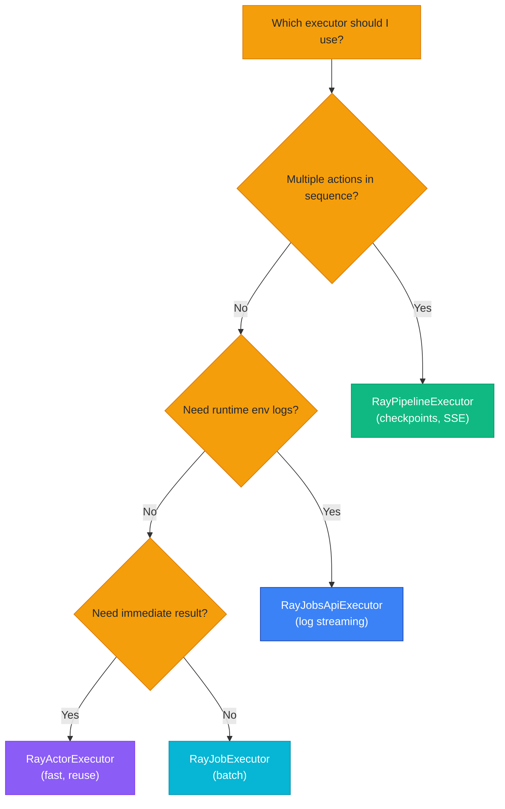
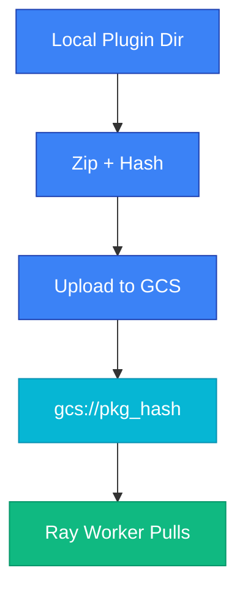

# Ray Execution

Ray executors enable distributed execution of plugin actions on Ray clusters, providing horizontal scaling, resource management, and fault tolerance for production workloads.

## Overview

The Synapse SDK provides four Ray-based executors, each optimized for different execution patterns:

### At a Glance

| Executor | Execution | Actor Reuse | Log Streaming | Checkpoint | Best For |
|----------|-----------|-------------|---------------|------------|----------|
| **RayActorExecutor** | Synchronous | Yes | No | No | Fast iteration, development |
| **RayJobExecutor** | Asynchronous | No | No | No | Batch processing, fire-and-forget |
| **RayJobsApiExecutor** | Asynchronous | No | Yes | No | Long jobs with log visibility |
| **RayPipelineExecutor** | Asynchronous | No | SSE | Yes | Multi-action workflows |

All executors inherit from `BaseRayExecutor` and share common configuration for runtime environments, package management, and credential injection.

## Executor Selection Guide

Use this decision flow to choose the right executor:



### Use Case Recommendations

| Use Case | Recommended Executor | Reason |
|----------|---------------------|--------|
| Development/testing | RayActorExecutor | Fast startup, actor reuse |
| Single training job | RayJobsApiExecutor | Runtime logs, resource tracking |
| Batch inference (multiple inputs) | RayJobExecutor | Concurrent submission |
| Full ML pipeline | RayPipelineExecutor | Checkpoints, progress streaming |
| Real-time inference | RayActorExecutor | Pre-warmed workers |

## RayActorExecutor

Executes actions synchronously using a persistent Ray Actor. The actor maintains state across executions, enabling fast consecutive calls without re-initialization overhead.

### Quick Start

```python filename="example.py"
from synapse_sdk.plugins.executors.ray import RayActorExecutor

executor = RayActorExecutor(
    ray_address='auto',
    working_dir='/path/to/plugin',
    num_gpus=1,
)

# Execute action
result = executor.execute(TrainAction, {'epochs': 10})

# Reuse the same actor for subsequent executions (fast)
result2 = executor.execute(InferAction, {'batch_size': 32})

# Clean up when done
executor.shutdown()
```

### Constructor Parameters

| Parameter | Type | Default | Description |
|-----------|------|---------|-------------|
| `env` | `PluginEnvironment \| dict \| None` | `None` | Environment config. Loads from `os.environ` if None |
| `job_id` | `str \| None` | `None` | Job identifier for tracking |
| `ray_address` | `str` | `'auto'` | Ray cluster address |
| `runtime_env` | `dict \| None` | `None` | Ray runtime environment config |
| `working_dir` | `str \| Path \| None` | `None` | Plugin working directory |
| `requirements_file` | `str \| Path \| None` | `None` | Path to requirements.txt |
| `package_manager` | `PackageManager \| 'pip' \| 'uv'` | `'pip'` | Package manager to use |
| `package_manager_options` | `list[str] \| None` | `None` | Additional package manager options |
| `wheels_dir` | `str` | `'wheels'` | Directory for .whl files (relative to working_dir) |
| `num_cpus` | `int \| None` | `None` | CPU cores to request |
| `num_gpus` | `int \| None` | `None` | GPUs to request |
| `include_sdk` | `bool` | `False` | Bundle local SDK (for development) |

### Methods

#### execute()

```python filename="synapse_sdk/plugins/executors/ray/task.py"
def execute(
    self,
    action_cls: type[BaseAction] | str,
    params: dict[str, Any],
    **kwargs: Any,
) -> Any:
    """Execute action using the Ray actor.

    Args:
        action_cls: BaseAction subclass or entrypoint string
            (e.g., 'plugin.train.TrainAction').
        params: Parameters dict to validate and pass.
        **kwargs: Ignored (for protocol compatibility).

    Returns:
        Action result from execute().

    Raises:
        ValidationError: If params fail validation.
        ExecutionError: If action execution fails.
    """
```

#### shutdown()

```python filename="synapse_sdk/plugins/executors/ray/task.py"
def shutdown(self) -> None:
    """Shutdown the actor and release resources."""
```

### Actor Reuse Pattern

```python filename="example.py"
executor = RayActorExecutor(working_dir='/plugin')

# Same actor handles all executions - no re-initialization
result1 = executor.execute(PreprocessAction, {'input': 'data.csv'})
result2 = executor.execute(TrainAction, {'epochs': 100})
result3 = executor.execute(ExportAction, {'format': 'onnx'})

# Always shutdown when done
executor.shutdown()
```

> **Good to know**: `RayTaskExecutor` is an alias for `RayActorExecutor` (backwards compatibility).

## RayJobExecutor

Submits actions as asynchronous Ray tasks. Each submission creates a new actor instance. Best for batch processing where you submit multiple jobs and collect results later.

### Quick Start

```python filename="example.py"
from synapse_sdk.plugins.executors.ray import RayJobExecutor

executor = RayJobExecutor(
    ray_address='auto',
    working_dir='/path/to/plugin',
)

# Submit job (non-blocking)
job_id = executor.submit(TrainAction, {'epochs': 100})

# Wait for completion
status = executor.wait(job_id, timeout_seconds=3600)

# Get result
result = executor.get_result(job_id)
```

### Constructor Parameters

| Parameter | Type | Default | Description |
|-----------|------|---------|-------------|
| `env` | `PluginEnvironment \| dict \| None` | `None` | Environment config |
| `ray_address` | `str` | `'auto'` | Ray cluster address |
| `runtime_env` | `dict \| None` | `None` | Ray runtime environment |
| `working_dir` | `str \| Path \| None` | `None` | Plugin working directory |
| `requirements_file` | `str \| Path \| None` | `None` | Path to requirements.txt |
| `package_manager` | `PackageManager \| 'pip' \| 'uv'` | `'pip'` | Package manager |
| `package_manager_options` | `list[str] \| None` | `None` | Package manager options |
| `wheels_dir` | `str` | `'wheels'` | Wheel files directory |
| `num_cpus` | `int \| None` | `None` | CPU cores to request |
| `num_gpus` | `int \| None` | `None` | GPUs to request |
| `include_sdk` | `bool` | `False` | Bundle local SDK |
| `job_id` | `str \| None` | `None` | Default job ID |

### Methods

#### submit()

```python filename="synapse_sdk/plugins/executors/ray/job.py"
def submit(
    self,
    action_cls: type[BaseAction] | str,
    params: dict[str, Any],
    *,
    job_id: str | None = None,
) -> str:
    """Submit action as a Ray task (non-blocking).

    Args:
        action_cls: BaseAction subclass or entrypoint string.
        params: Parameters dict for the action.
        job_id: Optional job identifier. Auto-generated if None.

    Returns:
        Job ID for tracking.
    """
```

#### get_status()

```python filename="synapse_sdk/plugins/executors/ray/job.py"
def get_status(self, job_id: str) -> str:
    """Get job status.

    Returns:
        'RUNNING', 'SUCCEEDED', 'FAILED', or 'UNKNOWN'.
    """
```

#### get_result()

```python filename="synapse_sdk/plugins/executors/ray/job.py"
def get_result(self, job_id: str, timeout: float | None = None) -> Any:
    """Get job result (blocks until complete).

    Args:
        job_id: Job ID from submit().
        timeout: Optional timeout in seconds.

    Returns:
        Action result.

    Raises:
        ExecutionError: If job failed or not found.
    """
```

#### wait()

```python filename="synapse_sdk/plugins/executors/ray/job.py"
def wait(self, job_id: str, timeout_seconds: float = 300) -> str:
    """Wait for job to complete.

    Returns:
        Final job status ('SUCCEEDED' or raises exception).

    Raises:
        ExecutionError: If job fails or times out.
    """
```

### Multiple Concurrent Jobs

```python filename="example.py"
executor = RayJobExecutor(working_dir='/plugin', num_gpus=1)

# Submit multiple jobs in parallel
job_ids = []
for dataset in [1, 2, 3, 4, 5]:
    job_id = executor.submit(TrainAction, {'dataset': dataset})
    job_ids.append(job_id)

# Collect results
results = {}
for job_id in job_ids:
    executor.wait(job_id)
    results[job_id] = executor.get_result(job_id)
```

### Status Polling

```python filename="example.py"
import time

job_id = executor.submit(TrainAction, {'epochs': 100})

while True:
    status = executor.get_status(job_id)
    print(f'Status: {status}')
    if status in ('SUCCEEDED', 'FAILED'):
        break
    time.sleep(5)

if status == 'SUCCEEDED':
    result = executor.get_result(job_id)
```

## RayJobsApiExecutor

Uses Ray's Jobs API (`JobSubmissionClient`) for job management. Provides access to runtime environment setup logs and real-time log streaming - essential for debugging dependency issues and monitoring long-running jobs.

### Quick Start

```python filename="example.py"
from synapse_sdk.plugins.executors.ray import RayJobsApiExecutor

executor = RayJobsApiExecutor(
    dashboard_address='http://localhost:8265',
    working_dir='/path/to/plugin',
    num_gpus=1,
)

# Submit job
job_id = executor.submit(TrainAction, {'epochs': 100})

# Stream logs in real-time (includes runtime env setup)
for log_line in executor.stream_logs(job_id):
    print(log_line, end='')

# Get result
result = executor.get_result(job_id)
```

### Constructor Parameters

| Parameter | Type | Default | Description |
|-----------|------|---------|-------------|
| `env` | `PluginEnvironment \| dict \| None` | `None` | Environment config |
| `dashboard_address` | `str` | `'http://localhost:8265'` | Ray Dashboard HTTP address |
| `runtime_env` | `dict \| None` | `None` | Ray runtime environment |
| `working_dir` | `str \| Path \| None` | `None` | Plugin working directory |
| `requirements_file` | `str \| Path \| None` | `None` | Path to requirements.txt |
| `package_manager` | `PackageManager \| 'pip' \| 'uv'` | `'pip'` | Package manager |
| `package_manager_options` | `list[str] \| None` | `None` | Package manager options |
| `wheels_dir` | `str` | `'wheels'` | Wheel files directory |
| `num_cpus` | `int \| float \| None` | `None` | CPU cores to request |
| `num_gpus` | `int \| float \| None` | `None` | GPUs to request |
| `memory` | `int \| None` | `None` | Memory in bytes |
| `include_sdk` | `bool` | `False` | Bundle local SDK |

### Methods

#### submit()

```python filename="synapse_sdk/plugins/executors/ray/jobs_api.py"
def submit(
    self,
    action_cls: type[BaseAction] | str,
    params: dict[str, Any],
    *,
    job_id: str | None = None,
) -> str:
    """Submit action as a Ray Job (non-blocking).

    Returns:
        Job ID for tracking.
    """
```

#### get_status()

```python filename="synapse_sdk/plugins/executors/ray/jobs_api.py"
def get_status(self, job_id: str) -> JobStatus:
    """Get job status.

    Returns:
        JobStatus enum (PENDING, RUNNING, SUCCEEDED, FAILED, STOPPED).
    """
```

#### get_logs()

```python filename="synapse_sdk/plugins/executors/ray/jobs_api.py"
def get_logs(self, job_id: str) -> str:
    """Get all job logs (includes runtime env setup logs).

    Returns:
        Full job logs as a string.
    """
```

#### stream_logs()

```python filename="synapse_sdk/plugins/executors/ray/jobs_api.py"
def stream_logs(
    self,
    job_id: str,
    *,
    timeout: float = 3600.0,
) -> Iterator[str]:
    """Stream job logs synchronously (includes runtime env setup logs).

    Yields:
        Log lines as they become available.
    """
```

#### stream_logs_async()

```python filename="synapse_sdk/plugins/executors/ray/jobs_api.py"
async def stream_logs_async(self, job_id: str) -> AsyncIterator[str]:
    """Stream job logs asynchronously.

    Yields:
        Log lines as they become available.
    """
```

#### get_result()

```python filename="synapse_sdk/plugins/executors/ray/jobs_api.py"
def get_result(self, job_id: str, timeout: float | None = None) -> Any:
    """Get job result (blocks until complete).

    Parses result from job output logs using markers.

    Raises:
        ExecutionError: If job failed or result cannot be parsed.
    """
```

#### wait()

```python filename="synapse_sdk/plugins/executors/ray/jobs_api.py"
def wait(
    self,
    job_id: str,
    timeout_seconds: float = 300,
    poll_interval: float = 1.0,
) -> str:
    """Wait for job to complete.

    Returns:
        Final job status as string.
    """
```

#### stop() / delete()

```python filename="synapse_sdk/plugins/executors/ray/jobs_api.py"
def stop(self, job_id: str) -> bool:
    """Stop a running job."""

def delete(self, job_id: str) -> bool:
    """Delete job info (only for terminal jobs)."""
```

### Async Log Streaming

```python filename="example.py"
import asyncio

async def run_with_logs():
    executor = RayJobsApiExecutor(
        dashboard_address='http://localhost:8265',
        working_dir='/plugin',
    )

    job_id = executor.submit(TrainAction, {'epochs': 100})

    async for log_line in executor.stream_logs_async(job_id):
        print(log_line, end='')

    return executor.get_result(job_id)

result = asyncio.run(run_with_logs())
```

### Resource Configuration

```python filename="example.py"
executor = RayJobsApiExecutor(
    dashboard_address='http://ray-head:8265',
    working_dir='/plugin',
    num_cpus=4,
    num_gpus=2,
    memory=16 * 1024 * 1024 * 1024,  # 16GB
    package_manager='uv',
)
```

> **Good to know**: Log streaming includes runtime environment setup progress (pip/uv install), making it invaluable for debugging dependency issues.

## RayPipelineExecutor

Executes multi-action pipelines with automatic checkpointing and real-time progress streaming via SSE. Integrates with the pipeline service API for state management.

### Quick Start

```python filename="example.py"
from synapse_sdk.plugins.executors.ray import RayPipelineExecutor, PipelineDefinition

executor = RayPipelineExecutor(
    ray_address='auto',
    working_dir='/path/to/plugin',
    pipeline_service_url='http://localhost:8100',
)

pipeline = PipelineDefinition(
    name='YOLO Training Pipeline',
    actions=[DownloadAction, ConvertAction, TrainAction, ExportAction],
    description='End-to-end training workflow',
)

# Submit pipeline (non-blocking)
run_id = executor.submit(pipeline, {'dataset': 123, 'epochs': 100})

# Wait for completion
progress = executor.wait(run_id, timeout_seconds=7200)
result = executor.get_result(run_id)
```

### Constructor Parameters

| Parameter | Type | Default | Description |
|-----------|------|---------|-------------|
| `env` | `PluginEnvironment \| dict \| None` | `None` | Environment config |
| `ray_address` | `str` | `'auto'` | Ray cluster address |
| `runtime_env` | `dict \| None` | `None` | Ray runtime environment |
| `working_dir` | `str \| Path \| None` | `None` | Plugin working directory |
| `requirements_file` | `str \| Path \| None` | `None` | Path to requirements.txt |
| `package_manager` | `PackageManager \| 'pip' \| 'uv'` | `'pip'` | Package manager |
| `package_manager_options` | `list[str] \| None` | `None` | Package manager options |
| `wheels_dir` | `str` | `'wheels'` | Wheel files directory |
| `num_cpus` | `int \| None` | `None` | CPU cores to request |
| `num_gpus` | `int \| None` | `None` | GPUs to request |
| `include_sdk` | `bool` | `False` | Bundle local SDK |
| `pipeline_service_url` | `str` | `'http://localhost:8100'` | Pipeline service API URL |
| `actor_pipeline_service_url` | `str \| None` | `None` | URL for Ray actor (use when cluster needs different URL) |

### PipelineDefinition

```python filename="synapse_sdk/plugins/executors/ray/pipeline.py"
@dataclass
class PipelineDefinition:
    """Definition of a pipeline to execute.

    Attributes:
        name: Pipeline name.
        actions: List of action classes or entrypoint strings.
        description: Optional description.
    """
    name: str
    actions: list[type[BaseAction] | str]
    description: str | None = None
```

### Methods

#### submit()

```python filename="synapse_sdk/plugins/executors/ray/pipeline.py"
def submit(
    self,
    pipeline: PipelineDefinition | list[type[BaseAction] | str],
    params: dict[str, Any],
    *,
    name: str | None = None,
    resume_from: str | None = None,
) -> str:
    """Submit a pipeline for execution (non-blocking).

    Args:
        pipeline: PipelineDefinition or list of action classes/entrypoints.
        params: Initial parameters for the pipeline.
        name: Pipeline name (required if pipeline is a list).
        resume_from: Run ID to resume from. Skips completed actions
            and restores accumulated params from latest checkpoint.

    Returns:
        Run ID for tracking.
    """
```

#### get_status()

```python filename="synapse_sdk/plugins/executors/ray/pipeline.py"
def get_status(self, run_id: str) -> RunStatus:
    """Get run status.

    Returns:
        RunStatus enum (PENDING, RUNNING, COMPLETED, FAILED, CANCELLED).
    """
```

#### get_progress()

```python filename="synapse_sdk/plugins/executors/ray/pipeline.py"
def get_progress(self, run_id: str) -> PipelineProgress:
    """Get detailed progress for a run.

    Returns:
        PipelineProgress with current action, overall progress, and per-action status.
    """
```

#### stream_progress()

```python filename="synapse_sdk/plugins/executors/ray/pipeline.py"
def stream_progress(
    self,
    run_id: str,
    timeout: float = 3600.0,
) -> Iterator[PipelineProgress]:
    """Stream progress updates via SSE.

    More efficient than polling for long-running pipelines.

    Yields:
        PipelineProgress objects with current state.
    """
```

#### stream_progress_async()

```python filename="synapse_sdk/plugins/executors/ray/pipeline.py"
async def stream_progress_async(
    self,
    run_id: str,
    timeout: float = 3600.0,
) -> AsyncIterator[PipelineProgress]:
    """Stream progress updates via SSE (async version)."""
```

#### wait()

```python filename="synapse_sdk/plugins/executors/ray/pipeline.py"
def wait(
    self,
    run_id: str,
    timeout_seconds: float = 3600,
    poll_interval: float = 5.0,
) -> PipelineProgress:
    """Wait for pipeline to complete.

    Returns:
        Final PipelineProgress.

    Raises:
        ExecutionError: If pipeline fails or times out.
    """
```

#### cancel() / close()

```python filename="synapse_sdk/plugins/executors/ray/pipeline.py"
def cancel(self, run_id: str) -> None:
    """Cancel a running pipeline."""

def close(self) -> None:
    """Close the executor and clean up resources."""
```

### Progress Streaming

```python filename="example.py"
from synapse_sdk.plugins.models.pipeline import RunStatus

run_id = executor.submit(pipeline, params)

for progress in executor.stream_progress(run_id):
    print(f'Action: {progress.current_action}')
    print(f'Status: {progress.status}')
    print(f'Progress: {progress.overall_progress:.1%}')

    if progress.status == RunStatus.COMPLETED:
        print('Pipeline completed!')
        break
    elif progress.status == RunStatus.FAILED:
        print(f'Pipeline failed: {progress.error}')
        break
```

### Resume from Checkpoint

```python filename="example.py"
# First run - fails at action index 2 (TrainAction)
run_id_1 = executor.submit(pipeline, params)
# ... TrainAction fails due to OOM ...

# Resume from checkpoint - skips completed actions
run_id_2 = executor.submit(
    pipeline,
    params,
    resume_from=run_id_1,  # Resumes from TrainAction
)

# Actions 0 (Download) and 1 (Convert) are marked as SKIPPED
# Execution continues from action 2 (TrainAction)
```

### Simple List Syntax

```python filename="example.py"
# Use a list directly instead of PipelineDefinition
run_id = executor.submit(
    [DownloadAction, ConvertAction, TrainAction],
    params={'dataset': 123},
    name='quick-pipeline',
)
```

> **Good to know**: Checkpoints store `params_snapshot` with accumulated parameters from all completed actions, enabling seamless resume without data loss.

## Common Configuration

All Ray executors share common configuration through `BaseRayExecutor`.

### Runtime Environment

The runtime environment is automatically configured with:

1. **Working directory**: Plugin code uploaded to cluster
2. **Dependencies**: Requirements from `requirements.txt`
3. **Wheel files**: Local packages from `wheels_dir`
4. **Environment variables**: Plugin environment + Synapse credentials

```python filename="example.py"
# Custom runtime_env
executor = RayActorExecutor(
    runtime_env={
        'pip': {'packages': ['torch==2.0.0', 'ultralytics']},
        'env_vars': {'CUDA_VISIBLE_DEVICES': '0,1'},
    },
)
```

### Package Management

```python filename="example.py"
# Using UV (faster)
executor = RayJobExecutor(
    working_dir='/plugin',
    package_manager='uv',
    package_manager_options=['--no-cache', '--system'],
)

# Default pip options include --upgrade
# UV defaults include --no-cache
```

### Working Directory with Wheels

```text
plugin/
├── config.yaml
├── requirements.txt
├── wheels/
│   └── custom_package-1.0.0-py3-none-any.whl
└── plugin/
    └── train.py
```

```python filename="example.py"
executor = RayActorExecutor(
    working_dir='/plugin',
    wheels_dir='wheels',  # Wheels auto-included in runtime_env
)
```

### Resource Allocation

```python filename="example.py"
# CPU/GPU allocation
executor = RayActorExecutor(
    num_cpus=4,
    num_gpus=1,
)

# Memory (RayJobsApiExecutor only)
executor = RayJobsApiExecutor(
    num_cpus=4,
    num_gpus=2,
    memory=16 * 1024 * 1024 * 1024,  # 16GB
)
```

### Credential Injection

Synapse credentials are automatically injected into the runtime environment:

```python filename="synapse_sdk/plugins/executors/ray/base.py"
# Automatically included in runtime_env['env_vars']:
# - SYNAPSE_HOST
# - SYNAPSE_ACCESS_TOKEN
```

This enables `BackendClient` creation on Ray workers without manual configuration.

## Remote Cluster Connection

### Local vs Remote Mode

```python filename="example.py"
# Local mode - connects to local Ray instance
executor = RayActorExecutor(ray_address='auto')

# Remote mode - connects via Ray client protocol
executor = RayActorExecutor(ray_address='ray://cluster-head:10001')
```

### GCS Packaging

For remote clusters, the working directory is automatically uploaded to Ray's Global Control Store (GCS):



- Content-addressed URIs prevent duplicate uploads
- Cached within executor instance for reuse

### Pipeline Service URL Configuration

For remote clusters that need different URLs:

```python filename="example.py"
executor = RayPipelineExecutor(
    ray_address='ray://cluster:10001',
    pipeline_service_url='http://localhost:8100',  # Local SDK uses this
    actor_pipeline_service_url='http://internal-api:8100',  # Ray actor uses this
)
```

## Monitoring & Logs

### Ray Dashboard

Access the Ray Dashboard at `http://<ray-head>:8265` to:

- View job status and resource usage
- Monitor worker health
- Access detailed logs

### Log Streaming (RayJobsApiExecutor)

```python filename="example.py"
executor = RayJobsApiExecutor(dashboard_address='http://localhost:8265')
job_id = executor.submit(TrainAction, params)

# Full logs after completion
logs = executor.get_logs(job_id)

# Real-time streaming
for line in executor.stream_logs(job_id):
    print(line, end='')
```

### Progress Monitoring (RayPipelineExecutor)

```python filename="example.py"
# Polling approach
while True:
    progress = executor.get_progress(run_id)
    print(f'{progress.current_action}: {progress.overall_progress:.1%}')
    if progress.status.is_terminal():
        break
    time.sleep(5)

# SSE streaming (more efficient)
for progress in executor.stream_progress(run_id):
    print(f'{progress.current_action}: {progress.overall_progress:.1%}')
```

## Best Practices

### Choose the Right Executor

> **Good to know**: Use `RayActorExecutor` for development and fast iteration. Switch to `RayJobsApiExecutor` when you need log visibility, or `RayPipelineExecutor` for multi-action workflows.

### Explicitly Declare Resources

```python filename="example.py"
# Always specify resources for production workloads
executor = RayJobsApiExecutor(
    num_cpus=4,
    num_gpus=1,
    memory=8 * 1024 * 1024 * 1024,  # 8GB
)
```

### Handle Errors Gracefully

```python filename="example.py"
from synapse_sdk.plugins.errors import ExecutionError

try:
    result = executor.get_result(job_id, timeout=3600)
except ExecutionError as e:
    print(f'Job failed: {e}')
    logs = executor.get_logs(job_id)  # Get logs for debugging
```

### Use Checkpoints for Long Pipelines

```python filename="example.py"
# If pipeline fails, resume from checkpoint
try:
    progress = executor.wait(run_id)
except ExecutionError:
    # Retry from last checkpoint
    new_run_id = executor.submit(pipeline, params, resume_from=run_id)
```

### Clean Up Resources

```python filename="example.py"
# RayActorExecutor - shutdown the actor
executor.shutdown()

# RayPipelineExecutor - close the client
executor.close()
```

### Use UV for Faster Dependency Installation

```python filename="example.py"
# UV is significantly faster than pip
executor = RayJobExecutor(
    working_dir='/plugin',
    package_manager='uv',
)
```

## Related

- [Local Execution](./local-execution) - Development without Ray
- [Action Pipelines](../pipelines) - Pipeline composition and validation
- [Defining Actions](../defining-actions) - How to define actions
- [RuntimeContext](../runtime-context) - Runtime context API
