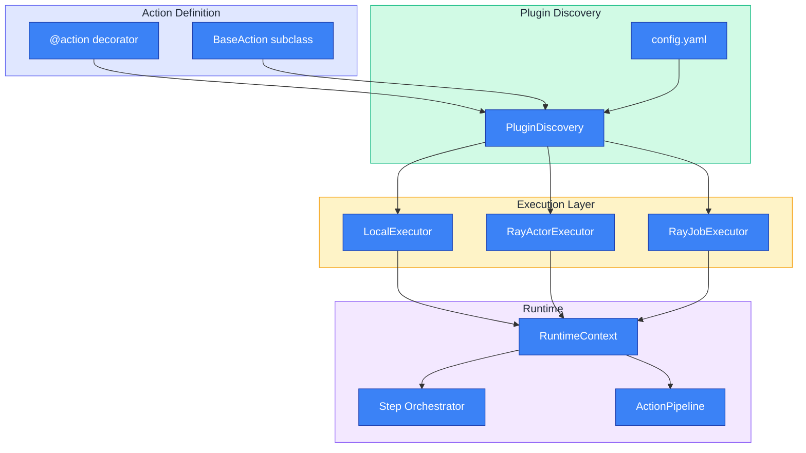

# Plugin System

The Synapse SDK plugin system provides a type-safe, extensible framework for building ML pipelines. You can define actions using either function decorators or class inheritance, chain them into pipelines, and execute them locally or on distributed Ray clusters.

## Overview

The plugin system centers around **actions**—reusable units of work with validated parameters and typed inputs/outputs. Actions can be composed into **pipelines** for complex workflows, orchestrated through **steps** for fine-grained control, and executed via **executors** that support both local development and distributed production environments.

### At a Glance

| Concept | Description | Primary Use |
|---------|-------------|-------------|
| **BaseAction** | Generic base class with typed parameters | Complex actions with workflows |
| **@action decorator** | Function-based action definition | Simple, stateless operations |
| **RuntimeContext** | Injected context with logger, client, env | Access runtime services |
| **DataType** | Semantic input/output types | Pipeline compatibility validation |
| **Step** | Workflow unit with progress tracking | Multi-stage operations |
| **Pipeline** | Action chaining with schema validation | End-to-end ML workflows |
| **Executor** | Local or Ray-based execution | Development and production |

## Key Concepts

### BaseAction

**BaseAction** is a generic abstract class that provides type-safe parameter handling. The generic parameter `P` must be a Pydantic `BaseModel` that defines the action's input schema.

```python filename="synapse_sdk/plugins/action.py"
from abc import ABC, abstractmethod
from typing import Generic, TypeVar
from pydantic import BaseModel

P = TypeVar('P', bound=BaseModel)

class BaseAction(ABC, Generic[P]):
    # Optional: injected from config.yaml during discovery if not set
    action_name: str | None = None             # Action name for invocation
    category: PluginCategory | None = None     # Category for grouping

    # Semantic types for pipeline compatibility validation
    input_type: type[DataType] | None = None   # Semantic input type
    output_type: type[DataType] | None = None  # Semantic output type
    params_model: type[P]                                  # Auto-extracted from generic
    result_model: type[BaseModel] | type[NoResult] = NoResult  # Optional result validation

    def __init__(self, params: P, ctx: RuntimeContext) -> None:
        self.params = params
        self.ctx = ctx

    @abstractmethod
    def execute(self) -> Any:
        """Execute the action logic."""
        ...
```

> **Good to know**:
> - The `params_model` is automatically extracted from `BaseAction[MyParams]`
> - Set `result_model` to enable output validation (warning-only mode)
> - Use `input_type` and `output_type` for pipeline compatibility checks

### @action Decorator

For simple, stateless operations, use the `@action` decorator to define function-based actions. The decorator attaches metadata for discovery and execution.

**Decorator parameters:**

| Parameter | Type | Description |
|-----------|------|-------------|
| `name` | `str \| None` | Action name (defaults to function name) |
| `description` | `str` | Human-readable description |
| `params` | `type[BaseModel] \| None` | Pydantic model for parameter validation |
| `result` | `type[BaseModel] \| None` | Pydantic model for result validation |
| `category` | `PluginCategory \| None` | Category for grouping actions |

```python filename="my_plugin/actions.py"
from synapse_sdk.plugins import action, RuntimeContext
from synapse_sdk.plugins.enums import PluginCategory
from pydantic import BaseModel

class ConvertParams(BaseModel):
    source_path: str
    target_format: str = 'yolo'

class ConvertResult(BaseModel):
    output_path: str
    files_converted: int

@action(
    name='convert',
    description='Convert dataset format',
    params=ConvertParams,
    result=ConvertResult,
    category=PluginCategory.EXPORT,
)
def convert(params: ConvertParams, ctx: RuntimeContext) -> ConvertResult:
    ctx.log_message(f'Converting to {params.target_format}')
    # Conversion logic...
    return ConvertResult(output_path='/converted', files_converted=100)
```

### RuntimeContext

**RuntimeContext** is injected into every action, providing access to logging, environment variables, backend clients, and checkpoints.

```python filename="synapse_sdk/plugins/context/__init__.py"
@dataclass
class RuntimeContext:
    logger: BaseLogger                      # Structured logging
    env: PluginEnvironment                  # Environment variables
    job_id: str | None = None               # Current job identifier
    client: BackendClient | None = None     # Backend API client
    agent_client: AgentClient | None = None # Ray operations client
    checkpoint: dict[str, Any] | None = None  # Pretrained model info
```

**Available methods:**

| Method | Description |
|--------|-------------|
| `set_progress(current, total, category)` | Update progress for a category |
| `set_metrics(value, category)` | Record metrics (loss, accuracy) |
| `log(event, data, file)` | Log structured event |
| `log_message(message, context)` | Log user-facing message |
| `log_dev_event(message, data)` | Log development/debug event |
| `end_log()` | Signal plugin execution complete |

### Semantic Type System

Actions declare `input_type` and `output_type` using the **DataType** hierarchy. This enables compile-time validation of pipeline compatibility.

```python filename="synapse_sdk/plugins/types.py"
class DataType:
    """Base class for semantic data types."""

    @classmethod
    def is_compatible_with(cls, other: type[DataType]) -> bool:
        return issubclass(cls, other) or issubclass(other, cls)

# Dataset types
class Dataset(DataType): ...
class DMDataset(Dataset): ...       # DataMaker format
class DMv1Dataset(DMDataset): ...   # DataMaker v1
class DMv2Dataset(DMDataset): ...   # DataMaker v2
class YOLODataset(Dataset): ...     # YOLO detection format
class COCODataset(Dataset): ...     # COCO instance segmentation
class PascalVOCDataset(Dataset): ... # Pascal VOC format

# Model types
class Model(DataType): ...
class ModelWeights(Model): ...      # Trained weights
class ONNXModel(Model): ...         # ONNX export
class TensorRTModel(Model): ...     # TensorRT optimized

# Result types
class Result(DataType): ...
class TestResults(Result): ...      # Test/evaluation metrics
class InferenceResults(Result): ... # Inference predictions
```

## Key Features

The plugin system provides:

- **Type-safe parameters** — Pydantic validation with auto-generated UI schemas
- **Step-based workflows** — Orchestrated execution with progress tracking and rollback
- **Action pipelines** — Chain actions with automatic result-to-params mapping
- **Semantic type validation** — Compile-time pipeline compatibility checks
- **Multiple execution modes** — Local, Ray Task, Ray Job, Ray Serve
- **Dataset format conversion** — DM, YOLO, COCO, Pascal VOC interoperability

## Plugin Categories

Organize plugins by functionality using `PluginCategory`:

| Category | Value | Description | Example Actions |
|----------|-------|-------------|-----------------|
| **Neural Network** | `neural_net` | Training, inference, deployment | TrainAction, InferenceAction |
| **Export** | `export` | Data export and format conversion | ExportAction |
| **Upload** | `upload` | File upload and validation | UploadAction |
| **Smart Tool** | `smart_tool` | AI-assisted annotation tools | AutoLabelAction |
| **Pre-Annotation** | `pre_annotation` | Annotation preprocessing | AddTaskDataAction |
| **Post-Annotation** | `post_annotation` | Annotation postprocessing | ValidateAction |
| **Data Validation** | `data_validation` | Data quality checks | QualityCheckAction |
| **Custom** | `custom` | User-defined functionality | Any custom action |

## Execution Methods

Choose the appropriate execution method based on your workload:

| Method | Value | Characteristics | Best For |
|--------|-------|-----------------|----------|
| **Local** | `local` | In-process execution, no Ray dependency | Development, debugging |
| **Task** | `task` | Synchronous, fast startup (under 1s), reusable Actor | Interactive operations, medium workloads |
| **Job** | `job` | Asynchronous, isolated environment, status tracking | Long-running training (100s+), batch processing |
| **Serve** | `serve` | REST API endpoint, auto-scaling | Real-time inference, model serving |

> **Good to know**:
> - Use `local` or `task` for development iteration and `job` for production training runs.
> - The `run_plugin()` function supports `local`, `task`, and `job` modes.
> - The `serve` mode requires Ray Serve deployment configuration and is not available via `run_plugin()`.

## Architecture

The plugin system follows a layered architecture:



**Data flow:**

1. **Definition** — Define actions via decorator or class inheritance
2. **Discovery** — Scan modules or load from `config.yaml`
3. **Execution** — Select executor based on workload (local/task/job)
4. **Runtime** — Inject context, orchestrate steps, chain pipelines

## Quick Start

### Function-Based Action (Simple)

Create a simple action using the `@action` decorator:

```python filename="my_plugin/actions.py"
from synapse_sdk.plugins import action, RuntimeContext
from pydantic import BaseModel, Field

class GreetParams(BaseModel):
    name: str = Field(description='Name to greet')
    formal: bool = False

@action(name='greet', params=GreetParams)
def greet(params: GreetParams, ctx: RuntimeContext) -> dict:
    prefix = 'Dear' if params.formal else 'Hello'
    message = f'{prefix} {params.name}!'
    ctx.log_message(message, 'info')
    return {'message': message}
```

### Class-Based Action (Complex Workflows)

For complex actions with progress tracking, use class inheritance:

```python filename="my_plugin/train.py"
from synapse_sdk.plugins.action import BaseAction
from synapse_sdk.plugins.types import YOLODataset, ModelWeights
from synapse_sdk.plugins.enums import PluginCategory
from pydantic import BaseModel, Field

class TrainParams(BaseModel):
    dataset: int = Field(description='Dataset ID to train on')
    epochs: int = Field(default=100, ge=1)
    batch_size: int = Field(default=32, ge=1)

class TrainResult(BaseModel):
    model_path: str
    final_loss: float
    metrics: dict[str, float]

class TrainAction(BaseAction[TrainParams]):
    category = PluginCategory.NEURAL_NET
    input_type = YOLODataset
    output_type = ModelWeights
    result_model = TrainResult

    def execute(self) -> TrainResult:
        self.set_progress(0, self.params.epochs, 'training')

        for epoch in range(self.params.epochs):
            # Training logic...
            self.set_progress(epoch + 1, self.params.epochs, 'training')
            self.set_metrics({'loss': 0.5, 'mAP50': 0.85}, 'training')

        return TrainResult(
            model_path='/models/best.pt',
            final_loss=0.05,
            metrics={'mAP50': 0.92, 'mAP50-95': 0.78}
        )
```

### Plugin Configuration

Define your plugin in `config.yaml`:

```yaml filename="my_plugin/config.yaml"
name: My Training Plugin
code: my-training-plugin
version: 1.0.0
category: neural_net
description: Custom training plugin with YOLO support

package_manager: pip

actions:
  greet:
    entrypoint: my_plugin.actions:greet
    method: task
    description: Simple greeting action

  train:
    entrypoint: my_plugin.train:TrainAction
    method: job
    description: Train model on dataset
    input_type: yolo_dataset
    output_type: model_weights
```

### Running Actions

Execute actions using the runner:

```python filename="examples/run_action.py"
from synapse_sdk.plugins.runner import run_plugin

# Local execution (development)
result = run_plugin(
    plugin_code='my-training-plugin',
    action='train',
    params={'dataset': 123, 'epochs': 10},
    mode='local'
)

# Ray Task execution (production, fast startup)
result = run_plugin(
    plugin_code='my-training-plugin',
    action='train',
    params={'dataset': 123, 'epochs': 10},
    mode='task',
    ray_address='ray://cluster:10001'
)

# Ray Job execution (production, long-running)
job_id = run_plugin(
    plugin_code='my-training-plugin',
    action='train',
    params={'dataset': 123, 'epochs': 100},
    mode='job',
    ray_address='ray://cluster:10001'
)
```

## Related Documentation

- [Defining Actions](./defining-actions) — Detailed action definition guide
- [Hyperparameters UI](./hyperparameters) — Auto-generate training parameter forms
- [RuntimeContext](./runtime-context) — Runtime context API reference
- [Steps & Workflow](./steps-workflow) — Step-based orchestration
- [Pipelines](./pipelines) — Action chaining and validation
- [Data Types](./data-types) — Semantic type system reference
- [Dataset Conversion](./dataset-conversion) — Format conversion guide
- [Local Execution](./execution/local-execution) — Development setup
- [Ray Execution](./execution/ray-execution) — Distributed execution
