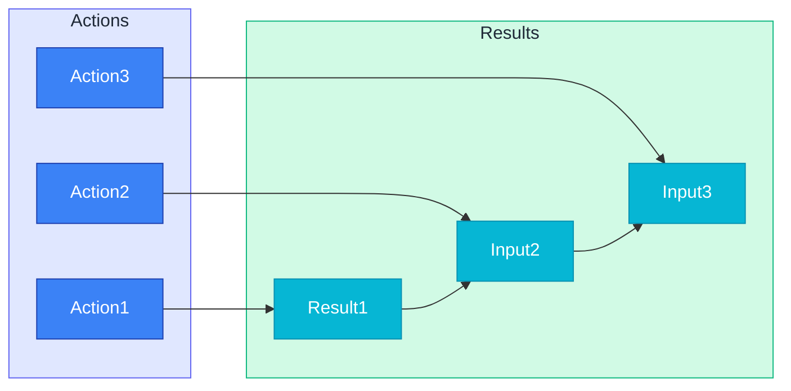
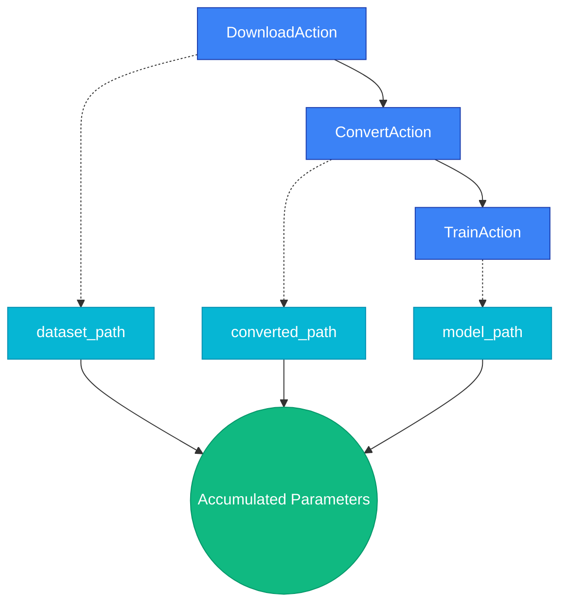

# Action Pipelines

ActionPipeline is an orchestration tool that chains multiple actions sequentially, similar to Unix pipes. Results from previous actions are automatically passed as inputs to subsequent actions, with automatic schema compatibility validation.

:::info[Prerequisites]

Understand [Defining Actions](./defining-actions.md) before working with pipelines.

:::

## Overview

ActionPipeline enables simple composition of complex workflows like data processing, model training, and deployment.



### At a Glance

| Feature | Description | Default |
|---------|-------------|---------|
| Schema Validation | Automatic input/output type compatibility checking | Enabled |
| Result Merging | Merge each action's result into accumulated parameters | Automatic |
| Execution Modes | Local synchronous or Ray remote execution | Local |
| Checkpointing | Save intermediate state and resume on remote execution | Supported |
| Progress Tracking | Monitor via callback or SSE streaming | Optional |

## Quick Start

```python filename="example.py"
from synapse_sdk.loggers import ConsoleLogger
from synapse_sdk.plugins.context import PluginEnvironment, RuntimeContext
from synapse_sdk.plugins.pipelines import ActionPipeline
from my_plugin.actions import DownloadAction, ConvertAction, TrainAction

# Create pipeline
pipeline = ActionPipeline([
    DownloadAction,
    ConvertAction,
    TrainAction,
])

# Create runtime context
ctx = RuntimeContext(
    logger=ConsoleLogger(),
    env=PluginEnvironment.from_environ(),
)

# Execute
result = pipeline.execute({'dataset': 123, 'epochs': 50}, ctx)
```

> **Good to know**: Pass action classes (not instances) when creating pipelines. Each action is instantiated at execution time.

## How ActionPipeline Works

### Execution Flow



Pipeline execution sequence:

1. **Initialization**: Set initial parameters in `accumulated_params`
2. **Action Loop**:
   - Create action instance with accumulated parameters
   - Call `execute()` method
   - Merge result into accumulated parameters
3. **Completion**: Return the last action's result

### Result Merging Mechanism

Each action's result is merged into accumulated parameters according to these rules:

```python filename="synapse_sdk/plugins/pipelines/action_pipeline.py"
# Merge result into accumulated params for next action
if isinstance(result, BaseModel):
    result_dict = result.model_dump()
elif isinstance(result, dict):
    result_dict = result
else:
    result_dict = {}

accumulated_params.update(result_dict)
```

> **Good to know**: If the same key exists, subsequent action results overwrite previous values.

## Schema Validation

ActionPipeline validates schema compatibility between adjacent actions at creation time.

### Semantic Type Compatibility

Verifies that action `input_type` and `output_type` are compatible.

```python filename="plugin/actions.py"
from synapse_sdk.plugins.action import BaseAction
from synapse_sdk.plugins.types import DMDataset, YOLODataset, ModelWeights

class ConvertAction(BaseAction[ConvertParams]):
    input_type = DMDataset      # Input type
    output_type = YOLODataset   # Output type

class TrainAction(BaseAction[TrainParams]):
    input_type = YOLODataset    # Must match ConvertAction.output_type
    output_type = ModelWeights
```

**Compatibility Rules:**
- Same `DataType` class
- Inheritance relationship (parent-child)
- `None` skips validation

### Field Compatibility

Validates that the previous action's `result_model` fields satisfy the next action's `params_model` required fields.

```python filename="plugin/models.py"
from pydantic import BaseModel

# Action1's result model
class DownloadResult(BaseModel):
    dataset_path: str      # Provides field
    file_count: int

# Action2's parameter model
class ConvertParams(BaseModel):
    dataset_path: str      # Required field - provided by DownloadResult
    output_format: str = 'yolo'  # Has default - optional
```

> **Good to know**: Field compatibility validation is name-based. Type matching is validated by Pydantic at runtime.

### Validation Modes

| Mode | `strict` Value | Behavior |
|------|----------------|----------|
| Warning Mode | `False` (default) | Log warning only on mismatch |
| Strict Mode | `True` | Raise `SchemaIncompatibleError` on mismatch |

```python filename="example.py"
# Warning mode (default) - can execute even with mismatches
pipeline = ActionPipeline([Action1, Action2])

# Strict mode - raises exception on mismatch
pipeline = ActionPipeline([Action1, Action2], strict=True)

# Disable schema validation
pipeline = ActionPipeline([Action1, Action2], validate_schemas=False)
```

## Execution Modes

### Local Execution

Execute synchronously in the current process.

```python filename="example.py"
from synapse_sdk.plugins.pipelines import ActionPipeline

pipeline = ActionPipeline([DownloadAction, ConvertAction, TrainAction])

# Basic execution
result = pipeline.execute(params, ctx)

# With progress callback
def on_progress(current: int, total: int, action_name: str) -> None:
    print(f'[{current}/{total}] {action_name}')

result = pipeline.execute(params, ctx, progress_callback=on_progress)
```

### Remote Execution (Ray)

Execute asynchronously on a Ray cluster.

```python filename="example.py"
from synapse_sdk.plugins.pipelines import ActionPipeline
from synapse_sdk.plugins.executors.ray import RayPipelineExecutor

pipeline = ActionPipeline([DownloadAction, ConvertAction, TrainAction])

# Create executor
executor = RayPipelineExecutor(
    ray_address='auto',
    pipeline_service_url='http://localhost:8100',
)

# Submit pipeline (non-blocking)
run_id = pipeline.submit(params, executor, name='training-pipeline')

# Wait for completion
result = pipeline.wait(run_id, executor, timeout_seconds=3600)
```

### Progress Monitoring

Monitor progress in real-time during remote execution.

```python filename="example.py"
from synapse_sdk.plugins.pipelines import display_progress

# Display progress via SSE streaming (Rich console)
run_id = pipeline.submit(params, executor)
final_progress = display_progress(executor.stream_progress(run_id))

# Async version
from synapse_sdk.plugins.pipelines import display_progress_async

final_progress = await display_progress_async(
    executor.stream_progress_async(run_id)
)
```

**PipelineProgress Structure:**

| Attribute | Type | Description |
|-----------|------|-------------|
| `run_id` | `str` | Execution ID |
| `status` | `RunStatus` | `PENDING`, `RUNNING`, `COMPLETED`, `FAILED`, `CANCELLED` |
| `actions` | `dict[str, ActionProgress]` | Per-action progress (keyed by action name) |
| `current_action` | `str \| None` | Currently executing action name |
| `overall_progress` | `float` | Overall progress (0.0-1.0) |
| `error` | `str \| None` | Error message |

## PipelineContext

`PipelineContext` is a shared context throughout pipeline execution. It manages working directories, checkpoint paths, and more.

### Directory Structure

```text
<base_path>/
└── <pipeline_id>/
    └── <run_id>/
        ├── datasets/       # Dataset files
        ├── models/         # Trained models
        ├── artifacts/      # Output artifacts
        ├── logs/           # Log files
        ├── checkpoints/    # Checkpoints
        └── actions/
            └── <action_name>/  # Per-action directory
```

### Attributes

| Attribute | Type | Description |
|-----------|------|-------------|
| `pipeline_id` | `str` | Pipeline unique identifier |
| `run_id` | `str` | Execution unique identifier (12-char UUID, auto-generated) |
| `base_path` | `Path` | Base directory (default: `/tmp/synapse_pipelines`) |
| `metadata` | `dict[str, Any]` | User-defined metadata |

### Properties

| Property | Return Type | Description |
|----------|-------------|-------------|
| `work_dir` | `Path` | `<base_path>/<pipeline_id>/<run_id>` |
| `datasets_dir` | `Path` | `<work_dir>/datasets` |
| `models_dir` | `Path` | `<work_dir>/models` |
| `artifacts_dir` | `Path` | `<work_dir>/artifacts` |
| `logs_dir` | `Path` | `<work_dir>/logs` |
| `checkpoints_dir` | `Path` | `<work_dir>/checkpoints` |

> **Good to know**: Directories are automatically created on property access (`mkdir(parents=True)`).

### Methods

```python filename="synapse_sdk/plugins/pipelines/context.py"
def get_action_dir(self, action_name: str) -> Path:
    """Return dedicated directory for specific action.

    Returns:
        <work_dir>/actions/<action_name>
    """

def cleanup(self) -> None:
    """Delete all files in working directory.

    Warning: This operation is irreversible.
    """
```

### Usage Example

```python filename="plugin/actions.py"
from synapse_sdk.plugins.pipelines import PipelineContext

# Create pipeline context
pipeline_ctx = PipelineContext(pipeline_id='train-pipeline')

# Use directory paths
model_path = pipeline_ctx.models_dir / 'best.pt'
checkpoint_path = pipeline_ctx.checkpoints_dir / 'epoch_10.pt'

# Per-action directory
action_dir = pipeline_ctx.get_action_dir('preprocessing')
```

## Checkpointing & Resume

During remote execution, checkpoints are automatically created after each action completes. On failure, you can resume from the last checkpoint.

### Checkpoint Creation

Checkpoints are created at these points:

1. When each action reaches `COMPLETED` status
2. Contents saved:
   - `action_name`: Completed action name
   - `action_index`: Action index
   - `params_snapshot`: Accumulated parameters snapshot
   - `result`: Action result

### Resume from Checkpoint

```python filename="example.py"
# Resume from previous execution ID
run_id = pipeline.submit(
    params,
    executor,
    resume_from='previous_run_id',  # Previous run_id
)

# Resume behavior:
# 1. Query latest checkpoint from previous execution
# 2. Skip completed actions (marked as SKIPPED)
# 3. Resume execution from next action
```

> **Warning**: Checkpointing is only supported for remote execution (`submit()`). Not available for local execution (`execute()`).

## API Reference

### ActionPipeline

```python filename="synapse_sdk/plugins/pipelines/action_pipeline.py"
class ActionPipeline:
    """Pipeline execution through action chaining."""

    def __init__(
        self,
        actions: list[type[BaseAction]],
        *,
        validate_schemas: bool = True,
        strict: bool = False,
    ) -> None:
        """Create pipeline.

        Args:
            actions: List of action classes to execute (order matters).
            validate_schemas: Validate schemas at creation time.
            strict: If True, raise exception on schema mismatch.

        Raises:
            ValueError: If actions list is empty.
            SchemaIncompatibleError: If strict=True and schema mismatch.
        """
```

#### execute()

```python filename="synapse_sdk/plugins/pipelines/action_pipeline.py"
def execute(
    self,
    params: dict[str, Any] | BaseModel,
    ctx: RuntimeContext,
    *,
    progress_callback: Callable[[int, int, str], None] | None = None,
) -> Any:
    """Execute pipeline locally and synchronously.

    Args:
        params: Initial parameters.
        ctx: RuntimeContext instance.
        progress_callback: Progress callback (current, total, action_name).

    Returns:
        Last action's result.
    """
```

#### submit()

```python filename="synapse_sdk/plugins/pipelines/action_pipeline.py"
def submit(
    self,
    params: dict[str, Any] | BaseModel,
    executor: Any,
    *,
    name: str | None = None,
    resume_from: str | None = None,
) -> str:
    """Submit pipeline for remote execution (non-blocking).

    Args:
        params: Initial parameters.
        executor: RayPipelineExecutor instance.
        name: Pipeline name (optional).
        resume_from: Previous execution ID to resume from.

    Returns:
        Run ID for tracking execution.
    """
```

#### wait()

```python filename="synapse_sdk/plugins/pipelines/action_pipeline.py"
def wait(
    self,
    run_id: str,
    executor: Any,
    *,
    timeout_seconds: float = 3600,
    poll_interval: float = 5.0,
) -> Any:
    """Wait for submitted pipeline to complete.

    Args:
        run_id: Run ID returned from submit().
        executor: Same executor used for submit().
        timeout_seconds: Maximum wait time (default: 1 hour).
        poll_interval: Polling interval (default: 5 seconds).

    Returns:
        Final pipeline result.

    Raises:
        ExecutionError: On execution failure or timeout.
    """
```

#### validate_initial_params()

```python filename="synapse_sdk/plugins/pipelines/action_pipeline.py"
def validate_initial_params(
    self,
    params: dict[str, Any] | BaseModel,
) -> list[str]:
    """Validate initial parameters satisfy entire pipeline requirements.

    Args:
        params: Initial parameters to validate.

    Returns:
        List of missing fields (format: 'ActionName.field_name').
        Empty list means all requirements satisfied.
    """
```

#### Properties

| Property/Method | Return Type | Description |
|-----------------|-------------|-------------|
| `actions` | `list[type[BaseAction]]` | Copy of action class list |
| `__len__()` | `int` | Number of actions in pipeline |
| `__repr__()` | `str` | `ActionPipeline(Action1 \| Action2 \| Action3)` |

### PipelineContext

```python filename="synapse_sdk/plugins/pipelines/context.py"
import uuid
from dataclasses import dataclass, field
from pathlib import Path
from typing import Any

@dataclass
class PipelineContext:
    """Shared context for pipeline execution."""

    pipeline_id: str
    run_id: str = field(default_factory=lambda: uuid.uuid4().hex[:12])
    base_path: Path = field(default_factory=lambda: Path('/tmp/synapse_pipelines'))
    metadata: dict[str, Any] = field(default_factory=dict)
```

### SchemaIncompatibleError

```python filename="synapse_sdk/plugins/pipelines/action_pipeline.py"
class SchemaIncompatibleError(Exception):
    """Raised when action schemas are incompatible in pipeline.

    Raised in strict=True mode on type or field mismatch.
    """
```

## Best Practices

### Declare Types Explicitly

Specify `input_type` and `output_type` on actions to ensure pipeline compatibility.

```python filename="plugin/actions.py"
class TrainAction(BaseAction[TrainParams]):
    input_type = YOLODataset     # Explicit input type
    output_type = ModelWeights   # Explicit output type
    result_model = TrainResult   # Result validation model
```

### Define result_model

Specify fields to pass to the next action in `result_model`.

```python filename="plugin/models.py"
class DownloadResult(BaseModel):
    dataset_path: str    # Used by next action
    file_count: int      # Metadata

class DownloadAction(BaseAction[DownloadParams]):
    result_model = DownloadResult

    def execute(self) -> DownloadResult:
        # ...
        return DownloadResult(dataset_path=path, file_count=100)
```

### Use Schema Validation

Use `strict=True` during development to catch schema issues early.

```python filename="example.py"
# Development environment
pipeline = ActionPipeline(actions, strict=True)

# Production environment (flexible execution)
pipeline = ActionPipeline(actions, strict=False)
```

### Report Progress

Report progress for long-running actions.

```python filename="plugin/actions.py"
class TrainAction(BaseAction[TrainParams]):
    def execute(self) -> TrainResult:
        for epoch in range(self.params.epochs):
            train_epoch()
            self.set_progress(epoch + 1, self.params.epochs, 'train')
```

## Related

- [Defining Actions](./defining-actions) - How to define actions
- [RuntimeContext](./runtime-context) - Runtime context API
- [Data Types](./data-types) - Semantic data type system
