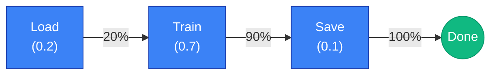

# Steps & Workflow

The Step framework separates complex workflows into reusable units, providing automatic progress tracking and failure rollback.

## Overview

Step-based workflows provide the following benefits:

- **Modularity**: Split complex tasks into independent steps
- **Progress Tracking**: Automatic progress calculation based on `progress_weight`
- **Error Recovery**: Automatic rollback of executed steps on failure
- **Reusability**: Reuse steps across different workflows

### At a Glance

| Component | Role | Import Path |
|-----------|------|-------------|
| `BaseStep[C]` | Abstract step class | `synapse_sdk.plugins.steps` |
| `StepResult` | Step execution result | `synapse_sdk.plugins.steps` |
| `BaseStepContext` | Shared state between steps | `synapse_sdk.plugins.steps` |
| `StepRegistry[C]` | Step registration and ordering | `synapse_sdk.plugins.steps` |
| `Orchestrator[C]` | Sequential step execution engine | `synapse_sdk.plugins.steps` |
| `LoggingStep[C]` | Wrapper for step logging | `synapse_sdk.plugins.steps` |
| `TimingStep[C]` | Wrapper for timing measurement | `synapse_sdk.plugins.steps` |
| `ValidationStep[C]` | Context validation step | `synapse_sdk.plugins.steps` |
| `ExportDatasetStep` | Download dataset from Synapse | `synapse_sdk.plugins.steps` |
| `ConvertDatasetStep` | Convert dataset format | `synapse_sdk.plugins.steps` |

## Core Components

### BaseStep

`BaseStep[C]` is the abstract base class for all steps. The type parameter `C` is a context type that extends `BaseStepContext`.

```python filename="synapse_sdk/plugins/steps/base.py"
class BaseStep[C: BaseStepContext](ABC):
    @property
    @abstractmethod
    def name(self) -> str:
        """Unique step identifier."""
        ...

    @property
    @abstractmethod
    def progress_weight(self) -> float:
        """Progress weight (0.0-1.0)."""
        ...

    @abstractmethod
    def execute(self, context: C) -> StepResult:
        """Execute the step."""
        ...

    def can_skip(self, context: C) -> bool:
        """Skip condition (default: False)."""
        return False

    def rollback(self, context: C, result: StepResult) -> None:
        """Rollback logic (default: no-op)."""
        pass
```

**Required Implementation:**

| Property/Method | Type | Description |
|-----------------|------|-------------|
| `name` | `str` | Unique step identifier |
| `progress_weight` | `float` | Step's portion of total progress (0.0~1.0) |
| `execute(context)` | `StepResult` | Execute step logic |

**Optional Override:**

| Method | Default | Description |
|--------|---------|-------------|
| `can_skip(context)` | `False` | Conditional skip logic |
| `rollback(context, result)` | No-op | Cleanup logic on failure |

### StepResult

`StepResult` is a dataclass that holds the step execution result.

```python filename="synapse_sdk/plugins/steps/base.py"
@dataclass
class StepResult:
    success: bool = True
    data: dict[str, Any] = field(default_factory=dict)
    error: str | None = None
    rollback_data: dict[str, Any] = field(default_factory=dict)
    skipped: bool = False
    timestamp: datetime = field(default_factory=datetime.now)
```

| Field | Type | Default | Description |
|-------|------|---------|-------------|
| `success` | `bool` | `True` | Whether step succeeded |
| `data` | `dict[str, Any]` | `{}` | Result data |
| `error` | `str \| None` | `None` | Error message on failure |
| `rollback_data` | `dict[str, Any]` | `{}` | Data needed for rollback |
| `skipped` | `bool` | `False` | Whether step was skipped |
| `timestamp` | `datetime` | `now()` | Completion timestamp |

### BaseStepContext

`BaseStepContext` is the base class for shared state between steps.

```python filename="synapse_sdk/plugins/steps/context.py"
@dataclass
class BaseStepContext:
    runtime_ctx: RuntimeContext
    step_results: list[StepResult] = field(default_factory=list)
    errors: list[str] = field(default_factory=list)
    current_step: str | None = field(default=None, init=False)

    def log(self, event: str, data: dict[str, Any], file: str | None = None) -> None:
        """Log an event."""
        ...

    def set_progress(self, current: int, total: int, category: str | None = None) -> None:
        """Set progress. Uses current_step as category if not provided."""
        ...

    def set_metrics(self, value: dict[str, Any], category: str | None = None) -> None:
        """Set metrics. Uses current_step as category if not provided."""
        ...
```

> **Good to know**: When calling `set_progress()` or `set_metrics()` inside a step without specifying `category`, the current step's `name` is automatically used as the category.

### StepRegistry

`StepRegistry[C]` manages step registration and execution order.

```python filename="synapse_sdk/plugins/steps/registry.py"
class StepRegistry[C: BaseStepContext]:
    def register(self, step: BaseStep[C]) -> None:
        """Add step to the end."""

    def unregister(self, name: str) -> None:
        """Remove step by name."""

    def get_steps(self) -> list[BaseStep[C]]:
        """Get registered step list."""

    def insert_after(self, after_name: str, step: BaseStep[C]) -> None:
        """Insert step after another step."""

    def insert_before(self, before_name: str, step: BaseStep[C]) -> None:
        """Insert step before another step."""

    @property
    def total_weight(self) -> float:
        """Sum of all step progress_weights."""
```

### Orchestrator

`Orchestrator[C]` executes registered steps sequentially and handles rollback on failure.

```python filename="synapse_sdk/plugins/steps/orchestrator.py"
class Orchestrator[C: BaseStepContext]:
    def __init__(
        self,
        registry: StepRegistry[C],
        context: C,
        progress_callback: Callable[[int, int], None] | None = None,
    ) -> None:
        """Initialize orchestrator.

        Args:
            registry: StepRegistry with steps to execute.
            context: Shared context for steps.
            progress_callback: Progress callback (current, total).
        """

    def execute(self) -> dict[str, Any]:
        """Execute all steps.

        Returns:
            Dict with success status and execution info.

        Raises:
            RuntimeError: On step failure (after rollback).
        """
```

## Creating Steps

### Basic Step

Subclass `BaseStep` to define a custom step.

```python filename="plugin/steps/load_data.py"
from dataclasses import dataclass, field
from synapse_sdk.plugins.steps import BaseStep, BaseStepContext, StepResult


@dataclass
class MyContext(BaseStepContext):
    """Custom context."""
    data: list[str] = field(default_factory=list)
    processed_count: int = 0


class LoadDataStep(BaseStep[MyContext]):
    """Data loading step."""

    @property
    def name(self) -> str:
        return 'load_data'

    @property
    def progress_weight(self) -> float:
        return 0.3  # 30% of total progress

    def execute(self, context: MyContext) -> StepResult:
        # Update progress (automatically uses 'load_data' as category)
        context.set_progress(0, 100)

        # Load data logic
        context.data = ['item1', 'item2', 'item3']

        context.set_progress(100, 100)
        return StepResult(success=True, data={'count': len(context.data)})
```

### Step with Rollback

Implement `rollback()` for steps that need cleanup on failure.

```python filename="plugin/steps/create_files.py"
from pathlib import Path
from synapse_sdk.plugins.steps import BaseStep, StepResult


class CreateFilesStep(BaseStep[MyContext]):
    """File creation step (with rollback support)."""

    @property
    def name(self) -> str:
        return 'create_files'

    @property
    def progress_weight(self) -> float:
        return 0.2

    def execute(self, context: MyContext) -> StepResult:
        created_files = []

        for item in context.data:
            path = Path(f'/tmp/{item}.txt')
            path.write_text(item)
            created_files.append(str(path))

        # Store info needed for rollback
        return StepResult(
            success=True,
            data={'files': created_files},
            rollback_data={'created_files': created_files},
        )

    def rollback(self, context: MyContext, result: StepResult) -> None:
        """Delete created files."""
        for file_path in result.rollback_data.get('created_files', []):
            Path(file_path).unlink(missing_ok=True)
        context.log('rollback', {'step': self.name, 'files_removed': len(result.rollback_data.get('created_files', []))})
```

### Conditional Skip

Implement `can_skip()` for conditional step execution.

```python filename="plugin/steps/optional_step.py"
class CacheStep(BaseStep[MyContext]):
    """Cache loading step (skip if cache exists)."""

    @property
    def name(self) -> str:
        return 'load_cache'

    @property
    def progress_weight(self) -> float:
        return 0.1

    def can_skip(self, context: MyContext) -> bool:
        # Skip if data already loaded
        return len(context.data) > 0

    def execute(self, context: MyContext) -> StepResult:
        # Cache loading logic (implement your own cache loading)
        context.data = ['cached_item1', 'cached_item2']
        return StepResult(success=True)
```

## Building Workflows

### Basic Workflow

```python filename="plugin/workflow.py"
from synapse_sdk.plugins.steps import Orchestrator, StepRegistry


# 1. Create context
context = MyContext(runtime_ctx=runtime_ctx)

# 2. Register steps
registry = StepRegistry[MyContext]()
registry.register(LoadDataStep())
registry.register(CreateFilesStep())
registry.register(ProcessStep())

# 3. Execute with orchestrator
orchestrator = Orchestrator(registry, context)
result = orchestrator.execute()

print(result)
# {'success': True, 'steps_executed': 3, 'steps_total': 3}
```

### Dynamic Step Insertion

Insert steps dynamically into an existing workflow.

```python filename="plugin/dynamic_workflow.py"
registry = StepRegistry[MyContext]()
registry.register(LoadDataStep())
registry.register(ProcessStep())
registry.register(SaveStep())

# Insert validation step before 'process'
registry.insert_before('process', ValidateStep())

# Insert audit step after 'process'
registry.insert_after('process', AuditStep())

# Execution order: load_data -> validate -> process -> audit -> save
```

To wrap an existing step with logging, register it with `LoggingStep` from the start:

```python filename="plugin/logged_workflow.py"
registry = StepRegistry[MyContext]()
registry.register(LoggingStep(LoadDataStep()))
registry.register(LoggingStep(ProcessStep()))
registry.register(LoggingStep(SaveStep()))

# All steps are wrapped with logging from registration
```

> **Good to know**: `LoggingStep` adds a `logged_` prefix to the step name (e.g., `load_data` becomes `logged_load_data`). When using dynamic insertion with wrapped steps, reference the prefixed name: `registry.insert_before('logged_process', ValidateStep())`.

### Progress Callback

Use progress callback to report progress to external systems.

```python filename="plugin/progress_workflow.py"
def on_progress(current: int, total: int) -> None:
    print(f'Progress: {current}/{total}%')

orchestrator = Orchestrator(
    registry=registry,
    context=context,
    progress_callback=on_progress,
)
orchestrator.execute()

# Output:
# Progress: 30/100%  (LoadDataStep complete, weight=0.3)
# Progress: 50/100%  (CreateFilesStep complete, weight=0.2)
# Progress: 100/100% (ProcessStep complete, weight=0.5)
```

## Using Steps in Actions

`BaseTrainAction` supports step-based execution through the `setup_steps()` method.

### BaseTrainAction Integration

```python filename="plugin/train.py"
from synapse_sdk.plugins import BaseTrainAction
from synapse_sdk.plugins.actions.train import TrainContext
from synapse_sdk.plugins.steps import StepRegistry


class MyTrainAction(BaseTrainAction[MyTrainParams]):
    """Step-based training action."""

    def setup_steps(self, registry: StepRegistry[TrainContext]) -> None:
        """Register workflow steps."""
        registry.register(LoadDatasetStep())
        registry.register(PreprocessStep())
        registry.register(TrainModelStep())
        registry.register(UploadModelStep())

    # Don't implement execute() - step-based execution is automatic when steps are registered
```

> **Good to know**: When `setup_steps()` registers any steps, step-based execution is automatically enabled instead of calling `execute()`.

### Custom Context

Extend `TrainContext` to add additional state fields.

```python filename="plugin/context.py"
from dataclasses import dataclass, field
from synapse_sdk.plugins.actions.train import TrainContext


@dataclass
class MyTrainContext(TrainContext):
    """Extended training context."""
    augmentation_config: dict = field(default_factory=dict)
    validation_results: list = field(default_factory=list)
```

## Built-in Step Utilities

### LoggingStep

Automatically logs step execution with timing.

```python filename="plugin/logged_steps.py"
from synapse_sdk.plugins.steps import LoggingStep

# Wrap existing step with logging
logged_step = LoggingStep(ProcessStep())
registry.register(logged_step)

# Log output:
# step_start: {'step': 'process'}
# step_end: {'step': 'process', 'elapsed': 1.234, 'success': True}
```

**Events logged by LoggingStep:**

| Event | Timing | Data |
|-------|--------|------|
| `step_start` | Before execution | `{'step': name}` |
| `step_end` | After execution | `{'step': name, 'elapsed': seconds, 'success': bool, 'skipped': bool}` |
| `step_rollback` | On rollback | `{'step': name}` |

### TimingStep

Measures execution time and adds it to the step's result data.

```python filename="plugin/timed_steps.py"
from synapse_sdk.plugins.steps import TimingStep

timed_step = TimingStep(ProcessStep())
registry.register(timed_step)

# After execution, the StepResult.data includes duration_seconds
# Access via context.step_results[-1].data['duration_seconds']
```

> **Good to know**: `TimingStep` adds a `timed_` prefix to the step name (e.g., `process` becomes `timed_process`).

### ValidationStep

Easily create context validation steps.

```python filename="plugin/validation_steps.py"
from synapse_sdk.plugins.steps import ValidationStep


def check_data_loaded(ctx: MyContext) -> tuple[bool, str | None]:
    """Validate data is loaded."""
    if not ctx.data:
        return False, 'No data loaded'
    return True, None


# Create ValidationStep
validation = ValidationStep(
    validator=check_data_loaded,
    name='validate_data',
    progress_weight=0.05,
)
registry.register(validation)
```

## Built-in Dataset Steps

The SDK provides reusable steps for common dataset operations. These are automatically used by `BaseTrainAction` when `target_format` is set, but you can also use them directly in custom workflows.

### ExportDatasetStep

Downloads a dataset from Synapse backend. Reads `dataset` from `context.params` and stores the result in `context.dataset`.

```python
from synapse_sdk.plugins.steps import ExportDatasetStep

registry.register(ExportDatasetStep())
```

**Behavior:**
- Reads `dataset`, `splits`, and `output_dir` from `context.params`
- Downloads dataset to local filesystem
- Stores result in `context.dataset` with keys: `path`, `format`, `is_categorized`, `count`

### ConvertDatasetStep

Converts a dataset between formats. Reads from `context.dataset` (set by `ExportDatasetStep`) and updates it with the converted path.

```python
from synapse_sdk.plugins.steps import ConvertDatasetStep

# Convert to YOLO format
registry.register(ConvertDatasetStep(target_format='yolo'))

# Convert to COCO format
registry.register(ConvertDatasetStep(target_format='coco'))
```

**Constructor args:**

| Arg | Type | Default | Description |
|-----|------|---------|-------------|
| `target_format` | `str` | `'yolo'` | Target format (yolo, coco, etc.) |
| `source_format` | `str` | `'dm_v2'` | Source format |

**Behavior:**
- Reads `context.dataset['path']` from previous step
- Converts to target format
- Updates `context.dataset` with: `path`, `config_path`, `format`, `is_categorized`

### Using in Custom Workflows

```python
from synapse_sdk.plugins.steps import ExportDatasetStep, ConvertDatasetStep, StepRegistry
from synapse_sdk.plugins.actions.train import TrainContext

def setup_steps(self, registry: StepRegistry[TrainContext]) -> None:
    # Use SDK steps for data handling
    registry.register(ExportDatasetStep())
    registry.register(ConvertDatasetStep(target_format='yolo'))
    
    # Add custom preprocessing
    registry.register(MyAugmentationStep())
    
    # Custom training step
    registry.register(MyTrainStep())
```

> **Good to know**: When using `BaseTrainAction` with `target_format` set, these steps are automatically registered. Override `setup_steps()` only when you need custom behavior.

## Progress Tracking

### Weight-Based Progress

`progress_weight` represents each step's portion of total progress.

```python
class LoadStep(BaseStep[MyContext]):
    @property
    def progress_weight(self) -> float:
        return 0.2  # 20%

class TrainStep(BaseStep[MyContext]):
    @property
    def progress_weight(self) -> float:
        return 0.7  # 70%

class SaveStep(BaseStep[MyContext]):
    @property
    def progress_weight(self) -> float:
        return 0.1  # 10%
```

Orchestrator calculates progress based on cumulative weights after each step completion.



### Per-Step Progress

Report detailed progress within a step.

```python filename="plugin/steps/train.py"
class TrainStep(BaseStep[TrainContext]):
    def execute(self, context: TrainContext) -> StepResult:
        epochs = context.params.get('epochs', 10)

        for epoch in range(epochs):
            train_one_epoch()
            # Per-step progress (automatically uses 'train' as category)
            context.set_progress(epoch + 1, epochs)
            context.set_metrics({'loss': 0.1, 'epoch': epoch})

        return StepResult(success=True)
```

## Error Handling & Rollback

### Automatic Rollback

On step failure, Orchestrator calls `rollback()` on all previously executed steps in reverse order.

```
Execution order:  Step1 -> Step2 -> Step3 (failed!)
Rollback order:   Step2.rollback() -> Step1.rollback()
```

```python filename="plugin/rollback_example.py"
class Step1(BaseStep[MyContext]):
    def execute(self, context: MyContext) -> StepResult:
        context.log('step1', {'action': 'created resource A'})
        return StepResult(success=True, rollback_data={'resource': 'A'})

    def rollback(self, context: MyContext, result: StepResult) -> None:
        resource = result.rollback_data.get('resource')
        context.log('rollback', {'action': f'deleted resource {resource}'})


class Step2(BaseStep[MyContext]):
    def execute(self, context: MyContext) -> StepResult:
        context.log('step2', {'action': 'created resource B'})
        return StepResult(success=True, rollback_data={'resource': 'B'})

    def rollback(self, context: MyContext, result: StepResult) -> None:
        resource = result.rollback_data.get('resource')
        context.log('rollback', {'action': f'deleted resource {resource}'})


class Step3(BaseStep[MyContext]):
    def execute(self, context: MyContext) -> StepResult:
        # Failure!
        return StepResult(success=False, error='Something went wrong')
```

**Execution result:**
```
step1: {'action': 'created resource A'}
step2: {'action': 'created resource B'}
step3: failed
rollback: {'action': 'deleted resource B'}  # Step2 rollback
rollback: {'action': 'deleted resource A'}  # Step1 rollback
RuntimeError: Step 'step3' failed: Something went wrong
```

> **Good to know**: Errors during rollback don't prevent other steps from rolling back (best-effort rollback).

### Exception Handling

Exceptions in `execute()` are automatically converted to `StepResult(success=False, error=str(e))`.

```python
class RiskyStep(BaseStep[MyContext]):
    def execute(self, context: MyContext) -> StepResult:
        # Exception automatically converted to failure
        raise ValueError('Invalid input')

# Result: StepResult(success=False, error='Invalid input')
# Then rollback proceeds
```

## Example: Multi-Step Training

Complete training workflow example.

```python filename="plugin/train_workflow.py"
from dataclasses import dataclass, field
from pathlib import Path
from typing import Any

from synapse_sdk.plugins import BaseTrainAction
from synapse_sdk.plugins.actions.train import BaseTrainParams, TrainContext
from synapse_sdk.plugins.steps import BaseStep, StepRegistry, StepResult, LoggingStep


class MyTrainParams(BaseTrainParams):
    """Training parameters."""
    dataset: int
    epochs: int = 100
    batch_size: int = 32


# Step definitions
class LoadDatasetStep(BaseStep[TrainContext]):
    @property
    def name(self) -> str:
        return 'load_dataset'

    @property
    def progress_weight(self) -> float:
        return 0.1

    def execute(self, context: TrainContext) -> StepResult:
        dataset = context.params.get('dataset')
        context.log('dataset_load_start', {'dataset': dataset})

        # Load dataset
        context.dataset = context.client.get_data_collection(dataset)

        context.log('dataset_load_complete', {'count': len(context.dataset)})
        return StepResult(success=True, data={'dataset_size': len(context.dataset)})


class TrainModelStep(BaseStep[TrainContext]):
    @property
    def name(self) -> str:
        return 'train'

    @property
    def progress_weight(self) -> float:
        return 0.7

    def execute(self, context: TrainContext) -> StepResult:
        epochs = context.params.get('epochs', 100)

        for epoch in range(epochs):
            # Train one epoch (implement your own training logic)
            loss = 1.0 / (epoch + 1)  # Example: decreasing loss
            context.set_progress(epoch + 1, epochs)
            context.set_metrics({'loss': loss, 'epoch': epoch})

        context.model_path = '/tmp/model.pt'
        return StepResult(
            success=True,
            data={'final_loss': loss},
            rollback_data={'model_path': context.model_path},
        )

    def rollback(self, context: TrainContext, result: StepResult) -> None:
        # Clean up temporary files created during training
        model_path = result.rollback_data.get('model_path')
        if model_path:
            Path(model_path).unlink(missing_ok=True)


class UploadModelStep(BaseStep[TrainContext]):
    @property
    def name(self) -> str:
        return 'upload_model'

    @property
    def progress_weight(self) -> float:
        return 0.2

    def execute(self, context: TrainContext) -> StepResult:
        context.set_progress(0, 100)

        model = context.client.create_model({
            'file': context.model_path,
            'name': 'trained-model',
        })
        context.model = model

        context.set_progress(100, 100)
        return StepResult(success=True, data={'model_id': model['id']})


# Action definition
class MyTrainAction(BaseTrainAction[MyTrainParams]):
    """Step-based training action."""

    def setup_steps(self, registry: StepRegistry[TrainContext]) -> None:
        # Wrap all steps with logging
        registry.register(LoggingStep(LoadDatasetStep()))
        registry.register(LoggingStep(TrainModelStep()))
        registry.register(LoggingStep(UploadModelStep()))
```

## Best Practices

### Step Design

- **Single responsibility**: Each step should perform one clear task
- **Consider reusability**: Design steps to be usable in other workflows
- **Appropriate granularity**: Avoid steps that are too small or too large

### Progress Weight

- **Reflect actual time**: Set weights based on actual execution time ratios
- **Consider totals**: Design so all step weights sum close to 1.0
- **Fast steps**: Use small weights (0.05~0.1) for quick steps like validation or initialization

### Rollback Implementation

- **Ensure idempotency**: Rollback should be safe to call multiple times
- **Handle partial failure**: Consider cases where execution failed mid-way
- **Store required info**: Include all necessary information in `rollback_data`

```python
# Good: Idempotent rollback
def rollback(self, context: MyContext, result: StepResult) -> None:
    path = Path(result.rollback_data.get('file_path', ''))
    path.unlink(missing_ok=True)  # No error if file doesn't exist
```

### Context State Management

- **Minimal state**: Store only necessary state in context
- **Immutable params**: Don't modify `params` in steps
- **Use logging**: Record important state changes with `log()`

## Related

- [Defining Actions](/plugins/defining-actions) - How to define actions
- [RuntimeContext](/plugins/runtime-context) - RuntimeContext API
- [Pipelines](/plugins/pipelines) - Pipeline configuration
