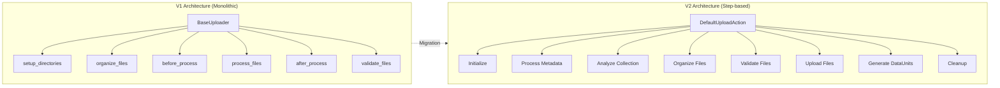
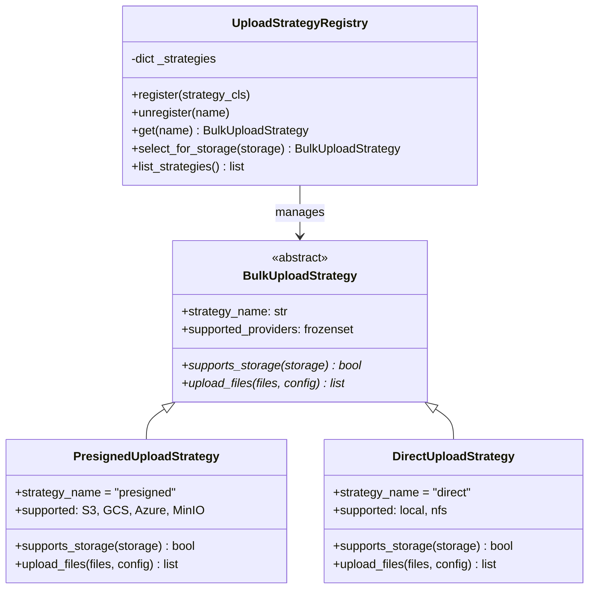
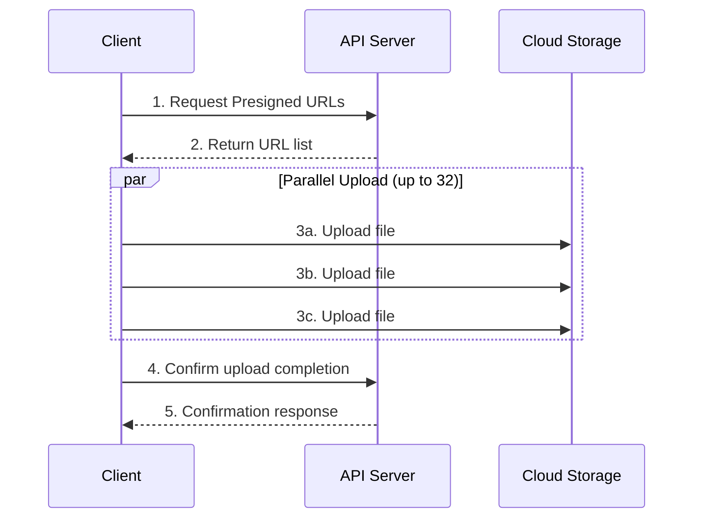
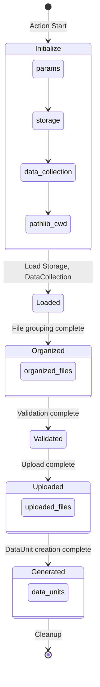
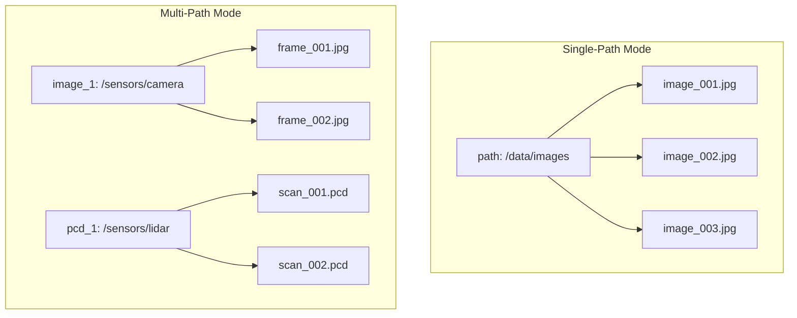
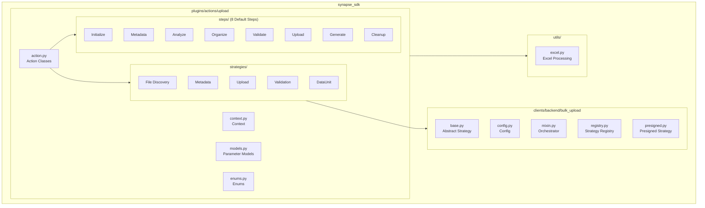

# Upload Plugin Migration Guide (V1 → V2)

This guide explains how to migrate existing V1 style upload plugins to the V2 Step-based architecture.

## Prerequisites

```bash
# Install SDK (with Excel metadata support)
pip install "synapse-sdk[all]"

# Or install individually
pip install synapse-sdk openpyxl
```

**Key Dependencies:**
- `synapse-sdk>=2.0.0`
- `openpyxl>=3.1.0` - Excel metadata parsing
- `jinja2>=3.1.0` - Plugin template generation

---

## Overview



### V1 Architecture (Legacy)
```python
# Monolithic structure - all logic in a single class
class Uploader(BaseUploader):
    def handle_upload_files(self):
        self.setup_directories()
        files = self.organize_files(self.organized_files)
        files = self.before_process(files)
        files = self.process_files(files)
        files = self.after_process(files)
        return self.validate_files(files)
```

### V2 Architecture (New)
```python
# Step-based workflow - each stage is an independent Step
class MyUploadAction(DefaultUploadAction[UploadParams]):
    action_name = 'upload'
    params_model = UploadParams
    # 8 Steps are automatically registered
```

---

## Key Changes

| Item | V1 | V2 |
|------|----|----|
| Base Class | `BaseUploader` | `BaseUploadAction` / `DefaultUploadAction` |
| Execution | Method Override | Step Registration |
| State Management | `self.organized_files` etc. | `UploadContext` dataclass |
| Parameters | `dict` | `UploadParams` (Pydantic) |
| Extensibility | Method Override | Strategy Pattern |

---

## Migration Steps

### 1. Define Parameter Model

**V1 (params as dict):**
```python
def __init__(self, run, path, file_specification, organized_files, extra_params):
    self.extra_params = extra_params or {}
```

**V2 (Pydantic model):**
```python
from synapse_sdk.plugins.actions.upload.models import UploadParams

class MyUploadParams(UploadParams):
    """Custom parameters can be added"""
    custom_option: str = "default"
```

### 2. Change Action Class

**V1:**
```python
from plugin import BaseUploader

class Uploader(BaseUploader):
    def process_files(self, organized_files):
        # File processing logic
        return organized_files
```

**V2 (Using default workflow):**
```python
from synapse_sdk.plugins.actions.upload import DefaultUploadAction, UploadParams

class MyUploadAction(DefaultUploadAction[UploadParams]):
    action_name = 'upload'
    params_model = UploadParams
    # 8 Steps are automatically registered
```

**V2 (Custom workflow):**
```python
from synapse_sdk.plugins.actions.upload import (
    BaseUploadAction,
    UploadContext,
)
from synapse_sdk.plugins.actions.upload.steps import (
    InitializeStep,
    ValidateFilesStep,
    UploadFilesStep,
    CleanupStep,
)
from synapse_sdk.plugins.steps import StepRegistry

class MyUploadAction(BaseUploadAction[MyParams]):
    action_name = 'upload'
    params_model = MyParams

    def setup_steps(self, registry: StepRegistry[UploadContext]) -> None:
        # Register only required Steps
        registry.register(InitializeStep())
        registry.register(ValidateFilesStep())
        registry.register(UploadFilesStep())
        registry.register(CleanupStep())
```

### 3. Migrate File Processing Logic

**V1 Method → V2 Custom Step Mapping:**

| V1 Method | V2 Step | Description |
|-----------|---------|-------------|
| `setup_directories()` | `InitializeStep` | Initialization |
| `organize_files()` | `OrganizeFilesStep` | File grouping |
| `before_process()` | Custom Step | Pre-processing |
| `process_files()` | Custom Step | Main processing |
| `after_process()` | Custom Step | Post-processing |
| `validate_files()` | `ValidateFilesStep` | Validation |

### 4. Write Custom Step

```python
from synapse_sdk.plugins.steps.base import BaseStep, StepResult
from synapse_sdk.plugins.actions.upload.context import UploadContext

class MyProcessingStep(BaseStep[UploadContext]):
    """Custom file processing Step"""

    @property
    def name(self) -> str:
        return "my_processing"

    @property
    def progress_weight(self) -> float:
        return 0.2  # 20% of total progress

    def execute(self, context: UploadContext) -> StepResult:
        # Access context.organized_files
        for file_group in context.organized_files:
            # File processing logic
            pass

        return StepResult(success=True, data={"processed": len(context.organized_files)})

    def rollback(self, context: UploadContext) -> None:
        # Rollback logic on failure (optional)
        pass
```

### 5. Use Strategy Pattern (Optional)

To customize specific behaviors, replace the Strategy:

```python
from synapse_sdk.plugins.actions.upload.strategies import (
    FileDiscoveryStrategy,
    FlatFileDiscoveryStrategy,
)

class MyFileDiscoveryStrategy(FileDiscoveryStrategy):
    """Custom file discovery strategy"""

    def discover(self, path, recursive=True):
        # Custom file discovery logic
        return discovered_files

# Use Strategy in Step
class MyOrganizeStep(OrganizeFilesStep):
    def __init__(self):
        super().__init__(
            file_discovery_strategy=MyFileDiscoveryStrategy()
        )
```

---

## config.yaml Changes

**V1:**
```yaml
actions:
  upload:
    entrypoint: plugin.upload.Uploader
```

**V2:**
```yaml
actions:
  upload:
    entrypoint: plugin.upload.MyUploadAction
    input_type: plugin.upload.MyUploadParams  # Auto-detected
```

### Dynamic Action Discovery

`synapse plugin create` uses `ActionRegistry` for dynamic action name and entrypoint generation:

```bash
$ synapse plugin create my-upload-plugin --category upload
✓ Plugin created at my-upload-plugin/
```

The generated `config.yaml` will have:
```yaml
actions:
  upload:  # Action name from ActionRegistry
    entrypoint: plugin.upload.UploadAction  # Entrypoint pattern from registry
```

To sync `input_type` after modifying `params_model`:
```bash
$ synapse plugin update-config
```

> This command analyzes `params_model` from code and auto-sets `input_type` in config.yaml.

---

## 8-Step Workflow Details

Default workflow provided by `DefaultUploadAction`:

```mermaid
flowchart TD
    subgraph INIT ["1️⃣ InitializeStep (5%)"]
        I1[Query & validate Storage]
        I2[Load DataCollection]
        I3[Setup working directory]
    end

    subgraph META ["2️⃣ ProcessMetadataStep (10%)"]
        M1[Parse Excel metadata]
        M2[Security validation<br/>file size, row limits]
    end

    subgraph ANALYZE ["3️⃣ AnalyzeCollectionStep (5%)"]
        A1[Load file_specification]
        A2[Analyze supported file types]
    end

    subgraph ORGANIZE ["4️⃣ OrganizeFilesStep (15%)"]
        O1[File discovery<br/>recursive option]
        O2[Group by stem]
        O3[single-path / multi-path mode]
    end

    subgraph VALIDATE ["5️⃣ ValidateFilesStep (10%)"]
        V1[Validate file extensions]
        V2[Validate file sizes]
        V3[Check specification matching]
    end

    subgraph UPLOAD ["6️⃣ UploadFilesStep (30%)"]
        U1[Presigned URL upload<br/>S3/GCS/Azure]
        U2[Direct API upload<br/>Fallback]
        U3[Parallel upload support]
    end

    subgraph GENERATE ["7️⃣ GenerateDataUnitsStep (20%)"]
        G1[Call DataUnit creation API]
        G2[Batch processing]
    end

    subgraph CLEANUP ["8️⃣ CleanupStep (5%)"]
        C1[Clean temporary files]
        C2[Release resources]
    end

    INIT --> META --> ANALYZE --> ORGANIZE --> VALIDATE --> UPLOAD --> GENERATE --> CLEANUP
```



---

## Upload Strategy Architecture



Upload strategies are managed via `UploadStrategyRegistry`:

```python
from synapse_sdk.clients.backend.bulk_upload import get_strategy_registry

registry = get_strategy_registry()
print(registry.list_strategies())  # ['presigned']

# Auto-selection based on storage provider
storage = {'provider': 'amazon_s3'}
strategy_cls = registry.select_for_storage(storage)
```

### Adding Custom Strategy

```python
from synapse_sdk.clients.backend.bulk_upload import BulkUploadStrategy, get_strategy_registry

class DirectUploadStrategy(BulkUploadStrategy):
    strategy_name = 'direct'
    supported_providers = frozenset({'local', 'nfs'})

    def supports_storage(self, storage):
        return storage.get('provider', '').lower() in self.supported_providers

    def upload_files(self, file_paths, config, *, on_progress=None):
        # Implementation
        pass

# Register
registry = get_strategy_registry()
registry.register(DirectUploadStrategy)
```

---

## Upload Methods

### Presigned URL Upload (Recommended)

Supported storage: **Amazon S3, MinIO, Google Cloud Storage, Azure Blob**



**Advantages:**
- Reduced API server load
- Up to 32 concurrent uploads
- Support for large files over 5TB (multipart)

### Traditional API Upload (Fallback)

Automatically used for storage that doesn't support Presigned URLs.

---

## UploadContext Usage



```python
@dataclass
class UploadContext(BaseStepContext):
    params: dict[str, Any]           # Upload parameters
    storage: Any | None              # Storage info
    data_collection: Any | None      # DataCollection info
    project: Any | None              # Project info
    pathlib_cwd: Path | None         # Working directory
    organized_files: list[dict]      # Grouped file list
    uploaded_files: list[dict]       # Uploaded file list
    data_units: list[dict]           # Created DataUnit list
    excel_metadata: dict | None      # Excel metadata

    # Utility properties
    @property
    def use_single_path(self) -> bool: ...

    @property
    def max_file_size_bytes(self) -> int: ...

    @property
    def client(self) -> BackendClient: ...
```

---

## Excel Metadata Support

You can load metadata from Excel files during upload and automatically link them to DataUnits.

### Excel File Format

| filename | label | confidence | category |
|----------|-------|------------|----------|
| image_001.jpg | cat | 0.95 | animal |
| image_002.jpg | dog | 0.87 | animal |

- **filename column (required)**: Key matching the filename
- **Other columns**: Automatically mapped to meta field

### Usage

```python
params = UploadParams(
    name="Upload with Metadata",
    storage=1,
    data_collection=5,
    path="/data/images",
    excel_metadata_path="metadata.xlsx",  # Path in storage
)
```

### Security Configuration

Resource limits can be set with `ExcelSecurityConfig`:

```python
from synapse_sdk.utils.excel import ExcelSecurityConfig

config = ExcelSecurityConfig(
    max_file_size_mb=10,      # Max file size
    max_rows=100000,          # Max rows
    max_columns=50,           # Max columns
    max_memory_usage_mb=30,   # Memory limit
)
```

---

## Single-Path vs Multi-Path Mode



### Single-Path Mode (Default)
```python
params = UploadParams(
    name="My Upload",
    storage=1,
    data_collection=5,
    use_single_path=True,  # Default
    path="/data/images",
    is_recursive=True,
)
```

### Multi-Path Mode
```python
from synapse_sdk.plugins.actions.upload.models import AssetConfig

params = UploadParams(
    name="Multi-Source Upload",
    storage=1,
    data_collection=5,
    use_single_path=False,
    assets={
        "image_1": AssetConfig(path="/sensors/camera", is_recursive=True),
        "pcd_1": AssetConfig(path="/sensors/lidar", is_recursive=False),
    },
)
```

---

## Comparison with train, add_task_data

| Feature | train | add_task_data | upload |
|---------|-------|---------------|--------|
| Base Class | `BaseTrainAction` | `AddTaskDataAction` | `BaseUploadAction` |
| Step Support | Optional | Required | Required |
| Default Steps | None | 1 | 8 |
| Context | `TrainContext` | `AddTaskDataContext` | `UploadContext` |
| Strategy Pattern | No | No | Yes |

### Common Pattern

```python
# Common pattern followed by all Actions
class MyAction(BaseXxxAction[MyParams]):
    action_name = 'action_name'
    params_model = MyParams

    def setup_steps(self, registry: StepRegistry[XxxContext]) -> None:
        registry.register(MyStep())

    def create_context(self) -> XxxContext:
        return XxxContext(
            runtime_ctx=self.ctx,
            params=self.params.model_dump(),
        )
```

---

## Local Execution and Debugging

### Run via CLI

```bash
# Pass parameters as JSON
synapse plugin run upload --mode local --params '{
  "name": "test-upload",
  "storage": 11,
  "data_collection": 2770,
  "path": "my-data/images/",
  "is_recursive": true
}'

# Debug mode
synapse plugin run upload --mode local --debug-sdk --params '...'
```

### Using params.json File

```json
{
  "name": "test-upload",
  "storage": 11,
  "data_collection": 2770,
  "path": "my-data/images/",
  "use_single_path": true,
  "is_recursive": true,
  "extra_params": {
    "custom_key": "custom_value"
  }
}
```

### VSCode Debugging Configuration

`.vscode/launch.json`:
```json
{
  "version": "0.2.0",
  "configurations": [
    {
      "name": "Debug Upload Action",
      "type": "debugpy",
      "request": "launch",
      "module": "synapse_sdk.cli.main",
      "args": [
        "plugin", "run", "upload",
        "--mode", "local",
        "--debug-sdk",
        "--params-file", "params.json"
      ],
      "env": {
        "SYNAPSE_HOST": "https://api.staging.synapse.sh",
        "SYNAPSE_ACCESS_TOKEN": "${env:SYNAPSE_ACCESS_TOKEN}"
      },
      "justMyCode": false
    }
  ]
}
```

### Common Errors and Solutions

| Error | Cause | Solution |
|-------|-------|----------|
| `Validation context is required` | Executor not passing client context | Use latest SDK version |
| `Storage model has no attribute 'get'` | Need to convert Storage model to dict | `{'provider': storage.provider, 'configuration': storage.configuration}` |
| `takes N positional arguments but N+1 were given` | Missing keyword argument | Pass as `use_chunked_upload=value` |

---

## Checklist

### Migration Completion Verification

- [ ] Change `BaseUploader` → `BaseUploadAction` or `DefaultUploadAction`
- [ ] Convert parameters to Pydantic model
- [ ] Separate custom logic into Steps
- [ ] Update entrypoint in config.yaml
- [ ] Run `synapse plugin update-config` (automatic for new plugins)
- [ ] Run local test (`synapse plugin run upload --mode local`)
- [ ] Write and verify unit tests

### Recommended Test Scenarios

```python
import pytest
from unittest.mock import MagicMock, patch

def test_upload_action_initialization():
    """Verify Action initializes correctly"""
    from plugin.upload import MyUploadAction

    action = MyUploadAction()
    assert action.action_name == 'upload'
    assert action.params_model is not None

def test_upload_params_validation():
    """Verify parameter validation works correctly"""
    from synapse_sdk.plugins.actions.upload.models import UploadParams

    # Error when required fields are missing
    with pytest.raises(ValidationError):
        UploadParams(name="test")  # storage, data_collection missing

    # Error when path is missing in single-path mode
    with pytest.raises(ValidationError):
        UploadParams(
            name="test",
            storage=1,
            data_collection=5,
            use_single_path=True,
            # path missing
        )
```

---

## References

### Related Documents
- [Step-based Workflow Guide](./step-workflow.md)
- [Strategy Pattern Guide](./strategy-pattern.md)
- [UploadParams API Reference](../api/upload-params.md)

### SDK Module Structure



**Directory Structure:**

```
synapse_sdk/
├── plugins/actions/upload/          # Upload Plugin Core Module
│   ├── action.py                    # Action Classes (Base/Default)
│   ├── context.py                   # Upload Context
│   ├── models.py                    # Parameter Models
│   ├── enums.py                     # Log Codes, Mode Enums
│   ├── steps/                       # 8 Default Steps
│   └── strategies/                  # Extensible Strategies
├── clients/backend/bulk_upload/     # Bulk Upload Client
│   ├── base.py                      # Abstract Strategy Class
│   ├── config.py                    # Upload Config
│   ├── mixin.py                     # Orchestrator Mixin
│   ├── registry.py                  # Strategy Registry
│   └── strategies/presigned.py      # Presigned URL Strategy
└── utils/excel.py                   # Excel Metadata Processing
```

---

*Last updated: 2026-01-22*
