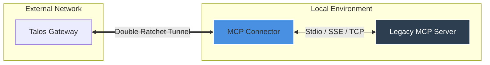

# Talos MCP Connector 🔌

> **Legacy Bridge & Secure Tunnel**: The Talos MCP Connector allows standard Model Context Protocol (MCP) servers—which natively speak JSON-RPC over Stdio or SSE—to integrate seamlessly with the Talos Network. It operates as a high-security sidecar proxy, wrapping legacy tool servers in forward-secure Double Ratchet tunnels.

---

## 🌟 Key Features

- **Zero-Mod Integration**: Connect any existing MCP server (Stdio/SSE) without changing a single line of code.
- **Security Sidecar**: Implements **Phase 10 A2A Encrypted Channels** (Double Ratchet) for all tool invocations.
- **Policy Enforcement**: Integrates with the Talos Policy Engine to enforce per-team tool access and read/write separation.
- **Durable Idempotency**: Built-in support for **Phase 9.3 Idempotency** via Redis-backed caches for write operations.
- **Universal Transport**: Unified handling of Stdio, SSE, and raw TCP tool transports.

## 🏗️ Architecture

The Connector functions as a cryptographic gateway, translating between the external Talos E2EE protocol and the internal local JSON-RPC protocol.



## 🛠️ Tech Stack

- **Runtime**: Python 3.11+
- **Core Protocol**: [Model Context Protocol (MCP)](https://modelcontextprotocol.io)
- **Encryption**: Talos Core (Rust-based Signal Double Ratchet)
- **Communication**: Stdio, EventSource (SSE), HTTP/2
- **Dependencies**: FastAPI (Internal API), Pydantic v2

## 💻 Usage

### Quickstart

Launch the connector pointing to your local server configuration:

```bash
./scripts/start.sh --config server_config.json
```

### Operational Interface

- `make test`: Execute unit and integration test suites.
- `make lint`: Run mypy and flake8 for type safety and style compliance.
- `scripts/test.sh`: Standard entrypoint for CI/CD gates.

## 🛡️ Security Guarantees

- **Transport Protection**: All data in transit is encrypted using ephemeral keys with per-message ratcheting.
- **Process Isolation**: The connector runs as a separate process, limiting the blast radius of potential server compromises.
- **Local Binding**: By default, the internal management API binds strictly to `127.0.0.1`.

## 📄 License

Licensed under the Apache License, Version 2.0. See [LICENSE](LICENSE) for details.
