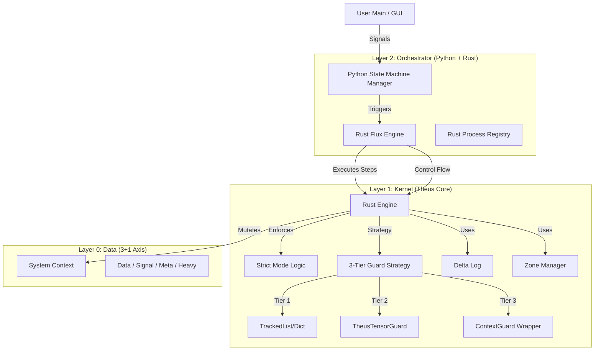

# [LEGACY] Theus V2.2 Architecture Specification
> **⚠️ WARNING: DEPRECATED**
> This document describes the legacy V2.2 architecture. Theus is now on **v3.0** which uses an **Immutable Snapshot Isolation** model.
> Please refer to [theus_framework/Documents/tutorials/en/](../tutorials/en/) for current V3 documentation.

## 1. Vision
Transition from a "Hybrid Framework" to a **"Process-Oriented Operating System"**.
Theus v2.2 utilizes a **Rust Microkernel** to ensure Correctness, Memory Safety, and Extreme Performance (Zero-Copy Heavy Zone) for AI Agent applications.

## 2. High-Level Architecture

## 3. Core Changes in V2.2

### A. From Python Engine to Rust Kernel
-   **V2.1:** `POPEngine` (Python) managed logic, calling Rust modules for support.
-   **V2.2:** `theus_core::Engine` (Rust) controls the entire lifecycle. Python `TheusEngine` is just a thin wrapper.
-   **Benefit:** Native performance and elimination of Python-side bypasses (when Strict Mode is ON).

### B. Strict Mode & "Training Mode"
-   **V2.1:** Safety was a convention.
-   **V2.2:** Safety is ENFORCED by default (`strict_mode=True`), but OPTIONAL for performance.
    -   **Production (Strict=True):** Enforces Immutable Inputs, Shadow Copies, and Contract Auditing. Guaranteed Rollback.
    -   **Training (Strict=False):** Disables the entire Transaction Layer. Zero Overhead, Native Speed, No Rollback. (New in 2.2.2).

### C. Flux Engine (Rust Orchestration)
-   **V2.1:** Python loop read YAML and called functions.
-   **V2.2:** The **Flux Logic** (Steps, If/Else, Loops) is moved to Rust Kernel.
    -   **Flux Engine:** Python only hands over the config; Rust acts as the stepper.
    -   **FSM Manager:** High-level State logic remains in Python for flexibility.

### D. 3-Tier Guard Strategy (New in v2.2.6)
We moved beyond a single "ContextGuard" to a tiered approach for optimal performance:
1.  **Tier 1 (Core Structures):** `TrackedList` and `TrackedDict` are now **Native Rust Types**. Python sees them as standard classes, but their storage and mutation logic live entirely in the Rust Microkernel (Zero-Overhead).
2.  **Tier 2 (Heavy Zone - `TheusTensorGuard`):** A specialized Rust Guard for `HEAVY` zone data (e.g. `heavy_tensor`). It permits direct memory writing (Zero-Copy) while still enforcing Ownership rules.
3.  **Tier 3 (Generic ContextGuard):** A Hybrid Wrapper for general python objects, ensuring strict Attribute Access Control.

### E. Heavy Zone (AI Optimization)
-   **V2.1:** All data passed through Transaction Log (Copy-on-Write). Crashed with 500MB+ Tensors.
-   **V2.2:** Special Zone `HEAVY` (`heavy_` prefix).
    -   **Zero-Copy:** Writes directly to RAM using `TheusTensorGuard`.
    -   **Non-Transactional:** "Heavy" data cannot be rolled back (Trade-off: Speed > Safety for Blobs).

## 4. Component Inventory (Updated)

| Component | Language | Role | Change in v2.2 |
| :--- | :--- | :--- | :--- |
| **Engine** | Rust | Kernel Coordinator. | Python -> Rust Migration (Execution Layer). |
| **Transaction**| Rust | Commit/Rollback Manager. | Added `strict_mode=False` bypass logic. |
| **Guard** | Rust | Context Proxy/Protector. | Added `heavy_` skip logic. |
| **Flux** | Rust | Workflow Stepper. | Replaces Python step iterator. |
| **FSM Manager**| Python | State Machine Logic. | Remains in Python (High-level Control). |
| **Registry** | Rust | Function Lookup. | Global Registry mapping string -> function ptr. |

## 5. Roadmap v3.0
1.  **Distributed Context:** Synchronize state across nodes via Raft Protocol.
2.  **WASM Target:** Compile Theus Core to WebAssembly for Browser-based Agents (Edge AI).
