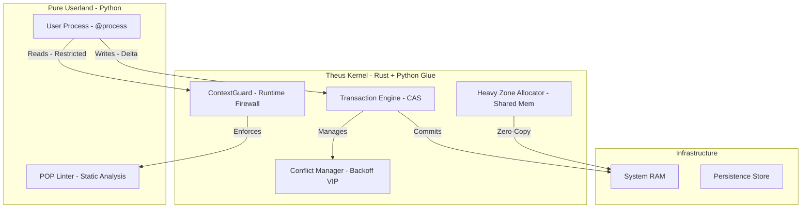
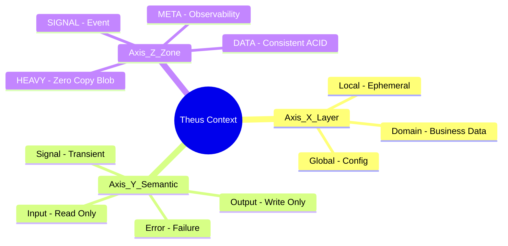
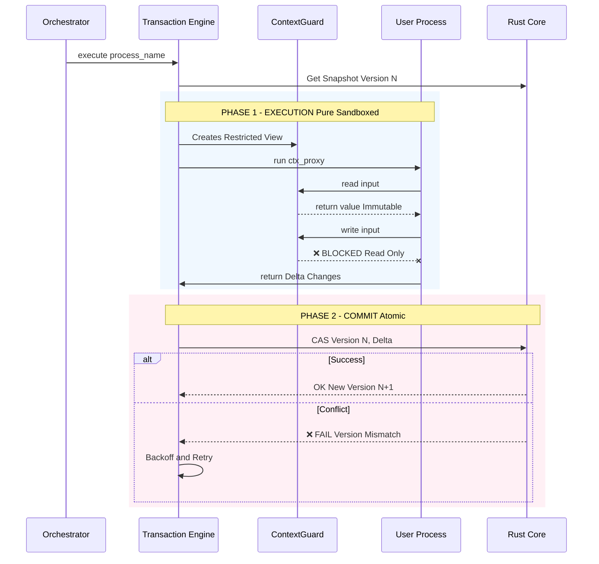
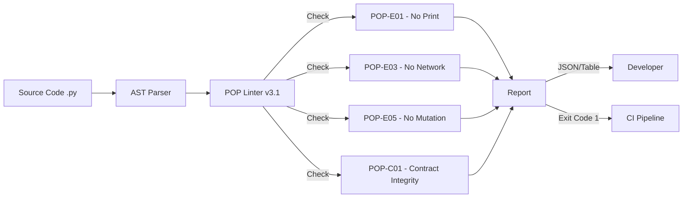

# Theus V3.0.2 Architecture: The Process-Oriented Operating System

**Date:** Jan 2026
**Version:** 3.0.2 (Production Stable)
**Core Philosophy:** "Zero-Trust, Zero-Copy, Zero-Mutation."

Theus is not just a framework; it is a **Process-Oriented Operating System** running on top of Python/Rust. It strictly enforces separation of concerns through a unique 3-Axis Context Model and a Hybrid Microkernel architecture.

---

## 1. System Overview (Hybrid Microkernel)

Theus divides the world into two realms: the **Safe Userland** (Python) and the **Strict Kernel** (Rust).

*   **Rust Core:** Handles State, Concurrency, Locking, and Atomic Commits.
*   **Python Layer:** Provides the Developer Experience (Decorators, Linter, CLI).

---

## 2. The 3-Axis Context Model (State Physics)

Theus treats data as coordinates in a 3D space to enforce strict architectural rules.

### Detailed Breakdown
1.  **Axis X (Layer):** Who owns it?
    *   `ctx.domain`: The long-lived business state.
    *   `ctx.local`: Temporary scratchpad.
2.  **Axis Y (Semantic):** What can I do with it?
    *   **Enforced by:** Linter & Runtime Guard.
    *   *Rule:* You cannot write to an Input. You cannot read a Signal in a PURE process.
3.  **Axis Z (Zone):** How is it stored?
    *   **HEAVY Zone:** Uses `SharedMemory` to pass 2GB Tensors between processes in 0.1ms (Zero-Copy).
    *   **DATA Zone:** Uses `Arc<HashMap>` for thread-safe concurrent reads.

---

## 3. Process Execution Lifecycle

How a `@process` runs from start to finish, ensuring ACID properties.

---

## 4. POP Linter Integration (v3.1)

The Linter acts as the "Compiler" for architectural rules, running before the code even executes.

### Key Rules
*   **POP-C01 (Contract Integrity):** Scans code body. If you touch `ctx.domain.user` but didn't declare `inputs=['domain.user']`, it screams.
*   **POP-E05 (Immutability):** Detects `ctx.x = 1`. Forces you to use `return {'x': 1}`.

---

## 5. Parallelism & Concurrency

Theus v3.0.2 introduces **True Parallelism** bypassing the GIL for Heavy workloads.

*   **ProcessPool:** Spawns separate Python Interpreters (Processes).
*   **Shared Memory:** Tensors in `HEAVY` zone are mapped into each child process's address space. **No pickling required.**
*   **Conflict Manager:**
    *   **VIP Locking:** If a critical process fails CAS 3 times, it gets a "VIP Ticket", pausing other writers until it succeeds.
    *   **Exponential Backoff:** Reduces contention storms.

---
*Created by Theus Architecture Team*
