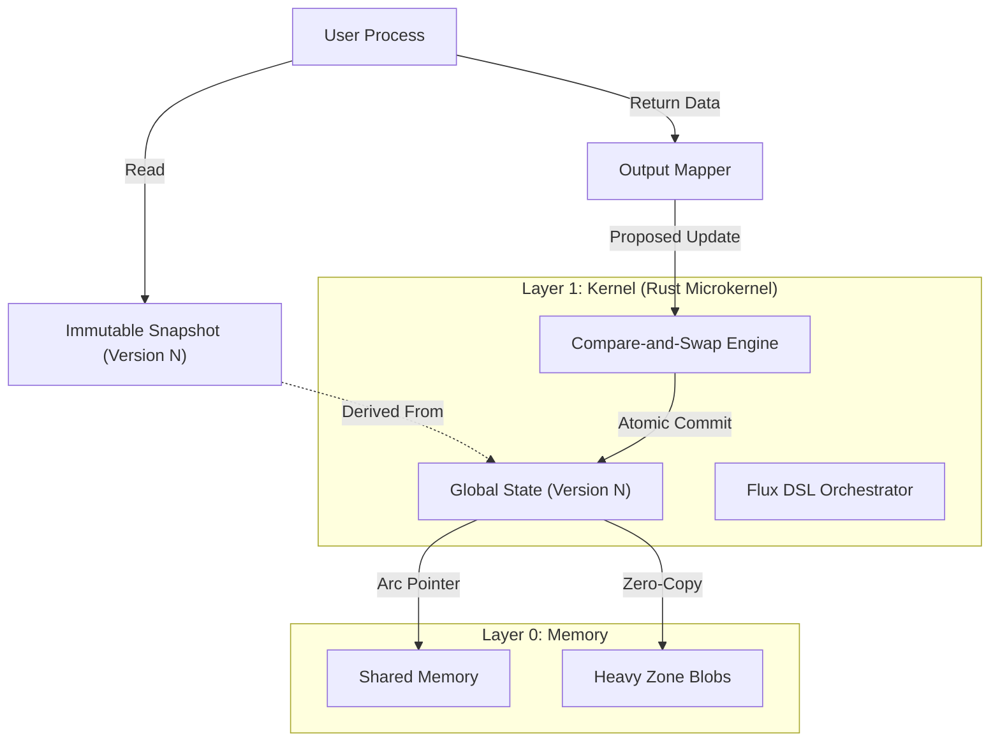

# Theus V3.0.1 Architecture Specification: The Immutable Core

## 1. Vision: Zero-Trust Process-Oriented Operating System
Theus V3.0.1 represents a fundamental shift from "Hybrid Framework" to a strict **Process-Oriented Operating System** built on **Rust**. The core philosophy is **Snapshot Isolation**: Processes operate on immutable snapshots of data and return pure state updates, which the Kernel atomicaly commits.

## 2. High-Level Architecture



## 3. Core Components

### A. The Immutable State (`theus_core::State`)
The heart of Theus is the **State** struct in Rust.
- **Structure:** `HashMap<String, Arc<PyObject>>`.
- **Immutability:** The State object *cannot* be modified in place.
- **Versioning:** Every update increments a monotonic `u64` version counter.
- **Concurrency:** Uses `Arc` (Atomic Reference Counting) to allow lock-free reads across multiple threads/interpreters.

### B. The Snapshot (`RestrictedStateProxy`)
When a process starts, it receives a **Restricted View**:
1.  **Read-Only:** Any attempt to set attributes (`ctx.domain.x = 1`) triggers `AttributeError`.
2.  **Frozen Collections:** Lists and Dicts are wrapped in `FrozenDict` / `FrozenList` to prevent deep mutation.
3.  **Scoped:** The view only contains what strictly belongs to the Process Contract (`inputs`).

### C. Atomic Commit (CAS)
Instead of locking the entire state, Theus uses **Optimistic Concurrency Control**:
1.  **Capture:** Engine records `start_version` when process begins.
2.  **Execute:** Process runs (potentially taking seconds) on its snapshot.
3.  **Compute:** Process returns new data (e.g., `return new_list`).
4.  **CAS (Compare-And-Swap):** Engine attempts to swap the State pointer:
    *   *If* Current Version == Start Version: **Commit** (Apply changes, Version++).
    *   *If* Mismatch: **Reject** (Throw `TransactionError` or Retry).

### D. Flux DSL Engine (`theus_core::WorkflowEngine`)
The orchestration logic is moved entirely to Rust to prevent Python GIL contention.
- **Parser:** Zero-copy YAML parsing.
- **Stepper:** Rust manages the Program Counter (PC) of the workflow.
- **Condition Eval:** Evaluates `if/while` conditions against the Rust State directly.

## 4. Key Patterns (V3.0.1)

### The "Return Data" Pattern
**Legacy V2:**
```python
def legacy(ctx):
    ctx.domain.x += 1  # ❌ Forbidden
```

**Modern V3:**
```python
def modern(ctx):
    return ctx.domain.x + 1  # ✅ Correct (Pure Function)
```

### The "Strict Outbox"
Side effects (Emails, API calls) are treated as **Data**:
1.  Process creates `OutboxMsg` objects.
2.  Process appends them to a returned list `new_queue`.
3.  Engine commits `new_queue` to State.
4.  Relay (Worker) consumes State and executes side effects.
*Why?* Ensures that if a transaction rolls back, the side effect (Email) is also "un-sent" (never queued).

## 5. Performance Characteristics
- **Read Speed:** Native Rust `HashMap` lookup (~10ns).
- **Write Speed:** Atomic Swap (~100ns overhead).
- **Heavy Zone:** Zero-Copy handling of Tensors allows passing 500MB+ blobs without serialization cost.

## 6. Migration from V2.x
- **Removals:** `TrackedList` (Mutation Tracking) is removed.
- **Additions:** `StateUpdate` class, `FrozenDict`.
- **Breaking:** `ctx.domain.* = value` will raise exceptions.

---
*Generated for Theus Framework v3.0.1*
