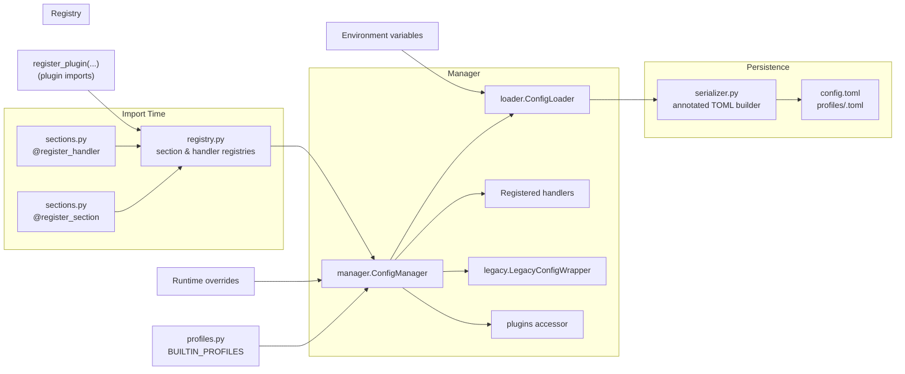

# `tidy3d.config` Architecture

`tidy3d.config` combines defaults, environment overrides, profile files, and plugin sections so `config` always reflects the active settings. This note is aimed at contributors who need to extend or debug the module.

## Big Picture

- Section schemas live in `sections.py` and register via `register_section`.
- `ConfigManager` merges builtin defaults, saved files, environment overrides, and runtime edits, then runs section handlers.
- `ConfigLoader` handles disk IO while `serializer.py` preserves comments and key order inside TOML files.
- `registry.py` tracks sections and handlers so late imports (plugins, tests) attach automatically.
- `legacy.py` keeps the historical API working by delegating to the manager.

## Runtime Flow

1. Importing `tidy3d.config` registers built-in sections and handlers.
2. `ConfigManager` attaches to the registry, loads builtin and user profiles, applies environment overrides, and composes the effective tree.
3. Handlers push side effects (logging level, env vars, cache dirs). Calls to `update_section` reload the tree and re-run the relevant handlers.

## Component Map

## Module Reference

- `sections.py` - Pydantic models for built-in sections (logging, simulation, microwave, adjoint, web, local cache, plugin container) registered via `register_section`. The bundled models inherit from the internal `ConfigSection` helper, but external code can use plain `BaseModel` subclasses. Optional handlers perform side effects. Fields mark persistence with `json_schema_extra={"persist": True}`.
- `registry.py` - Stores section and handler registries and notifies the attached manager so new entries appear immediately.
- `manager.py` - `ConfigManager` caches validated models, tracks runtime overrides per profile, filters persisted fields, exposes helpers such as `plugins`, `profiles`, and `format`. `SectionAccessor` routes attribute access to `update_section`.
- `loader.py` - Resolves the config directory, loads `config.toml` and `profiles/<name>.toml`, parses environment overrides, and writes atomically through `serializer.build_document`.
- `serializer.py` - Builds stable TOML documents with descriptive comments derived from section docstrings.
- `profiles.py` - Supplies builtin profiles merged ahead of user overrides.
- `legacy.py` - Implements backward-compatible wrappers and deprecation warnings around the manager.

## Extending the System

1. Define a Pydantic model and decorate it with `register_section`. Built-in sections use `ConfigSection`, but the decorator accepts any `BaseModel`.
2. Optionally define a handler with `register_handler` for side effects that must track the section.
3. Ensure the module imports during startup so registration happens automatically.

## Handler Rules

- Handlers receive the validated section model.
- They must tolerate repeated calls and only run for sections that changed unless you trigger `config.reload_config()` for a full pass.

## Persistence Notes

- Only fields tagged with `persist` write by default. Call `config.save(include_defaults=True)` to emit the full tree.
- `ConfigLoader` writes files atomically and leaves a `.bak` backup while swapping.

## Debugging

- `config.format()` prints the composed tree - handy for verifying merges.
- Inspect `_compose_without_env()` in a debugger to view the persisted state only.
- `get_sections()` and `get_handlers()` confirm that new registrations landed.
