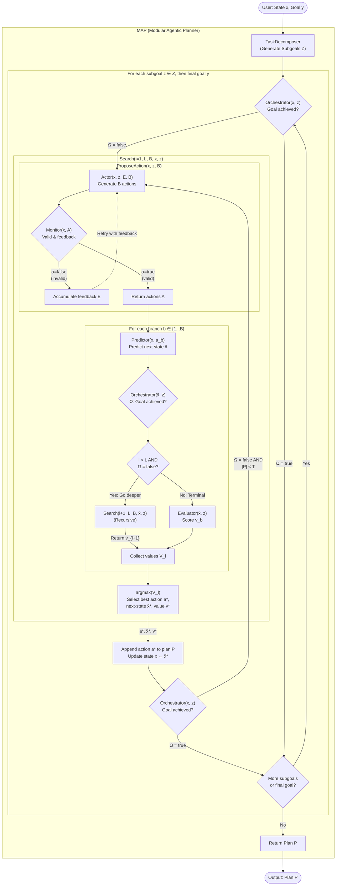

# TinyMAPAgent Example - Modular Agentic Planner

This example demonstrates how to build and run a **MAP (Modular Agentic Planner) agent** (`TinyMAPAgent`) using `tinygent`.
The MAP agent uses a sophisticated **modular search-based planning** approach that decomposes complex questions into sub-goals, then uses specialized modules (Actor, Monitor, Predictor, Evaluator, Orchestrator) to explore multiple action paths and select the best plan through tree search and evaluation.



## Quick Start

```bash
uv sync --extra openai

uv run examples/agents/map/main.py
```

---

## Concept

The **Modular Agentic Planner (MAP)** uses a modular architecture with specialized LLM-based components working together to solve complex planning problems. The algorithm consists of three main stages:

### Algorithm 1: MAP Main Loop
Given a state `x` and goal `y`, MAP generates a plan `P` (max length `T`):

1. **TaskDecomposer**: Breaks down the goal into subgoals `Z`
2. **For each subgoal** (plus the final goal):
   - **Orchestrator** checks if the goal is already satisfied
   - If not, calls **Search** to find the best action
   - Appends action to plan `P` and updates state `x`
   - Repeats until goal achieved or max plan length `T` reached

### Algorithm 2: ProposeAction Loop
Generates `B` valid actions through Actor-Monitor interaction:

1. **Actor** proposes `B` candidate actions given current state and goal
2. **Monitor** validates actions and provides feedback
3. If invalid, accumulates feedback and **Actor retries**
4. Loop continues until valid actions are generated (up to `max_recursion` attempts)

### Algorithm 3: Search (Tree Search with Depth L)
Performs tree search with `L` layers and `B` branches per layer:

1. **ProposeAction** generates `B` candidate actions at current depth `l`
2. **For each branch** `b ∈ {1...B}`:
   - **Predictor** predicts next state `x̃` after taking action
   - **Orchestrator** checks if goal is achieved in predicted state
   - If `l < L` and goal not achieved: **recursively search deeper** (depth `l+1`)
   - Otherwise: **Evaluator** scores the predicted state
3. **Select best action** with `argmax(scores)` across all branches
4. Return best action, predicted state, and value

### Key Features
- **Modular**: Each component (Actor, Monitor, Predictor, Evaluator, Orchestrator) is a specialized LLM call
- **Tree Search**: Explores multiple action paths (`B` branches) up to depth `L`
- **Validation**: Monitor ensures proposed actions follow task constraints
- **Value-based Selection**: Evaluator scores states; best action selected via argmax

---

## Configuration Parameters

| Parameter | Description | Corresponds to |
|-----------|-------------|----------------|
| `max_plan_length` | Maximum length of plan `P` (max actions before termination) | `T` in Algorithm 1 |
| `max_branches_per_layer` | Number of branches to explore at each search layer | `B` in Algorithms 2 & 3 |
| `max_layer_depth` | Maximum depth of search tree | `L` in Algorithm 3 |
| `max_recursion` | Maximum retry attempts in ProposeAction when Monitor fails | Loop limit in Algorithm 2 |

---

## Hooks

`TinyMAPAgent` inherits the full hook surface from `TinyBaseAgent` and raises them throughout decomposition, search, and evaluation:

| Hook | Trigger |
|-------------------------------|--------------------------------------------------------------------------------------------------------------------------------|
| `on_before_llm_call(*, run_id, llm_input)` | Fired before every LLM invocation (decomposition, actor, monitor, predictor, evaluator, orchestrator). |
| `on_after_llm_call(*, run_id, llm_input, result)` | Runs after each LLM call completes; streaming calls finish with `result=None` once all chunks arrive. |
| `on_before_tool_call(*, run_id, tool, args)` | Fired immediately before any tool is executed (if tools are provided). |
| `on_after_tool_call(*, run_id, tool, args, result)` | Fired after a tool executes successfully, including the tool output. |
| `on_answer_chunk(*, run_id, chunk, idx)` | Emitted for every streamed chunk returned by `run_stream`. |
| `on_answer(*, run_id, answer)` | Emitted once the blocking `run` method aggregates and returns the final answer. |
| `on_error(*, run_id, e)` | Triggered whenever decomposition, search, or evaluation raises an exception. |

---

## Files

* `main.py` — runnable demo showing MAP agent configuration.
* `quick.py` — simplified example with minimal configuration.
* `prompts.yaml` — prompt templates for all MAP agent components.
* `agent.yaml` — full agent configuration file for CLI usage.

---

## Quick Run

```bash
tiny \
    -i examples/agents/map/main.py \
    terminal \
    -c examples/agents/map/agent.yaml \
    -q "Will the Albany in Georgia reach a hundred thousand occupants before the one in New York?"
```

---

## Example Agent

```python
from pathlib import Path
from tinygent.agents import TinyMAPAgent
from tinygent.agents.map_agent import MapPromptTemplate
from tinygent.core.factory import build_llm
from tinygent.memory import BufferChatMemory
from tinygent.utils import tiny_yaml_load

# Load prompt templates
map_agent_prompt = tiny_yaml_load(str(Path(__file__).parent / 'prompts.yaml'))

# Create MAP agent
agent = TinyMAPAgent(
    llm=build_llm('openai:gpt-4o-mini', temperature=0.1),
    prompt_template=MapPromptTemplate(**map_agent_prompt),
    memory=BufferChatMemory(),
    max_plan_length=4,           # Decompose into max 4 sub-questions
    max_branches_per_layer=3,    # Explore 3 alternative actions per layer
    max_layer_depth=4,           # Search up to 4 layers deep
    max_recurrsion=3,            # Allow 3 attempts to fix invalid proposals
)
```

---

## Prompt Template Structure

The MAP agent requires a comprehensive prompt template with the following components:

```yaml
task_decomposer:
  system: "..."
  user: "..."

action_proposal:
  actor:
    init:
      system: "..."
      user: "..."
    init_fixer:
      system: "..."
      user: "..."
    continuos:
      system: "..."
      user: "..."
    continuos_fixer:
      system: "..."
      user: "..."
  
  monitor:
    init:
      system: "..."
      user: "..."
    continuos:
      system: "..."
      user: "..."

predictor:
  system: "..."
  user: "..."

evaluator:
  system: "..."
  user: "..."

orchestrator:
  system: "..."
  user: "..."
```

---

## Running the Agent

### Blocking Mode

```python
result = agent.run(
    "Will the Albany in Georgia reach a hundred thousand occupants before the one in New York?"
)
print("[RESULT]", result)
print("[MEMORY]", agent.memory.load_variables())
```

### Streaming Mode

Use `run_stream` for incremental updates suitable for live UIs or logs:

```python
import asyncio

async def stream_demo():
    async for chunk in agent.run_stream(
        "Will the Albany in Georgia reach a hundred thousand occupants before the one in New York?"
    ):
        print("[STREAM CHUNK]", chunk)

asyncio.run(stream_demo())
```

---

## Expected Output

```
[USER INPUT] Will the Albany in Georgia reach a hundred thousand occupants before the one in New York?

--- TASK DECOMPOSITION ---
Sub-questions:
1. What is the current population of Albany, Georgia?
2. What is the population growth rate of Albany, Georgia?
3. What is the current population of Albany, New York?
4. What is the population growth rate of Albany, New York?

--- SEARCH: Subgoal 1 ---
[Action Proposal] Exploring 3 branches...
[Actor] Proposed answer: "Albany, Georgia has approximately 72,000 residents as of 2024."
[Monitor] Validation: Valid response
[Predictor] Next state predicted
[Evaluator] Score: 8/10
[Best Action Selected] Answer: "Albany, Georgia has approximately 72,000 residents as of 2024."

--- SEARCH: Subgoal 2 ---
...

[FINAL RESULT] Based on current population data and growth rates, Albany, New York (current population ~97,000) 
is likely to reach 100,000 occupants before Albany, Georgia (current population ~72,000), given Albany NY's 
higher population base and comparable growth rate.

[MEMORY] {'chat_history': '... full conversation log with decomposition and search results ...'}
```

---

## When to Use MAP Agent

The MAP agent is best suited for:

- **Complex analytical questions** requiring decomposition into sub-problems
- **Multi-faceted research** where multiple angles need exploration
- **Comparative analysis** (e.g., comparing two cities, products, strategies)
- **Problems requiring exploration of alternatives** before settling on a solution
- **Scenarios where validation and self-correction** improve answer quality

---

## Architecture Components

The MAP agent implements six specialized modules, each using LLM calls:

### 1. TaskDecomposer
**Purpose**: Decomposes complex goal `y` into a sequence of subgoals `Z`  
**Input**: Initial state `x`, goal `y`  
**Output**: List of subgoals `[z₁, z₂, ..., zₙ]`  
**Implementation**: Structured LLM generation

### 2. Actor
**Purpose**: Generates `B` candidate actions given current state and goal  
**Input**: State `x`, goal `z`, accumulated feedback `E`, number of branches `B`  
**Output**: `B` proposed actions `A = {a₁, a₂, ..., aB}`  
**Implementation**: LLM text generation (can retry with feedback)

### 3. Monitor
**Purpose**: Validates proposed actions against task constraints  
**Input**: State `x`, proposed actions `A`  
**Output**: Validity flag `σ` and feedback `ε`  
**Implementation**: Structured LLM validation

### 4. Predictor
**Purpose**: Predicts next state `x̃` after taking action `a`  
**Input**: Current state `x`, action `a`  
**Output**: Predicted next state `x̃`  
**Implementation**: Structured LLM generation

### 5. Evaluator
**Purpose**: Scores predicted state quality relative to goal  
**Input**: Predicted state `x̃`, goal `z`  
**Output**: Numeric score `v` (higher is better)  
**Implementation**: Structured LLM scoring

### 6. Orchestrator
**Purpose**: Determines if goal `z` is achieved in state `x`  
**Input**: State `x`, goal `z`  
**Output**: Boolean `Ω` (true if goal satisfied)  
**Implementation**: Structured LLM decision

---

## How the Components Interact

```
MAP Main Loop:
  └─> TaskDecomposer → subgoals Z
      For each subgoal z:
        ├─> Orchestrator: check if z already satisfied
        └─> if not: Search(l=1, L, B, x, z)
            │
            └─> ProposeAction(x, z, B)
                ├─> Actor → generate B actions
                ├─> Monitor → validate & feedback
                └─> loop until valid (max_recursion times)
            
            For each of B branches:
                ├─> Predictor → predict next state x̃
                ├─> Orchestrator → check if goal achieved
                └─> if depth < L and not achieved:
                    │   └─> Search(l+1, ...) recursively
                    └─> else: Evaluator → score state
            
            └─> argmax: select best action by score
```

---

## Advanced Features

### Multi-Branch Exploration
The agent explores `max_branches_per_layer` different action proposals simultaneously, enabling it to consider multiple approaches before selecting the best one.

### Iterative Refinement
When the **Monitor** detects an invalid proposal, the **Actor** receives feedback and regenerates the answer, improving quality through iteration.

### Depth-Limited Search
The `max_layer_depth` parameter prevents infinite recursion while still allowing deep exploration when needed.

### State Prediction
The **Predictor** component enables the agent to simulate future states before committing to actions, improving decision quality.

---

## Comparison with Other Agents

| Feature | ReAct Agent | Multi-Step Agent | MAP Agent |
|---------|-------------|------------------|-----------|
| **Planning** | Inline reasoning | Periodic re-planning | Upfront decomposition |
| **Exploration** | Single path | Single path | Multi-branch tree search |
| **Validation** | Tool results only | Step validation | Monitor + Evaluator |
| **Best for** | Sequential tasks | Step-by-step workflows | Complex analytical problems |
| **Complexity** | Low | Medium | High |

---

## Tips for Success

1. **Tune `max_branches_per_layer`**: Higher values explore more alternatives but increase cost
2. **Adjust `max_layer_depth`**: Deeper search finds better solutions but takes longer
3. **Configure `max_recurrsion`**: Balance between answer quality and efficiency
4. **Craft clear prompts**: The quality of decomposition and validation depends heavily on prompt design
5. **Use appropriate LLMs**: MAP agents benefit from more capable models (e.g., GPT-4) due to complex reasoning

---

## Limitations

- **Higher computational cost** due to multiple LLM calls per decision
- **Requires well-designed prompts** for all components (decomposer, actor, monitor, predictor, evaluator, orchestrator)
- **May over-decompose simple questions** that don't require sophisticated planning
- **Search space grows exponentially** with branches and depth

---

## Further Reading

- [Modular Agentic Planner (MAP) Paper](https://arxiv.org/abs/2310.00194) - Original research: "Improving Planning with Large Language Models: A Modular Agentic Architecture"
- [Tree of Thoughts](https://arxiv.org/abs/2305.10601) - Related work on tree-based reasoning
- [ReAct Agent Documentation](../react/README.md) - Simpler alternative for sequential tasks
- [Multi-Step Agent Documentation](../multi-step/README.md) - Middle-ground approach with periodic planning
