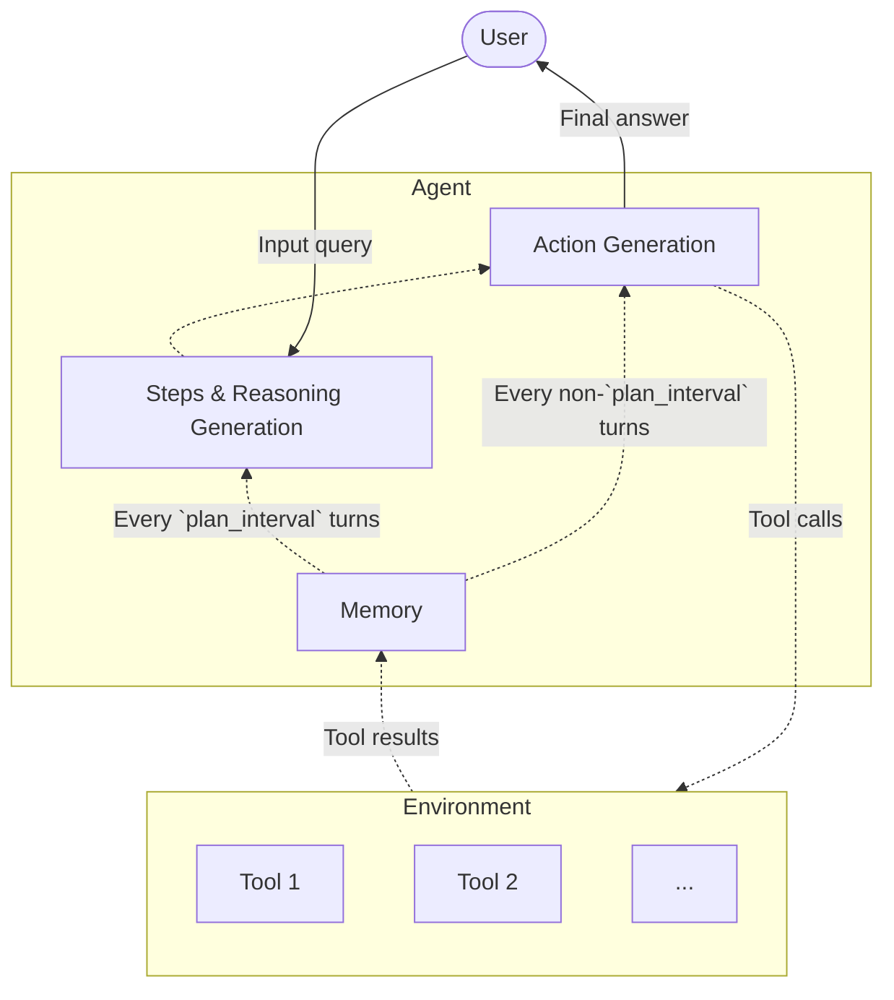

# TinyMultiStepAgent Example — Multi-Step Reason + Act Agent

This example demonstrates how to build and run a **multi-step ReAct-style agent** (`TinyMultiStepAgent`) using `tinygent`.
The agent alternates between **planning** and **acting**, while keeping track of steps, tools, and conversation history.



## Quick Start

```bash
uv sync --extra openai

uv run examples/agents/multi-step/main.py
```

---

## Concept

* **Planning**: the agent generates or updates a plan every `plan_interval` turns (default: 5).
* **Acting**: the agent executes planned actions step by step, calling tools when needed.
* **Final Answer**: if no final answer is reached within `max_iterations` (default: 15), the agent generates one explicitly.
* **Memory**: stores conversation history using `BufferChatMemory` (or any other memory backend).
* **Tools**: user-defined functions decorated with `@tool`.

---

## Hooks

`TinyMultiStepAgent` inherits the full hook surface defined in `TinyBaseAgent` and raises them throughout planning and execution:

| Hook | Trigger |
|-------------------------------|--------------------------------------------------------------------------------------------------------------------------------------|
| `on_before_llm_call(*, run_id, llm_input)` | Fired before every LLM invocation (planning, acting, fallback). |
| `on_after_llm_call(*, run_id, llm_input, result)` | Runs after each LLM call. Streaming calls resolve with `result=None` once all chunks are received. |
| `on_before_tool_call(*, run_id, tool, args)` | Fired immediately before a tool executes. |
| `on_after_tool_call(*, run_id, tool, args, result)` | Fired after a tool completes, including its output payload. |
| `on_plan(*, run_id, plan)` | Emitted for every generated plan step (initial plan and periodic updates). |
| `on_reasoning(*, run_id, reasoning)` | Emitted when the planner returns reasoning text alongside plan steps. |
| `on_tool_reasoning(*, run_id, reasoning)` | Emitted when a `ReasoningTool` provides intermediate reasoning. |
| `on_answer_chunk(*, run_id, chunk, idx)` | Emitted for each streamed chunk returned by `run_stream`. |
| `on_answer(*, run_id, answer)` | Emitted once the blocking `run` method aggregates the final answer. |
| `on_error(*, run_id, e)` | Triggered whenever planning, tool execution, or streaming raises an exception. |

---

## Files

* `example.py` — runnable demo with two example tools.
* `agent.yaml` — prompt templates for planning, acting, and final answer generation.

---

## Quick Run
```bash
tiny \
    -i examples/agents/multi-step/main.py \
    terminal \
    -c examples/agents/multi-step/agent.yaml \
    -q "What is the weather like in Paris?" \
    -q "What is the weather like in New York?" \
```

## Example Tools

```python
from tinygent.tools import tool
from tinygent.core.types import TinyModel
from pydantic import Field

class WeatherInput(TinyModel):
    location: str = Field(..., description="The location to get the weather for.")

@tool
def get_weather(data: WeatherInput) -> str:
    """Get the current weather in a given location."""
    return f"The weather in {data.location} is sunny with a high of 75°F."


class GetBestDestinationInput(TinyModel):
    top_k: int = Field(..., description="The number of top destinations to return.")

@tool
def get_best_destination(data: GetBestDestinationInput) -> list[str]:
    """Get the best travel destinations."""
    destinations = ["Paris", "New York", "Tokyo", "Barcelona", "Rome"]
    return destinations[: data.top_k]
```

---
## Example Agent

```python
from pathlib import Path
from tinygent.agents import TinyMultiStepAgent
from tinygent.agents.multi_step_agent import (
    ActionPromptTemplate,
    FinalAnswerPromptTemplate,
    PlanPromptTemplate,
    MultiStepPromptTemplate,
)
from tinygent.llms import OpenAILLM
from tinygent.memory import BufferChatMemory
from tinygent.utils import tiny_yaml_load

multi_step_agent_prompt = tiny_yaml_load(str(Path(__file__).parent / "agent.yaml"))

multi_step_agent = TinyMultiStepAgent(
    llm=OpenAILLM(),
    memory_list=[BufferChatMemory()],
    prompt_template=MultiStepPromptTemplate(
        acter=ActionPromptTemplate(
            system=multi_step_agent_prompt["acter"]["system"],
            final_answer=multi_step_agent_prompt["acter"]["final_answer"],
        ),
        plan=PlanPromptTemplate(
            init_plan=multi_step_agent_prompt["plan"]["init_plan"],
            update_plan=multi_step_agent_prompt["plan"]["update_plan"],
        ),
        final=FinalAnswerPromptTemplate(
            final_answer=multi_step_agent_prompt["final"]["final_answer"],
        ),
    ),
    tools=[get_weather, get_best_destination],
)
```

---

## Running the Agent

### Blocking Mode

```python
result = multi_step_agent.run(
    "What is the best travel destination and what is the weather like there?"
)
print("[RESULT]", result)
print("[MEMORY]", multi_step_agent.memory.load_variables())
```

### Streaming Mode

Use `run_stream` to get incremental plan, reasoning and tool call updates:

```python
import asyncio

async def stream_runs():
    async for chunk in multi_step_agent.run_stream(
        "What is the best travel destination and what is the weather like there?"
    ):
        print("[STREAM CHUNK]", chunk)

asyncio.run(stream_runs())
```

---

## Expected Output

```
[USER INPUT] What is the best travel destination and what is the weather like there?
--- STEP 1 ---
[1. STEP - Plan]: Decide how to pick destination and check weather.
[1. STEP - Tool Call]: get_best_destination({'top_k': 1}) = ['Paris']
[2. STEP - Tool Call]: get_weather({'location': 'Paris'}) = The weather in Paris is sunny with a high of 75°F.
[RESULT] The best destination is Paris. The weather in Paris is sunny with a high of 75°F.
[MEMORY] {'chat_history': '... full conversation log ...'}
```
