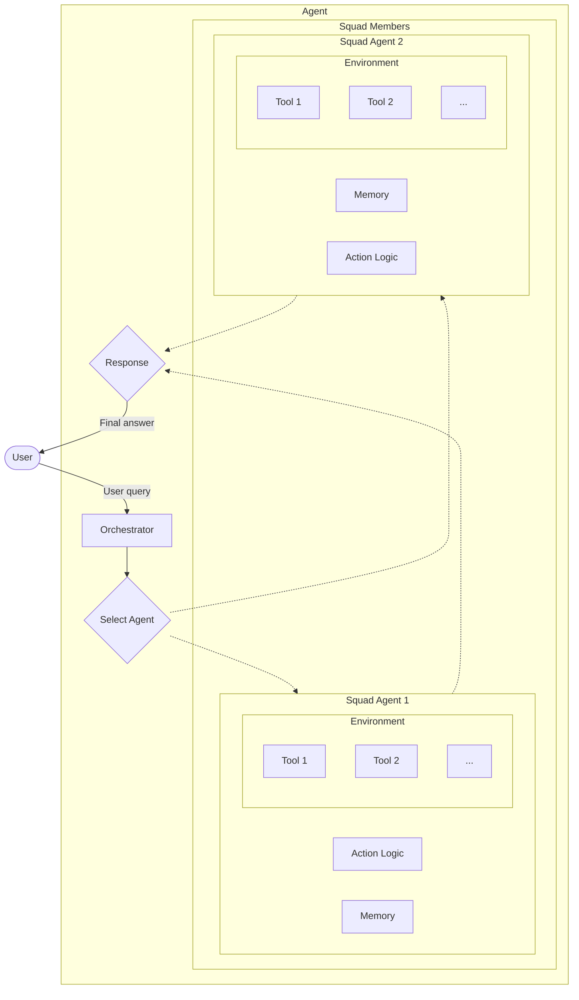

# TinySquadAgent Example

This example demonstrates how to build and run a **Squad style agent** (`TinySquadAgent`) using `tinygent`.
The agent alternates between multiple squad members (sub-agents).



## Quick Start

```bash
uv sync --extra openai

uv run examples/agents/squad/main.py
```

## Concept

The `TinySquadAgent` consists of an **orchestrator** and multiple **squad members** (sub-agents).
The orchestrator is responsible for selecting which squad member to delegate the user query to.

---

## Hooks

`TinySquadAgent` inherits the hook surface from `TinyBaseAgent` and triggers these callbacks:

| Hook | Trigger |
|-------------------------------|----------------------------------------------------------------------------------------------------------------------------|
| `on_before_llm_call(*, run_id, llm_input)` | Fired before the orchestrator calls the classifier LLM prompt. |
| `on_after_llm_call(*, run_id, llm_input, result)` | Runs after the classification LLM completes. |
| `on_before_tool_call(*, run_id, tool, args)` | Fired if the squad agent executes a top-level tool (disabled by default in the example). |
| `on_after_tool_call(*, run_id, tool, args, result)` | Runs after a top-level tool finishes; receives the tool output. |
| `on_answer_chunk(*, run_id, chunk, idx)` | Emitted for every streamed token forwarded from the selected squad member. |
| `on_answer(*, run_id, answer)` | Emitted once the blocking `run` call aggregates the full response from the chosen squad member. |
| `on_error(*, run_id, e)` | Triggered whenever classification or delegation raises an exception. |

Squad members keep their own hook configuration. If you want the top-level agent to forward member-specific events, register hooks on each member agent directly before building the squad.

---

## Files

- `main.py` — runnable demo that wires up a classifier and two member agents.
- `agent.yaml` — default configuration for the orchestrator and squad roster.
- `prompts/` — prompt fragments for custom squads.
- `quick.py` — minimal entry-point showing how to embed the agent.
- `squad/` — reusable components for building richer squads.

---

## Quick Run

```bash
tiny \
    -i examples/agents/squad/main.py \
    terminal \
    -c examples/agents/squad/agent.yaml \
    -q "What is the best travel destination and what is the weather like there?"
```

---

## Expected Output

```
[USER INPUT] Find a city for a team offsite and describe the weather.
[CLASSIFIER] Selected member: travel_planner → task: Pick a location and gather context.
[STREAM] travel_planner → ...Tokyo looks ideal...
[STREAM] weather_analyst → ...Current forecast in Tokyo is sunny with highs around 75°F.
[RESULT] Tokyo is a great option for an offsite. Expect sunny weather with highs near 75°F.
```

Your exact trace depends on the configured squad members and tools, but you should see the classifier pick a member and the selected agent stream its answer through the squad agent hooks.

---
