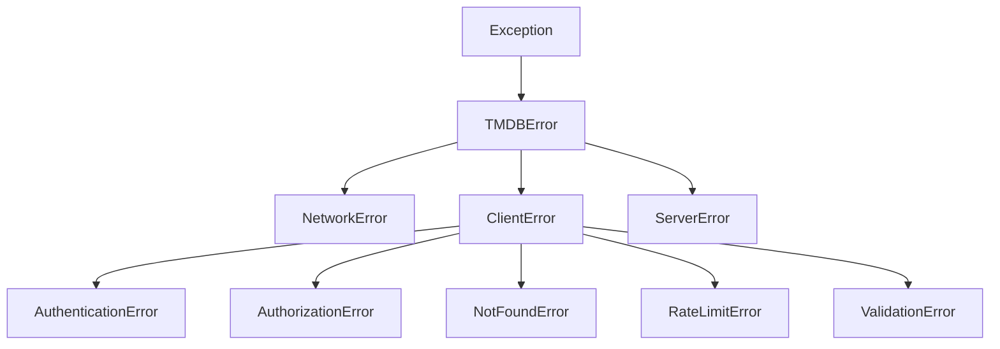

<!-- FILE: docs/concepts/error-handling.md -->

# Error Handling

In the real world, networks fail, servers time out, and resources disappear. A robust application must anticipate and handle these failures.

TMDBFusion provides a granular, hierarchical exception system to help you react precisely to different failure modes.

---

## The Exception Hierarchy

All exceptions raised by TMDBFusion inherit from `TMDBError`. This allows you to catch catch-all errors if you wish, or be very specific.



### Base Exception

- `TMDBError`: The root of all evil. If you catch this, you catch everything thrown by the library.

### Network Categories

- `NetworkError`: The request never reached the TMDB servers (DNS failure, Connection Refused, SSL Error).
- `ServerError`: The request reached TMDB, but they had an internal problem (HTTP 500, 502, 503).
- `ClientError`: You did something wrong (HTTP 4xx).

---

## Common Errors and Solutions

### 1. `NotFoundError` (404)

The resource you requested doesn't exist.

- **Cause**: Bad Movie ID, Deleted List, Invalid Season number.
- **Handling**: Skip the item or show a "Not Found" UI.

```python
from tmdbfusion.exceptions import NotFoundError

try:
    movie = client.movies.details(999999999)
except NotFoundError:
    print("That movie doesn't exist!")
```

### 2. `RateLimitError` (429)

You are asking for data too fast.

- **Cause**: Exceeding the standard ~40 requests/10 seconds limit (depends on your API key tier).
- **Handling**: Wait and retry. (See [Rate Limiting](rate-limiting.md) for automated handling).

### 3. `AuthenticationError` (401)

Your API key is invalid or suspended.

- **Cause**: Bad configuration, revoked key.
- **Handling**: Crash the app. This is usually a fatal configuration error.

### 4. `ValidationError`

The library refused to send your request because arguments were invalid.

- **Cause**: Passing a string where an int was expected (handled by Type Checker), or logic errors.

---

## Best Practices

### The "Robust Loop" Pattern

When processing a list of items, never let one bad apple crash the whole batch.

```python
movie_ids = [550, 551, 99999999, 552]  # One ID is bad

for mid in movie_ids:
    try:
        details = client.movies.details(mid)
        save_to_db(details)
    
    except NotFoundError:
        print(f"Movie {mid} not found. Skipping.")
    
    except RateLimitError:
        print("Hit rate limit! Sleeping...")
        time.sleep(10)
        # Ideally, retry the current ID here
    
    except TMDBError as e:
        # Catch-all for weird stuff (500s, network handling)
        logging.error(f"Failed to fetch {mid}: {e}")
```

### Inspecting the Error

All exceptions carry useful metadata:

```python
try:
    client.movies.details(550)
except TMDBError as e:
    print(e.message)     # "Resource not found"
    print(e.status_code) # 404 (if applicable)
    print(e.response)    # The raw response object (if available)
```

---

## Debugging Tips

If you are getting errors and don't know why:

### Enable Debug Logging

TMDBFusion uses the standard Python `logging` module.

```python
import logging

# Set level to DEBUG to see URL, Headers, and Response Bodies
logging.basicConfig(level=logging.DEBUG)
```

**Warning**: This will print your API Key to the console! Be careful.

### Check status.themoviedb.org

Sometimes it's not you, it's them. If you see a lot of `ServerError` (500s), check the API status page.
