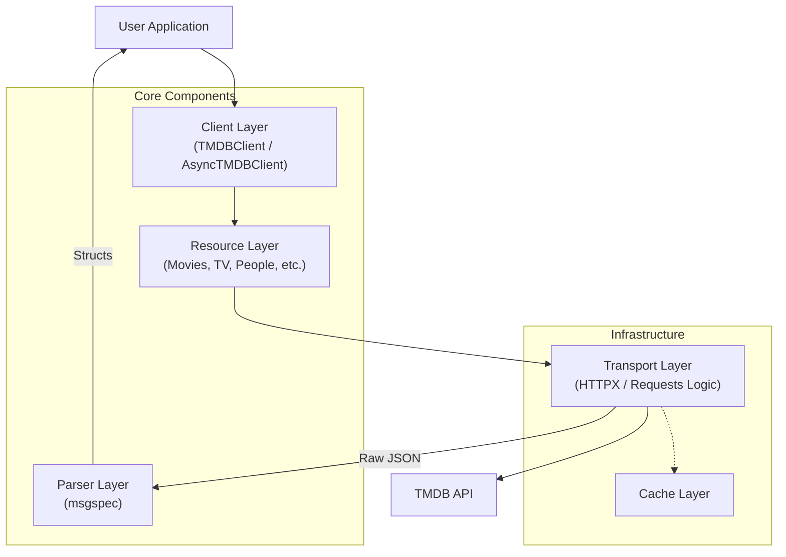

<!-- FILE: docs/getting-started/overview.md -->

# Overview

**TMDBFusion** is a next-generation Python wrapper for [The Movie Database (TMDB) API](https://developer.themoviedb.org/docs). It is designed to be the foundational layer for complex movie and TV applications, data analysis pipelines, and high-traffic web services.

Unlike simple API wrappers that return raw JSON dictionaries, TMDBFusion provides a rich, type-safe, and highly optimized interface for interacting with media metadata.

---

## Design Philosophy

The development of TMDBFusion is guided by four core principles:

### 1. **Correctness First**

Media metadata is complex. Dates can be missing, popularity can be zero, and cast lists can be empty. TMDBFusion handles these edge cases gracefully.

- **Strict Parsing**: We use `msgspec` to validate every byte of the API response. If the data structure doesn't match our contract, we know immediately.
- **Explicit Types**: Every function argument and return value is type-hinted. You never have to guess if an ID is a string or an integer.

### 2. **Performance by Default**

We believe that ease of use should not come at the cost of performance.

- **Async & Sync**: We treat both paradigms as first-class citizens. The `AsyncTMDBClient` is built on `httpx` for massive concurrency, while `TMDBClient` offers simplicity for scripts.
- **Zero-Copy**: Where possible, data is passed through efficiently without unnecessary duplication.

### 3. **Developer Ergonomics**

The library is built to be discoverable.

- **Predictable Naming**: Endpoints like `/movie/{id}/credits` map exactly to `client.movies.credits(id)`.
- **Rich Documentation**: Docstrings are strictly enforced (NumPy style) and cover parameters, returns, and exceptions.

### 4. **Production Readiness**

This isn't a hobby project. It's built to run in production.

- **Robust Error Handling**: We don't just raise `Exception`. We raise `RateLimitError`, `AuthenticationError`, `NotFoundError`, etc.
- **Logging**: Deep integration with Python's `logging` module allows you to trace every request.

---

## Architecture

TMDBFusion follows a layered architecture to ensure separation of concerns and maintainability.



### The Client Layer

The `TMDBClient` acts as the central registry. It holds configuration (API Key, Base URL) and manages the lifecycle of the HTTP session. It instantiates the Resource layers lazily.

### The Resource Layer

Each major domain of the TMDB API (Movies, TV, People) has its own "Service" class (e.g., `MoviesAPI`). This keeps the code organized and prevents the main client class from becoming a "God Object" with hundreds of methods.

### The Transport Layer

This low-level layer handles:

- URL construction
- Header injection (Authorization)
- Rate limit checking
- Error status mapping
- Retries and backoff

---

## Features at a Glance

### Fully Typed Models

We don't return dictionaries. We return strongly-typed `Structs`.

```python
# Instead of this:
title = data["title"]  # KeyError? TypeError?

# You get this:
title = movie.title  # Autocompleted! Guaranteed string.
```

### Smart Pagination

Iterate through pages of results without writing a `while` loop.

```python
# The library fetches pages 1, 2, 3... automatically as you iterate.
for movie in client.movies.popular():
    process(movie)
    if should_stop():
        break
```

### Image Handling

Helper methods to generate full image URLs are built-in.

```python
image_url = client.images.poster_url(movie.poster_path, size="w500")
```

### Rate Limit Protection

TMDBFusion respects the `X-RateLimit-Reset` headers. If you hit a limit, the library can automatically sleep and retry, or raise a structured error for you to handle.

---

## Comparison

| Feature | `tmdbfusion` | `tmdbv3api` | `tmdbsimple` |
|:--------|:------------:|:-----------:|:------------:|
| **Async Support** | First-class | No | No |
| **Type Hints** | 100% | Partial | No |
| **Response Models** | `msgspec` Structs | Dicts | Dicts |
| **Exception Hierarchy** | Granular | Generic | Generic |
| **Pagination Helpers** | Iterators | Manual | Manual |
| **Project Status** | Active | Maintenance | Maintenance |

---

## What's Next?

Ready to dive in?

- **[Install the Library](installation.md)**
- **[Get your API Key](authentication.md)**
- **[Run your first code](quickstart.md)**
