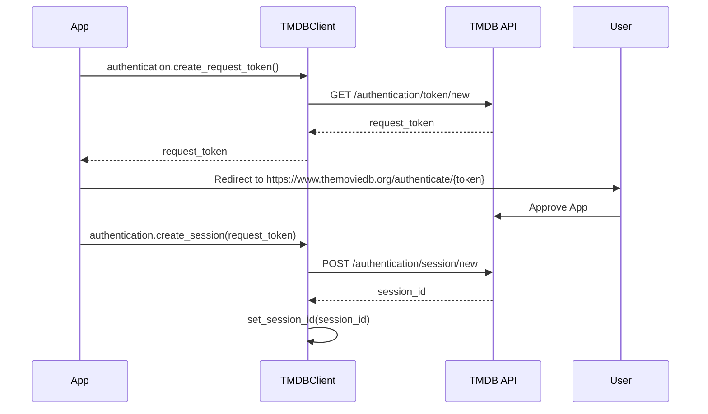

# Deep Dive: Authentication

This guide details the cryptographic and flow mechanics of authenticating with TMDB API v3 and v4.

## Authentication Strategies

TMDBFusion's `TMDBClient` and `AsyncTMDBClient` employ a dual-mode authentication strategy.

### 1. API Read Access Token (v4) - **Recommended**

The v4 Read Access Token (JWT) is the preferred method for modern applications. It provides:

* **Higher Throughput**: Often less rate-limited than API keys.
* **Granular Scopes**: Can be scoped to specific permissions (though primarily used for read-only access in this wrapper).
* **Stateless Verification**: The client sends this token as a `Bearer` header.

**Internal Header Logic**:
When you provide a `token` that is longer than 50 characters, `_base.py` automatically detects this as a JWT and switches to `Authorization: Bearer <TOKEN>`.

```python
# Best Practice: Load from environment
import os
from tmdbfusion import AsyncTMDBClient

async with AsyncTMDBClient(os.getenv("TMDB_READ_TOKEN")) as client:
    # High-performance authenticated call
    await client.movies.details(550)
```

### 2. API Key (v3) - **Legacy**

The v3 API Key is a query-parameter based authentication.

* **Mechanism**: Appended as `?api_key=<KEY>` to every request URL.
* **Use Case**: Simple scripts or legacy applications.

**Internal Header Logic**:
If the token length is short (~32 chars), the client treats it as an API Key and appends it to `params`.

## User-Context Authentication (OAuth Flow)

To perform write operations (rating movies, creating lists) or read private user data, you must execute the 3-Legged OAuth flow.



### Step-by-Step Implementation

1. **Generate Request Token**
    This token is temporary (expires in 60 minutes) and is used to solicit user permission.

    ```python
    req_token = await client.authentication.create_request_token()
    ```

2. **User Approval**
    You must direct the user to the approval URL. The client does not launch a browser; this is your application's responsibility.

    ```python
    print(f"Please approve: https://www.themoviedb.org/authenticate/{req_token}")
    ```

3. **Session Creation**
    Once the user approves, you exchange the `request_token` for a permanent `session_id`.

    ```python
    session_id = await client.authentication.create_session(req_token)
    # CRITICAL: This method automatically sets self.session_id internally
    # Future requests will now include &session_id=...
    ```

4. **Verification**
    Verify the session is active and linked to the correct user.

    ```python
    account = await client.account.details()
    print(f"Authenticated as User ID: {account.id}")
    ```

### Session Security

> [!WARNING]
> The `session_id` acts as a password. If leaked, an attacker can access the user's account.

* **Storage**: Store `session_id` in a secure, encrypted database or encrypted cookie (if web app).
* **Lifecycle**: Sessions do not expire automatically unless revoked.
* **Revocation**: Always provide a logout function.

    ```python
    await client.authentication.delete_session(session_id)
    ```

## Error Handling

Authentication errors raise specific exceptions from `tmdbfusion.exceptions`:

* `AuthenticationError (HTTP 401)`: Invalid API key or unverified Request Token.
* `AuthorizationError (HTTP 403)`: Valid key, but insufficient permissions (e.g., trying to modify another user's list).
