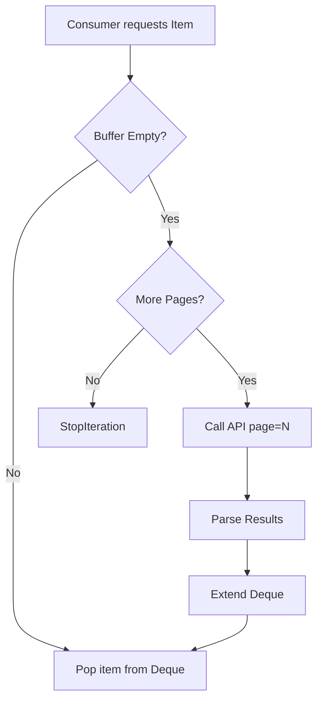

# Deep Dive: Pagination

This guide dissects the `AsyncPaginatedIterator` and `PaginatedIterator` implementation, explaining how to handle massive datasets efficiently.

## The Iterator Protocol

The pagination system implements the standard Python Iterator Protocol (`__next__`/`__anext__`). It is designed to be **lazy** and **buffered**.

### Internal State Machine

The iterator maintains the following state:

1. **`_page`**: The next page index to fetch (starts at 1).
2. **`_buffer`**: A `collections.deque` storing items fetched but not yet yielded.
3. **`_total_pages`**: Discovered dynamically from the first API response.



### Memory Safety

The iterator does **not** load all pages into memory. It buffers one page (typically 20 items) at a time.

* **Memory Footprint**: ~O(20 items)
* **Stability**: Safe to iterate over `pages=float('inf')` without OOM errors.

### Advanced Filtering (Sync)

Since `PaginatedIterator` yields standard objects, you can combine it with `itertools` for powerful pipelines.

```python
import itertools
from tmdbfusion import TMDBClient

client = TMDBClient(...)

# Fetch popular movies, but stop once we find 5 movies from 2023
iterator = client.movies.popular()
filtered = (m for m in iterator if m.release_date.startswith("2023"))
results = list(itertools.islice(filtered, 5))
```

### Async Iteration Patterns

For async applications, you can process items as they stream in.

```python
async for movie in client.movies.popular():
    # This loop will pause every 20 items to await the next API call
    await database.save(movie)
```

### Rate Limit Handling

The iterator implicitly respects rate limits because it uses the underlying `_client` to make requests. If fetching page 200 hits a limit:

1. The `_client` catches the 429.
2. It sleeps for `Retry-After`.
3. It retries the request.
4. The iterator resumes yielding items.

**This is transparent to your loop code.** You do not need `try/except` blocks for rate limits inside your pagination loop.

### Custom Mapping

If an API endpoint has a non-standard response structure (e.g., generic lists), you can inject a custom mapper.

```python
def map_custom_companies(response):
    return response.get("production_companies", [])

iter = client.paginate(
    client.companies.search, 
    query="Sony", 
    map_response=map_custom_companies
)
```
