# Triagent Web UI - Architecture Design Document

**Document Version:** 2.2
**Last Updated:** 2026-01-11
**Prepared by:** Santosh Dandey
**Branch:** `feature/sandbox-module-v2`

---

## Table of Contents

1. [Current Web Architecture](#1-current-web-architecture)
2. [Problems Identified](#2-problems-identified)
3. [Design Options](#3-design-options)
4. [Sequence Diagrams](#4-sequence-diagrams) - Sync request/response flow (4 steps)
5. [Triagent Public API Reference](#5-triagent-public-api-reference)
6. [API Inventory](#6-api-inventory) - Updated with persona/model parameters
7. [Authentication Flow](#7-authentication-flow) - With Mermaid sequence diagrams
8. [UI/UX - Chainlit App Forms](#8-uiux---chainlit-app-forms) - NEW: Configuration modals
9. [CI/CD](#9-cicd)
10. [Environment Variables](#10-environment-variables)
11. [Important File Locations](#11-important-file-locations)
12. [Folder Structure](#12-folder-structure)
13. [Implementation Plan](#13-implementation-plan) - High-level steps and detailed code

---

## 1. Current Web Architecture

### High-Level Overview


### Color Legend

| Color | Component Boundary | Description |
|-------|-------------------|-------------|
| 🔵 **Blue** `#2196f3` | Client Layer | User's browser interface |
| 🟢 **Green** `#4caf50` | Chainlit Container | Web UI and session management |
| 🟠 **Orange** `#ff9800` | Sessions Container | Dynamic Sessions sandbox |
| 🔴 **Pink** `#e91e63` | Claude Agent SDK | SDK client and CLI subprocess |
| 🟣 **Purple** `#9c27b0` | Azure Services | Cloud APIs and tools |

### Component Description

| Component | File Location | Purpose |
|-----------|---------------|---------|
| **Chainlit App** | `src/triagent/web/container/chainlit_app.py` | Web UI frontend, handles user interactions via WebSocket |
| **Session Manager** | `src/triagent/web/container/session_manager.py` | Manages user sessions, coordinates with SessionProxy |
| **SessionProxy** | `src/triagent/web/services/session_proxy.py` | Bridges Chainlit to Dynamic Sessions via /code/execute |
| **Local Sessions API** | `src/triagent/web/local_sessions_api.py` | Mock of Azure Dynamic Sessions for local testing |
| **Runner** | `src/triagent/sandbox/runner.py` | Code executed inside Dynamic Sessions container |
| **SDK Client** | `src/triagent/sdk_client.py` | Builds ClaudeAgentOptions for Claude SDK |
| **Events** | `src/triagent/sandbox/events.py` | JSON event emitters for stdout communication |

---

## 2. Problems Identified

### 2.1 Azure Dynamic Sessions Limitations

**Problem**: Azure Dynamic Sessions ONLY supports the `/code/execute` endpoint. Custom HTTP endpoints (REST APIs, WebSocket, SSE) are NOT accessible.


**Consequence**: All communication must use `/code/execute` pattern. Events are passed via stdout (JSON lines). No real-time streaming - only batch responses.

### 2.2 Claude SDK Subprocess Timeout

**Problem**: The `ClaudeSDKClient` spawns a Claude CLI subprocess with an internal 60-second timeout that cannot be easily overridden.

```python
# In claude_agent_sdk/client.py (SDK internal code)
initialize_timeout_ms = int(os.environ.get("CLAUDE_CODE_STREAM_CLOSE_TIMEOUT", "60000"))
initialize_timeout = max(initialize_timeout_ms / 1000.0, 60.0)  # Minimum 60s!
```

**Evidence from logs:**
```
03:34:24 - Chat sent: "hi"
03:35:27 - Error: Control request timeout (63 seconds = timeout hit)

Traceback:
  File "claude_agent_sdk/_internal/query.py", line 371, in _send_control_request
    await event.wait()
  ...
  raise Exception(f"Control request timeout: {request.get('subtype')}")
```

### 2.3 Complex Initialization Chain

**Problem**: The SDK initialization involves multiple layers, each adding latency and potential failure points.

```mermaid
graph TD
    subgraph RUNNER["🟠 runner.py"]
        style RUNNER fill:#ff9800,stroke:#e65100,stroke-width:2px,color:#000
        R1["ConfigManager.load_credentials()"]
        R2["create_sdk_client()"]
        R3["ClaudeAgentOptions with env vars"]
    end

    subgraph SDK["🔴 ClaudeSDKClient"]
        style SDK fill:#e91e63,stroke:#880e4f,stroke-width:2px,color:#fff
        S1["__aenter__()"]
        S2["Spawn Claude CLI subprocess"]
    end

    subgraph CLI["🔵 Claude CLI - Node.js"]
        style CLI fill:#2196f3,stroke:#0d47a1,stroke-width:2px,color:#fff
        C1["Load MCP servers"]
        C2["Initialize system prompts"]
        C3["Connect to Azure Foundry"]
    end

    subgraph TIMEOUT["⚠️ TIMEOUT ZONE"]
        style TIMEOUT fill:#f44336,stroke:#b71c1c,stroke-width:2px,color:#fff
        T1["60-second internal timeout"]
    end

    R1 --> R2 --> R3 --> S1 --> S2 --> C1 --> C2 --> C3 --> T1

    style R1 fill:#ffa726,stroke:#e65100,color:#000
    style R2 fill:#ffa726,stroke:#e65100,color:#000
    style R3 fill:#ffa726,stroke:#e65100,color:#000
    style S1 fill:#ec407a,stroke:#880e4f,color:#000
    style S2 fill:#ec407a,stroke:#880e4f,color:#000
    style C1 fill:#42a5f5,stroke:#0d47a1,color:#000
    style C2 fill:#42a5f5,stroke:#0d47a1,color:#000
    style C3 fill:#42a5f5,stroke:#0d47a1,color:#000
    style T1 fill:#ef5350,stroke:#b71c1c,color:#000
```



**Timing breakdown:**
| Step | Typical Latency |
|------|-----------------|
| HTTP POST to /code/execute | ~50-100ms |
| Python interpreter + imports | ~200-500ms |
| ClaudeSDKClient spawn | ~500-1000ms |
| MCP server loading | ~500-1000ms |
| **Claude API call** | **~2-30 seconds** |
| **TOTAL** | **3-35 seconds** |

---

## 3. Design Options

### Option A: Current Implementation (ClaudeSDKClient via runner.py)

**Architecture:**



```mermaid
graph LR
    subgraph GREEN["🟢 Chainlit Container"]
        style GREEN fill:#4caf50,stroke:#1b5e20,stroke-width:2px,color:#fff
        A1["Chainlit"]
        A2["SessionProxy"]
    end

    subgraph ORANGE["🟠 Sessions Container"]
        style ORANGE fill:#ff9800,stroke:#e65100,stroke-width:2px,color:#000
        A3["/code/execute"]
        A4["runner.py"]
    end

    subgraph PINK["🔴 Claude SDK"]
        style PINK fill:#e91e63,stroke:#880e4f,stroke-width:2px,color:#fff
        A5["ClaudeSDKClient"]
        A6["Claude CLI"]
    end

    subgraph PURPLE["🟣 Azure"]
        style PURPLE fill:#9c27b0,stroke:#4a148c,stroke-width:2px,color:#fff
        A7["Azure Foundry"]
    end

    A1 --> A2 --> A3 --> A4 --> A5 --> A6 --> A7

    style A1 fill:#66bb6a,stroke:#1b5e20,color:#000
    style A2 fill:#66bb6a,stroke:#1b5e20,color:#000
    style A3 fill:#ffa726,stroke:#e65100,color:#000
    style A4 fill:#ffa726,stroke:#e65100,color:#000
    style A5 fill:#ec407a,stroke:#880e4f,color:#000
    style A6 fill:#ec407a,stroke:#880e4f,color:#000
    style A7 fill:#ab47bc,stroke:#4a148c,color:#fff
```

**Implementation files:**
- `src/triagent/sandbox/runner.py` - Contains `run_init_sdk()`, `run_chat()`
- `src/triagent/sdk_client.py` - Builds `ClaudeAgentOptions`

**How it works:**
1. Chainlit receives user message
2. SessionProxy builds Python code string
3. POST to /code/execute with the code
4. Dynamic Session executes runner.py functions
5. runner.py creates ClaudeSDKClient
6. ClaudeSDKClient spawns Claude CLI subprocess
7. Claude CLI loads MCP servers, connects to Azure Foundry
8. Response collected and printed to stdout as JSON
9. SessionProxy parses stdout, yields events to Chainlit

**Pros:**
- ✅ Full SDK capabilities (MCP servers, tools, subagents)
- ✅ Uses official Claude Agent SDK
- ✅ Session resumption via session_id
- ✅ System prompts, hooks, permissions all work

**Cons:**
- ❌ Internal 60-second timeout causes failures
- ❌ Complex initialization chain
- ❌ Subprocess spawning overhead
- ❌ Hard to debug (multiple process boundaries)
- ❌ No streaming (batch only)

**Observations:**
- Timeout occurs during `_send_control_request("initialize")`
- Setting `CLAUDE_CODE_STREAM_CLOSE_TIMEOUT=300000` doesn't help (internal min 60s)
- The timeout is in the SDK's control protocol, not HTTP

---

### Option B: Triagent Public API (Proposed)

**Architecture:**



```mermaid
graph LR
    subgraph GREEN["🟢 Chainlit Container"]
        style GREEN fill:#4caf50,stroke:#1b5e20,stroke-width:2px,color:#fff
        B1["Chainlit"]
        B2["SessionProxy"]
    end

    subgraph ORANGE["🟠 Sessions Container"]
        style ORANGE fill:#ff9800,stroke:#e65100,stroke-width:2px,color:#000
        B3["/code/execute"]
        B4["runner.py"]
    end

    subgraph CYAN["🔷 NEW: Triagent API"]
        style CYAN fill:#00bcd4,stroke:#006064,stroke-width:2px,color:#000
        B5["triagent.api<br/>TriagentSession"]
    end

    subgraph PINK["🔴 Claude SDK"]
        style PINK fill:#e91e63,stroke:#880e4f,stroke-width:2px,color:#fff
        B6["ClaudeSDKClient"]
    end

    B1 --> B2 --> B3 --> B4 --> B5 --> B6

    style B1 fill:#66bb6a,stroke:#1b5e20,color:#000
    style B2 fill:#66bb6a,stroke:#1b5e20,color:#000
    style B3 fill:#ffa726,stroke:#e65100,color:#000
    style B4 fill:#ffa726,stroke:#e65100,color:#000
    style B5 fill:#26c6da,stroke:#006064,color:#000
    style B6 fill:#ec407a,stroke:#880e4f,color:#000
```

**Key difference:** Create a clean public API layer (`triagent/api.py`) that:
1. Wraps ClaudeSDKClient with better error handling
2. Exposes simple methods: `create()`, `query()`, `execute()`, `help()`
3. Manages session persistence internally
4. Can be imported and used from /code/execute

**Proposed file structure:**
```
src/triagent/
├── api.py                      # NEW: Public API
│   ├── TriagentSession         # Main class
│   ├── QueryResult             # Query response dataclass
│   └── CommandResult           # Command response dataclass
├── sandbox/
│   └── runner.py               # SIMPLIFIED: Uses triagent.api
```

**How it resolves the issues:**

1. **Cleaner abstraction**: Single entry point (`TriagentSession`) instead of raw SDK
2. **Better error handling**: Catches SDK exceptions, returns structured errors
3. **Session management**: Built-in save/load to JSON file
4. **Streaming support**: Can yield events or collect full response
5. **Command support**: Execute CLI commands (/help, /config) programmatically

**Note:** This still uses ClaudeSDKClient internally, so the 60-second timeout may persist. The benefit is cleaner code and better error handling, not fixing the timeout.

**To truly fix the timeout, consider Option C (below).**

---

### Option C: Direct Anthropic SDK (Agentic Loop)

**Architecture:**


**Key difference:** Bypasses ClaudeSDKClient entirely - No subprocess, no 60s timeout! Uses `anthropic` Python package directly.

**How it works:**
1. Use `anthropic.Anthropic(base_url=azure_foundry_url, api_key=azure_token)`
2. Implement agentic loop: send message → check tool_use → execute tool → send result
3. No subprocess, no Claude CLI, no internal timeout

**Pros:**
- ✅ No subprocess spawning
- ✅ No internal timeout (we control httpx timeout)
- ✅ Simpler code path
- ✅ Tool use works (pass tool definitions to API)

**Cons:**
- ❌ No MCP server support (must implement tools manually)
- ❌ No built-in permissions/hooks
- ❌ More manual code for conversation management

---

## 4. Sequence Diagrams

The sync request/response flow follows 4 distinct steps. Each step completes fully before the next begins.

**Platform Legend:**
| Platform | Docker Image | Runs On |
|----------|--------------|---------|
| Azure Web Apps | `triagent-chainlit:v1.0` | Azure Container Apps (external ingress) |
| Azure Dynamic Sessions | `triagent-sessions:v1.0` | Azure Container Apps Session Pool |
| External | N/A | Azure AI Foundry, Azure AD |

### 4.1 Step 1: Upfront Configuration (Frontend Only)

User selects team, persona, and model before any backend calls are made.


### 4.2 Step 2: Authentication Check (Separate Step)

Check Azure CLI authentication status. If not authenticated, start device code flow.


### 4.3 Step 3: SDK Initialization (With Azure CLI Token)

Initialize Claude SDK with configuration options. **Key:** No API key is passed - SDK uses `DefaultAzureCredential` to read tokens from `~/.azure/`.


### 4.4 Step 4: Chat with Tool Use (Repeated for Each Message)

Send messages and receive responses. Session is resumed from file for each request. API calls use **tokens from `~/.azure/`** (auto-refreshed by DefaultAzureCredential).


---

## 5. Triagent Public API Reference

### 5.1 `triagent.api.TriagentSession`

| Method | Parameters | Return Type | Purpose |
|--------|------------|-------------|---------|
| `create()` | `team: str, persona: str, model: str` | `TriagentSession` | Create new session with all config options |
| `load()` | `session_file: Path` | `TriagentSession` | Resume session from file |
| `query()` | `message: str` | `QueryResult` | Send chat message |
| `execute()` | `command: str` | `CommandResult` | Execute slash command (/help, /config) |
| `help()` | - | `list[dict]` | Get available commands |
| `save()` | `session_file: Path` | `None` | Save session state |
| `close()` | - | `None` | Cleanup resources |

### 5.2 Data Classes

```python
@dataclass
class SessionConfig:
    """Configuration collected upfront from UI."""
    team: str = "omnia-data"
    persona: str = "developer"
    model: str = "claude-opus-4-5"

@dataclass
class QueryResult:
    """Result of a chat query."""
    text: str              # Response text
    tools_used: list[str]  # Tools invoked (e.g., ["execute_azure_cli"])
    turn_count: int        # Number of agentic turns
    session_id: str        # For resumption

@dataclass
class CommandResult:
    """Result of a command execution."""
    output: str            # Command output text
    success: bool          # Whether command succeeded
```

### 5.3 Sample Usage

```python
from triagent.api import TriagentSession

# Initialize with all options (collected from UI upfront)
session = await TriagentSession.create(
    team="omnia-data",
    persona="developer",
    model="claude-opus-4-5"
)

# Chat
result = await session.query("list active PRs in cortex-ui")
print(result.text)
print(f"Tools used: {result.tools_used}")

# Execute command
cmd_result = await session.execute("/help")
print(cmd_result.output)

# Save for later
await session.save("/tmp/session.json")
await session.close()

# Resume later
session = await TriagentSession.load("/tmp/session.json")
result = await session.query("what did we discuss?")
```

---

## 6. API Inventory

### 6.1 Chainlit → SessionManager

| Method | Signature | Purpose |
|--------|-----------|---------|
| `check_auth_status()` | `(session_id: str) → AsyncGenerator` | Step 2: Check Azure auth status |
| `init_sdk_session()` | `(session_id: str, team: str, persona: str, model: str) → AsyncGenerator` | Step 3: Initialize SDK with all options |
| `stream_sdk_session_chat()` | `(session_id: str, message: str, team: str) → AsyncGenerator` | Step 4: Send chat message |
| `get_session_status()` | `(session_id: str) → dict` | Check if session exists |
| `clear_session()` | `(session_id: str) → dict` | Delete session state |
| `validate_config()` | `(session_id: str, team: str, persona: str, model: str) → AsyncGenerator` | Validate config options (NEW) |

### 6.2 SessionManager → SessionProxy

| Method | Signature | Purpose |
|--------|-----------|---------|
| `check_auth_status()` | `(session_id: str, team: str) → AsyncGenerator` | Execute run_check_auth in sandbox |
| `init_sdk_session()` | `(session_id: str, team: str, persona: str, model: str) → AsyncGenerator` | Execute run_init_sdk in sandbox |
| `stream_sdk_session_chat()` | `(session_id: str, message: str, team: str) → AsyncGenerator` | Execute run_chat in sandbox |
| `validate_config()` | `(session_id: str, team: str, persona: str, model: str) → AsyncGenerator` | Execute run_validate_config in sandbox (NEW) |

### 6.3 SessionProxy → Dynamic Sessions

| Endpoint | Method | Purpose |
|----------|--------|---------|
| `POST /code/execute` | HTTP POST | Execute Python code in sandbox |

**Request format:**
```json
{
  "properties": {
    "codeInputType": "inline",
    "executionType": "synchronous",
    "code": "from triagent.sandbox.runner import run_init_sdk\nimport asyncio\nasyncio.run(run_init_sdk('omnia-data', 'developer', 'claude-opus-4-5'))"
  }
}
```

**Response format:**
```json
{
  "properties": {
    "stdout": "{\"type\": \"progress\", \"step\": \"init\"}\n{\"type\": \"done\", \"session_id\": \"xyz789\"}",
    "stderr": "",
    "executionResult": "success"
  }
}
```

### 6.4 Runner Functions (Sandbox)

| Function | Signature | Purpose |
|----------|-----------|---------|
| `run_check_auth()` | `(team: str) → None` | Step 2: Non-blocking auth check |
| `run_init_sdk()` | `(team: str, persona: str, model: str) → None` | Step 3: Initialize SDK with all options (UPDATED) |
| `run_chat()` | `(message: str, team: str) → None` | Step 4: Send message (loads persona/model from session) |
| `run_validate_config()` | `(team: str, persona: str, model: str) → None` | Validate config options (NEW) |

### 6.5 Event Types (stdout JSON)

| Event Type | Fields | Purpose |
|------------|--------|---------|
| `progress` | `step, message` | Initialization progress |
| `device_code` | `code, url, message` | Device code for Azure auth |
| `text` | `content` | Response text from Claude |
| `tool_start` | `name, input_preview` | Tool execution starting |
| `tool_end` | `name, success` | Tool execution complete |
| `confirm_request` | `request_id, tool_name, description` | Write operation confirmation |
| `config_valid` | `valid, errors` | Config validation result (NEW) |
| `config_options` | `teams, personas, models` | Available config options (NEW) |
| `done` | `session_id, turns` | Operation complete |
| `error` | `error, details` | Error occurred |

### 6.6 Claude SDK → Azure Foundry

| Operation | Endpoint |
|-----------|----------|
| Messages API | `https://{resource}.services.ai.azure.com/anthropic/v1/messages` |

**Headers:**
- `Authorization: Bearer {azure_ad_token}` (DefaultAzureCredential)
- `anthropic-version: 2023-06-01`

---

### 6.7 SessionProxy Method Implementation Reference

This section details each SessionProxy method, the Python code it submits to `/code/execute`, and the expected events.

#### Method Summary

| Method | Runner Function | Purpose |
|--------|-----------------|---------|
| `check_auth_status()` | `run_check_auth(team)` | Stage 1: Check Azure auth, return device code if needed |
| `init_sdk_session()` | `run_init_sdk(team)` | Stage 2: Initialize SDK after auth confirmed |
| `stream_sdk_session_chat()` | `run_chat(message, team)` | Stage 4: Send chat message, stream response |
| `get_session_status()` | `SessionStore.load()` | Check if session exists and get state |
| `clear_session()` | `SessionStore.clear()` | Delete session state to start fresh |

---

#### 6.7.1 `check_auth_status(session_id, team)`

**Purpose**: Non-blocking auth check. Returns immediately with device code if not authenticated.

**Code Submitted**:
```python
from triagent.sandbox.runner import run_check_auth
import asyncio
asyncio.run(run_check_auth("{team}"))
```

**Sequence**:
```
SessionProxy → POST /code/execute → runner.run_check_auth(team)
                                      ↓
                                   az account show
                                      ↓
                          ┌───────────┴───────────┐
                          │                       │
                   (authenticated)         (not authenticated)
                          ↓                       ↓
                   emit_done()            nohup az login --use-device-code &
                   authenticated=true     emit_device_code(code, url)
```

**Expected Events**:
- `{"type": "progress", "step": "checking_auth", "message": "Checking Azure authentication..."}`
- `{"type": "device_code", "code": "ABC123", "url": "https://microsoft.com/devicelogin", "message": "..."}` (if not authenticated)
- `{"type": "done", "authenticated": true|false}`

---

#### 6.7.2 `init_sdk_session(session_id, team)`

**Purpose**: Initialize Claude SDK after authentication is confirmed.

**Code Submitted**:
```python
from triagent.sandbox.runner import run_init_sdk
import asyncio
asyncio.run(run_init_sdk("{team}"))
```

**Sequence**:
```
SessionProxy → POST /code/execute → runner.run_init_sdk(team)
                                      ↓
                                   Poll az account show (2 min max)
                                      ↓
                                   Load credentials
                                      ↓
                                   Create ClaudeSDKClient (no API key)
                                      ↓
                                   SDK uses DefaultAzureCredential
                                      ↓
                                   Connect to Azure AI Foundry
                                      ↓
                                   Save SessionState to file
                                      ↓
                                   emit_done(session_id, initialized=true)
```

**Expected Events**:
- `{"type": "progress", "step": "polling_auth", "message": "Waiting for Azure login..."}`
- `{"type": "progress", "step": "auth_confirmed", "message": "Azure login confirmed"}`
- `{"type": "progress", "step": "loading_credentials", "message": "Loading credentials..."}`
- `{"type": "progress", "step": "creating_sdk", "message": "Creating Claude SDK client..."}`
- `{"type": "progress", "step": "connecting", "message": "Connecting to Azure AI Foundry..."}`
- `{"type": "done", "session_id": "xyz789", "initialized": true}`

---

#### 6.7.3 `stream_sdk_session_chat(session_id, message, team)`

**Purpose**: Send user message to Claude SDK and stream response events.

**Code Submitted**:
```python
from triagent.sandbox.runner import run_chat
import asyncio
asyncio.run(run_chat("{escaped_message}", "{team}"))
```

**Note**: Message is escaped for Python string (backslashes, quotes, newlines).

**Sequence**:
```
SessionProxy → POST /code/execute → runner.run_chat(message, team)
                                      ↓
                                   Load session from /root/.triagent/session.json
                                      ↓
                                   Resume ClaudeSDKClient session
                                      ↓
                                   sdk.query(message)
                                      ↓
                             ┌────────┴────────┐
                             │                 │
                        (tool_use)        (text response)
                             ↓                 ↓
                    emit_tool_start()    emit_text(content)
                    Execute tool
                    emit_tool_end()
                             ↓                 ↓
                             └────────┬────────┘
                                      ↓
                                   Update session turns
                                   Save session to file
                                   emit_done(turns=N)
```

**Expected Events**:
- `{"type": "text", "content": "..."}`
- `{"type": "tool_start", "name": "execute_azure_cli", "input_preview": "az repos pr list..."}`
- `{"type": "tool_end", "name": "execute_azure_cli", "success": true}`
- `{"type": "confirm_request", "request_id": "...", "tool_name": "...", "description": "..."}` (for write operations)
- `{"type": "done", "turns": 5}`

---

#### 6.7.4 `get_session_status(session_id)`

**Purpose**: Check if session file exists and read current state.

**Code Submitted**:
```python
import json
from triagent.sandbox.session_store import SessionStore

store = SessionStore()
state = store.load()
if state:
    print(json.dumps({
        "exists": True,
        "initialized": state.initialized,
        "session_id": state.session_id[:8] if state.session_id else None,
        "team": state.team,
        "conversation_turns": state.conversation_turns,
    }))
else:
    print(json.dumps({"exists": False, "initialized": False}))
```

**Response Format** (parsed from stdout):
```json
{
  "exists": true,
  "initialized": true,
  "session_id": "xyz789ab",
  "team": "omnia-data",
  "conversation_turns": 5
}
```

---

#### 6.7.5 `clear_session(session_id)`

**Purpose**: Delete session state to start fresh conversation.

**Code Submitted**:
```python
import json
from triagent.sandbox.session_store import SessionStore

store = SessionStore()
success = store.clear()
print(json.dumps({"status": "cleared" if success else "error"}))
```

**Response Format** (parsed from stdout):
```json
{"status": "cleared"}
```

---

## 7. Authentication Flow

### 7.1 Chainlit App Authentication Flow

The complete flow from app open to session ready, integrating Steps 1-3.


### 7.2 Azure CLI Device Code Flow

The non-blocking device code authentication mechanism using nohup daemon.


### 7.3 Token Flow: Azure CLI to Claude SDK

When the Claude SDK needs to authenticate with Azure AI Foundry, it reads tokens saved by `az login --use-device-code`. The key is that **no API key is set in environment variables**, which triggers `DefaultAzureCredential`.


**Why This Works:**

1. **`get_foundry_env()`** in `auth.py` checks `foundry_auth_mode`
2. When mode is `azure_cli_token`, it **does NOT set** `ANTHROPIC_FOUNDRY_API_KEY`
3. Claude CLI detects missing API key and falls back to `DefaultAzureCredential`
4. `DefaultAzureCredential` reads from `~/.azure/msal_token_cache.json` (saved by `az login`)
5. Tokens are auto-refreshed when expired - no user intervention needed

### 7.4 Authentication Modes

| Mode | Config | ANTHROPIC_FOUNDRY_API_KEY | Token Source |
|------|--------|---------------------------|--------------|
| `azure_cli_token` (Recommended) | `foundry_auth_mode: "azure_cli_token"` | **NOT SET** | `~/.azure/` via DefaultAzureCredential |
| `api_key` | `foundry_auth_mode: "api_key"` | Set to API key | Environment variable |

### 7.5 Token Scopes

| Scope | Purpose |
|-------|---------|
| `https://cognitiveservices.azure.com/.default` | Azure Foundry Claude API |
| `https://dynamicsessions.io/.default` | Azure Dynamic Sessions API |

---

## 8. UI/UX - Chainlit App Forms

### 8.1 Configuration Modal

Displayed at session start to collect all options upfront.

```
┌─────────────────────────────────────────────────────────────┐
│                   Welcome to Triagent                        │
│                                                              │
│  Configure your session before starting:                     │
│                                                              │
│  Team:     ┌──────────────────────────────────────────┐     │
│            │ Omnia Data                            ▼  │     │
│            └──────────────────────────────────────────┘     │
│                                                              │
│  Persona:  ┌──────────────────────────────────────────┐     │
│            │ Developer                             ▼  │     │
│            └──────────────────────────────────────────┘     │
│                                                              │
│  Model:    ┌──────────────────────────────────────────┐     │
│            │ Claude Opus 4.5                       ▼  │     │
│            └──────────────────────────────────────────┘     │
│                                                              │
│                    ┌─────────────────┐                       │
│                    │  Start Session  │                       │
│                    └─────────────────┘                       │
│                                                              │
└─────────────────────────────────────────────────────────────┘
```

**Options:**

| Field | Options | Default |
|-------|---------|---------|
| Team | Omnia Data, Omnia, Levvia | Omnia Data |
| Persona | Developer, Support | Developer |
| Model | Claude Opus 4.5, Claude Sonnet 4 | Claude Opus 4.5 |

**Implementation:**
```python
async def show_configuration_modal() -> dict:
    """Collect configuration using Chainlit actions."""
    teams = ["Omnia Data", "Omnia", "Levvia"]
    personas = ["Developer", "Support"]
    models = ["Claude Opus 4.5", "Claude Sonnet 4"]

    # Use sequential AskActionMessage for each selection
    team_response = await cl.AskActionMessage(
        content="Select your team:",
        actions=[cl.Action(name=t, value=t.lower().replace(" ", "-"), label=t) for t in teams]
    ).send()

    # ... similar for persona and model

    return {"team": team_response, "persona": persona_response, "model": model_response}
```

### 8.2 Device Code Modal

Displayed when Azure CLI authentication is required.

```
┌─────────────────────────────────────────────────────────────┐
│                Azure Authentication Required                 │
│                                                              │
│  To authenticate with Azure, please:                         │
│                                                              │
│  1. Open your browser and navigate to:                       │
│                                                              │
│     ┌────────────────────────────────────────────┐          │
│     │  https://microsoft.com/devicelogin         │          │
│     └────────────────────────────────────────────┘          │
│                                                              │
│  2. Enter this code:                                         │
│                                                              │
│     ┌────────────────────────────────────────────┐          │
│     │           A B C D 1 2 3 4                  │          │
│     └────────────────────────────────────────────┘          │
│                                                              │
│  3. Sign in with your corporate account                      │
│                                                              │
│  4. Click "Done" below when complete                         │
│                                                              │
│           ┌──────────┐       ┌──────────┐                   │
│           │   Done   │       │  Cancel  │                   │
│           └──────────┘       └──────────┘                   │
│                                                              │
└─────────────────────────────────────────────────────────────┘
```

**Implementation:**
```python
async def show_device_code_modal(code: str, url: str) -> bool:
    """Show device code and wait for user confirmation."""
    response = await cl.AskActionMessage(
        content=f"""**Azure Authentication Required**

Please complete these steps:

1. Open your browser to: **{url}**
2. Enter this code: **{code}**
3. Sign in with your corporate account
4. Click "Done" below when complete""",
        actions=[
            cl.Action(name="done", value="done", label="Done"),
            cl.Action(name="cancel", value="cancel", label="Cancel")
        ],
        timeout=900  # 15 minutes
    ).send()

    return response.get("name") == "done"
```

### 8.3 Tool Confirmation Modal

Displayed when Claude wants to execute a write operation.

```
┌─────────────────────────────────────────────────────────────┐
│                  Confirm Operation                           │
│                                                              │
│  Claude wants to execute:                                    │
│                                                              │
│  ┌────────────────────────────────────────────────────────┐ │
│  │  Tool: execute_azure_cli                                │ │
│  │                                                         │ │
│  │  Command:                                               │ │
│  │  az repos pr create --title "Fix bug" --description... │ │
│  └────────────────────────────────────────────────────────┘ │
│                                                              │
│  Do you want to allow this operation?                        │
│                                                              │
│           ┌──────────┐       ┌──────────┐                   │
│           │   Yes    │       │    No    │                   │
│           └──────────┘       └──────────┘                   │
│                                                              │
└─────────────────────────────────────────────────────────────┘
```

### 8.4 Chat Interface Elements

**Message Input Area:**
- Text input field at bottom
- Send button (or Enter to submit)
- File upload button (optional)

**Tool Execution Indicator:**
```
┌─────────────────────────────────────────────────────────────┐
│  ⏳ Running Azure CLI...                                     │
│     az repos pr list --status active                         │
└─────────────────────────────────────────────────────────────┘
```

**Tool Completion:**
```
┌─────────────────────────────────────────────────────────────┐
│  ✓ execute_azure_cli (2.1s)                                  │
└─────────────────────────────────────────────────────────────┘
```

**Session Status Messages:**
- "Checking authentication..." (Step 2)
- "Initializing session..." (Step 3)
- "Session ready! Start chatting..." (Ready)
- "Session resumed (5 turns)" (Resuming existing session)

---

## 9. CI/CD

### 9.1 Docker Setup

#### Chainlit Container (`Dockerfile.chainlit`)

**Purpose:** Web UI that connects to Dynamic Sessions

**Build steps:**
1. Base: `python:3.11-slim`
2. Install: curl, ca-certificates
3. Install: pip, uv (fast package manager)
4. Copy: pyproject.toml, README.md, hatch_build.py, src/
5. Install: `uv pip install -e ".[web]"` (triagent with web dependencies)
6. Copy: .chainlit/, chainlit.md (Chainlit config)
7. Create: /root/.triagent directory
8. Expose: port 8080
9. Run: `chainlit run src/triagent/web/container/chainlit_app.py`

#### Sessions Container (`Dockerfile.sessions`)

**Purpose:** Sandbox for /code/execute (mimics Azure Dynamic Sessions)

**Security:** Runs as non-root `triagent` user (UID 1000) to enable `bypassPermissions` mode in Claude SDK. Running as root blocks this mode for security reasons.

**Build steps:**
1. Base: `python:3.11-slim`
2. Install: curl, ca-certificates, gnupg, git
3. Install: Azure CLI (for MCP tools)
4. Install: Node.js 20.x (for MCP Azure DevOps server)
5. Create: `triagent` user (UID 1000, GID 1000)
6. Create: `/home/triagent/.triagent`, `/home/triagent/.azure` directories
7. Set ownership: `chown -R triagent:triagent /home/triagent`
8. Copy: pyproject.toml, README.md, src/ (with `--chown=triagent:triagent`)
9. Install: `pip install -e ".[web]"` (triagent with web dependencies)
10. Set ownership: `chown -R triagent:triagent /app`
11. Switch to: `USER triagent`
12. Set: `HOME=/home/triagent`, `USER=triagent`

**Important:** Sessions container does NOT have CMD/ENTRYPOINT for Dynamic Sessions. All execution via /code/execute.

#### Platform Note

**IMPORTANT:** Azure App Services requires **AMD64** architecture.

```yaml
services:
  sessions:
    platform: linux/amd64  # Required for Azure deployment
```

### 9.2 Build Commands

```bash
# Local development build
docker compose -f docker-compose.local.yml build

# Build specific service
docker compose -f docker-compose.local.yml build sessions
docker compose -f docker-compose.local.yml build chainlit

# Run locally
docker compose -f docker-compose.local.yml up -d

# View logs
docker logs -f triagent-web-ui-chainlit-1
docker logs -f triagent-web-ui-sessions-1
```

### 9.3 Deployment Steps (Azure)

1. **Build images:**
   ```bash
   docker build -f Dockerfile.chainlit -t triagent-chainlit:v1.0 --platform linux/amd64 .
   docker build -f Dockerfile.sessions -t triagent-sessions:v1.0 --platform linux/amd64 .
   ```

2. **Push to registry:**
   ```bash
   az acr login --name <registry>
   docker tag triagent-chainlit:v1.0 <registry>.azurecr.io/triagent-chainlit:v1.0
   docker push <registry>.azurecr.io/triagent-chainlit:v1.0
   ```

3. **Create Session Pool:**
   ```bash
   az containerapp sessionpool create \
     --name triagent-sessions \
     --resource-group <rg> \
     --location eastus2 \
     --container-type PythonLTS \
     --max-sessions 100 \
     --cooldown-period 300
   ```

4. **Deploy Chainlit App:**
   ```bash
   az containerapp create \
     --name triagent-web \
     --resource-group <rg> \
     --environment <env> \
     --image <registry>.azurecr.io/triagent-chainlit:v1.0 \
     --target-port 8080 \
     --ingress external
   ```

5. **Set App Settings:**
   ```bash
   az containerapp update \
     --name triagent-web \
     --resource-group <rg> \
     --set-env-vars \
       TRIAGENT_SESSION_POOL_ENDPOINT=https://<pool>.dynamicsessions.io \
       TRIAGENT_LOCAL_MODE=false
   ```

---

## 10. Environment Variables

### 10.1 Chainlit Container

| Variable | Required | Default | Description |
|----------|----------|---------|-------------|
| `TRIAGENT_LOCAL_MODE` | Yes | - | `true` for local, `false` for Azure |
| `TRIAGENT_LOCAL_SESSIONS_URL` | Local only | `http://sessions:8082` | URL for local sessions container |
| `TRIAGENT_SESSION_POOL_ENDPOINT` | Azure only | - | Azure Dynamic Sessions endpoint |
| `PYTHONPATH` | Yes | `/app/src` | Python module path |
| `PYTHONUNBUFFERED` | Recommended | `1` | Disable output buffering |

### 10.2 Sessions Container

| Variable | Required | Default | Description |
|----------|----------|---------|-------------|
| `HOME` | Yes | `/home/triagent` | Triagent user home directory |
| `USER` | Yes | `triagent` | Current user name |
| `PYTHONPATH` | Yes | `/app/src` | Python module path |
| `CI` | Yes | `true` | Enable CI mode (triggers bypassPermissions) |
| `ANTHROPIC_HEADLESS` | Yes | `1` | Disable interactive prompts |
| `CLAUDE_CODE_SKIP_ONBOARDING` | Yes | `1` | Skip onboarding wizard |
| `PYTHONUNBUFFERED` | Recommended | `1` | Disable output buffering |
| `CLAUDE_CODE_STREAM_CLOSE_TIMEOUT` | Optional | `60000` | SDK timeout in ms |

### 10.3 SDK Environment (Passed to Claude CLI)

**Azure CLI Token Mode (Recommended):**

| Variable | Value | Set By | Description |
|----------|-------|--------|-------------|
| `CLAUDE_CODE_USE_FOUNDRY` | `"1"` | auth.py | Enable Azure Foundry mode |
| `ANTHROPIC_FOUNDRY_RESOURCE` | `"usa-s-mgyg1ysp-eastus2"` | auth.py | Extracted from base_url |
| `ANTHROPIC_DEFAULT_OPUS_MODEL` | `"claude-opus-4-5"` | auth.py | Model/deployment name |

**Important:** `ANTHROPIC_FOUNDRY_API_KEY` is **intentionally NOT set** when using Azure CLI token mode. This triggers Claude CLI to use Azure SDK's `DefaultAzureCredential`, which automatically reads tokens from `~/.azure/msal_token_cache.json`.

**Authentication Mode Comparison:**

| Mode | Config Setting | ANTHROPIC_FOUNDRY_API_KEY | Token Source |
|------|----------------|---------------------------|--------------|
| Azure CLI Token (Recommended) | `foundry_auth_mode: "azure_cli_token"` | **NOT SET** | `~/.azure/` via DefaultAzureCredential |
| Static API Key | `foundry_auth_mode: "api_key"` | Set to API key value | Environment variable |

### 10.4 SDK Permission Mode

The Claude Agent SDK supports different permission modes for tool execution:

| Mode | Environment | Behavior |
|------|-------------|----------|
| `bypassPermissions` | Container (CI=true) | All tools auto-approved, no prompts |
| `acceptEdits` | Interactive | File edits allowed, other writes prompt |
| `default` | Interactive | All write operations prompt for confirmation |

**Permission Mode Selection (`sdk_client.py`):**

```python
# Automatic mode selection based on environment
is_headless = os.environ.get("CI") == "true" or os.environ.get("ANTHROPIC_HEADLESS") == "1"

if is_headless:
    # Container mode: bypass permissions (requires non-root user)
    ClaudeAgentOptions(permission_mode="bypassPermissions", ...)
else:
    # Interactive CLI: use can_use_tool callback for confirmation
    ClaudeAgentOptions(can_use_tool=permission_handler.can_use_tool, ...)
```

**IMPORTANT:** The `bypassPermissions` mode is **blocked when running as root** for security reasons. The Sessions container runs as `triagent` user (UID 1000) to enable this mode.

---

## 11. Important File Locations

### 11.1 Configuration Directory: `~/.triagent/`

Uses `Path.home()` for portability across different users:

| Context | User | Actual Path |
|---------|------|-------------|
| Sessions Container | triagent | `/home/triagent/.triagent/` |
| Root Container (legacy) | root | `/root/.triagent/` |
| Local CLI | current user | `~/.triagent/` |

| File | Purpose | Sample Content |
|------|---------|----------------|
| `config.json` | Team, persona, project settings | See below |
| `credentials.json` | API keys, auth settings | See below |
| `mcp_servers.json` | MCP server configuration | Optional |
| `session.json` | Session state (sandbox only) | See below |
| `az_login_device.log` | Device flow auth log (sandbox only) | Temporary |

#### Sample `config.json`:
```json
{
  "team": "omnia-data",
  "persona": "developer",
  "ado_organization": "symphonyvsts",
  "ado_project": "Audit Cortex 2",
  "verbose": false,
  "markdown_format": true,
  "session_logging": false,
  "disable_ssl_verify": true,
  "auto_approve_writes": false
}
```

#### Sample `credentials.json` (Azure CLI Token Mode - Recommended):
```json
{
  "api_provider": "azure_foundry",
  "anthropic_foundry_base_url": "https://usa-s-mgyg1ysp-eastus2.services.ai.azure.com/anthropic/v1/messages",
  "anthropic_foundry_model": "claude-opus-4-5",
  "anthropic_foundry_api_key": "",
  "foundry_auth_mode": "azure_cli_token"
}
```

**Note:** When `foundry_auth_mode` is `"azure_cli_token"`:
- The `anthropic_foundry_api_key` field is **ignored** (can be empty or omitted)
- Authentication uses tokens from `az login --use-device-code` stored in `~/.azure/`
- Tokens are automatically refreshed by `DefaultAzureCredential`
- No static API key management required

#### Sample `session.json` (sandbox):
```json
{
  "session_id": "106efd43-8742-48d7-b512-7dce30f35c5a",
  "team": "omnia-data",
  "persona": "developer",
  "model": "claude-opus-4-5",
  "initialized": true,
  "conversation_turns": 5
}
```

### 11.2 Azure CLI Directory: `~/.azure/`

| File | Purpose |
|------|---------|
| `azureProfile.json` | Azure subscriptions and accounts |
| `msal_token_cache.json` | Cached OAuth tokens |
| `config` | Azure CLI configuration |
| `azuredevops/` | Azure DevOps extension cache |

**Note:** In containers, `~/.azure/` is `/root/.azure/`.

---

## 12. Folder Structure

### 12.1 Current Structure

```
triagent-web-ui/
├── .chainlit/                    # Chainlit configuration
│   └── config.toml
├── .github/workflows/            # CI/CD workflows
├── docs/                         # Documentation
├── src/triagent/
│   ├── __init__.py
│   ├── __main__.py
│   ├── agent.py                  # AzureFoundryClient (direct API)
│   ├── auth.py                   # SDK environment setup
│   ├── cli.py                    # Main CLI entry point
│   ├── config.py                 # ConfigManager, credentials
│   ├── hooks.py                  # Permission hooks
│   ├── permissions.py            # Permission handling
│   ├── sdk_client.py             # ClaudeAgentOptions builder
│   ├── session_logger.py
│   ├── versions.py
│   │
│   ├── commands/                 # CLI commands
│   │   ├── config.py
│   │   ├── help.py
│   │   ├── init.py
│   │   ├── persona.py
│   │   └── team.py
│   │
│   ├── mcp/                      # MCP server setup
│   │   ├── setup.py
│   │   └── tools.py
│   │
│   ├── sandbox/                  # Dynamic Sessions code
│   │   ├── __init__.py
│   │   ├── events.py             # JSON event emitters
│   │   ├── runner.py             # run_init_sdk, run_chat
│   │   └── session_store.py      # Session file persistence
│   │
│   ├── security/                 # Auth and crypto
│   │   ├── azure_auth.py         # get_azure_cli_token()
│   │   ├── constants.py
│   │   ├── corporate_detect.py
│   │   ├── crypto.py
│   │   └── group_membership.py
│   │
│   ├── skills/                   # Team-specific prompts
│   │   ├── loader.py
│   │   ├── models.py
│   │   ├── system.py
│   │   ├── omnia-data/
│   │   └── levvia/
│   │
│   ├── teams/                    # Team configuration
│   │   └── config.py
│   │
│   ├── tools/                    # Tool definitions
│   │   ├── azure_cli.py          # AZURE_CLI_TOOL
│   │   └── error_recovery.py
│   │
│   └── web/                      # Web UI components
│       ├── __init__.py
│       ├── config.py             # WebConfig
│       ├── local_sessions_api.py # Local mock of Dynamic Sessions
│       ├── container/
│       │   ├── chainlit_app.py   # Chainlit entry point
│       │   └── session_manager.py
│       └── services/
│           └── session_proxy.py  # /code/execute proxy
│
├── tests/                        # Test files
├── Dockerfile.chainlit
├── Dockerfile.sessions
├── docker-compose.local.yml
├── pyproject.toml
└── chainlit.md
```

### 12.2 New Structure (After Changes)

**Files to ADD:**
```
src/triagent/
├── api.py                        # NEW: Public Python API (TriagentSession)
```

**Files to MODIFY:**
```
src/triagent/
├── sandbox/
│   └── runner.py                 # MODIFY: Use triagent.api internally
```

**Files to DELETE:**
```
(None - existing code preserved for backwards compatibility)
```

---

## 13. Implementation Plan

### 13.1 Overview

This implementation follows a sync request/response pattern where:
1. **Frontend collects all options upfront** (team, persona, model) before any backend calls
2. **Azure CLI authentication is a separate step** that can be completed independently
3. **Each operation is atomic** - completes fully before the next step
4. **No streaming** - all responses are batch JSON via stdout

### 13.2 Sync Request/Response Flow

```
┌─────────────────────────────────────────────────────────────────────────────────┐
│                    SYNC REQUEST/RESPONSE FLOW                                   │
├─────────────────────────────────────────────────────────────────────────────────┤
│                                                                                 │
│  ┌────────────────────────────────────────────────────────────────────────────┐ │
│  │ STEP 1: UPFRONT CONFIGURATION (Frontend Only)                              │ │
│  ├────────────────────────────────────────────────────────────────────────────┤ │
│  │                                                                            │ │
│  │  User opens Chainlit UI                                                    │ │
│  │       │                                                                    │ │
│  │       ▼                                                                    │ │
│  │  ┌─────────────────────────────────────┐                                   │ │
│  │  │     CONFIGURATION MODAL             │                                   │ │
│  │  │                                     │                                   │ │
│  │  │  Team:    [Omnia Data ▼]            │                                   │ │
│  │  │  Persona: [Developer ▼]             │                                   │ │
│  │  │  Model:   [claude-opus-4-5 ▼]       │                                   │ │
│  │  │                                     │                                   │ │
│  │  │         [Start Session]             │                                   │ │
│  │  └─────────────────────────────────────┘                                   │ │
│  │       │                                                                    │ │
│  │       ▼                                                                    │ │
│  │  Options stored in cl.user_session                                         │ │
│  │  - team: "omnia-data"                                                      │ │
│  │  - persona: "developer"                                                    │ │
│  │  - model: "claude-opus-4-5"                                                │ │
│  │                                                                            │ │
│  └────────────────────────────────────────────────────────────────────────────┘ │
│                                                                                 │
│  ┌────────────────────────────────────────────────────────────────────────────┐ │
│  │ STEP 2: AUTHENTICATION CHECK (Separate Step)                               │ │
│  ├────────────────────────────────────────────────────────────────────────────┤ │
│  │                                                                            │ │
│  │  Frontend calls: check_auth_status(session_id)                             │ │
│  │       │                                                                    │ │
│  │       ▼                                                                    │ │
│  │  POST /code/execute ─────────────────────────────────────────────►         │ │
│  │       │                              run_check_auth()                      │ │
│  │       │                                    │                               │ │
│  │       │                                    ▼                               │ │
│  │       │                           ┌───────────────┐                        │ │
│  │       │                           │ az account    │                        │ │
│  │       │                           │ show          │                        │ │
│  │       │                           └───────┬───────┘                        │ │
│  │       │                                   │                                │ │
│  │       │                    ┌──────────────┴──────────────┐                 │ │
│  │       │                    │                             │                 │ │
│  │       │                    ▼                             ▼                 │ │
│  │       │          ┌─────────────────┐          ┌──────────────────┐         │ │
│  │       │          │  Authenticated  │          │ Not Authenticated│         │ │
│  │       │          │  emit_done()    │          │                  │         │ │
│  │       │          └─────────────────┘          └────────┬─────────┘         │ │
│  │       │                                                │                   │ │
│  │       │                                                ▼                   │ │
│  │       │                                    ┌──────────────────────┐        │ │
│  │       │                                    │ nohup az login       │        │ │
│  │       │                                    │ --use-device-code &  │        │ │
│  │       │                                    └──────────┬───────────┘        │ │
│  │       │                                               │                    │ │
│  │       │                                               ▼                    │ │
│  │  ◄────┴───────────────────────────────── emit_device_code()                │ │
│  │  Response: {"type": "device_code", "code": "ABCD1234", "url": "..."}       │ │
│  │       │                                                                    │ │
│  │       ▼                                                                    │ │
│  │  ┌─────────────────────────────────────┐                                   │ │
│  │  │     DEVICE CODE MODAL               │                                   │ │
│  │  │                                     │                                   │ │
│  │  │  Enter code: ABCD1234               │                                   │ │
│  │  │  at: microsoft.com/devicelogin      │                                   │ │
│  │  │                                     │                                   │ │
│  │  │    [Done]         [Cancel]          │                                   │ │
│  │  └─────────────────────────────────────┘                                   │ │
│  │                                                                            │ │
│  │  User completes login in browser, clicks "Done"                            │ │
│  │                                                                            │ │
│  └────────────────────────────────────────────────────────────────────────────┘ │
│                                                                                 │
│  ┌────────────────────────────────────────────────────────────────────────────┐ │
│  │ STEP 3: SDK INITIALIZATION (With All Options)                              │ │
│  ├────────────────────────────────────────────────────────────────────────────┤ │
│  │                                                                            │ │
│  │  Frontend calls: init_sdk_session(session_id, team, persona, model)        │ │
│  │       │                                                                    │ │
│  │       ▼                                                                    │ │
│  │  POST /code/execute ─────────────────────────────────────────────►         │ │
│  │       │                    run_init_sdk(team, persona, model)              │ │
│  │       │                                    │                               │ │
│  │       │                                    ▼                               │ │
│  │       │                           ┌───────────────┐                        │ │
│  │       │                           │ Poll for auth │                        │ │
│  │       │                           │ (2 min max)   │                        │ │
│  │       │                           └───────┬───────┘                        │ │
│  │       │                                   │                                │ │
│  │       │                                   ▼                                │ │
│  │       │                           ┌───────────────┐                        │ │
│  │       │                           │ ConfigManager │                        │ │
│  │       │                           │ .load()       │                        │ │
│  │       │                           └───────┬───────┘                        │ │
│  │       │                                   │                                │ │
│  │       │                                   ▼                                │ │
│  │       │                           ┌───────────────┐                        │ │
│  │       │                           │ ClaudeSDK     │                        │ │
│  │       │                           │ Client init   │                        │ │
│  │       │                           │ with options  │                        │ │
│  │       │                           └───────┬───────┘                        │ │
│  │       │                                   │                                │ │
│  │       │                                   ▼                                │ │
│  │       │                           ┌───────────────┐                        │ │
│  │       │                           │ Save session  │                        │ │
│  │       │                           │ to file       │                        │ │
│  │       │                           └───────┬───────┘                        │ │
│  │       │                                   │                                │ │
│  │  ◄────┴───────────────────────────────────┘                                │ │
│  │  Response: {"type": "done", "session_id": "...", "initialized": true}      │ │
│  │                                                                            │ │
│  └────────────────────────────────────────────────────────────────────────────┘ │
│                                                                                 │
│  ┌────────────────────────────────────────────────────────────────────────────┐ │
│  │ STEP 4: CHAT (Repeated for Each Message)                                   │ │
│  ├────────────────────────────────────────────────────────────────────────────┤ │
│  │                                                                            │ │
│  │  User types message                                                        │ │
│  │       │                                                                    │ │
│  │       ▼                                                                    │ │
│  │  POST /code/execute ─────────────────────────────────────────────►         │ │
│  │       │                    run_chat(message, team)                         │ │
│  │       │                                    │                               │ │
│  │       │                                    ▼                               │ │
│  │       │                           ┌───────────────┐                        │ │
│  │       │                           │ Load session  │                        │ │
│  │       │                           │ from file     │                        │ │
│  │       │                           └───────┬───────┘                        │ │
│  │       │                                   │                                │ │
│  │       │                                   ▼                                │ │
│  │       │                           ┌───────────────┐                        │ │
│  │       │                           │ ClaudeSDK     │                        │ │
│  │       │                           │ resume + query│                        │ │
│  │       │                           └───────┬───────┘                        │ │
│  │       │                                   │                                │ │
│  │       │                                   ▼                                │ │
│  │       │                           Process SDK messages:                    │ │
│  │       │                           - emit_text()                            │ │
│  │       │                           - emit_tool_start()                      │ │
│  │       │                           - emit_tool_end()                        │ │
│  │       │                                   │                                │ │
│  │  ◄────┴───────────────────────────────────┘                                │ │
│  │  Response: {"type": "text", ...}, {"type": "done", "turns": N}             │ │
│  │                                                                            │ │
│  └────────────────────────────────────────────────────────────────────────────┘ │
│                                                                                 │
└─────────────────────────────────────────────────────────────────────────────────┘
```

### 13.3 Implementation Tasks

#### Task 1: Create Public API Module (`src/triagent/api.py`)

**Purpose:** Clean abstraction layer over ClaudeSDKClient for sandbox execution

**Implementation:**

```python
# src/triagent/api.py
"""Triagent Public API for Azure Dynamic Sessions"""

from dataclasses import dataclass
from pathlib import Path
from typing import AsyncIterator, Optional
import asyncio

@dataclass
class SessionConfig:
    """Configuration for a Triagent session."""
    team: str = "omnia-data"
    persona: str = "developer"
    model: str = "claude-opus-4-5"

@dataclass
class QueryResult:
    """Result of a chat query."""
    text: str
    tools_used: list[str]
    turn_count: int
    session_id: str

@dataclass
class CommandResult:
    """Result of a command execution."""
    output: str
    success: bool

class TriagentSession:
    """
    Public API for Triagent operations inside Azure Dynamic Sessions.

    Usage:
        session = await TriagentSession.create(
            team="omnia-data",
            persona="developer",
            model="claude-opus-4-5"
        )
        result = await session.query("List active PRs")
        print(result.text)
        await session.close()
    """

    def __init__(self, config: SessionConfig):
        self._config = config
        self._session_id: Optional[str] = None
        self._initialized: bool = False
        self._client = None

    @classmethod
    async def create(
        cls,
        team: str = "omnia-data",
        persona: str = "developer",
        model: str = "claude-opus-4-5"
    ) -> "TriagentSession":
        """Create a new Triagent session with the specified configuration."""
        config = SessionConfig(team=team, persona=persona, model=model)
        session = cls(config)
        await session._initialize()
        return session

    @classmethod
    async def load(cls, session_file: Path) -> "TriagentSession":
        """Resume a session from a saved state file."""
        # Load session state and resume
        pass

    async def _initialize(self) -> None:
        """Initialize the Claude SDK client."""
        # Create ClaudeSDKClient with options
        # Execute initial query to get session_id
        # Save session state
        pass

    async def query(self, message: str) -> QueryResult:
        """Send a chat message and get the response."""
        # Resume session
        # Execute query
        # Return structured result
        pass

    async def execute(self, command: str) -> CommandResult:
        """Execute a slash command."""
        pass

    def help(self) -> list[dict]:
        """Get available commands."""
        pass

    async def save(self, session_file: Path) -> None:
        """Save session state for later resumption."""
        pass

    async def close(self) -> None:
        """Cleanup resources."""
        pass
```

**Unit Tests:**

| Test Case | Description | Expected |
|-----------|-------------|----------|
| `test_create_session` | Create new session with defaults | Session created with session_id |
| `test_create_session_custom` | Create with custom team/persona | Config applied correctly |
| `test_query_simple` | Simple chat query | QueryResult with text |
| `test_query_with_tools` | Query that uses tools | tools_used populated |
| `test_save_load` | Save and resume session | Session state preserved |

---

#### Task 2: Update Runner for Upfront Configuration (`src/triagent/sandbox/runner.py`)

**Purpose:** Accept all configuration options at init time

**Changes:**

1. Update `run_init_sdk()` signature:
```python
async def run_init_sdk(
    team: str = "omnia-data",
    persona: str = "developer",
    model: str = "claude-opus-4-5"
) -> None:
    """
    Initialize SDK with all configuration options.

    This is called AFTER authentication is confirmed.
    All options are passed upfront from the frontend.
    """
    pass
```

2. Update `run_chat()` to use stored config:
```python
async def run_chat(message: str, team: str = "omnia-data") -> None:
    """
    Send a chat message using the stored session configuration.

    The team parameter is for backwards compatibility.
    Persona and model are loaded from session state.
    """
    pass
```

3. Add new function for configuration validation:
```python
async def run_validate_config(
    team: str,
    persona: str,
    model: str
) -> None:
    """
    Validate configuration options without initializing SDK.

    Emits:
        - done: {"valid": true, "teams": [...], "personas": [...]}
        - error: {"error": "Invalid team 'foo'"}
    """
    pass
```

**Unit Tests:**

| Test Case | Description | Expected |
|-----------|-------------|----------|
| `test_run_init_with_options` | Init with all options | Session created with config |
| `test_run_init_defaults` | Init with defaults | Default config applied |
| `test_run_validate_config` | Validate valid config | done event with valid=true |
| `test_run_validate_config_invalid` | Validate invalid team | error event |

---

#### Task 3: Update SessionProxy for New API (`src/triagent/web/services/session_proxy.py`)

**Purpose:** Route new configuration options to sandbox runner

**Changes:**

1. Update `init_sdk_session()`:
```python
async def init_sdk_session(
    self,
    session_id: str,
    team: str,
    persona: str = "developer",
    model: str = "claude-opus-4-5"
) -> AsyncGenerator[dict[str, Any], None]:
    """Initialize SDK session with all configuration options."""
    code = f'''
from triagent.sandbox.runner import run_init_sdk
import asyncio
asyncio.run(run_init_sdk("{team}", "{persona}", "{model}"))
'''
    # Execute and yield events
```

2. Add `validate_config()`:
```python
async def validate_config(
    self,
    session_id: str,
    team: str,
    persona: str,
    model: str
) -> AsyncGenerator[dict[str, Any], None]:
    """Validate configuration options."""
    pass
```

**Unit Tests:**

| Test Case | Description | Expected |
|-----------|-------------|----------|
| `test_init_with_options` | Init with all options | Events emitted correctly |
| `test_validate_config` | Validate config | Validation result returned |

---

#### Task 4: Update Session Manager (`src/triagent/web/container/session_manager.py`)

**Purpose:** Pass configuration options through to proxy

**Changes:**

```python
class ChainlitSessionManager:
    """Session manager with upfront configuration support."""

    async def init_sdk_session(
        self,
        session_id: str,
        team: str,
        persona: str = "developer",
        model: str = "claude-opus-4-5"
    ) -> AsyncGenerator[dict[str, Any], None]:
        """Initialize session with all options."""
        async for event in self._proxy.init_sdk_session(
            session_id, team, persona, model
        ):
            yield event

    async def validate_config(
        self,
        session_id: str,
        team: str,
        persona: str,
        model: str
    ) -> AsyncGenerator[dict[str, Any], None]:
        """Validate configuration options."""
        async for event in self._proxy.validate_config(
            session_id, team, persona, model
        ):
            yield event
```

---

#### Task 5: Update Chainlit UI for Upfront Collection (`src/triagent/web/container/chainlit_app.py`)

**Purpose:** Collect all options before any backend calls

**Changes:**

1. Remove Chainlit chat profiles (move to custom modal)

2. Add configuration collection at session start:
```python
@cl.on_chat_start
async def on_chat_start():
    """
    Collect all configuration options upfront, then:
    1. Show configuration modal
    2. User selects team, persona, model
    3. Check authentication status
    4. Handle device code flow if needed
    5. Initialize SDK with all options
    """

    # Step 1: Show configuration modal
    config = await show_configuration_modal()

    # Store in session
    cl.user_session.set("team", config["team"])
    cl.user_session.set("persona", config["persona"])
    cl.user_session.set("model", config["model"])

    # Step 2: Check authentication
    # ... (existing flow)

    # Step 3: Initialize with all options
    async for event in manager.init_sdk_session(
        session_id,
        team=config["team"],
        persona=config["persona"],
        model=config["model"]
    ):
        # Handle events
        pass

async def show_configuration_modal() -> dict:
    """Show modal to collect team, persona, model selection."""

    # Get available options
    teams = [
        {"value": "omnia-data", "label": "Omnia Data"},
        {"value": "omnia", "label": "Omnia"},
        {"value": "levvia", "label": "Levvia"}
    ]
    personas = [
        {"value": "developer", "label": "Developer"},
        {"value": "support", "label": "Support"}
    ]
    models = [
        {"value": "claude-opus-4-5", "label": "Claude Opus 4.5"},
        {"value": "claude-sonnet-4", "label": "Claude Sonnet 4"}
    ]

    # Use Chainlit's AskUserMessage for form
    response = await cl.AskActionMessage(
        content="Configure your session:",
        actions=[
            cl.Action(name="start", value="start", label="Start Session")
        ]
    ).send()

    # Note: Chainlit doesn't have native form support
    # Alternative: Use cl.input_widget or custom HTML

    return {
        "team": "omnia-data",  # From form
        "persona": "developer",
        "model": "claude-opus-4-5"
    }
```

**UI Flow:**
```
User opens Chainlit
    │
    ▼
┌─────────────────────────────────────┐
│     Welcome to Triagent!            │
│                                     │
│  Configure your session:            │
│                                     │
│  Team:    ┌─────────────────┐       │
│           │ Omnia Data    ▼ │       │
│           └─────────────────┘       │
│                                     │
│  Persona: ┌─────────────────┐       │
│           │ Developer     ▼ │       │
│           └─────────────────┘       │
│                                     │
│  Model:   ┌─────────────────┐       │
│           │ Claude Opus 4.5▼│       │
│           └─────────────────┘       │
│                                     │
│         [Start Session]             │
└─────────────────────────────────────┘
    │
    ▼ (User clicks "Start Session")
    │
    ▼
Check Authentication...
    │
    ├─── If authenticated ───► Initialize SDK with options
    │
    └─── If not authenticated:
         │
         ▼
    ┌─────────────────────────────────────┐
    │     Azure Authentication Required   │
    │                                     │
    │  Go to: microsoft.com/devicelogin   │
    │  Enter code: ABCD1234               │
    │                                     │
    │     [Done]       [Cancel]           │
    └─────────────────────────────────────┘
         │
         ▼ (User clicks "Done")
         │
    Initialize SDK with options
         │
         ▼
    Session Ready! Start chatting...
```

---

#### Task 6: Update Events Module (`src/triagent/sandbox/events.py`)

**Purpose:** Add new event types for configuration validation

**Changes:**

```python
class EventType(str, Enum):
    PROGRESS = "progress"
    DEVICE_CODE = "device_code"
    TEXT = "text"
    TOOL_START = "tool_start"
    TOOL_END = "tool_end"
    CONFIRM_REQUEST = "confirm_request"
    CONFIG_VALID = "config_valid"      # NEW
    CONFIG_OPTIONS = "config_options"  # NEW
    DONE = "done"
    ERROR = "error"

def emit_config_valid(valid: bool, errors: list[str] = None) -> None:
    """Emit configuration validation result."""
    _emit({
        "type": EventType.CONFIG_VALID,
        "valid": valid,
        "errors": errors or []
    })

def emit_config_options(
    teams: list[str],
    personas: list[str],
    models: list[str]
) -> None:
    """Emit available configuration options."""
    _emit({
        "type": EventType.CONFIG_OPTIONS,
        "teams": teams,
        "personas": personas,
        "models": models
    })
```

---

#### Task 7: Update Session Store (`src/triagent/sandbox/session_store.py`)

**Purpose:** Store persona and model in session state

**Changes:**

```python
@dataclass
class SessionState:
    """Session state with full configuration."""
    session_id: str
    team: str = "omnia-data"
    persona: str = "developer"     # NEW
    model: str = "claude-opus-4-5" # NEW
    initialized: bool = False
    conversation_turns: int = 0
    metadata: dict[str, Any] = field(default_factory=dict)
```

---

### 13.4 Testing Plan

#### Phase 1: API Unit Testing (Local)

**Setup:**
```bash
# Activate virtual environment
source .venv/bin/activate

# Run API tests
pytest tests/test_api.py -v
```

**Test Cases:**

| Test | Description | Command |
|------|-------------|---------|
| Create Session | Test session creation with defaults | `pytest tests/test_api.py::test_create_session` |
| Create with Options | Test session creation with custom options | `pytest tests/test_api.py::test_create_session_custom` |
| Query | Test chat query | `pytest tests/test_api.py::test_query` |
| Save/Load | Test session persistence | `pytest tests/test_api.py::test_save_load` |

---

#### Phase 2: Chainlit Integration Testing (Local Containers)

**Setup:**
```bash
# Build containers
docker compose -f docker-compose.local.yml build

# Start services
docker compose -f docker-compose.local.yml up -d

# View logs
docker logs -f triagent-web-ui-chainlit-1
docker logs -f triagent-web-ui-sessions-1
```

**Test Cases:**

| Step | Test | Expected |
|------|------|----------|
| 1 | Open http://localhost:8080 | Configuration modal appears |
| 2 | Select team/persona/model | Options stored in session |
| 3 | Click "Start Session" | Auth check initiated |
| 4 | Complete device code flow | Auth confirmed |
| 5 | Wait for SDK init | Session ready message |
| 6 | Send "hi" message | Response received |
| 7 | Send "list active PRs" | Tool use visible, response received |

**Validation Commands:**
```bash
# Check session file in container
docker exec triagent-web-ui-sessions-1 cat /root/.triagent/session.json

# Check logs for events
docker logs triagent-web-ui-sessions-1 | grep '"type":'
```

---

#### Phase 3: Session Pool Deployment (Azure)

**Setup:**

**Build & Push Sessions Image:**
```bash
# Build and push sessions image to ACR
./scripts/deploy/build-and-push.sh \
  --env sandbox \
  --tag v1.0 \
  --skip-chainlit

# Or for production
./scripts/deploy/build-and-push.sh --env prd --tag v1.0 --skip-chainlit
```

**Deploy to Session Pool:**
```bash
# Deploy to Azure Session Pool
./scripts/deploy/deploy-to-azure.sh \
  --env sandbox \
  --tag v1.0 \
  --skip-app-service
```

**Script Locations:**
- Build: `scripts/deploy/build-and-push.sh`
- Deploy: `scripts/deploy/deploy-to-azure.sh`
- Config: `scripts/deploy/environments/{env}.env`

**API Endpoint Tests:**

| Endpoint | Test | Expected |
|----------|------|----------|
| `/code/execute` | Run `run_check_auth("omnia-data")` | device_code or done event |
| `/code/execute` | Run `run_init_sdk("omnia-data", "developer", "claude-opus-4-5")` | done event with session_id |
| `/code/execute` | Run `run_chat("hi", "omnia-data")` | text and done events |
| `/code/execute` | Run `run_validate_config(...)` | config_valid event |

**Test Script:**
```python
# tests/test_session_pool_api.py
import httpx
from azure.identity import DefaultAzureCredential

async def test_session_pool_endpoints():
    credential = DefaultAzureCredential()
    token = credential.get_token("https://dynamicsessions.io/.default")

    headers = {
        "Authorization": f"Bearer {token.token}",
        "Identifier": "test-session-001"
    }

    endpoint = "https://<pool>.dynamicsessions.io/code/execute"

    # Test 1: Check auth
    response = await httpx.post(endpoint, json={
        "properties": {
            "codeInputType": "inline",
            "executionType": "synchronous",
            "code": '''
from triagent.sandbox.runner import run_check_auth
import asyncio
asyncio.run(run_check_auth("omnia-data"))
'''
        }
    }, headers=headers)

    assert response.status_code == 200
    stdout = response.json()["properties"]["stdout"]
    events = [json.loads(line) for line in stdout.split("\n") if line]

    # Verify events
    assert any(e["type"] in ["device_code", "done"] for e in events)
```

---

#### Phase 4: Web Testing (End-to-End)

**Setup:**

**Build & Push Chainlit Image:**
```bash
# Build and push Chainlit image to ACR
./scripts/deploy/build-and-push.sh \
  --env sandbox \
  --tag v1.0 \
  --skip-sessions
```

**Deploy to App Service:**
```bash
# Deploy to Azure App Service (Chainlit)
./scripts/deploy/deploy-to-azure.sh \
  --env sandbox \
  --tag v1.0 \
  --skip-session-pool
```

**Full Deployment (Both Images):**
```bash
# Build and deploy everything
./scripts/deploy/deploy-all.sh --env sandbox --tag v1.0
```

**Post-Deployment Health Check:**
```bash
./scripts/deploy/health-check.sh --env sandbox
```

**Script Locations:**
- Build: `scripts/deploy/build-and-push.sh`
- Deploy: `scripts/deploy/deploy-to-azure.sh`
- All-in-one: `scripts/deploy/deploy-all.sh`
- Health: `scripts/deploy/health-check.sh`

**Test Cases:**

| Step | Action | Expected |
|------|--------|----------|
| 1 | Navigate to app URL | Configuration modal appears |
| 2 | Select "Omnia Data" team | Team highlighted |
| 3 | Select "Developer" persona | Persona highlighted |
| 4 | Select "Claude Opus 4.5" model | Model highlighted |
| 5 | Click "Start Session" | "Checking authentication..." |
| 6 | If device code shown, complete flow | Auth modal appears with code |
| 7 | Click "Done" after Azure login | "Initializing session..." |
| 8 | Wait for initialization | "Session ready" message |
| 9 | Type "hi" and send | Response within 30 seconds |
| 10 | Type "list active PRs in cortex-ui" | Tool execution visible, response with PR list |
| 11 | Refresh page | Session resumed automatically |
| 12 | Start new chat | Fresh configuration modal |

**Performance Metrics:**

| Metric | Target | How to Measure |
|--------|--------|----------------|
| Configuration modal load | < 500ms | Browser DevTools |
| Auth check response | < 2s | Network tab |
| SDK initialization | < 30s | Network tab |
| Simple query response | < 10s | Message timestamp |
| Tool query response | < 60s | Message timestamp |
| Session resumption | < 5s | Network tab |

---

### 13.5 File Summary

| File | Action | Purpose |
|------|--------|---------|
| `src/triagent/api.py` | CREATE | Public API for sandbox operations |
| `src/triagent/sandbox/runner.py` | MODIFY | Accept persona/model, add validation |
| `src/triagent/sandbox/events.py` | MODIFY | Add config validation events |
| `src/triagent/sandbox/session_store.py` | MODIFY | Store persona/model in state |
| `src/triagent/web/services/session_proxy.py` | MODIFY | Route new options to runner |
| `src/triagent/web/container/session_manager.py` | MODIFY | Pass options through to proxy |
| `src/triagent/web/container/chainlit_app.py` | MODIFY | Upfront configuration modal |
| `tests/test_api.py` | CREATE | API unit tests |
| `tests/test_session_pool_api.py` | CREATE | Session pool integration tests |

---

### 13.6 Rollback Plan

If issues are discovered after deployment:

1. **Chainlit Container**: Redeploy previous version
   ```bash
   az containerapp update --name triagent-web --image triagent-chainlit:v0.9
   ```

2. **Session Pool**: Session pool uses base Python image, no custom image needed

3. **Configuration**: Previous session files will still work (backward compatible)

---

## Document History

| Version | Date | Author | Changes |
|---------|------|--------|---------|
| 1.0 | 2026-01-09 | Santosh Dandey | Initial architecture document |
| 1.1 | 2026-01-10 | Santosh Dandey | Added Section 12: Implementation Plan with sync request/response flow, 7 implementation tasks, 4-phase testing plan, file summary, and rollback plan |
| 2.0 | 2026-01-10 | Santosh Dandey | Major document reorganization: (1) Rewrote Section 4 with 4 sync request/response flow diagrams, (2) Updated Section 5-6 with persona/model parameters, (3) Rewrote Section 7 with Mermaid sequence diagrams for Chainlit app and Azure CLI device flow, (4) Added new Section 8: UI/UX Chainlit App Forms with configuration modal, device code modal, and chat interface mockups, (5) Renumbered sections 8-12 to 9-13, (6) Updated session.json to include persona and model fields |
| 2.1 | 2026-01-10 | Santosh Dandey | Updated authentication flow for Azure CLI token mode: (1) Updated Section 4.3 to show DefaultAzureCredential reading from ~/.azure/, (2) Updated Section 4.4 to include token cache participant, (3) Added Section 7.3 Token Flow diagram showing how Claude SDK uses Azure CLI tokens, (4) Renumbered 7.3-7.4 to 7.4-7.5, (5) Updated Section 10.3 to remove API_KEY requirement and add auth mode comparison, (6) Updated credentials.json sample with auth mode notes |
