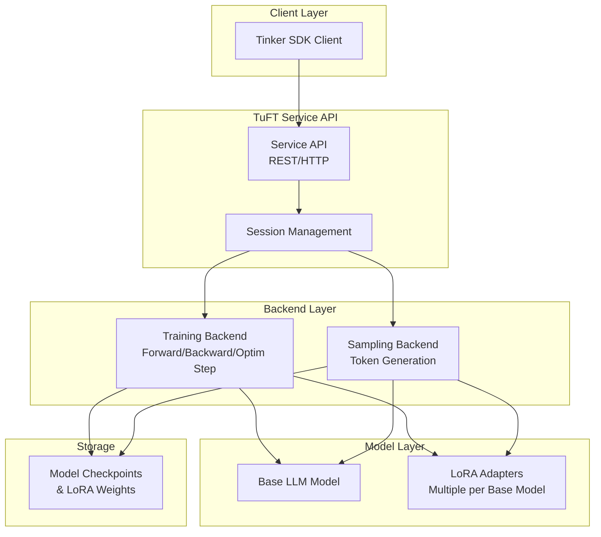

<div align="center">
  
</div>

TuFT (**T**enant-**u**nified **F**ine**T**uning) is a multi-tenant platform that lets multiple users fine-tune LLMs on shared infrastructure through a unified API. Access it via the Tinker SDK or compatible clients.

Check out our [roadmap](#roadmap) to see what we're building next.

We're open source and welcome contributions! Join the community:
- [DingTalk Group](https://qr.dingtalk.com/action/joingroup?code=v1,k1,UWvzO6HHSeuvRQ5WXCOMJEijadQV+hDjhMIpiVr8qCs=&_dt_no_comment=1&origin=11?)
- [Discord](https://discord.gg/wEahC7ZJ)

## Table of Contents

- [Quick Install](#quick-install)
- [Quick Start Example](#quick-start-example)
- [Installation](#installation)
- [Use the Pre-built Docker Image](#use-the-pre-built-docker-image)
- [User Guide](#user-guide)
- [Persistence](#persistence)
- [Observability (OpenTelemetry)](#observability-opentelemetry)
- [Architecture](#architecture)
- [Roadmap](#roadmap)
- [Development](#development)

## Quick Install

> **Note**: This script supports unix platforms. For other platforms, see [Installation](#installation).

Install TuFT with a single command:

```bash
/bin/bash -c "$(curl -fsSL https://raw.githubusercontent.com/agentscope-ai/tuft/main/scripts/install.sh)"
```

This installs TuFT with full backend support (GPU dependencies, persistence, flash-attn) and a bundled Python environment to `~/.tuft`. After installation, restart your terminal and run:

```bash
tuft
```

## Quick Start Example

This example demonstrates how to use TuFT for training and sampling with the [Tinker SDK](https://pypi.org/project/tinker/).
Make sure the server is running on port 10610 before running the code. See the [Run the server](#run-the-server) section below for instructions on starting the server.

### 1. Data Preparation

Prepare your training data in the format expected by TuFT:

```python
import tinker
from tinker import types

# Connect to the running TuFT server
client = tinker.ServiceClient(base_url="http://localhost:10610", api_key="local-dev-key")

# Discover available base models
capabilities = client.get_server_capabilities()
base_model = capabilities.supported_models[0].model_name

print("Supported models:")
for model in capabilities.supported_models:
    print("-", model.model_name or "(unknown)")

# Prepare training data
# In practice, you would use a tokenizer:
# tokenizer = training.get_tokenizer()
# prompt_tokens = tokenizer.encode("Hello from TuFT")
# target_tokens = tokenizer.encode(" Generalizing beyond the prompt")

# For this example, we use fake token IDs
prompt_tokens = [101, 42, 37, 102]
target_tokens = [101, 99, 73, 102]

datum = types.Datum(
    model_input=types.ModelInput.from_ints(prompt_tokens),
    loss_fn_inputs={
        "target_tokens": types.TensorData(
            data=target_tokens, 
            dtype="int64", 
            shape=[len(target_tokens)]
        ),
        "weights": types.TensorData(data=[1.0, 1.0, 1.0, 1.0], dtype="float32", shape=[4])
    },
)
```

**Example Output:**
```
Supported models:
- Qwen/Qwen3-4B
- Qwen/Qwen3-8B
```

### 2. Training

Create a LoRA training client and perform forward/backward passes with optimizer steps:

```python
# Create a LoRA training client
training = client.create_lora_training_client(base_model=base_model, rank=8)

# Run forward/backward pass
fwdbwd = training.forward_backward([datum], "cross_entropy").result(timeout=30)
print("Loss metrics:", fwdbwd.metrics)

# Apply optimizer update
optim = training.optim_step(types.AdamParams(learning_rate=1e-4)).result(timeout=30)
print("Optimizer metrics:", optim.metrics)
```

**Example Output:**
```
Loss metrics: {'loss:sum': 2.345, 'step:max': 0.0, 'grad_norm:mean': 0.123}
Optimizer metrics: {'learning_rate:mean': 0.0001, 'step:max': 1.0, 'update_norm:mean': 0.045}
```

### 3. Save Checkpoint

Save the trained model checkpoint and sampler weights:

```python
# Save checkpoint for training resumption
checkpoint = training.save_state("demo-checkpoint").result(timeout=60)
print("Checkpoint saved to:", checkpoint.path)

# Save sampler weights for inference
sampler_weights = training.save_weights_for_sampler("demo-sampler").result(timeout=60)
print("Sampler weights saved to:", sampler_weights.path)

# Inspect session information
rest = client.create_rest_client()
session_id = client.holder.get_session_id()
session_info = rest.get_session(session_id).result(timeout=30)
print("Session contains training runs:", session_info.training_run_ids)
```

**Example Output:**
```
Checkpoint saved to: tinker://550e8400-e29b-41d4-a716-446655440000/weights/checkpoint-001
Sampler weights saved to: tinker://550e8400-e29b-41d4-a716-446655440000/sampler_weights/sampler-001
Session contains training runs: ['550e8400-e29b-41d4-a716-446655440000']
```

### 4. Sampling

Load the saved weights and generate tokens:

```python
# Create a sampling client with saved weights
sampling = client.create_sampling_client(model_path=sampler_weights.path)

# Prepare prompt for sampling
# sample_prompt = tokenizer.encode("Tell me something inspiring.")
sample_prompt = [101, 57, 12, 7, 102]

# Generate tokens
sample = sampling.sample(
    prompt=types.ModelInput.from_ints(sample_prompt),
    num_samples=1,
    sampling_params=types.SamplingParams(max_tokens=5, temperature=0.5),
).result(timeout=30)

if sample.sequences:
    print("Sample tokens:", sample.sequences[0].tokens)
    # Decode tokens to text:
    # sample_text = tokenizer.decode(sample.sequences[0].tokens)
    # print("Generated text:", sample_text)
```

**Example Output:**
```
Sample tokens: [101, 57, 12, 7, 42, 102]
```

> **Note**: Replace fake token IDs with actual tokenizer calls when you have a tokenizer available locally.

## Installation

> **Tip**: For a quick one-command setup, see [Quick Install](#quick-install). This section is for users who prefer to manage their own Python environment or need more control over the installation.

We recommend using [uv](https://github.com/astral-sh/uv) for dependency management.

### Install from Source Code

1. Clone the repository:

    ```bash
    git clone https://github.com/agentscope-ai/TuFT
    ```

2. Create a virtual environment:

    ```bash
    cd TuFT
    uv venv --python 3.12
    ```

3. Activate environment:

    ```bash
    source .venv/bin/activate
    ```

4. Install dependencies:

    ```bash
    # Install minimal dependencies for non-development installs
    uv sync

    # If you need to develop or run tests, install dev dependencies
    uv sync --extra dev

    # If you want to run the full feature set (e.g., model serving, persistence),
    # please install all dependencies
    uv sync --all-extras
    python scripts/install_flash_attn.py
    # If you face issues with flash-attn installation, you can try installing it manually:
    # uv pip install flash-attn --no-build-isolation
    ```


### Install via PyPI

You can also install TuFT directly from PyPI:

```bash
uv pip install tuft

# Install optional dependencies as needed
uv pip install "tuft[dev,backend,persistence]"
```

### Run the server

The CLI starts a FastAPI server:

```bash
tuft --port 10610 --config /path/to/tuft_config.yaml
```

The config file `tuft_config.yaml` specifies server settings including available base models, authentication, persistence, and telemetry. Below is a minimal example.

```yaml
supported_models:
  - model_name: Qwen/Qwen3-4B
    model_path: Qwen/Qwen3-4B
    max_model_len: 32768
    tensor_parallel_size: 1
  - model_name: Qwen/Qwen3-8B
    model_path: Qwen/Qwen3-8B
    max_model_len: 32768
    tensor_parallel_size: 1
```

See [`config/tuft_config.example.yaml`](config/tuft_config.example.yaml) for a complete example configuration with all available options.

## Use the Pre-built Docker Image

If you face issues with local installation or want to get started quickly,
you can use the pre-built Docker image.

1. Pull the latest image from GitHub Container Registry:

    ```bash
    docker pull ghcr.io/agentscope-ai/tuft:latest
    ```

2. Run the Docker container and start the TuFT server on port 10610:

    ```bash
    docker run -it \
        --gpus all \
        --shm-size="128g" \
        --rm \
        -p 10610:10610 \
        -v <host_dir>:/data \
        ghcr.io/agentscope-ai/tuft:latest \
        tuft --port 10610 --config /data/tuft_config.yaml
    ```

    Please replace `<host_dir>` with a directory on your host machine where you want to store model checkpoints and other data.
    Suppose you have the following structure on your host machine:

    ```plaintext
    <host_dir>/
        ├── checkpoints/
        ├── Qwen3-4B/
        ├── Qwen3-8B/
        └── tuft_config.yaml
    ```

    The `tuft_config.yaml` file defines the server configuration, for example:
    ```yaml
    supported_models:
      - model_name: Qwen/Qwen3-4B
        model_path: /data/Qwen3-4B
        max_model_len: 32768
        tensor_parallel_size: 1
      - model_name: Qwen/Qwen3-8B
        model_path: /data/Qwen3-8B
        max_model_len: 32768
        tensor_parallel_size: 1
    ```

## User Guide
We provide practical examples to demonstrate how to use TuFT for training and sampling. The guides below cover both Supervised Fine-Tuning and Reinforcement Learning workflows, with links to runnable notebooks.

| Dataset | Task | Guide | Example |
|---|---|---|---|
| [no_robots](https://huggingface.co/datasets/HuggingFaceH4/no_robots) | Supervised Fine-Tuning (SFT) | [chat_sft.md](docs/chat_sft.md) | [chat_sft.ipynb](examples/chat_sft.ipynb) |
| [Countdown](https://huggingface.co/datasets/Jiayi-Pan/Countdown-Tasks-3to4) | Reinforcement Learning (RL) | [countdown_rl.md](docs/countdown_rl.md) | [countdown_rl.ipynb](examples/countdown_rl.ipynb) |


## Persistence

TuFT supports optional Redis-based persistence for server state. When enabled,
the server can recover sessions, training runs, and pending futures after a restart.

To use persistence, install the optional dependency:

```bash
uv pip install tuft[persistence]
```

### Persistence Modes

TuFT provides three persistence modes:

| Mode | Description | Use Case |
|------|-------------|----------|
| `disabled` | No persistence, data in-memory only | Development, testing without state recovery |
| `redis_url` | External Redis server | Production, multi-instance deployments |
| `file_redis` | File-backed store | Demos, small-scale testing |

### Configuration

Add a `persistence` section to your `tuft_config.yaml` configuration file and choose one of the following modes.

#### Mode 1: Disabled (Default)

No configuration needed. All data is stored in memory and lost on restart.

```yaml
# tuft_config.yaml
persistence:
  mode: disabled
```

#### Mode 2: External Redis Server

Use an external Redis server for production deployments:

```yaml
# tuft_config.yaml
persistence:
  mode: redis_url
  redis_url: "redis://localhost:6379/0"
  namespace: "tuft"
```

You can start a local Redis instance using Docker:

```bash
docker run -d --name TuFT-redis -p 6379:6379 redis:7-alpine
```

#### Mode 3: File-backed Store

Use the file-backed store for demos or small-scale testing:

```yaml
# tuft_config.yaml
persistence:
  mode: file_redis
  file_path: "~/.cache/tuft/file_redis.json"
  namespace: "tuft"
```

## Observability (OpenTelemetry)

TuFT supports optional OpenTelemetry integration for distributed tracing, metrics, and logging.
This allows you to monitor your TuFT server using observability tools like SigNoz, Jaeger, or Grafana.

### Configuration

Add the following `telemetry` section to your `tuft_config.yaml` configuration file:

```yaml
# tuft_config.yaml
telemetry:
  enabled: true
  service_name: tuft
  otlp_endpoint: http://localhost:4317  # Your OTLP collector endpoint
  resource_attributes: {}
    # example:
    # deployment.environment: production
    # service.version: 1.0.0
    # service.namespace: my-namespace
```

Alternatively, use environment variables:

```bash
export TUFT_OTLP_ENDPOINT=http://localhost:4317
export TUFT_OTEL_DEBUG=1  # Enable console exporter for debugging
```

## Architecture

TuFT provides a unified service API for agentic model training and sampling. The system supports multiple LoRA adapters per base model and checkpoint management.



### Key Components

- **Service API**: RESTful interface for training and sampling operations
- **Training Backend**: Handles forward/backward passes and optimizer steps for LoRA fine-tuning
- **Sampling Backend**: Generates tokens from trained models
- **Checkpoint Storage**: Manages model checkpoints and LoRA weights


## Roadmap

### Core Focus: Post-Training for Agent Scenarios

We focus on post-training for agentic models. The rollout phase in RL training involves reasoning, multi-turn conversations, and tool use, which tends to be asynchronous relative to the training phase. We aim to improve the throughput and resource efficiency of the overall system, building tools that are easy to use and integrate into existing workflows.

### Architecture & Positioning

- **Horizontal platform**: Not a vertically integrated fine-tuning solution, but a flexible platform that plugs into different training frameworks and compute infrastructures
- **Code-first API**: Connects agentic training workflows with compute infrastructure through programmatic interfaces
- **Layer in AI stack**: Sits above the infrastructure layer (Kubernetes, cloud platforms, GPU clusters), integrating with training frameworks (PeFT, FSDP, vLLM, DeepSpeed) as implementation dependencies
- **Integration approach**: Works with existing ecosystems rather than replacing them

### Near-Term (3 months)

- **Multi-machine, multi-GPU training**: Support distributed architectures using PeFT, FSDP, vLLM, DeepSpeed, etc.
- **Cloud-native deployment**: Integration with AWS, Alibaba Cloud, GCP, Azure and Kubernetes orchestration
- **Observability**: Monitoring system with real-time logs, GPU metrics, training progress, and debugging tools
- **Serverless GPU**: Lightweight runtime for diverse deployment scenarios, with multi-user and multi-tenant GPU resource sharing to improve utilization efficiency

### Long-Term (6 months)

- **Environment-driven learning loop**: Standardized interfaces with WebShop, MiniWob++, BrowserEnv, Voyager and other agent training environments
- **Automated pipeline**: Task execution → feedback collection → data generation → model updates
- **Advanced RL paradigms**: RLAIF, Error Replay, and environment feedback mechanisms
- **Simulation sandboxes**: Lightweight local environments for rapid experimentation

### Open Collaboration: We are Looking for Collaborators

This roadmap is not fixed, but rather a starting point for our journey with the open source community. Every feature design will be implemented through GitHub Issue discussions, PRs, and prototype validation. We sincerely welcome you to propose real-world use cases, performance bottlenecks, or innovative ideas—it is these voices that will collectively define the future of Agent post-training.

We welcome suggestions and contributions from the community! Join us on:
- [DingTalk Group](https://qr.dingtalk.com/action/joingroup?code=v1,k1,UWvzO6HHSeuvRQ5WXCOMJEijadQV+hDjhMIpiVr8qCs=&_dt_no_comment=1&origin=11?)
- [Discord](https://discord.gg/wEahC7ZJ) (on AgentScope's Server)

## Development

### Setup Development Environment

1. Install [uv](https://github.com/astral-sh/uv) if you haven't already:

    ```bash
    curl -LsSf https://astral.sh/uv/install.sh | sh
    ```

2. Install dev dependencies:

    ```bash
    uv sync --extra dev
    ```

3. Set up pre-commit hooks:

    ```bash
    uv run pre-commit install
    ```

### Running Tests

```bash
uv run pytest
```

To skip integration tests:

```bash
uv run pytest -m "not integration"
```

For detailed testing instructions, including GPU tests, persistence testing, and writing new tests, see the [Testing Guide](docs/how_to_write_tests.md).

### Linting and Type Checking

Run the linter:

```bash
uv run ruff check .
uv run ruff format .
```

Run the type checker:

```bash
uv run pyright
```

### Notebook Linting

For Jupyter notebooks:

```bash
uv run nbqa ruff notebooks/
```

### Secret Detection

Scan and update the secrets baseline:

```bash
uv run detect-secrets scan > .secrets.baseline
```

Audit detected secrets to mark false positives:

```bash
uv run detect-secrets audit .secrets.baseline
```

### Contributing

Please ensure all tests pass and pre-commit hooks succeed before creating new PRs.