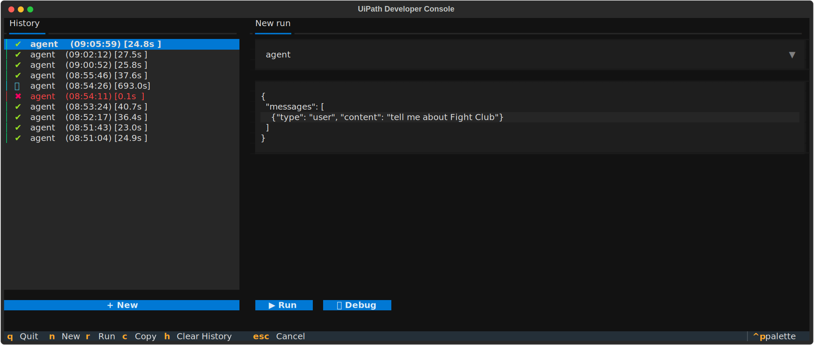
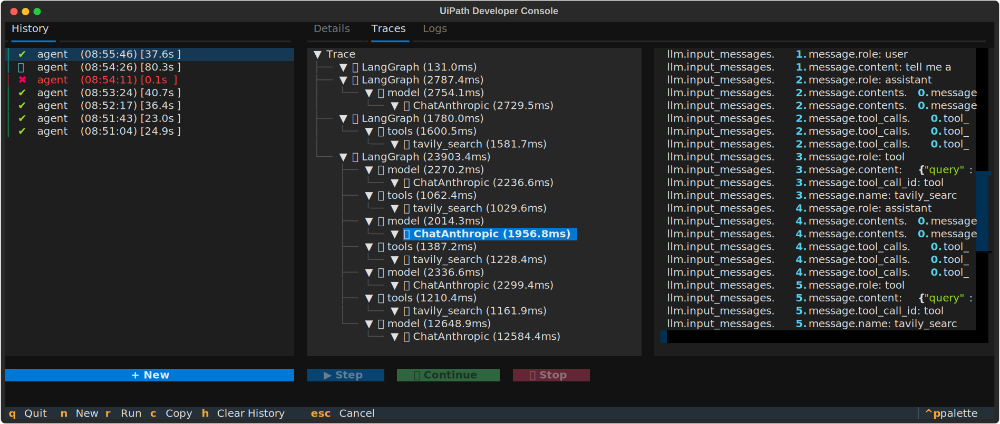
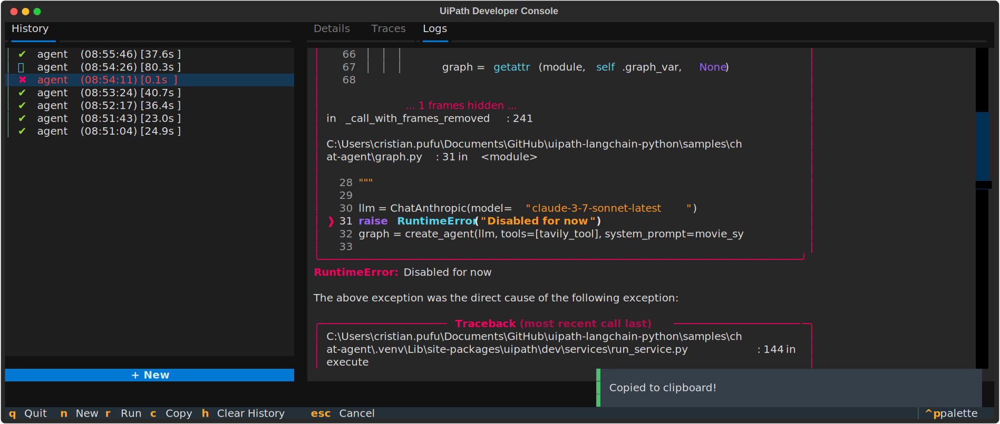

# UiPath Developer Console

[](https://pypi.org/project/uipath-dev/)
[](https://pypi.org/project/uipath-dev/)
[](https://pypi.org/project/uipath-dev/)

Interactive terminal application for building, testing, and debugging UiPath Python runtimes, agents, and automation scripts.

## Overview

The Developer Console provides a local environment for developers who are building or experimenting with Python-based UiPath runtimes.
It integrates with the [`uipath-runtime`](https://github.com/uipath/uipath-runtime-python) SDK to execute agents and visualize their behavior in real time using the [`textual`](https://github.com/textualize/textual) framework.

This tool is designed for:
- Developers building **UiPath agents** or **custom runtime integrations**
- Python engineers testing **standalone automation scripts** before deployment
- Contributors exploring **runtime orchestration** and **execution traces**

## Installation

```bash
uv add uipath-dev
```

## Features

- Run and inspect Python runtimes interactively
- View structured logs, output, and OpenTelemetry traces
- Export and review execution history

---






## Development

Launch the Developer Console with mocked data:

```bash
uv run uipath-dev
```

To run tests:

```bash
pytest
```

### :heart: Special Thanks

A huge thank-you to the open-source community and the maintainers of the libraries that make this project possible:

- [OpenTelemetry](https://github.com/open-telemetry/opentelemetry-python) for observability and tracing.
- [Pyperclip](https://github.com/asweigart/pyperclip) for cross-platform clipboard operations.
- [Textual](https://github.com/Textualize/textual) for the powerful TUI framework that powers the developer console.
