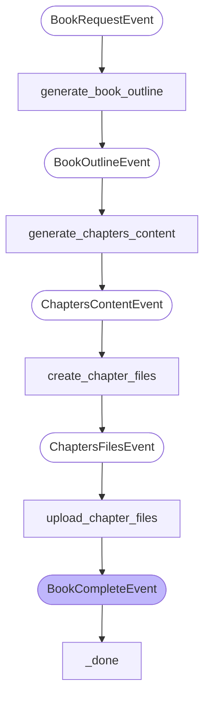

# Multi-Modal Book Writer Agent

A UiPath LlamaIndex agent that automatically generates complete books with chapters, illustrations, and multi-modal content, demonstrating the use of **job attachments** for handling multiple files in UiPath automations.

## What it does

This agent creates a complete book on any given topic by:

1. **Generating a book outline** with chapter titles and descriptions
2. **Writing detailed chapter content** with engaging text
3. **Creating visual illustrations** for each chapter using AI image generation
4. **Generating multiple file formats** for each chapter (Markdown, JSON metadata, text summaries)
5. **Uploading all files as job attachments** to demonstrate multi-modal file handling

## Key Features

- **Multi-modal content generation**: Combines text, images, and multiple document formats
- **Job attachments demonstration**: Shows how to handle multiple files in UiPath jobs
- **Workflow-based architecture**: Uses LlamaIndex workflows for structured processing
- **AI-powered content**: Leverages OpenAI for both text and image generation

## Workflow Architecture

## Usage

The agent accepts two inputs:
- **topic**: The subject for the book (e.g., "Machine Learning", "Cooking", "Space Exploration")
- **num_chapters**: Number of chapters to generate (recommended: 3-5)

## Sample Demonstration

This sample demonstrates how UiPath can handle complex multi-modal workflows that generate and manage multiple file types as job attachments, making it ideal for document generation, content creation, and automated publishing workflows.

## Dependencies

- Python ≥ 3.11
- UiPath LlamaIndex integration
- OpenAI API (for text and image generation)
