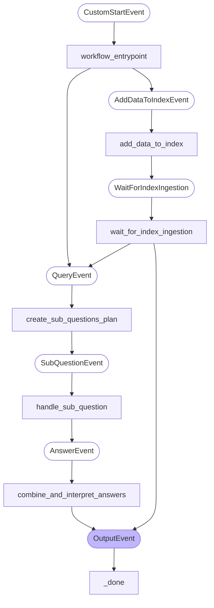

# Travel helper RAG agent

## Overview

The **Travel helper RAG agent** project demonstrates the implementation of a Retrieval-Augmented Generation (RAG) system using [UiPath Context Grounding](https://docs.uipath.com/automation-cloud/automation-cloud/latest/admin-guide/about-context-grounding).

It consists of a Llama Index agent that utilizes two `ContextGroundingQueryEngines`: one to retrieve relevant data about the company's travel policy and another to assess an individual's personal travel preferences.

## System Architecture

### Agent Graph



## Agent Responsibilities

- Accepts a user query with details about an upcoming business trip.
- Verifies if new data should be added to RAG indexes.
- Initializes two `QueryEngineTools`, each based on distinct context-grounding indexes.
- Breaks down the initial query into multiple `sub-questions`.
- Assigns ReAct agents to address each `sub-question`.
- Combines the responses to generate a travel summary, including the permitted budget, employee preferences, and recommendations.

## Steps to Execute Project on UiPath Cloud Platform
### Prerequisites
1. **Create two Orchestrator Storage Buckets**

For this demo we'll create them in the _Shared_ folder.


2. **Create two Context Grounding Indexes**

Next, we'll create two Context Grounding Indexes.


When configuring _Index General Details_, we'll select the previously created storage buckets as data sources.

Example for `company_policy` index:


That's it! Next, we'll deploy the agent.

### Deploy the agent
1. **Clone the Repository**
   ```bash
   git clone https://github.com/UiPath/uipath-integrations-python.git
   ```

2. **Navigate to the Sample Directory**
   - **Windows:**
     ```bash
     cd .\uipath-integrations-python\packages\uipath-llamaindex\samples\travel-helper-RAG-agent
     ```

   - **Unix-like Systems (Linux, macOS):**
     ```bash
     cd ./uipath-integrations-python/packages/uipath-llamaindex/samples/travel-helper-RAG-agent
     ```

3. **Create and Activate a Virtual Python Environment**
   ```bash
   pip install uv
   uv venv -p 3.11 .venv
   .venv\Scripts\activate  # Windows
   source .venv/bin/activate  # Unix-like Systems
   uv sync
   ```

4. **Authenticate with UiPath Cloud Platform**
   ```bash
   uipath auth
   ```
   > **Note:** After successful authentication in the browser, select the tenant for publishing the agent package.
```
👇 Select tenant:
  0: DefaultTenant
  1: Tenant2
  2: Tenant3
...
Select tenant: 2
```

5. **Package and Publish Agents**
   ```bash
   uipath pack
   uipath publish --my-workspace
   ```
```
⠋ Publishing most recent package: travel-helper-RAG-agent.1.0.0.nupkg ...
✓  Package published successfully!
⠇ Getting process information ...
🔗 Process configuration link: [LINK]
💡 Use the link above to configure any environment variables
```
> Note: when publishing to _my-workspace_ a process will be auto-provisioned for you.

6. **Run the agent on UiPath Cloud Platform**

    There are two ways we can run the agent:
    1. **Invoke it from command line**:
   ```bash
    > uipath invoke agent --file .\input.json
    ⠴ Loading configuration ...
    ⠴ Starting job ...
    ✨ Job started successfully!
    🔗 Monitor your job here: [LINK]
    ```
   2. Run it from Orchestrator _Processes_ page:

    

    

8. **Conclusions**

We can monitor our agent execution from the job info panel.


On traces tab, we can see the steps that our agent took to complete the task, along with the flow diagram.


> **IMPORTANT**❗: The `add_data_to_index` should be set to **true**
> every time new data is added to the sample_data directory. If one wishes to add other file types such as _.csv, .json, .xml etc_ to be ingested by the context grounding index
> the packOptions section from `uipath.json` file should be updated. See example below:
```json
  "packOptions": {
    "fileExtensionsIncluded": [
      ".txt",
      ".xlsx",
      ".csv",
      ".xml",
      ...
    ]
  }
```


## Local Debugging
You can run and debug the agent locally:

```bash
uipath run agent --file input.json
# optional: use the debug mode
uipath run agent --file input.json --debug
```
>  Check [here](https://uipath.github.io/uipath-python/cli/#run) our CLI documentation.


> **_NOTE:_**  This assumes that the indexes are created in the folder identified by the _index_folder_path_ parameter.


