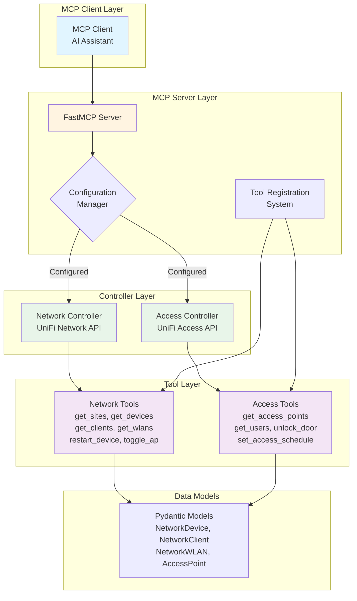

# UniFi MCP Server

[](https://github.com/lesleslie/crackerjack)
[](https://www.python.org/downloads/)


A FastMCP server for managing UniFi Network and Access controllers.

## Overview

This server provides MCP (Model Context Protocol) tools to interact with UniFi Network and Access controllers, allowing you to manage devices, sites, users, and other UniFi entities through an MCP interface.

### System Architecture



## Features

- **UniFi Network Controller Integration**: Manage sites, devices, clients, and WLANs
- **UniFi Access Controller Integration**: Manage access points, users, and door access
- **MCP Tools**: Rich set of tools for common UniFi operations
- **Configuration Management**: Flexible configuration via environment variables or pyproject.toml
- **Async Operations**: Built with async/await for efficient performance
- **Error Handling**: Comprehensive error handling and retry mechanisms

## Installation

1. Install the required dependencies:

```bash
pip install -r requirements.txt
# Or if using pyproject.toml
pip install uv && uv sync
```

2. Install the package in development mode:

```bash
pip install -e .
```

## Configuration

### Environment Variables

You can configure the server using environment variables:

```bash
# Server configuration
MCP_SERVER_HOST=127.0.0.1
MCP_SERVER_PORT=8000
MCP_DEBUG=true

# Network Controller (optional)
UNIFI__NETWORK_CONTROLLER__HOST=unifi.example.com
UNIFI__NETWORK_CONTROLLER__PORT=8443
UNIFI__NETWORK_CONTROLLER__USERNAME=admin
UNIFI__NETWORK_CONTROLLER__PASSWORD=password
UNIFI__NETWORK_CONTROLLER__SITE_ID=default

# Access Controller (optional)
UNIFI__ACCESS_CONTROLLER__HOST=unifi-access.example.com
UNIFI__ACCESS_CONTROLLER__PORT=8444
UNIFI__ACCESS_CONTROLLER__USERNAME=admin
UNIFI__ACCESS_CONTROLLER__PASSWORD=password
UNIFI__ACCESS_CONTROLLER__SITE_ID=default
```

### PyProject.toml Configuration

Alternatively, you can configure the server in your `pyproject.toml`:

```toml
[tool.unifi-mcp]
[tool.unifi-mcp.server]
host = "127.0.0.1"
port = 8000
debug = false

[tool.unifi-mcp.network_controller]
host = "unifi.example.com"
port = 8443
username = "admin"
password = "password"
site_id = "default"

[tool.unifi-mcp.access_controller]
host = "unifi-access.example.com"
port = 8444
username = "admin"
password = "password"
site_id = "default"
```

## Usage

### Running the Server

```bash
# Using the CLI
python -m unifi_mcp start --host 127.0.0.1 --port 8000

# Or directly
python -c "from unifi_mcp.main import main; main()"
```

### Available CLI Commands

```bash
# Start the server
python -m unifi_mcp start --host 127.0.0.1 --port 8000 --debug

# Check configuration
python -m unifi_mcp config

# Check server status
python -m unifi_mcp status

# Test connection to a controller
python -m unifi_mcp test-connection network
python -m unifi_mcp test-connection access
```

## MCP Tools Available

### Network Controller Tools

- `get_unifi_sites`: Get all sites from the UniFi Network Controller
- `get_unifi_devices`: Get all devices in a specific site
- `get_unifi_clients`: Get all clients in a specific site
- `get_unifi_wlans`: Get all WLANs in a specific site
- `restart_unifi_device`: Restart a device by its MAC address
- `disable_unifi_ap`: Disable an access point by its MAC address
- `enable_unifi_ap`: Enable an access point by its MAC address
- `get_unifi_statistics`: Get site statistics

### Access Controller Tools

- `get_unifi_access_points`: Get all access points
- `get_unifi_access_users`: Get all users
- `get_unifi_access_logs`: Get door access logs
- `unlock_unifi_door`: Unlock a door
- `set_unifi_access_schedule`: Set access schedule for a user

## Development

### Running Tests

```bash
# Run the test script
python tests/test_unifi_mcp.py
```

### Project Structure

```
unifi_mcp/
├── __init__.py
├── __main__.py
├── main.py                 # Main application entry point
├── server.py              # FastMCP server implementation
├── config.py              # Configuration management with Pydantic models
├── cli.py                 # Typer-based CLI for management
├── clients/               # API clients for UniFi Network, Access, and Local
│   ├── __init__.py
│   ├── base_client.py     # Base HTTP client with authentication handling
│   ├── network_client.py  # UniFi Network Controller API client
│   └── access_client.py   # UniFi Access Controller API client
├── models/                # Pydantic models for UniFi data structures
│   ├── __init__.py
│   ├── network.py         # Network controller data models
│   └── access.py          # Access controller data models
├── tools/                 # MCP tools for UniFi operations
│   ├── __init__.py
│   ├── network_tools.py   # Network-specific tools
│   └── access_tools.py    # Access-specific tools
├── utils/                 # Utility functions
│   ├── __init__.py
│   ├── retry_utils.py     # Retry logic with exponential backoff
│   └── validators.py      # Input validation
└── monitoring/            # Monitoring and health check utilities
```

## Security Considerations

- Store credentials securely and never commit them to version control
- Use appropriate firewall rules to restrict access to the MCP server
- Enable SSL/TLS if the server is exposed to untrusted networks
- Regularly update dependencies to address security vulnerabilities

## Troubleshooting

If you encounter connection issues:

1. Verify that your UniFi controllers are accessible from the server
1. Check that the correct credentials and ports are configured
1. Ensure that SSL certificates are valid (or set `verify_ssl` to false for self-signed certificates in development)
1. Check the server logs for detailed error messages

## Contributing

Contributions are welcome! Please feel free to submit a Pull Request.
