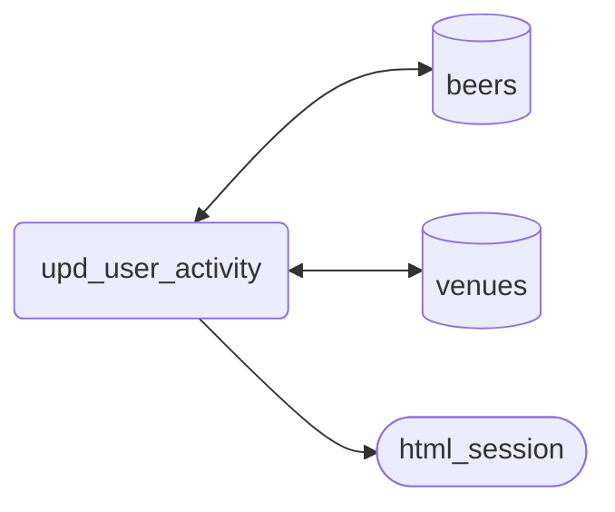

# What is Scraped?
| type             | url                            | web struct                         | note                                           |
| ---------------- | ------------------------------ | ---------------------------------- | ---------------------------------------------- |
| beer details     | beer/{beer_id}                 | WebBeerDetails                     |
| user details     | user/{user_id}                 | WebUserDetails<br> WebActivityBeer | has activity too                               |
| user had beers   | user/{user_id}/beers           | WebUserHadBeer                     |
| user list names  | user/{user_id}/lists           | WebUserList                        |
| user list beers  | user/{user_id}/lists/{list_id} | WebUserListBeer                    |
| user venues      | user/{user_id}/venues          | WebUserVenueHistory                |
| venue activity   | venue/{venue_id}/activity      | WebActivityBeer                    | unverified venue on same page as venue details |
| venue details    | venue/{venue_id}               | WebVenueDetails                    |
| venue menu names | venue/{venue_id}               | WebVenueMenu                       |
| venue menu beers | venue/{venue_id}               | WebVenueMenuBeer                   | may be a different URL                         |

# Loop
```
# load menu beers
if has menu-header
    if has menu-selector
        for each menu-selector
            load menu
            for each menu-section
                process menu
    else
        for each menu-section
            process menu

# process menu (sub)
for each menu-section-header (collaroy packed beers)
    process menu-section-header
    for each menu-section-list
        while more beer
            for each beer in list
                process beer
            if show-more-section and still_want_more():
                load next page

# load checkins
if has menu
    load activity page

for each checkin
    log beer, time, serving, rating
```
# HTML
## Menus

### examples
| venue    | type             |
| -------- | ---------------- |
| 4 pines  | unofficial       |
| winona   | single           |
| sweeneys | multi            |
| collaroy | multi selectable |

### menu tags
```
menu-header

	missing 			for 4 pines
	-header menu-select	for winona
	menu-select 		for sweeneys
	menu-select multi 	for collaroy

menu-selector			for collaroy
	<select class=‘menu-selector’>
	  <option value=“xxx”>menu name</option>

menu-section-header
	<h4>menu name<span>xx</span></h4>

	missing 			for 4 pines
	single				for winona
	multiple 			for sweeneys
	single			 	for collaroy

menu-section-list
	<ul><li><div class=“beer-info”>
	  <div class=“beer-label”><span data-update-at=“date”></span>
	  <div class=“beer-details”>
	    <h5><a href=“xx”>beer name</a><em>style</em></h5>
	    <h6><span><a href=“brewery”>brewery</a><div class=“caps small” data-rating=“3.949”></h6>
	</ul>
	<a class=“more show-more-section” data-section-id=“123” data-venue-id=“123” data-menu-id=“123”>
```
### activity tags
```html
<div class=“checkin”>
  <div class=“top”>
    <p class=“text”><a class=“user”>Bob</a> is drinking a/n <a>beer</a> by <a>brewery</a> at <a>venue</a></p>
    <div class=“checkin-comment><div class="rating-serving">
      <p class="serving"><span>Can</span></p>
      <div class="caps " data-rating="4.25">
    </div>
  <div class="feedback">
    <div class="bottom">
      <a href="/user/Martinlife/checkin/991966052" class="time timezoner track-click" data-gregtime="Sun, 31 Jan 2021 05:35:45 +0000">31 Jan 21</a>
```
## 4 Pines (no menu)

# Menu systems

There are several different presentations of a venue's menu:
| type                      | example             | id      | url                                                 |
| ------------------------- | ------------------- | ------- | --------------------------------------------------- |
| unverified                | 4 Pines brewpub     | 14705   | https://untappd.com/v/4-pines-brewpub/14705         |
| single menu               | Winona              | 8931121 | https://untappd.com/v/winona/8931121                |
| multi menu, all displayed | Sweeneys            | 107565  | https://untappd.com/v/hotel-sweeney-s/107565        |
| multi menu, selectable    | Collaroy Beach Club | 99967   | https://untappd.com/v/the-beach-club-collaroy/99967 |

## unverified
Not much to do here.
1. scrape the checkins. Can get user's personal rating (but use global if available), and check in time easily
2. take note of "recent". < 1 week?
3. can't page, so just take the 20
## single menu
Some of these are huge. Winona has 554 on their menu but they aren't necessarily available - they just don't clean it up. So only scrape 100(?) or only since a certain date (available in HTML)
1. get beer list name
2. get beers on first page, capturing
   - global rating
   - name
   - brewery
   - style
   - date updated in
     ```html
     <span class="new-trigger" data-update-at="Mon, 30 Nov 2020 05:44:33 +0000" style="display: none;">New</span>
     ```
3. repeat by "pressing" the  "Show More Beers". This actually is a request for XHR data
   ```bash
   curl -XGET -H "x-requested-with: XMLHttpRequest" "https://untappd.com/venue/more_menu/8931121/15?section_id=178512830"
   ```
   Subsequent pressing gets a url like `https://untappd.com/venue/more_menu/8931121/30?section_id=178512830`. '8931121' is the venue ID and stays the same. Note the 15 changed to a 30, which is the start number (then goes 45, 60, ...). Section ID 178512830 stays the same too and needs to be scraped from the "more" button (or the other tags nearby).
   ```html
   <a href="javascript:void(0);" class="yellow button more show-more-section track-click" data-track="venue" data-href=":moremenu" data-section-id="178512830" data-venue-id="8931121" data-menu-id="50008188" style="display: block;">Show More Beers</a>
   ```
   This returns a JSON string with HTML in it, eg,
   ```json
   {"count":15,"view":"\t\t<li>\n\t\t\t<div class=\"beer-info \">\n\t\t\t    <div class=...}
   ```
   HTML is a bunch of `<li>` tags, eg,
   ```html
   <li>
    <div class="beer-info ">
        <div class="beer-label">
            <span class="new-trigger" data-update-at="Thu, 25 Feb 2021 08:52:44 +0000" style="display: none;">New</span>
        </div>
        <div class="beer-details">
            <h5><a class="track-click" data-track="menu" data-href=":beer"
                    href="/b/garage-project-hazy-daze-amarillo-and-mosaic/4185296">Hazy Daze- Amarillo & Mosaic</a>
                <em>Pale Ale - New England</em></h5>
            <h6><span>5.8% ABV • N/A IBU • <a class="track-click" data-track="menu" data-href=":brewery"
                        href="/w/garage-project/14539">Garage Project</a>
                    • </span>

                <div class="caps small" data-rating="3.946">
                    <div class="cap cap-100"></div>
                    <div class="cap cap-100"></div>
                    <div class="cap cap-100"></div>
                    <div class="cap cap-90"></div>
                    <div class="cap"></div>
                </div>
            </h6>
        </div>
    </div>
   </li>
   ```
4. scrape this the same way
5. repeat until found "x" entries or they're too old
6. scrape checkins to see who's recently drunk. Could keep track of serving style (draft, taster) to only match against tap menus.

## mutiple menus all displayed

## mutiple menus selectable

?ng_menu_id=72f516dc-3ef0-4333-9113-1fa70c2143db


# Example

```python
def get_menus(html: HTML) -> List[str]:
    """Find menu names and links for a supplied venue response.

    There are three types of venues:
        1. official with menu selection.    Eg, 99967 (Collaroy)
        1. official with multiple menus.    Eg, 107565 (Sweeneys)
        2. official with one menu.          Eg, 8931121 (Winona)
        3. unofficial.                      Eg, 14705 (4 Pines)

    Menu heirarchy:
        menu header, eg, "The Arlington Tap List", "Hotel Sweeneys", "Beer List" (can be multiple with diff URL)
            menu section, eg, "Currently Tapped", "Hand Pumps", "Main Bar", "WINONA Beer List" (can be multi)
                beer
                more beer (if more than 15)
```
```html
    <div class="menu-header">
        <select>                                            <---|
            <option value="e3e40b1b">BEER ON TAP</option>   <---+-- if multi headers
        </select>                                           <---|
        <p class="menu-total">BEER ON TAP</p>               <--- current menu (below)
        <span class="updated=time" data-time="xxx"></span>  <--- menu header update time
    </div>

    <div class="menu-section" id="section_172559734">
        <div class="menu-section-header">
            <h4>Hand Pumps (Ground Floor) <span>(2 Beers)</span></h4>       <--- menu section name
            <ul class="menu-section-list" id="section-menu-list-172559734">
                <li>                                                        <--- multiple
                    <div class="beer-info ">
                        <div class="beer-label">
                            <span class="new-trigger" data-update-at="Sun, 20 Dec 2020 10:06:18 +0000" style="display: none;">New</span>
                        </div>
                        <div class="beer-details">
                            <h5><a class="track-click" data-track="menu" data-href=":beer" href="/b/joshua-tetley-and-son-tetley-s-smooth-flow/986134">Tetley's Smooth Flow</a> <em>English Bitter</em></h5>
                            <h6>
                                <span>3.6% ABV • N/A IBU • <a class="track-click" data-track="menu" data-href=":brewery" href="/w/joshua-tetley-son/183905">Joshua Tetley &amp; Son</a>• </span>
                                <div class="caps small" data-rating="2.829">...</div>
                            </h6>
                        </div>
                    </div>
                    <div class="beer-containers">
                        <p><strong>Serving:</strong>330ml Can</p>
                    </div>
                </li>
            </ul>
            <a href="javascript:void(0);" class="yellow button more show-more-section track-click" data-track="venue" data-href=":moremenu" data-section-id="172717719" data-venue-id="99967" data-menu-id="48363844">Show More Beers</a>
        </div>
```

1. Offical, menu selection

A menu list looke like:
```html
        <div class="menu-header menu-select multi">
            <select class="menu-selector">
              <option value="e3e40b1b-ba2e-4eed-950e-ea13182cc4f0">BEER ON TAP</option>
              <option value="72f516dc-3ef0-4333-9113-1fa70c2143db">The Arlington Fridge List</option>
            </select>
            <p class="menu-total">BEER ON TAP</p>
            <span class="updated-time" data-time="Sun, 10 Jan 2021 04:08:10 +0000">Sunday, Jan 10, 3:08 PM</span>
        </div>

        The full menu for menu in the text of the menu-total <p> will be on this page.
        Other menus need to be separately fetched, eg,
        https://untappd.com/v/the-beach-club-collaroy/99967?ng_menu_id=72f516dc-3ef0-4333-9113-1fa70c2143db

        A beer menu looks like:

        <div class="menu-section" id="section_172646387">
          <div class="menu-section-header">
            <h4>The Arlington Fridge List <span>(96 Beers)</span></h4>
          </div>
          <ul class="menu-section-list" id="section-menu-list-172646387">
            <li>
              <div class="beer-info ">
                <div class="beer-label">
                  <span class="new-trigger" data-update-at="Fri, 29 Jan 2021 04:21:54 +0000" style="display: none;">New</span>
                  
                </div>
                <div class="beer-details">
                  <h5><a class="track-click" data-track="menu" data-href=":beer" href="/b/3-ravens-brewery-nat-rav-2020-heathcote-yellow-muscat/3854903">Nat Rav 2020 Heathcote Yellow Muscat</a> <em>Sour - Other</em></h5>
                  <h6><span>7.5% ABV • N/A IBU • <a class="track-click" data-track="menu" data-href=":brewery" href="/w/3-ravens-brewery/3324">3 Ravens Brewery</a>• </span>
                    <div class="caps small" data-rating="3.924">
                      <div class="cap cap-100"></div>
                      <div class="cap cap-100"></div>
                      <div class="cap cap-100"></div>
                      <div class="cap cap-90"></div>
                      <div class="cap"></div>
                    </div>
                  </h6>
                </div>
              </div>
              <div class="beer-containers">
                <p>
                  <strong>Serving:</strong>
                  750ml Bottle
                </p>
              </div>
            </li>
          </ul>
          <a href="javascript:void(0);" class="yellow button more show-more-section track-click" data-track="venue" data-href=":moremenu" data-section-id="172646387" data-venue-id="99967" data-menu-id="48343231">Show More Beers</a>
          <p class="stream-loading"><span></span></p>
        </div>
```

2. Offical, multiple menus

A menu list looke like:
```html
        <div class="menu-header menu-select">
            <p class="menu-total">Hotel Sweeneys</p>
            <span class="updated-time" data-time="Sat, 30 Jan 2021 14:57:56 +0000">Sunday, Jan 31, 1:57 AM</span>
        </div>

        So, same details with menu-total not really being a _menu_ and the updated time but no selection

        There are multiple of these sections. A single beer menu looks the same as the other menu options:

        <div class="menu-section" id="section_172559734">
            <div class="menu-section-header">
                <h4>Hand Pumps (Ground Floor) <span>(2 Beers)</span></h4>
                <p>We have 2 hand pumps in the 'main' downstairs bar and rotate through UK and Australian beers. Regular features are London Pride and/or ESB from Fullers. They are less carbonated and definitely worth a try.</p> </div>
                <ul class="menu-section-list" id="section-menu-list-172559734">
                    <li>
                        :   :
                    </li>
                </ul>
            </div>
```


3. Official, single menu

A menu list looke like:
```html
        <div class="menu-header menu-select">
            <p class="menu-total">Beer List</p>
            <span class="updated-time" data-time="Sat, 30 Jan 2021 04:08:01 +0000">Saturday, Jan 30, 3:08 PM</span>
        </div>

        So, same details with menu-total and the updated time but no selection

        A beer menu looks the same as in 1.

    For official venues, extra menu pages (15 more beers) can be loaded via, eg,
    https://untappd.com/venue/more_menu/99967/15?section_id=172646387", with headers={"x-requested-with": "XMLHttpRequest"}.
    This will return a JSON-style response as it thinks we're AJAX
```
4. Unoffical

  No menu-header <div>


# module structure
