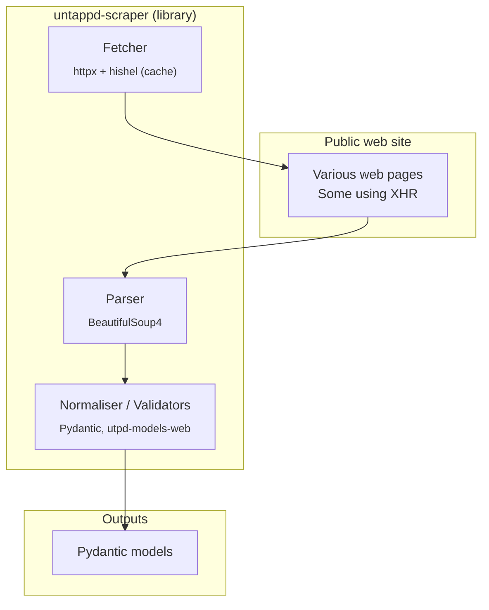

# untappd-scraper architecture

## Overview

## Main libraries used

- httpx
- hishel
- BeautifulSoup4 and requests-html (legacy)
- Pydantic
- utpd-models-web, created specifically for this project
- Brotli
- Loguru, logfire
- tenacity, ratelim

## Automated testing

Testing done under GitLab CI/CD pipelines using pytest and captured / simulated HTML responses.
