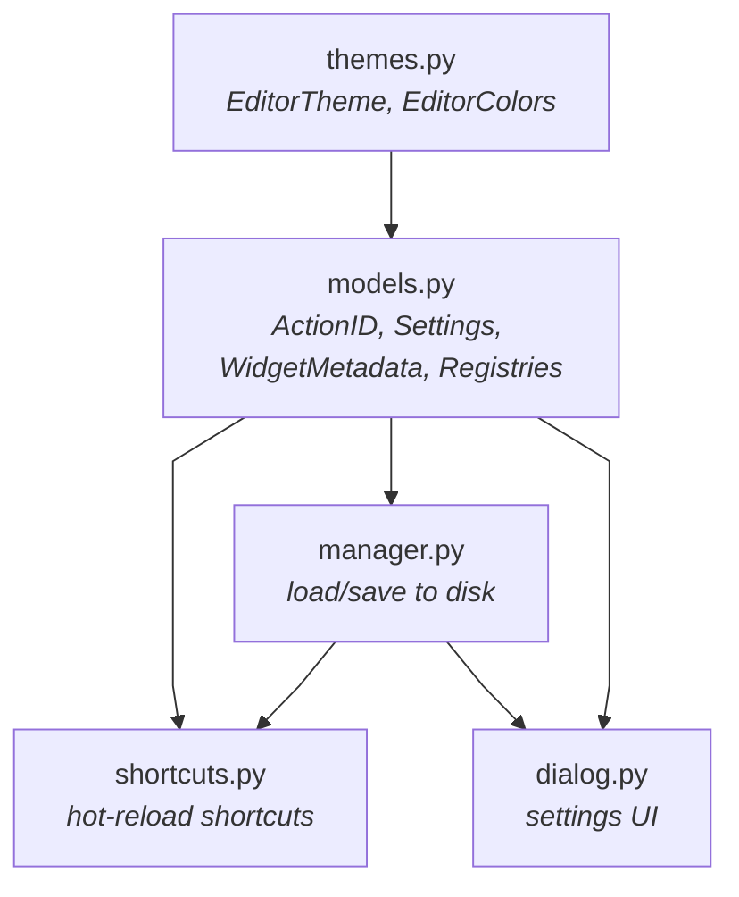

# Settings Module

**Single source of truth**: Everything is defined in `models.py`:

- Shortcuts: `ActionID` enum includes default key bindings
- Settings: Model fields use `Annotated` types with UI metadata + defaults
- Widget behavior: Each `WidgetMetadata` subclass handles its own widget creation and value handling

## Adding a Shortcut

### 1. Add ActionID (`models.py`)

```python
class ActionID(StrEnum):
    MY_ACTION = "scope.my_action", "My Action Label", "Ctrl+M"
    #             ↑ action_id        ↑ label            ↑ default key
```

### 2. Register in Code

```python
from .settings.shortcuts import ShortcutManager
from .settings.models import ActionID

# For QAction (e.g., menu items):
ShortcutManager.register_action(ActionID.MY_ACTION, my_action)

# For standalone shortcuts:
ShortcutManager.register_shortcut(ActionID.MY_ACTION, callback, parent_widget)
```

---

## Adding a Setting

Add a field with annotation and default value (`models.py`):

```python
# Global (app-wide) → GlobalSettings or nested model
class GlobalSettings(BaseModel):
    my_feature: Annotated[bool, Checkbox(section="Features", label="My Feature", text="Enable")] = False

# For nested settings (like TimelineSettings):
class TimelineSettings(BaseModel):
    my_option: Annotated[int, Spin(section="Timeline", label="My Option", min=0, max=100)] = 50
```

That's it! **No other files to edit.**

---

## Widget Types

| Type            | Annotation Example                                                |
| --------------- | ----------------------------------------------------------------- |
| `Checkbox`      | `Annotated[bool, Checkbox(text="Enable")] = False`                |
| `Dropdown`      | `Annotated[str, Dropdown(items=[("A", "a")])] = "a"`              |
| `Spin`          | `Annotated[int, Spin(min=0, max=100, suffix=" px")] = 50`         |
| `DoubleSpin`    | `Annotated[float, DoubleSpin(min=0, max=1, decimals=2)] = 0.5`    |
| `PlainTextEdit` | `Annotated[list[float], PlainTextEdit(value_type=float)] = [1.0]` |
| `TimeEdit`      | `Annotated[QTime, TimeEdit(display_format="HH:mm:ss")]`           |

### Value Transforms (for unit conversion)

```python
drag_timeout: Annotated[
    float,
    Spin(
        min=10,
        max=500,
        suffix=" ms",
        to_ui=lambda v: int(v * 1000),   # seconds -> ms (display)
        from_ui=lambda v: v / 1000.0,    # ms -> seconds (storage)
)] = 0.04  # Default in seconds
```

---

## Architecture

### Module Dependencies



### File Responsibilities

| File           | Purpose                                                                                                                                |
| -------------- | -------------------------------------------------------------------------------------------------------------------------------------- |
| `themes.py`    | `EditorTheme` enum with predefined color schemes, `EditorColors` NamedTuple for syntax highlighting                                    |
| `models.py`    | Pydantic models, `ActionID` enum, `WidgetMetadata` classes (with widget creation/value handling), `SettingEntry`, registries, defaults |
| `manager.py`   | `SettingsManager` singleton - loads/saves settings, emits signals                                                                      |
| `shortcuts.py` | `ShortcutManager` singleton - Qt shortcut registration                                                                                 |
| `dialog.py`    | `SettingsDialog` - auto-generated from model annotations                                                                               |
