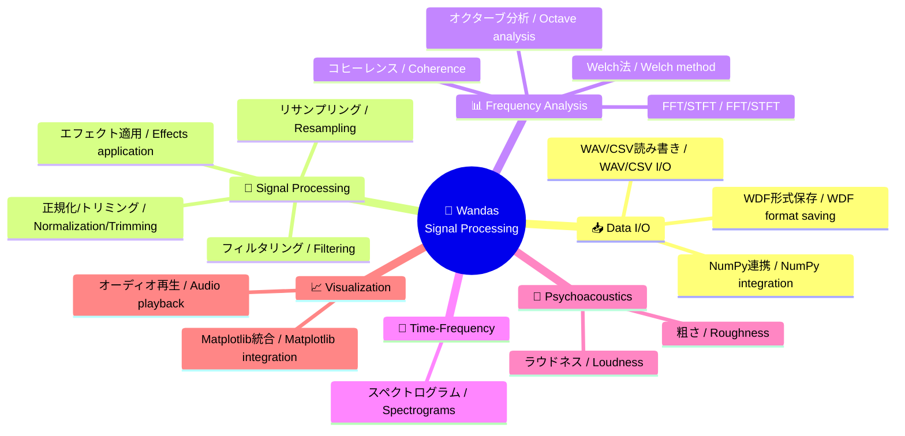

# Wandas

<h1 align="center">
    
</h1>

<p align="center">
    <strong>Data Structures for Waveform Analysis</strong><br>
    Pythonによる効率的な信号解析のためのオープンソースライブラリ
</p>

<p align="center">
    <a href="https://pypi.org/project/wandas/"></a>
    <a href="https://pypi.org/project/wandas/"></a>
    <a href="https://github.com/kasahart/wandas/actions/workflows/ci.yml"></a>
    <a href="https://codecov.io/gh/kasahart/wandas"></a>
    <a href="https://github.com/kasahart/wandas/blob/main/LICENSE"></a>
    <a href="https://pypi.org/project/wandas/"></a>

</p>

---

## 🚀 インストール / Installation

```bash
pip install git+https://github.com/endolith/waveform-analysis.git@master
pip install wandas
```

または開発版 / Or development version:

```bash
pip install git+https://github.com/kasahart/wandas.git
```

## 📖 クイックスタート / Quick Start

```python
import wandas as wd

# WAVファイルを読み込んで解析 / Load and analyze WAV file
signal = wd.read_wav("audio.wav")
signal.describe()  # 信号の概要を表示 / Display signal overview

# フィルタリングと可視化 / Filtering and visualization
filtered = signal.low_pass_filter(cutoff=1000)
filtered.fft().plot(title="周波数スペクトル / Frequency Spectrum")
```

## ✨ 主な機能 / Key Features

### 🎵 包括的な信号処理 / Comprehensive Signal Processing

- **フィルタリング / Filtering**: ローパス、ハイパス、バンドパス、A特性フィルタ / Low‑pass, High‑pass, Band‑pass, A‑weighting filters
- **周波数解析 / Frequency Analysis**: FFT、STFT、Welch法、コヒーレンス、伝達関数 / FFT, STFT, Welch, coherence, transfer functions
- **時間周波数解析 / Time‑Frequency Analysis**: スペクトログラム生成と解析 / Spectrogram generation and analysis
- **心理音響 / Psychoacoustics**: ラウドネス、粗さなどの聴覚指標 / Loudness, roughness and other perceptual metrics

### 📊 pandasライクなデータ構造 / Pandas‑like Data Structures

- **ChannelFrame**: 時間領域データ（サンプル、チャネル、メタデータを保持） / Time‑domain frame (samples, channels, metadata)
- **SpectralFrame**: 周波数領域データ（スペクトル表現） / Frequency‑domain frame (spectrum representations)
- **SpectrogramFrame**: 時間周波数データ（STFT/スペクトログラム） / Time‑frequency frame (STFT / spectrograms)
- **メソッドチェーン / Method chaining**: 直感的で連結可能な処理フロー / Intuitive, chainable processing API

### 🎨 可視化統合 / Visualization Integration

- Matplotlibとシームレスに統合 / Seamless integration with Matplotlib
- `.plot()` による即時表示（Axes返却） / Immediate plotting via .plot() (returns Axes)
- `.describe()` でメタデータ／統計の要約表示 / .describe() for metadata and summary statistics
- カスタマイズ可能なプロットオプション（カラーブラインド対応） / Customizable plot options (color‑blind friendly)

### ⚡ 効率的な大規模データ処理 / Efficient Large Data Handling

- Daskを用いた遅延評価 / Lazy evaluation using Dask
- メモリ効率的なチャンク処理と並列化 / Memory‑efficient chunking and parallelism
- 不要な compute() を避ける設計 / Designed to avoid unnecessary compute() calls

### 🔧 柔軟なI/O / Flexible I/O

- WAV / CSV の読み書き対応 / Read/write WAV and CSV
- WDF（HDF5ベース）でメタデータを完全保存 / WDF (HDF5‑based) with full metadata preservation
- NumPy / Dask配列からの直接生成 / Create directly from NumPy / Dask arrays

### 📈 拡張性 / Extensibility

- プラグイン／AudioOperationベースでカスタム処理を追加可能 / Plugin/custom operations via AudioOperation base
- 処理履歴（operation_history）とメタデータの完全トレーサビリティ / Full traceability with operation_history and metadata
- オープンソースで継続的に機能拡張可能 / Open‑source and continuously extensible
- APIと型ヒントで拡張しやすい設計 / Extension‑friendly design with clear typing

### ✅ テスト・品質 / Testing & Quality

- pytestベースのテストスイート（高いカバレッジを目指す） / pytest‑based test suite (aiming for high coverage)
- mypyによる静的型チェックのサポート / Static type checking with mypy
- CIでの自動テスト・リント・型チェック / Automated CI for tests, linting and type checks

## 🎯 何ができるか / What You Can Do



## 📚 使用例 / Usage Examples

### 基本的な信号処理 / Basic Signal Processing

```python
import wandas as wd

# サンプル信号生成 / Generate sample signal
signal = wd.generate_sin(freqs=[440, 880], duration=2.0, sampling_rate=44100)

# メソッドチェーンでの処理 / Method chaining processing
processed = (
    signal
    .normalize()                    # 正規化 / Normalization
    .low_pass_filter(cutoff=1000)   # ローパスフィルタ / Low-pass filter
    .resample(target_rate=22050)    # リサンプリング / Resampling
)

# FFT解析と可視化 / FFT analysis and visualization
spectrum = processed.fft()
spectrum.plot(title="処理済み信号のスペクトル / Processed Signal Spectrum")
```

### スペクトログラム分析 / Spectrogram Analysis

```python
# 時間周波数解析 / Time-frequency analysis
spectrogram = signal.stft(n_fft=2048, hop_length=512)
spectrogram.plot(cmap='viridis', title="スペクトログラム / Spectrogram")
```

### CSVデータ処理 / CSV Data Processing

```python
# CSVファイルからデータ読み込み / Load data from CSV file
data = wd.read_csv("sensor_data.csv", time_column="Time")
data.plot(overlay=False, title="センサーデータ / Sensor Data")
```

## 📖 ドキュメント / Documentation

- **[公式ドキュメントサイト](https://kasahart.github.io/wandas/)** - 詳細なAPIリファレンスとガイド
- **[チュートリアル](learning-path/)** - 実践的な使用例

## 🛠️ 開発環境 / Development

### テスト実行 / Running Tests

```bash
# 依存関係インストール / Install dependencies
uv sync

# テスト実行 / Run tests
uv run pytest

# カバレッジレポート / Coverage report
uv run pytest --cov=wandas --cov-report=html
```

### 品質チェック / Quality Checks

```bash
# 型チェック / Type checking
uv run mypy --config-file=pyproject.toml

# リント / Linting
uv run ruff check wandas tests

# フォーマット / Formatting
uv run ruff format wandas tests
```

## 🤝 貢献 / Contributing

Wandasはオープンソースプロジェクトです。貢献を歓迎します！ / Wandas is an open-source project. Contributions are welcome!

### 貢献方法 / How to Contribute

1. Issueで問題を報告または機能リクエスト / Report issues or feature requests via Issues
2. Forkしてブランチを作成 / Fork the repository and create a branch
3. 変更を実装し、テストを追加 / Implement changes and add tests
4. Pull Requestを作成 / Open a Pull Request

### GitHub Copilot サポート / GitHub Copilot Support

このリポジトリには包括的なCopilot指示が設定されています。[`.github/copilot-instructions.md`](.github/copilot-instructions.md)を参照して、プロジェクトの構造と開発規約をご確認ください。 / This repository is configured with comprehensive Copilot instructions. See [`.github/copilot-instructions.md`](.github/copilot-instructions.md) for project structure and development conventions.

詳細は[`.github/AGENTS.md`](.github/AGENTS.md)を参照 / For more details, see [`.github/AGENTS.md`](.github/AGENTS.md)

## 🐛 バグ報告・機能リクエスト / Issues

- **バグ報告**: [Issue Tracker](https://github.com/kasahart/wandas/issues) に詳細を記載 / For bug reports, please include details on the Issue Tracker
- **機能リクエスト**: 新機能の提案も歓迎します / Feature requests are also welcome

## 📋 依存関係とライセンス / Dependencies & License

### 主要依存関係 / Core Dependencies

- **NumPy** (BSD 3-Clause) - 配列演算 / Array operations
- **SciPy** (BSD 3-Clause) - 信号処理アルゴリズム / Signal processing algorithms
- **Dask** (BSD 3-Clause) - 遅延評価・並列処理 / Lazy evaluation and parallel processing
- **Matplotlib** (PSF) - 可視化 / Visualization
- **Librosa** (ISC) - 音声処理ユーティリティ / Audio processing utilities
- **h5py** (BSD 3-Clause) - HDF5ファイルサポート / HDF5 file support

### 専門ライブラリ / Specialized Libraries

- **Mosqito** (GPL-3.0) - 心理音響指標 / Psychoacoustic metrics
- **japanize-matplotlib** (MIT) - 日本語フォントサポート / Japanese font support for Matplotlib

### ライセンス / License

このプロジェクトは [MIT License](LICENSE) の下で公開されています。 / This project is licensed under the [MIT License](LICENSE).

---

<p align="center">
    <strong>Wandas で効率的な信号解析を体験しましょう！</strong><br>
    <em>Experience efficient signal analysis with Wandas!</em>
</p>
