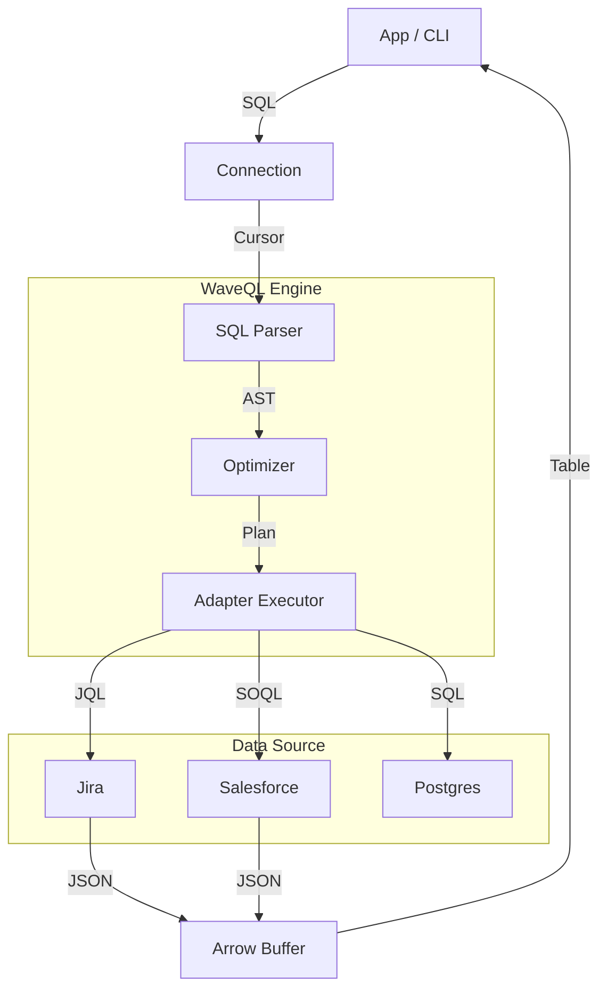

# Architecture

## System Diagram

## Core Components

*   **Connection (`connection.py`)**: Entry point DB-API 2.0. Manages `httpx` pool and Auth.
*   **Optimizer (`query_planner.py`)**:
    *   **Pushdown**: Extracts `WHERE` -> Native filters (JQL/SOQL).
    *   **Federation**: Splits JOINs into separate API calls -> DuckDB.
*   **Transport**:
    *   **Zero-Copy**: Types mapped directly to `pyarrow.Table`.
    *   **Async-First**: All I/O is `asyncio`/`anyio` native.
*   **CDC**:
    *   **Polling**: Timestamp-based cursor tracking.
    *   **WAL**: Postgres replication slot streaming.

## Identifiers
We support:
1.  **Simple**: `incident`
2.  **Qualified**: `servicenow.incident`
3.  **Quoted**: `"incident"`, `"servicenow"."incident"`

## Browser (Wasm)
WaveQL runs in Pyodide. `is_wasm()` switch routes traffic via `pyodide-http` since raw sockets are unavailable.
