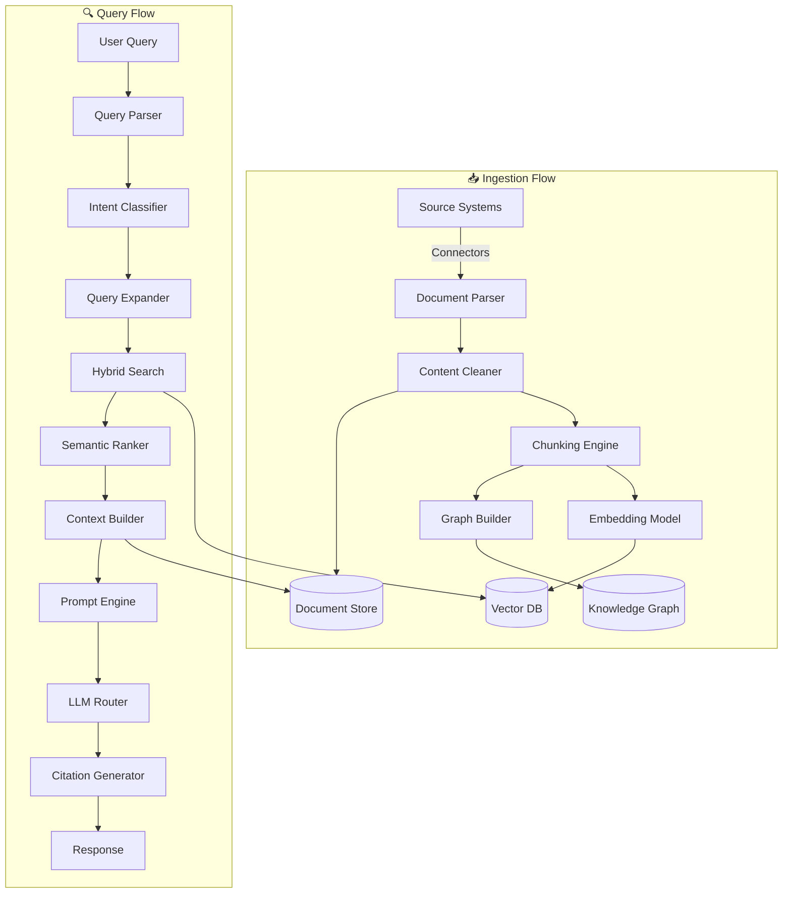

# Idea Summary

> Idea ID: IDEA-011
> Folder: Draft Idea - 01252026 133624
> Version: v1
> Created: 2026-01-25
> Status: Refined

## Overview
An AI-Integrated Enterprise Knowledge Base that serves as the unified knowledge layer for both AI agents and employees. The system consolidates fragmented knowledge tools into a single, intelligent platform powered by RAG (Retrieval-Augmented Generation) architecture.

## Problem Statement
Large enterprises face critical challenges:
- **Knowledge Fragmentation**: Multiple tools (Confluence, SharePoint, Notion, etc.) create silos
- **AI Context Gap**: AI agents lack access to real-time, accurate organizational knowledge
- **Employee Productivity Loss**: Average employee spends 20% of time searching for information
- **Knowledge Staleness**: Static repositories become outdated without continuous maintenance
- **No Single Source of Truth**: Duplication and inconsistency across systems

## Target Users
1. **AI Agents** - Internal chatbots, Copilot, automation agents, customer-facing AI
2. **Employees** (500+) - Knowledge consumers who need quick access to information
3. **Knowledge Curators** - SMEs who maintain and validate content
4. **IT/Platform Team** - System administrators and integrators

## Proposed Solution
A modern **AI Knowledge Management Platform** with three pillars:

### 1. Unified Knowledge Repository
- Centralized storage consolidating all knowledge types
- Automatic ingestion from existing tools (connectors)
- AI-powered tagging, categorization, and enrichment

### 2. RAG-Powered AI Layer
- Vector embeddings for semantic search
- Context-aware retrieval for AI agents
- Grounded generation with citations

### 3. Employee Portal (Library)
- Intuitive search and browse experience
- Personalized recommendations
- Contribution and feedback mechanisms

---

## Layered Architecture

> **Architecture Diagram:** [module-view.html](architecture/module-view.html) | [module-view.dsl](architecture/module-view.dsl)

The system follows a **5-layer architecture** designed for scalability, separation of concerns, and flexibility.

```
┌─────────────────────────────────────────────────────────────┐
│                  CONSUMER INTERFACES                        │
├─────────────────────────────────────────────────────────────┤
│                     API GATEWAY                             │
├─────────────────────────────────────────────────────────────┤
│                     RAG ENGINE                              │
├─────────────────────────────────────────────────────────────┤
│                 KNOWLEDGE PROCESSING                        │
├─────────────────────────────────────────────────────────────┤
│                    DATA STORAGE                             │
└─────────────────────────────────────────────────────────────┘
```

---

### Layer 1: Consumer Interfaces (Amber)

The topmost layer that provides interfaces for both AI and human consumers.

| Module | Components | Description |
|--------|------------|-------------|
| **AI Consumers** | Internal Chatbots, GitHub Copilot, Automation Agents, Customer AI | Programmatic consumers that query the knowledge base via APIs to augment their responses with enterprise knowledge |
| **Human Consumers** | Employee Portal, Search UI, Mobile App, Admin Console | User-facing interfaces for browsing, searching, and managing knowledge |

**Key Responsibilities:**
- Provide unified access point for all consumers
- Adapt responses based on consumer type (structured for AI, rich for humans)
- Handle user authentication and session management

---

### Layer 2: API Gateway (Pink)

The security and traffic management layer that sits between consumers and core services.

| Module | Components | Description |
|--------|------------|-------------|
| **Gateway Services** | Authentication, Rate Limiting | Security controls including SSO/LDAP integration, API key validation, and request throttling |
| **API Endpoints** | REST API, GraphQL API, Streaming API, Webhook Handler | Multiple API protocols to support different integration patterns |

**Key Responsibilities:**
- **Authentication**: Validate user identity via SSO, API keys, or JWT tokens
- **Rate Limiting**: Protect backend services from overload (per-user, per-app limits)
- **REST API**: Standard request/response for simple queries
- **GraphQL API**: Flexible queries for complex data needs
- **Streaming API**: Real-time updates for live search results
- **Webhook Handler**: Push notifications when knowledge changes

---

### Layer 3: RAG Engine (Blue)

The intelligence layer that processes queries and generates contextual responses.

| Module | Components | Description |
|--------|------------|-------------|
| **Query Processing** | Query Parser, Intent Classifier, Query Expander | Understands and enriches user queries for optimal retrieval |
| **Retrieval Pipeline** | Hybrid Search, Semantic Ranker, Context Builder | Finds and ranks the most relevant knowledge chunks |
| **Generation** | Prompt Engine, LLM Router, Citation Generator | Generates natural language responses with citations |

**Component Details:**

#### Query Processing Module
- **Query Parser**: Tokenizes and normalizes input (handles typos, synonyms)
- **Intent Classifier**: Determines query type (factual lookup, how-to, comparison)
- **Query Expander**: Adds related terms and concepts to improve recall

#### Retrieval Pipeline Module
- **Hybrid Search**: Combines vector similarity (semantic) + BM25 (keyword) search
- **Semantic Ranker**: Re-ranks results using cross-encoder models for precision
- **Context Builder**: Assembles top-K chunks into coherent context for LLM

#### Generation Module
- **Prompt Engine**: Constructs prompts with system instructions, context, and query
- **LLM Router**: Routes to appropriate model (GPT-4, Claude, Llama) based on query type
- **Citation Generator**: Extracts and formats source citations for transparency

---

### Layer 4: Knowledge Processing (Indigo)

The data pipeline layer that handles ingestion, transformation, and maintenance.

| Module | Components | Description |
|--------|------------|-------------|
| **Ingestion Pipeline** | Source Connectors, Document Parser, Content Cleaner | Extracts knowledge from various enterprise systems |
| **Embedding Pipeline** | Chunking Engine, Embedding Model, Index Manager | Transforms documents into searchable vector representations |
| **Knowledge Services** | Graph Builder, Freshness Checker, Metadata Enricher | Maintains knowledge quality and relationships |

**Component Details:**

#### Ingestion Pipeline Module
- **Source Connectors**: Pre-built integrations for Confluence, SharePoint, Google Drive, Notion, email archives, Slack, Jira
- **Document Parser**: Extracts text from PDFs, DOCX, HTML, Markdown, spreadsheets
- **Content Cleaner**: Removes boilerplate, normalizes formatting, redacts sensitive data

#### Embedding Pipeline Module
- **Chunking Engine**: Splits documents into semantic chunks (paragraph-level, ~512 tokens)
- **Embedding Model**: Generates vector embeddings (OpenAI Ada, Cohere, SentenceTransformers)
- **Index Manager**: Manages vector index updates, handles incremental indexing

#### Knowledge Services Module
- **Graph Builder**: Constructs knowledge graph from entity relationships
- **Freshness Checker**: Monitors source systems for updates, triggers re-indexing
- **Metadata Enricher**: Auto-tags content with categories, topics, entities

---

### Layer 5: Data Storage (Green)

The persistence layer that stores all knowledge artifacts.

| Module | Components | Description |
|--------|------------|-------------|
| **Vector Storage** | Pinecone/Milvus, Vector Index | High-performance vector database for semantic search |
| **Document Storage** | PostgreSQL, S3/Blob Store | Relational metadata and raw document storage |
| **Knowledge Graph** | Neo4j/Neptune, Graph Index | Graph database for relationship queries |

**Component Details:**

#### Vector Storage Module
- **Pinecone/Milvus**: Managed or self-hosted vector database for embeddings
- **Vector Index**: HNSW or IVF indexes for fast approximate nearest neighbor search
- **Capacity**: Designed for 10M+ vectors with sub-100ms query latency

#### Document Storage Module
- **PostgreSQL**: Stores document metadata (title, author, source, permissions, timestamps)
- **S3/Blob Store**: Raw document storage for original files and chunked content
- **Versioning**: Maintains history of document changes

#### Knowledge Graph Module
- **Neo4j/Neptune**: Stores entities and their relationships
- **Graph Index**: Enables traversal queries (e.g., "find all policies related to X topic")
- **Use Cases**: Contextual navigation, impact analysis, knowledge discovery

---

## Data Flow



---

## Key Features Summary

| # | Feature | Layer | Priority |
|---|---------|-------|----------|
| 1 | Multi-Source Connectors | Knowledge Processing | P0 |
| 2 | Intelligent Chunking | Knowledge Processing | P0 |
| 3 | Vector Embedding Pipeline | Knowledge Processing | P0 |
| 4 | Hybrid Search | RAG Engine | P0 |
| 5 | RAG API Endpoint | API Gateway | P0 |
| 6 | Employee Search Portal | Consumer Interfaces | P1 |
| 7 | Knowledge Graph | Data Storage | P1 |
| 8 | Access Control | API Gateway | P0 |
| 9 | Content Freshness | Knowledge Processing | P1 |
| 10 | Usage Analytics | Consumer Interfaces | P2 |
| 11 | Feedback Loop | RAG Engine | P1 |
| 12 | AI Maintenance Agent | Knowledge Processing | P2 |

---

## Success Criteria
- [ ] Reduce average time-to-answer by 50%
- [ ] Achieve 85%+ retrieval accuracy on benchmark queries
- [ ] Consolidate 3+ existing knowledge tools
- [ ] 80% employee adoption within 6 months
- [ ] AI agents use KB as primary knowledge source

## Constraints & Considerations

### Technical Constraints
- Must integrate with existing enterprise SSO/LDAP
- Data residency requirements (on-prem vs cloud)
- Latency requirements: < 2s for search results

### Security Considerations
- Row-level access control (RBAC) at retrieval time
- Sensitive data redaction before ingestion
- Audit logging for all access
- Compliance with data retention policies

---

## Terminology Analysis

Modern terminology for your use case:
- **Knowledge Base** ✅ - Still widely used, understood
- **Enterprise Knowledge Platform** - More comprehensive positioning
- **AI Knowledge Hub** - Emphasizes AI integration
- **Recommendation**: Use **"Enterprise Knowledge Platform"** or simply **"Knowledge Base"**

---

## Implementation Roadmap

### Phase 1: Foundation (Months 1-3)
- [ ] Set up vector database infrastructure (Data Storage layer)
- [ ] Build ingestion pipeline for top 2 sources (Knowledge Processing layer)
- [ ] Implement basic RAG API endpoint (API Gateway + RAG Engine)
- [ ] Prototype employee search UI (Consumer Interfaces)

### Phase 2: Core Features (Months 4-6)
- [ ] Add remaining source connectors
- [ ] Implement hybrid search + reranking
- [ ] Deploy employee portal v1
- [ ] Integrate with AI agents (Copilot, chatbots)

### Phase 3: Enhancement (Months 7-9)
- [ ] Knowledge graph integration
- [ ] Content freshness automation
- [ ] Usage analytics dashboard
- [ ] Feedback loop implementation

### Phase 4: Optimization (Months 10-12)
- [ ] AI maintenance agent
- [ ] Performance tuning at scale
- [ ] Full migration from legacy tools
- [ ] Change management & training

---

## Source Files
- new idea.md

## Ideation Artifacts
- Architecture Diagram: [module-view.html](architecture/module-view.html)
- Architecture DSL: [module-view.dsl](architecture/module-view.dsl)

## Next Steps
- [ ] Proceed to Idea Mockup (employee portal wireframe)
- [ ] Proceed to detailed component design

## References & Applied Principles

### Applied Principles
- **RAG Architecture** - Retrieval-Augmented Generation for grounded AI responses
- **CQRS Pattern** - Separate read (retrieval) and write (ingestion) paths
- **Layered Architecture** - Clean separation of concerns across 5 layers

### Further Reading
- [Microsoft Azure RAG Design Guide](https://learn.microsoft.com/en-us/azure/architecture/ai-ml/guide/rag/rag-solution-design-and-evaluation-guide)
- [Building Enterprise Knowledge Base with RAG](https://xenoss.io/blog/enterprise-knowledge-base-llm-rag-architecture)
- [AI Knowledge Management Best Practices](https://www.glean.com/perspectives/best-practices-for-implementing-ai-in-knowledge-management-systems)
