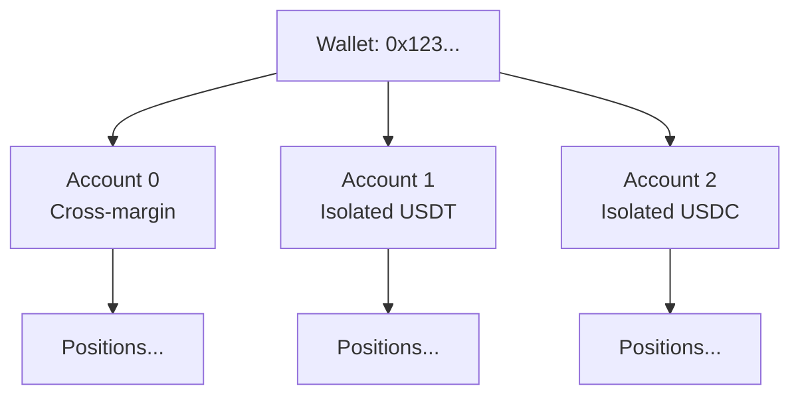
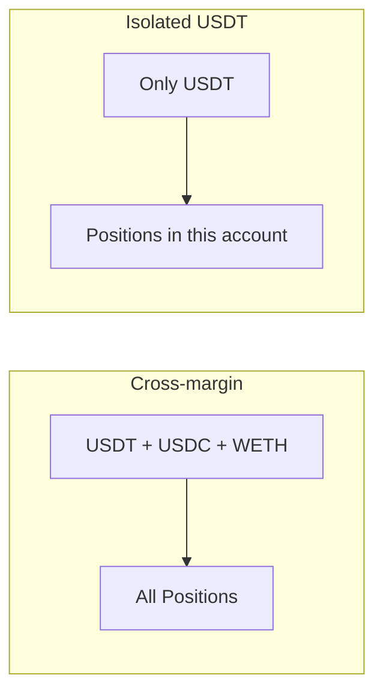

# Account System

Account management in XCCY Protocol.

## Overview

A single wallet can own multiple sub-accounts:



## AccountId

`AccountId` is the structure for account identification:

| Field | Type | Description |
|-------|------|-------------|
| `owner` | `str` | Wallet address |
| `account_id` | `int` | Sub-account index (0, 1, 2, ...) |
| `isolated_margin_token` | `str \| None` | Token for isolated margin, or `None` for cross-margin |

```python
from xccy.types import AccountId

# Explicit creation
account = AccountId(
    owner="0x7f5ff301328391930fFfbb1a781CAB47f5Ec48C4",
    account_id=0,
    isolated_margin_token=None,  # cross-margin
)

# Via client (takes owner from private key)
account = client.account.create_account_id(account_id=0)
```

## Creating Accounts

```python
from xccy.tokens import PolygonTokens

# Default (ID=0, cross-margin)
main = client.account.create_account_id()

# Different strategies = different IDs
trading = client.account.create_account_id(account_id=1)
hedge = client.account.create_account_id(account_id=2)

# Isolated margin (single token as collateral)
isolated_usdt = client.account.create_account_id(
    account_id=0,
    isolated_margin_token=PolygonTokens.USDT,
)

isolated_usdc = client.account.create_account_id(
    account_id=0,
    isolated_margin_token=PolygonTokens.USDC,
)
```

## Cross-margin vs Isolated

| Mode | Collateral | Risk | Use Case |
|------|------------|------|----------|
| **Cross** | Any tokens | Shared across positions | Experienced traders |
| **Isolated** | Specified token only | Isolated per account | Simplicity, safety |



```python
# Check mode
client.account.is_cross_margin(main)          # True
client.account.is_isolated_margin(isolated_usdt)  # True

# Get description
desc = client.account.get_margin_mode_description(isolated_usdt)
print(desc)  # "Isolated margin (0xc2132D05...)"
```

## Operators

Operators are addresses that can act on behalf of an account (e.g., Operator.sol for batching):

```python
# Approve operator
tx = client.account.set_operator(
    account=main,
    operator="0xOperatorContract...",
    approved=True,
)

# Check approval
is_approved = client.account.is_operator(main, operator_address)
print(f"Operator approved: {is_approved}")

# Revoke
tx = client.account.set_operator(main, operator_address, approved=False)
```

## Utilities

```python
# Account hash (for debugging)
account_hash = client.account.get_account_hash(account)
print(f"Hash: 0x{account_hash.hex()}")

# Create new account from existing (same owner)
alt = client.account.derive_account(main, new_id=5)

# "Switch" margin mode (creates new account)
new_account = client.account.switch_margin_mode(
    account=main,
    isolated_token=PolygonTokens.USDC,
)
```

## Key Concepts

1. **AccountId is data, not an on-chain entity**
   - Creating `AccountId` does nothing on-chain
   - Account is "created" on first deposit/swap

2. **Different `account_id` = different positions**
   - Margin and positions are isolated between sub-accounts
   - Useful for separating strategies

3. **One owner, many accounts**
   - All accounts controlled by one wallet
   - Margin can be moved between them

## Example: Multi-account Strategy

```python
from xccy.tokens import PolygonTokens

# Main account for long positions
long_account = client.account.create_account_id(
    account_id=0,
    isolated_margin_token=PolygonTokens.USDT,
)

# Separate account for shorts
short_account = client.account.create_account_id(
    account_id=1,
    isolated_margin_token=PolygonTokens.USDT,
)

# LP account
lp_account = client.account.create_account_id(
    account_id=2,
    isolated_margin_token=PolygonTokens.USDT,
)

# Deposit to each
from xccy import parse_amount

for acc in [long_account, short_account, lp_account]:
    client.margin.deposit(acc, PolygonTokens.USDT, parse_amount(100, "USDT"))
```
