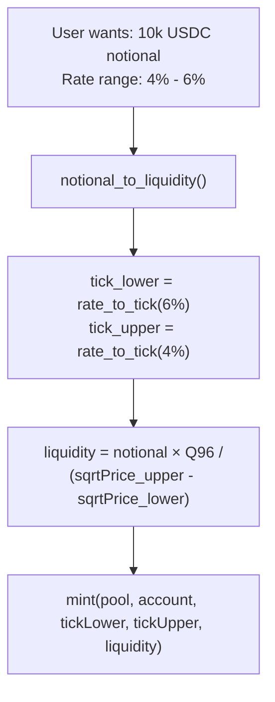
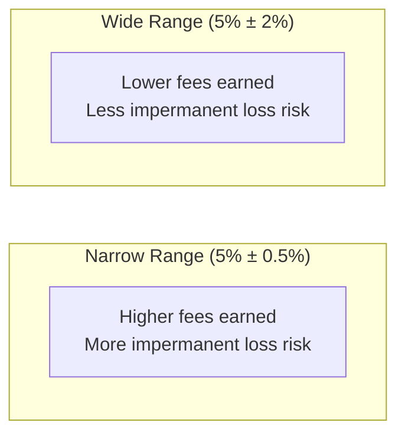
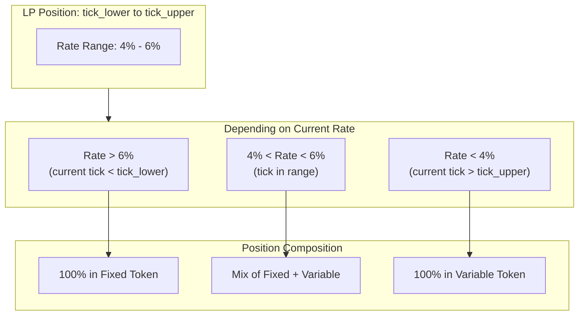

# Liquidity Math

Understanding liquidity, notional, and the math behind LP positions.

## Key Concepts

In XCCY's IRS AMM:

- **Liquidity**: Abstract units representing your LP position size
- **Notional**: Real token value (variable token = underlying)
- **Tick Range**: The rate range where your liquidity is active



## The Formula

From `SqrtPriceMath.sol`:

```
notional = liquidity × (sqrtPrice_upper - sqrtPrice_lower) / Q96
```

Rearranged to get liquidity:

```
liquidity = notional × Q96 / (sqrtPrice_upper - sqrtPrice_lower)
```

Where:
- `Q96 = 2^96` (fixed-point multiplier)
- `sqrtPrice_X = tick_to_sqrt_price_x96(tick_X)`

## Using the SDK

### Notional to Liquidity

```python
from xccy.math import (
    notional_to_liquidity,
    fixed_rate_to_tick,
)

# I want to LP with 10,000 USDC notional
notional = 10_000 * 10**6  # USDC has 6 decimals

# Rate range: 4% to 6%
tick_lower = fixed_rate_to_tick(0.06)  # Higher rate = lower tick
tick_upper = fixed_rate_to_tick(0.04)  # Lower rate = higher tick

# Calculate liquidity needed
liquidity = notional_to_liquidity(notional, tick_lower, tick_upper)

print(f"Liquidity units: {liquidity}")
```

### Liquidity to Notional

```python
from xccy.math import liquidity_to_notional

# Check notional for existing position
liquidity = 1_234_567_890
tick_lower = -6960
tick_upper = -6840

notional = liquidity_to_notional(liquidity, tick_lower, tick_upper)

print(f"Notional: {notional / 10**6:.2f} USDC")
```

### Rate Range Selection



```python
from xccy.math.tick import get_tick_range_for_rate

# Get tick range for 5% ± 0.5% (100 bps total width)
tick_lower, tick_upper = get_tick_range_for_rate(
    target_rate=0.05,
    width_bps=100,
    tick_spacing=60,
)

print(f"Tick range: [{tick_lower}, {tick_upper}]")
```

## Tick Math

### Tick ↔ Rate Conversion

```python
from xccy.math import tick_to_fixed_rate, fixed_rate_to_tick

# Tick to rate
rate = tick_to_fixed_rate(-6930)
print(f"Tick -6930 = {rate:.2%}")  # ~5%

# Rate to tick
tick = fixed_rate_to_tick(0.05)
print(f"5% rate = tick {tick}")  # ~-6930
```

### Tick ↔ SqrtPrice

```python
from xccy.math import tick_to_sqrt_price_x96, sqrt_price_x96_to_tick

# Tick to sqrt price
sqrt_price = tick_to_sqrt_price_x96(-6930)

# Sqrt price to tick
tick = sqrt_price_x96_to_tick(sqrt_price)
```

### Tick Alignment

```python
from xccy.math.tick import align_tick_to_spacing

# Align to pool's tick spacing
tick = -6925
tick_spacing = 60

aligned_down = align_tick_to_spacing(tick, tick_spacing)  # -6960
aligned_up = align_tick_to_spacing(tick, tick_spacing, round_up=True)  # -6900
```

## Position Value

### Current Value

```python
from xccy.math.liquidity import get_position_value_bounds

# Get token amounts for your position
amount0, amount1 = get_position_value_bounds(
    liquidity=liquidity,
    tick_lower=tick_lower,
    tick_upper=tick_upper,
    current_tick=current_tick,
)

print(f"Fixed tokens: {amount0}")
print(f"Notional (variable): {amount1}")
```

### Value Scenarios



## Convenience Functions

### Estimate Liquidity for USD Amount

```python
from xccy.math.liquidity import estimate_liquidity_for_notional

# Quick estimate for $10k USD notional
liquidity = estimate_liquidity_for_notional(
    notional_usd=10_000,
    tick_lower=-6960,
    tick_upper=-6840,
    token_decimals=6,  # USDC
)
```

### Format Notional for Display

```python
from xccy.math.liquidity import format_notional

display = format_notional(
    notional=10_000_000_000,  # 10k in raw units
    token_decimals=6,
    symbol="USDC",
)
print(display)  # "10,000.00 USDC"
```

## Practical Example

```python
from xccy import XccyClient
from xccy.tokens import PolygonTokens
from xccy.math import fixed_rate_to_tick, notional_to_liquidity

# Setup
client = XccyClient(rpc_url="...", private_key="...")
account = client.account.create_account_id()

# Build pool key
pool = client.pool.build_pool_key(
    underlying=PolygonTokens.USDC,
    compound_token=PolygonTokens.A_USDC,
    term_start=1704067200,
    term_end=1735689600,
)

# Define LP range: 4% to 6%
tick_lower = fixed_rate_to_tick(0.06)
tick_upper = fixed_rate_to_tick(0.04)

# Calculate liquidity for $10,000 notional
notional = 10_000 * 10**6
liquidity = notional_to_liquidity(notional, tick_lower, tick_upper)

# Mint liquidity
tx = client.trading.mint(
    pool_key=pool,
    account=account,
    tick_lower=tick_lower,
    tick_upper=tick_upper,
    liquidity=liquidity,
)

print(f"Added {notional / 10**6:,.0f} USDC notional as LP")
```

## API Reference

::: xccy.math.liquidity
    options:
      show_source: false
      members:
        - notional_to_liquidity
        - liquidity_to_notional
        - get_amount0_delta
        - get_amount1_delta
