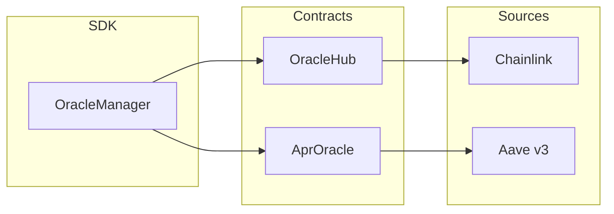

# Oracles

Query prices and APR from on-chain oracles.

## Overview

XCCY uses two types of oracles:

| Oracle | Contract | Data |
|--------|----------|------|
| **OracleHub** | Price source proxy | Token prices in USD |
| **AprOracle** | Rate aggregator | Yield-bearing token APR |



## Token Prices

```python
from xccy.tokens import PolygonTokens

# USD price
price = client.oracle.get_price_usd(PolygonTokens.USDT)
print(f"USDT: ${price:.4f}")  # $1.0000

price = client.oracle.get_price_usd(PolygonTokens.WETH)
print(f"WETH: ${price:.2f}")  # $3500.00

# Raw WAD format (18 decimals)
price_wad = client.oracle.get_price_usd_wad(PolygonTokens.USDT)
print(f"Raw: {price_wad}")  # 1000000000000000000
```

## APR

```python
# Current APR for yield-bearing token
apr = client.oracle.get_apr(PolygonTokens.A_USDT)
print(f"aUSDT APR: {apr * 100:.2f}%")  # 2.98%

apr = client.oracle.get_apr(PolygonTokens.A_USDC)
print(f"aUSDC APR: {apr * 100:.2f}%")

# Raw RAY format (27 decimals)
apr_ray = client.oracle.get_apr_ray(PolygonTokens.A_USDT)
print(f"Raw: {apr_ray}")
```

## Rate Between Timestamps

```python
import time

# Rate accrued between two timestamps
now = int(time.time())
one_hour_ago = now - 3600

rate = client.oracle.get_rate_from_to(
    compound_token=PolygonTokens.A_USDT,
    from_timestamp=one_hour_ago,
    to_timestamp=now,
)
print(f"Rate last hour: {rate:.6f}")
```

## Check Availability

```python
# Check if price is available
try:
    price = client.oracle.get_price_usd(some_token)
except OracleError as e:
    print(f"Price not available: {e}")

# Check if APR is available
try:
    apr = client.oracle.get_apr(some_atoken)
except OracleError as e:
    print(f"APR not configured: {e}")
```

## Data Formats

| Format | Decimals | Example |
|--------|----------|---------|
| **WAD** | 18 | `1000000000000000000` = 1.0 |
| **RAY** | 27 | `50000000000000000000000000` = 5% |

```python
from xccy.math.fixed_point import wad_to_decimal, ray_to_decimal

# WAD → Decimal
value = wad_to_decimal(1_000_000_000_000_000_000)  # → 1.0

# RAY → Decimal
value = ray_to_decimal(50_000_000_000_000_000_000_000_000)  # → 0.05
```

## Supported Tokens

### Polygon

| Token | Address | Price | APR |
|-------|---------|-------|-----|
| USDT | `0xc2132D05...` | ✓ | - |
| USDC | `0x3c499c54...` | ✓ | - |
| WETH | `0x7ceB23fD...` | ✓ | - |
| aUSDT | `0x6ab707Ac...` | - | ✓ |
| aUSDC | `0x625E7708...` | - | ✓ |
| aWETH | `0xe50fA9b3...` | - | ✓ |
