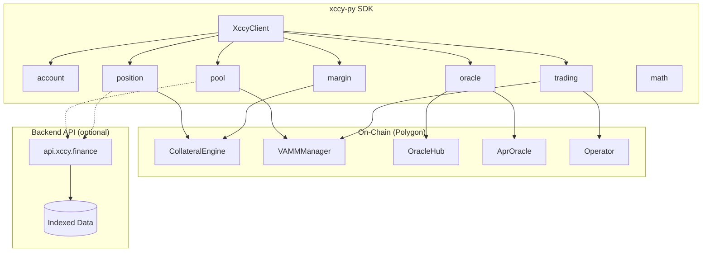
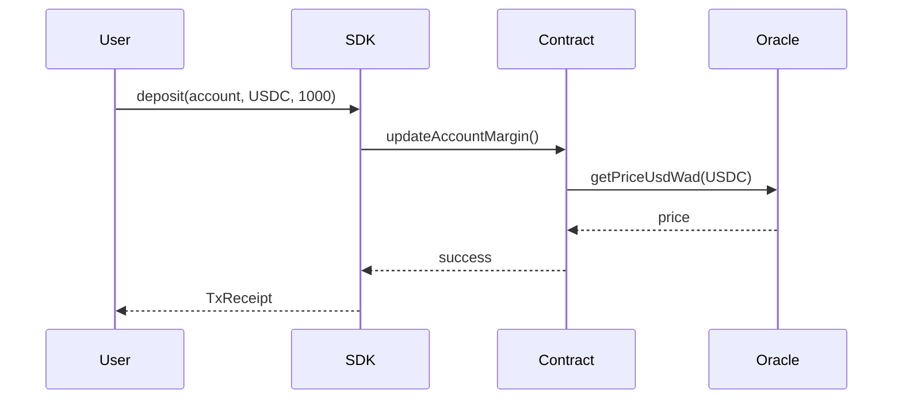
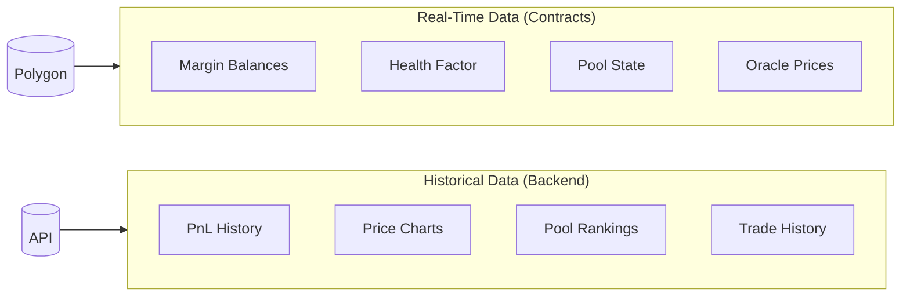
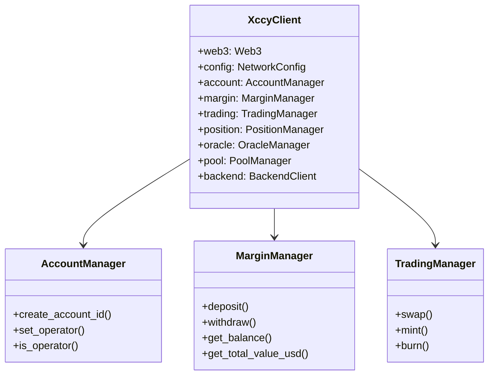
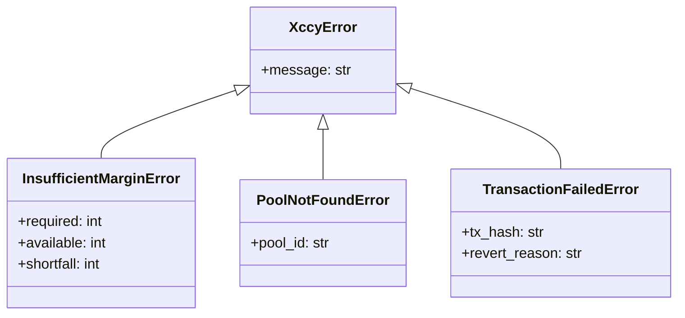

# Architecture

Understanding the XCCY Protocol architecture and how the SDK interacts with it.

## System Overview



## Core Components

### 1. XccyClient

The main entry point that aggregates all functionality:

```python
client = XccyClient(
    rpc_url="https://polygon-rpc.com",
    private_key="0x...",  # Optional
    network="polygon",
    backend_url="https://api.xccy.finance",  # Optional
)
```

### 2. Smart Contracts

| Contract | Purpose | SDK Module |
|----------|---------|------------|
| CollateralEngine | Margin, positions, health | `margin`, `position` |
| VAMMManager | Pool state, swaps, LP | `pool`, `trading` |
| OracleHub | Token prices | `oracle` |
| AprOracle | APR/APY data | `oracle` |
| Operator | Batched operations | `trading` |

### 3. Data Flow



## Data Source Strategy

The SDK follows a **contracts-first** approach:



| Data Type | Source | Reason |
|-----------|--------|--------|
| Margin balances | Contract | Real-time accuracy |
| Health factor | Contract | Critical for liquidation |
| Pool state | Contract | Current price/tick |
| Token prices | Contract | Oracle freshness |
| PnL history | Backend | Requires indexing |
| Price charts | Backend | Aggregated over time |
| Pool rankings | Backend | TVL calculation |

## Module Architecture



## Network Configuration

The SDK supports multiple networks through `NetworkConfig`:

```python
from xccy.constants import POLYGON_CONFIG

print(POLYGON_CONFIG.chain_id)        # 137
print(POLYGON_CONFIG.collateral_engine)  # 0x23e2...
print(POLYGON_CONFIG.vamm_manager)       # 0xe8FE...
```

## Error Handling


