# Health Monitoring

Track positions and liquidation risk.

## Overview

```mermaid
flowchart TD
    Account["Account"]
    
    Account --> Margin["Margin Value"]
    Account --> Obligations["Obligations"]
    
    Margin --> Health["Health Factor"]
    Obligations --> Health
    
    Health --> Safe["Safe ✓"]
    Health --> Warning["Warning ⚠️"]
    Health --> Liquidatable["Liquidatable ❌"]
```



## Check Positions

```python
# Active positions (from backend)
positions = client.position.get_active_positions()

print(f"Active positions: {len(positions)}")
for pos in positions:
    print(f"  Pool: {pos.pool_id[:16]}...")
    print(f"  PnL: ${pos.pnl:.4f}")
```

## User Metrics

```python
# Aggregated metrics (from backend)
metrics = client.position.get_user_metrics()

print(f"Total PnL: ${metrics.total_pnl:.4f}")
print(f"Total Collateral: ${metrics.total_collateral:.4f}")
print(f"Active Positions: {metrics.active_position_count}")
```

## Obligations

```python
# How much margin is required for current positions (in WAD)
obligations = client.position.get_obligations(account)
print(f"Obligations: ${obligations:.4f}")
```

## Health Factor

```
Health Factor = Margin Value / Obligations

> 1.5 : Safe ✓
1.0 - 1.5 : Warning ⚠️
< 1.0 : Liquidatable ❌
```

```python
# Get health status
status = client.position.get_health_status(account)

print(f"Margin: ${status.margin_value_usd:.2f}")
print(f"Obligations: ${status.obligations_usd:.2f}")
print(f"Health Factor: {status.health_factor:.2f}")
print(f"Liquidatable: {status.is_liquidatable}")
```

## Liquidation Risk

```mermaid
flowchart LR
    subgraph Safe["Health > 1.5"]
        S[" ✓ Safe"]
    end
    
    subgraph Warning["1.0 < Health < 1.5"]
        W["⚠️ Add margin"]
    end
    
    subgraph Danger["Health < 1.0"]
        D["❌ Liquidatable"]
    end
    
    Safe --> Warning
    Warning --> Danger
```



```python
# Check if liquidatable
is_liq = client.position.is_liquidatable(account)

if is_liq:
    print("⚠️ Account can be liquidated!")
```

## Real-time Monitoring

```python
import time

def monitor_health(client, account, interval=60):
    """Monitor health factor every N seconds."""
    
    while True:
        try:
            status = client.position.get_health_status(account)
            
            if status.health_factor < 1.0:
                print(f"🚨 LIQUIDATABLE! HF: {status.health_factor:.2f}")
            elif status.health_factor < 1.5:
                print(f"⚠️ WARNING: HF: {status.health_factor:.2f}")
            else:
                print(f"✓ Safe: HF: {status.health_factor:.2f}")
            
            time.sleep(interval)
            
        except KeyboardInterrupt:
            break

# Run
monitor_health(client, account)
```

## Settlement History

```python
# Settlement history (from backend)
settlements = client.position.get_settlements(account.owner)

for s in settlements:
    print(f"Pool: {s.pool_id[:16]}...")
    print(f"  Settled at: {s.settled_at}")
    print(f"  PnL: ${s.settlement_pnl:.4f}")
```

## Best Practices

1. **Keep HF > 1.5** — Buffer for volatility
2. **Monitor on position open** — Especially large ones
3. **Keep reserve** — For quick deposits during drawdowns
4. **Use isolated** — Limits risk to one account

## Example: Alert System

```python
def check_and_alert(client, account, min_health=1.3):
    """Check and alert on low health."""
    
    status = client.position.get_health_status(account)
    
    if status.health_factor < min_health:
        deficit = status.obligations_usd * min_health - status.margin_value_usd
        
        return {
            "alert": True,
            "health_factor": status.health_factor,
            "need_to_deposit": deficit,
            "message": f"Health {status.health_factor:.2f} < {min_health}. Need ${deficit:.2f} more margin."
        }
    
    return {
        "alert": False,
        "health_factor": status.health_factor,
        "message": "Account healthy"
    }

# Usage
result = check_and_alert(client, account)
if result["alert"]:
    print(result["message"])
```
