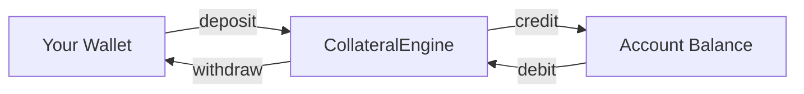
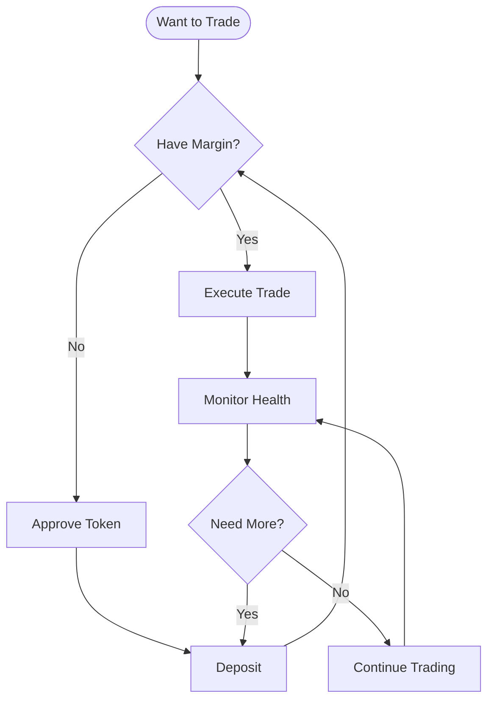
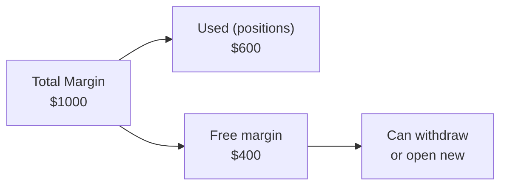

# Margin Operations

Deposit, withdraw, and monitor margin.

## Overview



## Deposit

```python
from xccy import parse_amount
from xccy.tokens import PolygonTokens

# 1. Approve token (one-time per token)
client.margin.approve_token(PolygonTokens.USDT)

# 2. Deposit
tx = client.margin.deposit(
    account=account,
    token=PolygonTokens.USDT,
    amount=parse_amount(100, "USDT"),
)

print(f"Deposited: {tx.transactionHash.hex()}")
```

### Approve with Custom Amount

```python
# Approve only specific amount
client.margin.approve_token(
    token=PolygonTokens.USDT,
    amount=parse_amount(1000, "USDT"),
)

# Unlimited approval (default)
client.margin.approve_token(PolygonTokens.USDT)  # max uint256
```

## Withdraw

```python
# Withdraw 50 USDT
tx = client.margin.withdraw(
    account=account,
    token=PolygonTokens.USDT,
    amount=parse_amount(50, "USDT"),
)

print(f"Withdrawn: {tx.transactionHash.hex()}")
```

⚠️ Withdrawal may revert if:
- Insufficient free margin
- Withdrawal violates margin requirement

## Check Balance

```python
# Balance of specific token (on-chain)
balance = client.margin.get_balance(account, PolygonTokens.USDT)
print(f"USDT balance: {format_amount(balance, 'USDT')}")

# All balances (from backend, if available)
try:
    balances = client.margin.get_all_balances(account)
    for token, amount in balances.items():
        print(f"{token}: {amount}")
except:
    print("Backend not available")
```

## Workflow



## Collateral and Valuation

In **cross-margin** mode:
- All deposits count as collateral
- Valuation in USD via OracleHub

In **isolated-margin** mode:
- Only specified token
- Simpler to calculate

```python
# Total collateral value in USD
total_usd = client.margin.get_total_value_usd(account)
print(f"Total collateral: ${total_usd:.2f}")
```

## Margin vs Free Margin



```python
# Obligations (used margin)
obligations = client.position.get_obligations(account)
print(f"Obligations: ${obligations:.2f}")

# Free margin = Total - Obligations
```

## Best Practices

1. **Approve once** — Unlimited approval saves gas
2. **Keep buffer** — Don't use 100% of margin
3. **Monitor health** — Especially during volatility
4. **Use isolated** — To isolate risks

## Example: Safe Deposit Workflow

```python
from xccy import parse_amount, format_amount
from xccy.tokens import PolygonTokens

def safe_deposit(client, account, token, amount_human):
    """Safe deposit with checks."""
    
    # 1. Check approval
    allowance = client.margin.get_allowance(token)
    amount_raw = parse_amount(amount_human, token)
    
    if allowance < amount_raw:
        print(f"Approving {token}...")
        client.margin.approve_token(token)
    
    # 2. Deposit
    tx = client.margin.deposit(account, token, amount_raw)
    print(f"Deposited {amount_human} {token}: {tx.transactionHash.hex()}")
    
    return tx

# Usage
safe_deposit(client, account, PolygonTokens.USDT, 100)
```
