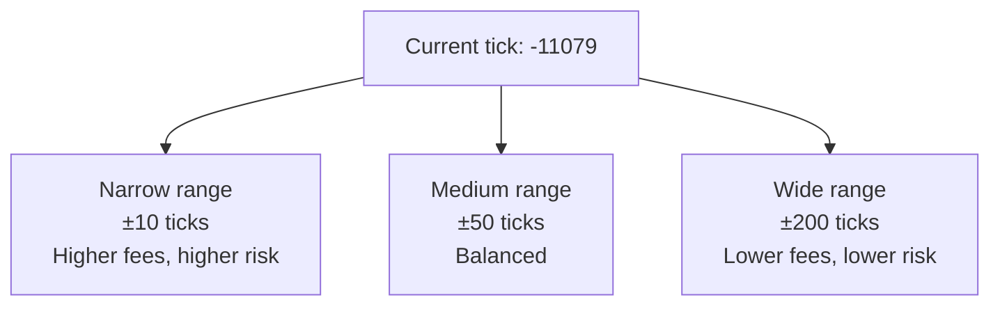

# Provide Liquidity Example

Add and remove liquidity (LP) example.

## Setup

```python
import os
from xccy import XccyClient, parse_amount, format_amount
from xccy.tokens import PolygonTokens
from xccy.types import PoolKey
from web3 import Web3

client = XccyClient(
    rpc_url=os.environ["POLYGON_RPC"],
    private_key=os.environ["PK"],
    backend_url="https://api.xccy.finance",
)

# Get pool
pools = client.pool.list_pools(active_only=True)
usdt_pool = next((p for p in pools if p.token and "6ab707" in p.token.lower()), None)

pool_key = PoolKey(
    underlying_asset=Web3.to_checksum_address(usdt_pool.underlying_token),
    compound_token=Web3.to_checksum_address(usdt_pool.token),
    term_start_timestamp_wad=int(usdt_pool.term_start_timestamp_wad),
    term_end_timestamp_wad=int(usdt_pool.term_end_timestamp_wad),
    fee_wad=int(usdt_pool.fee_wad or "100000000000000"),
    tick_spacing=usdt_pool.tick_spacing,
)

account = client.account.create_account_id(
    account_id=0,
    isolated_margin_token=PolygonTokens.USDT,
)
```

## Get Current Tick

```python
pool_id = pool_key.get_pool_id()
tick, sqrt_price = client.vamm_manager.functions.getVAMMState(pool_id).call()

print(f"Current tick: {tick}")
print(f"Tick spacing: {pool_key.tick_spacing}")
```

## Calculate Tick Range

```python
# Tick range around current (±30 spacing units)
tick_lower = ((tick // pool_key.tick_spacing) - 30) * pool_key.tick_spacing
tick_upper = ((tick // pool_key.tick_spacing) + 30) * pool_key.tick_spacing

print(f"Tick range: [{tick_lower}, {tick_upper}]")
```

## Mint LP

```python
liquidity = 100_000  # Liquidity units

result = client.trading.mint(
    pool_key=pool_key,
    account=account,
    tick_lower=tick_lower,
    tick_upper=tick_upper,
    liquidity=liquidity,
)

print("=" * 50)
print("MINT RESULT")
print("=" * 50)
print(f"TX: {result.transaction_hash}")
print(f"Gas: {result.gas_used:,}")
print()
print(f"Liquidity: {result.liquidity:,}")
print(f"Range: [{result.tick_lower}, {result.tick_upper}]")
print(f"Margin req: {format_amount(result.margin_requirement, 'USDT')} USDT")
```

## Burn LP

```python
result = client.trading.burn(
    pool_key=pool_key,
    account=account,
    tick_lower=tick_lower,
    tick_upper=tick_upper,
    liquidity=liquidity,
)

print("=" * 50)
print("BURN RESULT")
print("=" * 50)
print(f"TX: {result.transaction_hash}")
print(f"Gas: {result.gas_used:,}")
print()
print(f"Burned: {result.liquidity:,}")
print(f"Remaining margin: {format_amount(result.margin_requirement, 'USDT')} USDT")
```

## Output

```
Current tick: -11079
Tick spacing: 1
Tick range: [-11109, -11049]
==================================================
MINT RESULT
==================================================
TX: d3c26e852e19ce7447fb63dd3ccdfeb8ad7ef0bf...
Gas: 1,059,282

Liquidity: 100,000
Range: [-11109, -11049]
Margin req: 0.0132 USDT
==================================================
BURN RESULT
==================================================
TX: 49373002b360b2e6def2f124f47d89613c9bad90...
Gas: 784,507

Burned: 100,000
Remaining margin: 0.0132 USDT
```

## Choosing Tick Range



- **Narrow range**: Higher fees with active trading, but higher risk of going out of range
- **Wide range**: Lower fees, but liquidity works longer

## Convert Liquidity ↔ Notional

```python
from xccy.math.liquidity import liquidity_to_notional

# Calculate notional for our position
notional = liquidity_to_notional(
    liquidity=100_000,
    sqrt_price_current=sqrt_price,
    tick_lower=tick_lower,
    tick_upper=tick_upper,
)

print(f"Notional: {format_amount(notional, 'USDT')} USDT")
```
