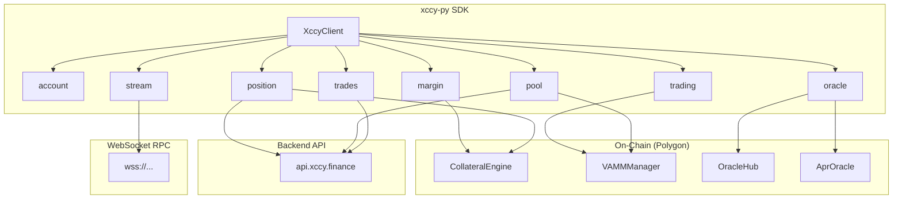

# XCCY Python SDK

**xccy-py** — Python SDK for the XCCY Protocol, an Interest Rate Swap AMM on Polygon.

## What is XCCY?

XCCY Protocol enables trading interest rates through a virtual AMM (vAMM):

- **Trade fixed vs variable** — Lock in fixed rates or speculate on rate movements
- **Provide liquidity** — Earn fees as a market maker on rate ranges
- **Hedge rate risk** — Protect DeFi yields from rate volatility

## Quick Example

```python
from xccy import XccyClient, parse_amount, format_amount
from xccy.tokens import PolygonTokens

# Connect to Polygon
client = XccyClient(
    rpc_url="https://polygon-rpc.com",
    private_key="0x...",
    backend_url="https://api.xccy.finance",
)

# Create account (isolated margin on USDT)
account = client.account.create_account_id(
    account_id=0,
    isolated_margin_token=PolygonTokens.USDT,
)

# Deposit 100 USDT
client.margin.approve_token(PolygonTokens.USDT)
client.margin.deposit(account, PolygonTokens.USDT, parse_amount(100, "USDT"))

# Get active pool from backend
from xccy.types import PoolKey
from web3 import Web3

pools = client.pool.list_pools(active_only=True)
p = pools[0]
pool_key = PoolKey(
    underlying_asset=Web3.to_checksum_address(p.underlying_token),
    compound_token=Web3.to_checksum_address(p.token),
    term_start_timestamp_wad=int(p.term_start_timestamp_wad),
    term_end_timestamp_wad=int(p.term_end_timestamp_wad),
    fee_wad=int(p.fee_wad or "100000000000000"),
    tick_spacing=p.tick_spacing,
)

# Swap: pay fixed on 10 USDT notional
result = client.trading.swap(
    pool_key=pool_key,
    account=account,
    notional=parse_amount(10, "USDT"),
    is_fixed_taker=True,
)

print(f"Fixed delta: {format_amount(result.fixed_token_delta, 'USDT')} USDT")
print(f"Variable delta: {format_amount(result.variable_token_delta, 'USDT')} USDT")
```

## Architecture



## Data Flow

| Operation | Source | Description |
|-----------|--------|-------------|
| Swap / Mint / Burn | Contracts | Transactions via VAMMManager |
| Deposit / Withdraw | Contracts | Via CollateralEngine |
| Prices / APR | Contracts | OracleHub + AprOracle |
| Pool listings | Backend | Aggregated data |
| Positions / PnL | Backend | History and metrics |
| Historical trades | Backend | Indexed trade history |
| Live events | WebSocket | Real-time Swap/Mint/Burn events |

## Installation

```bash
pip install xccy
```

## Guides

- [Quick Start](quickstart.md) — Get started in 5 minutes
- [Account System](accounts.md) — Sub-accounts and margin modes
- [Trading](trading.md) — Swaps and LP
- [Margin](margin.md) — Deposits, withdrawals, monitoring
- [Health Monitoring](health.md) — Position tracking
- [Trade Tracking](trades.md) — Historical and live trade streaming
- [Oracles](oracles.md) — Prices and rates
