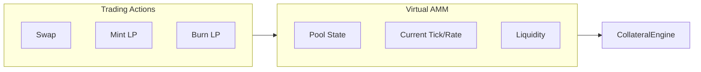
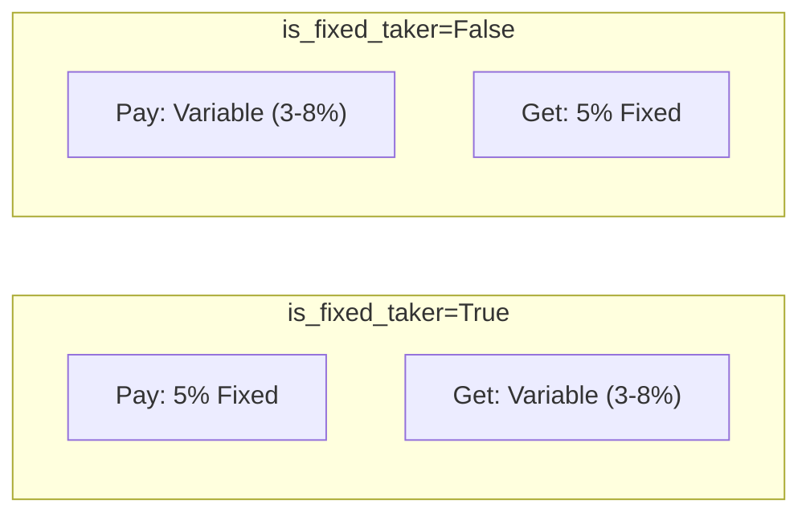
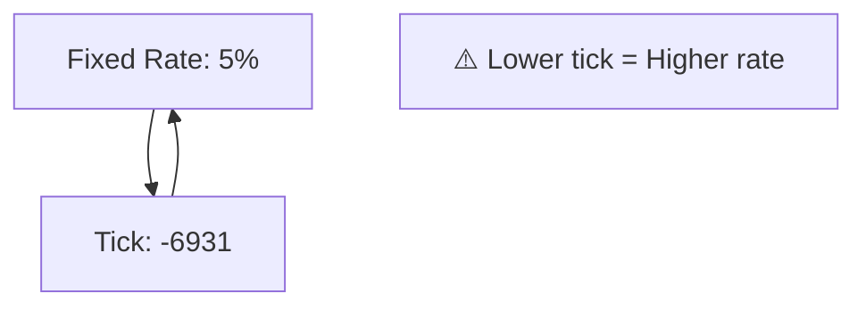
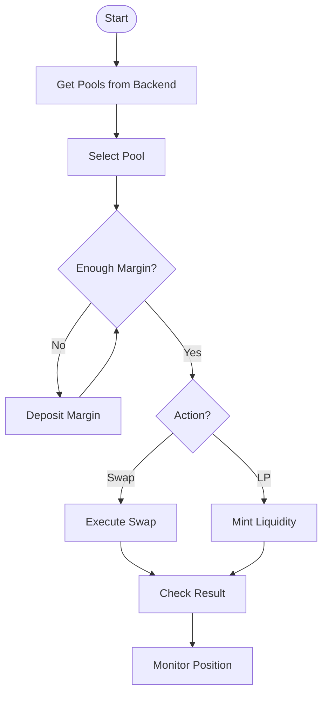

# Trading Guide

Swap and LP operations in XCCY Protocol.

## Overview

XCCY uses a Virtual AMM (VAMM) for interest rate trading:

- **Swap**: Exchange fixed for variable rates
- **Mint**: Add liquidity to a rate range
- **Burn**: Remove liquidity



## Swap

### Executing a Swap

```python
from xccy import parse_amount, format_amount

# Pay fixed rate (receive variable)
result = client.trading.swap(
    pool_key=pool_key,
    account=account,
    notional=parse_amount(10, "USDT"),  # 10 USDT
    is_fixed_taker=True,
)

print(f"TX: {result.transaction_hash}")
print(f"Fixed delta: {format_amount(result.fixed_token_delta, 'USDT')} USDT")
print(f"Variable delta: {format_amount(result.variable_token_delta, 'USDT')} USDT")
print(f"Fee: {format_amount(result.cumulative_fee_incurred, 'USDT')} USDT")
print(f"Margin req: {format_amount(result.position_margin_requirement, 'USDT')} USDT")
print(f"Gas used: {result.gas_used:,}")
```

### SwapResult

| Field | Type | Description |
|-------|------|-------------|
| `fixed_token_delta` | `int` | Fixed token change (raw units) |
| `variable_token_delta` | `int` | Variable token change (raw units) |
| `cumulative_fee_incurred` | `int` | Fee amount |
| `fixed_token_delta_unbalanced` | `int` | Unbalanced delta |
| `position_margin_requirement` | `int` | Required margin |
| `transaction_hash` | `str` | Transaction hash |
| `gas_used` | `int` | Gas consumed |

### Swap Direction

| `is_fixed_taker` | You Pay | You Receive | Use Case |
|------------------|---------|-------------|----------|
| `True` | Fixed rate | Variable rate | Lock in yield |
| `False` | Variable rate | Fixed rate | Bet on rising rates |



## Liquidity Provision

### Get Current Tick

```python
# Pool ID from pool_key
pool_id = pool_key.get_pool_id()

# Current tick and sqrtPrice
tick, sqrt_price = client.vamm_manager.functions.getVAMMState(pool_id).call()
print(f"Current tick: {tick}")
```

### Tick Range

```python
# Tick range around current (±50 ticks accounting for spacing)
tick_lower = ((tick // pool_key.tick_spacing) - 50) * pool_key.tick_spacing
tick_upper = ((tick // pool_key.tick_spacing) + 50) * pool_key.tick_spacing
```

### Mint LP

```python
result = client.trading.mint(
    pool_key=pool_key,
    account=account,
    tick_lower=tick_lower,
    tick_upper=tick_upper,
    liquidity=100_000,
)

print(f"TX: {result.transaction_hash}")
print(f"Liquidity: {result.liquidity:,}")
print(f"Range: [{result.tick_lower}, {result.tick_upper}]")
print(f"Margin req: {format_amount(result.margin_requirement, 'USDT')} USDT")
```

### MintResult

| Field | Type | Description |
|-------|------|-------------|
| `liquidity` | `int` | Liquidity added |
| `tick_lower` | `int` | Lower bound |
| `tick_upper` | `int` | Upper bound |
| `margin_requirement` | `int` | Required margin |
| `transaction_hash` | `str` | Hash |
| `gas_used` | `int` | Gas |

### Burn LP

```python
result = client.trading.burn(
    pool_key=pool_key,
    account=account,
    tick_lower=tick_lower,
    tick_upper=tick_upper,
    liquidity=100_000,
)

print(f"TX: {result.transaction_hash}")
print(f"Burned: {result.liquidity:,}")
print(f"Remaining margin req: {format_amount(result.margin_requirement, 'USDT')} USDT")
```

### BurnResult

| Field | Type | Description |
|-------|------|-------------|
| `liquidity` | `int` | Liquidity removed |
| `tick_lower` | `int` | Lower bound |
| `tick_upper` | `int` | Upper bound |
| `margin_requirement` | `int` | Remaining margin |
| `transaction_hash` | `str` | Hash |
| `gas_used` | `int` | Gas |

## Tick ↔ Rate Conversion

```python
from xccy.math import fixed_rate_to_tick, tick_to_fixed_rate

# Rate → Tick (higher rate = lower tick!)
tick = fixed_rate_to_tick(0.05)  # 5% → ~-6931

# Tick → Rate
rate = tick_to_fixed_rate(-6931)  # → ~5%
```



## Liquidity ↔ Notional

```python
from xccy.math.liquidity import liquidity_to_notional, notional_to_liquidity

# Calculate notional for given liquidity
notional = liquidity_to_notional(
    liquidity=100_000,
    sqrt_price_current=sqrt_price,
    tick_lower=tick_lower,
    tick_upper=tick_upper,
)

# Calculate liquidity for target notional
liquidity = notional_to_liquidity(
    notional=parse_amount(100, "USDT"),
    sqrt_price_current=sqrt_price,
    tick_lower=tick_lower,
    tick_upper=tick_upper,
)
```

## Getting Pools

```python
# From backend (recommended)
pools = client.pool.list_pools(active_only=True)

for p in pools:
    print(f"Pool: {p.pool_id[:24]}...")
    print(f"  TVL: ${p.tvl_usd:.0f}")
    print(f"  APY: {p.apy:.2%}")
    print(f"  Status: {p.status}")

# Build PoolKey
from xccy.types import PoolKey
from web3 import Web3

pool_data = pools[0]
pool_key = PoolKey(
    underlying_asset=Web3.to_checksum_address(pool_data.underlying_token),
    compound_token=Web3.to_checksum_address(pool_data.token),
    term_start_timestamp_wad=int(pool_data.term_start_timestamp_wad),
    term_end_timestamp_wad=int(pool_data.term_end_timestamp_wad),
    fee_wad=int(pool_data.fee_wad or "100000000000000"),
    tick_spacing=pool_data.tick_spacing,
)
```

## Workflow



## Settlement

After pool maturity:

```python
# Settle expired position
tx = client.trading.settle_position(pool_key, account)
```

## Liquidation

Liquidate an undercollateralized account:

```python
# Liquidate target account
tx = client.trading.liquidate_account(
    target_account=target,
    liquidator_account=liquidator,
)
```
