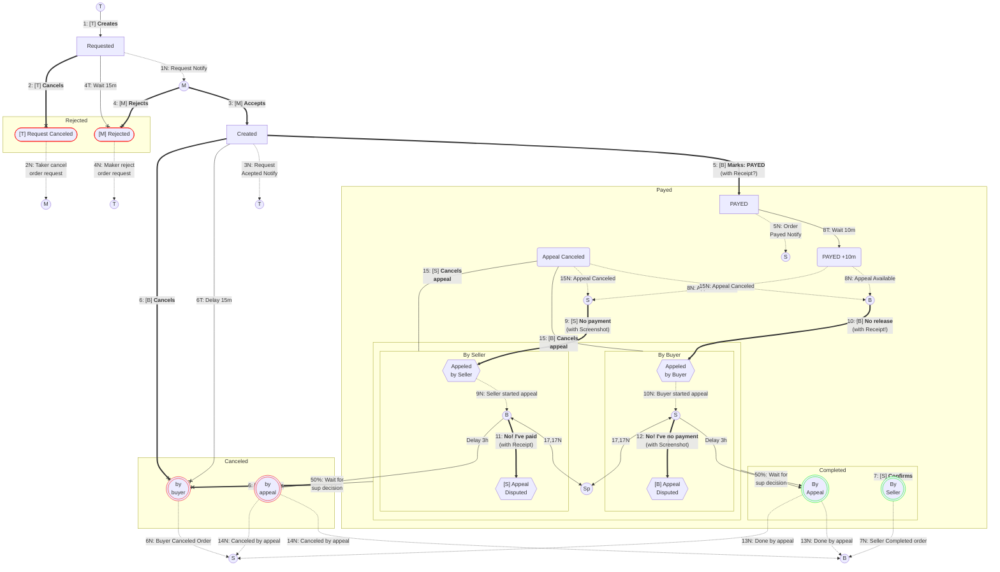

## Структура http-клиентов
#### Абстрактные классы клиентов:
**BaseClient** *[host: str]* - базовый http-клиент, с низкоуровнеными методами get, post, put и delete, сессией, и общими 
для всех клиентов свойствами. *[В конструкторе принимает хост строкой]*

**BaseExClient**(BaseClient) *[ex: Ex]* - клиент с публичными/анонимными методами конкретной биржи.
*[В конструкторе принимает зависимость: экземпляр биржи]*

**_BaseAuthClient**(BaseClient) *[agent: Agent]* - клиент реализующий логин (получение необходимых заголовков) конкретного
юзера биржи. *[В конструкторе принимает зависимость: экземпляр агента]*

**BaseInAgentTrait** - класс реализующий прием входящих событий от биржи. Если у биржи есть вебсокет канал, то по нему,
если нет - то через поллинг каждые х секунд.

**BaseAgentClient**(BaseAuthClient, BaseInAgentTrait) *[agent: Agent, ex_client: BaseExClient]* - клиент с приватными
методами биржи от лица конкретного юзера биржи. *[В конструкторе принимает зависимости: экземпляр агента, и клиента биржи]*

**BaseOrderClient** *[order: Order, agent_client: BaseExClient]* - методы для обработки конкретного ордера на бирже.
*[В конструкторе принимает зависимости: экземпляр ордера, и клиента агента]*

## Order Flow:
- 0: Получшение заявок за заданное время, в статусе, по валюте, монете, направлению: `get_orders(stauts=OrderStatus.active, coin='USDT', cur='RUB', is_sell=False) => [order]`

### Order Class description:
- 1: [T] Запрос на старт сделки (`order`) по чужому объявлению (`ad`) тейкером на сумму amount: `order_request(ad_id, amount) => order_id`
- 1N: [M] - Запрос мейкеру на сделку `order_request_ask => Order`
- 2: [T] Отмена запроса на сделку `cancel_request()`
- 2N: [M] - Уведомление об отмене запроса на сделку `request_canceled_notify`
- 3: [M] Одобрить запрос на сделку `accept_request()`
- 3N: [T] Уведомление об одобрении запроса на сделку `request_accepted_notify`
- 4: [M] Отклонить запрос на сделку `reject_request()`
- 4T: Бездействие 15мин `wait15m_on_order_request`
- 4N: [T] Уведомление об отклонении запроса на сделку `request_rejected_notify`
- 5: [B] Перевод сделки в состояние "оплачено", c отправкой чека `mark_payed(receipt)`
- 5N: [S] Уведомиление продавца об оплате `payed_notify`
- 6T: Бездействие 15мин `wait15m_on_order_creaed`
- 6: [B] Отмена сделки `cancel_order()`
- 6N: [S] Уведомиление продавцу об отмене оредера покупателем `order_canceled_notify`
- 7: [S] Подтвердить получение оплаты `confirm()`
- 7N: [B] Уведомиление покупателю об успешном завершении продавцом `order_completed_notify`
- 8T: Бездействие 10мин `wait10m_on_payed`
- 8N: [S,B] Уведомление о наступлении возможности подать аппеляцию `appeal_available_notify`
- 9,10: [S,B] Подать аппеляцию cо скриншотом/видео/файлом `start_appeal(file)`
- 9N,10N: [S,B] Уведомление о поданной на меня аппеляци `appeal_started`
- 11,12: [S,B] Встречное оспаривание полученной аппеляции cо скриншотом/видео/файлом `dispute_appeal(file)`
- 11N,12N: [S,B] Уведомление о встречном оспаривание поданной аппеляции `dispute_appeal(file)`
- 13T: [S] Бездействие продавца 3часа `seller_wait3h_on_appeal`
- 14T: [B] Бездействие покупателя 3часа `buyer_wait3h_on_appeal`
- 13N: [S,B] Уведомление о завершении сделки по аппеляции `order_completed_by_appeal`
- 14N: [B,S] Уведомление об отмене сделки по аппеляции `order_canceled_by_appeal`
- 15: [B,S] Отмена аппеляции`cancel_appeal()`
- 15N: [B,S] Уведомление об отмене аппеляции против меня `appeal_canceled`
- 16: Отправка сообщения юзеру в чат по ордеру с приложенным файлом `send_order_msg(msg:str, file=None)`
- 16N Получение сообщения в чате по ордеру `get_order_msg => (msg:str, file=None)`
- 17: Отправка сообщения по апелляции `send_appeal_msg(file, msg:str=None)`
- 17N: Получение сообщения по апелляции `get_appeal_msg => msg:str`

### Scheme

###### Legend
***[T] - Taker, [M] - Maker, [S] - Seller, [B] - Buyer***. 
*Clean digits (1, 2, ..)*: Simple outbound HTTP Requests; 
*N suffix (1N, 2N, ..)*: Inbound Notifications - from SSE/WS/Pyrogram client; 
*T suffix (4T, 8T, ..)*: Only Tests with idle waithing time.

### Ex (Public)
- 19: Список поддерживаемых валют тейкера `curs() => [Cur]`
- 20: Список платежных методов `pms() => [Pm]`
- 21: Список платежных методов по каждой валюте `cur_pms_map() => {Cur: [Pm]}`
- 22: Список торгуемых монет (с ограничениям по валютам, если есть) `coins() => [Coin]`
- 23: Список пар валюта/монет `pairs() => [Pair]`
- 24: Список объяв по (buy/sell, cur, coin, pm) `ads(coin: Coin, cur: Cur, is_sell: bool, pms:list[Pm]=None)`
- 42: Минимальные объемы валют в объявлении `cur_mins() => FlatDict`
- 43: Минимальные объемы монет в объявлении `coin_mins() => FlatDict`

### Fiat
- 25: Список реквизитов моих платежных методов `my_fiats(cur:Cur=None) => [Fiat]`
- 26: Создание `fiat_new(cur:Cur, pm:Pm, detail:str, type:PmType=None)`
- 27: Редактирование `fiat_upd(detail:str=None, type:PmType=None)`
- 28: Удаление `fiat_del(fiat_id:int)`

### Ad
- 29: Список моих ad `my_ads()`
- 30: Создание ad: `ad_new(coin: Coin, cur:Cur, is_sell: bool, pms:[Pm], price:float, is_float:bool=True, min_fiat:int=None, details:str=None, autoreply:str=None, status:AdvStatus=AdvStatus.active)`
- 31: Редактирование `ad_upd(pms:[Pm]=None, price:float=None, is_float:bool=None, min_fiat:int=None, details:str=None, autoreply:str=None, status:AdvStatus=None)`
- 32: Удаление `ad_del()`
- 33: Вкл/выкл объявления `ad_switch() => result: bool`
- 34: Вкл/выкл всех объявлений `ads_switch() => result: bool`

### User
- 35: Получить объект юзера по его ид `get_user(user_id) => user`
- 36: Отправка сообщения юзеру с приложенным файлом `send_user_msg(msg:str, file=None)`*
- 37: (Раз)Блокировать юзера `block_user(is_blocked:bool=True)`
- 38: Поставить отзыв юзеру `rate_user(positive:bool)` 
**Inbound:**
- 36N: Получение сообщения от юзера `get_user_msg => (msg:str, file=None)`
- 37N: Получение уведомления о (раз)блокировке юзером `got_blocked => is_blocked:bool`
- 38N: Получение уведомления о полученном отзыве `got_rated => (user_id:int, order_id:int)`

### Assets
- 41: Получить балансы моих монет: `my_assets() => list[Asset]`
- 40: Получить реквизиты для депозита монеты `deposit(amount: int) => bool` 
- 40N: Получена монета `deposited => amount`
- 41: Вывести монету `withdraw(amount: int) => bool`
- 41N: Монета выведена `withdrew => amount`