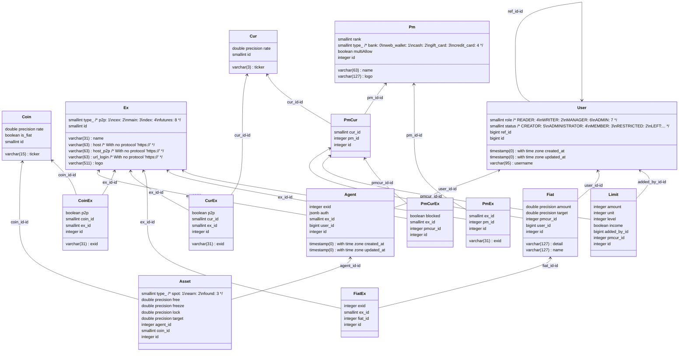

## INSTALL
```bash
# Create python virtual environment
python3 -m venv venv
# Activate this environment
source venv/bin/activate
# Install dependencies
pip install -r requirements.dev.txt

# Create pg db
createdb --U username -W dbname
## set password for db user

# Copy .env file from sample template
cp .env.sample .env
## set your pg creds in .env file
```

## TEST
```bash
pytest
```


### pre-commit
You can done `commit` only after `pytest` will done success.
Pre-commit script stored in `.git/hooks/pre-commit` file; current script is:
```shell
#!/bin/sh
pytest
```

### Relations
