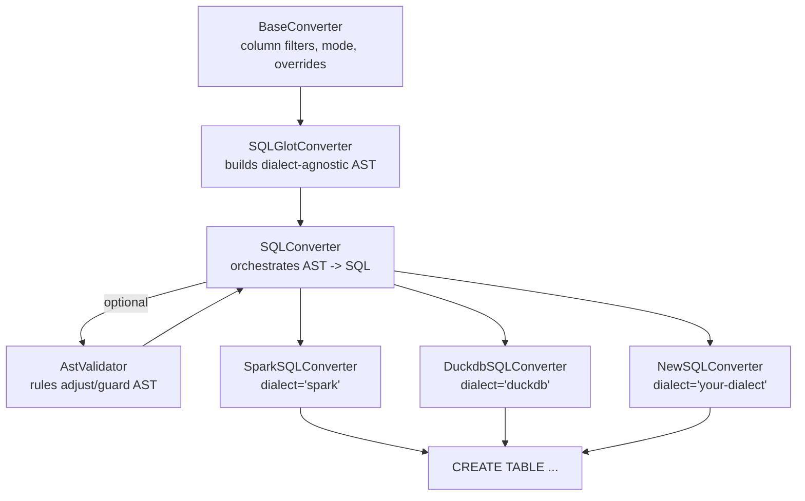

# Extending yads

`yads` keeps its edges intentionally small. Converters map canonical specs to runtime
schemas, SQL converters lean on `sqlglot` for dialect-specific DDL, and loaders ingest
new sources into a `YadsSpec`. This page explains the patterns that make extensions
behave consistently.

## Extension map

- **Writing a Core Converter**: Subclass [`BaseConverter`](../api/converters/index.md)
  when you need to emit a new runtime schema or serialization.
- **Writing a SQL Converter**: Combine [`SQLConverter`](../api/converters/sql/sql.md)
  with an AST converter and optional validators to support a new dialect.
- **Writing a Loader**: Extend [`ConfigurableLoader`](../api/loaders/index.md) to parse
  new inputs into a `YadsSpec`.

## Writing a Core Converter

`BaseConverter` handles column filtering, per-call mode overrides, and the conversion
lifecycle. Built-in converters largely follow the same outline, which keeps behavior
predictable.

### Shape configuration

Define a frozen dataclass that extends `BaseConverterConfig` to add any hooks you need
(fallback types, target toggles, and so on). The base fields already cover:

- `mode`: `"raise"` or `"coerce"` for unsupported features.
- `ignore_columns` / `include_columns`: scope the output.
- `column_overrides`: callables keyed by column name.

### Conversion process

Implement `convert` and `_convert_field_default`. The base class handles filters and
overrides; you focus on mapping a `Field` to your target type.

```python
from dataclasses import dataclass
import yads.spec as yspec
import yads.types as ytypes
from yads.converters import BaseConverter, BaseConverterConfig


@dataclass(frozen=True)
class NewCoreConfig(BaseConverterConfig[dict[str, str]]):
    fallback_type: str = "string"


class NewCoreConverter(BaseConverter[dict[str, str]]):
    def __init__(self, config: NewCoreConfig | None = None) -> None:
        self.config = config or NewCoreConfig()
        super().__init__(self.config)

    def convert(self, spec: yspec.YadsSpec, *, mode: str | None = None) -> dict:
        fields: list[dict[str, str]] = []
        with self.conversion_context(mode=mode):
            self._validate_column_filters(spec)
            for col in self._filter_columns(spec):
                with self.conversion_context(field=col.name):
                    fields.append(self._convert_field_with_overrides(col))
        return {"name": spec.name, "type": "record", "fields": fields}

    def _convert_field_default(self, field: yspec.Field) -> dict[str, str]:
        ytype = field.type
        if isinstance(ytype, ytypes.String):
            return {"name": field.name, "type": "string"}
        if isinstance(ytype, ytypes.Integer):
            return {"name": field.name, "type": "long"}
        if isinstance(ytype, ytypes.Boolean):
            return {"name": field.name, "type": "boolean"}
        coerced = self.raise_or_coerce(
            ytype, coerce_type=self.config.fallback_type
        )
        return {"name": field.name, "type": coerced}
```

Guidance:

- Wrap conversions with `conversion_context(field=...)` to enrich warnings with the
  field name.
- `raise_or_coerce` centralizes error vs. fallback handling and uses your config’s
  `fallback_type` when present.
- If your target type supports, consider `functools.singledispatchmethod`
  like the Polars, PyArrow, and SQL AST converters do.

### Per-column overrides

Overrides run before `_convert_field_default`, so targeted tweaks stay isolated:

```python
def timestamp_override(field, conv):
    return {"name": field.name, "type": "timestamp-millis"}

converter = NewCoreConverter(
    NewCoreConfig(column_overrides={"submitted_at": timestamp_override})
)
schema = converter.convert(spec)
```

## Writing a SQL Converter

SQL support layers a converter stack:

```
YadsSpec -> SQLGlotConverter (AST) -> AstValidator (optional) -> SQLConverter.sql()
```



How the pieces fit together:

- `SQLGlotConverter` subclasses `BaseConverter` and emits a neutral `sqlglot` AST.
- `SQLConverter` keeps the mode in sync, optionally runs an `AstValidator`, and calls
  `.sql(dialect=..., **kwargs)` to format DDL.
- Dialect classes (Spark, DuckDB, or your own) subclass `SQLConverter` and inject
  validator rules plus any AST converter config needed for that dialect.

`SQLConverter` handles mode propagation and column filters. `SQLGlotConverter`
produces a dialect-agnostic `sqlglot` AST, and `AstValidator` applies
dialect-specific rules before rendering.

### New dialect recipe

1. Pick a `sqlglot` dialect string (`dialect="newsqldialect"` or similar).
2. Reuse or add `AstValidationRule` instances to model dialect gaps.
3. Wire them into an `SQLConverterConfig` and subclass `SQLConverter`.

```python
from yads.converters.sql.sql_converter import SQLConverter, SQLConverterConfig
from yads.converters.sql.validators import AstValidator, DisallowType
from sqlglot.expressions import DataType


class NewSQLConverter(SQLConverter):
    def __init__(self, *, mode: str = "coerce") -> None:
        rules = [
            DisallowType(
                disallow_type=DataType.Type.TIMESTAMPLTZ,
                fallback_type=DataType.Type.TIMESTAMPTZ,
            ),
        ]
        validator = AstValidator(rules=rules)
        config = SQLConverterConfig(
            mode=mode,
            dialect="postgres",
            ast_validator=validator,
        )
        super().__init__(config)
```

Configuration choices:

- `SQLGlotConverterConfig` (pass as `ast_converter_config`) controls `if_not_exists`,
  `or_replace`, catalog/database suppression, and `fallback_type`.
- `column_overrides` accepts callables that return `sqlglot.exp.ColumnDef` nodes for
  full control over a column’s AST.
- For a non-sqlglot AST, supply your own `ast_converter` that implements the same
  interface and returns an object exposing `.sql(dialect=..., **kwargs)`.

To surface a new dialect through `yads.to_sql`, add a branch in
`yads.converters.to_sql` that instantiates your converter, or consume your converter
directly.

## Writing a Loader

Loaders turn external schemas into `YadsSpec` instances. Use `ConfigurableLoader`
when you need mode overrides or additional config.

```python
from dataclasses import dataclass
import yads.spec as yspec
import yads.types as ytypes
from yads.loaders import ConfigurableLoader, BaseLoaderConfig
from yads.exceptions import validation_warning, UnsupportedFeatureError


@dataclass(frozen=True)
class NewLoaderConfig(BaseLoaderConfig):
    fallback_type: ytypes.YadsType | None = None


class NewLoader(ConfigurableLoader):
    def __init__(self, config: NewLoaderConfig | None = None) -> None:
        self.config = config or NewLoaderConfig()
        super().__init__(self.config)

    def load(self, new_source) -> yspec.YadsSpec:
        columns: list[yspec.Column] = []
        with self.load_context():
            for name, dtype in new_source.items():
                with self.load_context(field=name):
                    columns.append(self._convert_dtype(name, dtype))
        return yspec.YadsSpec(
            name="analytics.example",
            version=1,
            columns=columns,
        )

    def _convert_dtype(self, name: str, dtype) -> yspec.Column:
        if str(dtype) == "int64":
            return yspec.Column(name=name, type=ytypes.Integer(bits=64))
        if str(dtype) == "object" and self.config.mode == "coerce":
            fallback = self.config.fallback_type or ytypes.String()
            validation_warning(
                message=f"Coercing '{name}' object dtype to {fallback}.",
                filename=__name__,
                module=__name__,
            )
            return yspec.Column(name=name, type=fallback)
        raise UnsupportedFeatureError(f"Unsupported dtype for column '{name}'.")
```

Keep loaders deterministic and explicit about any lossy conversions. When exposing a
new loader via the public API, mirror existing helpers in `yads.loaders.__init__` and
add tests under `tests/` to lock in behavior.

## Before you send a PR

- Add unit tests that cover coercion warnings and failure paths for your extension.
- Run `make test` and `make lint` locally; add integration tests when touching SQL or
  dependency-specific behavior.
- Document any public-facing changes in `docs/` so downstream users know how to opt in
  to your new converter, dialect, or loader.
