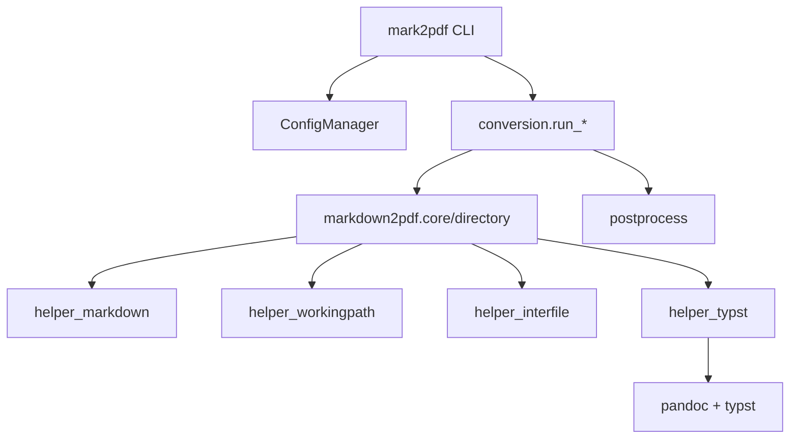

# mark2pdf 项目审计报告（重写版）

> 审计日期：2026-01-01
> 审计范围：全项目（src/、template/、scripts/、pyproject.toml、_logs/docs）
> 状态：配置与工作区体系成型，CLI 功能齐备，核心转换链路清晰

---

## 一、项目概览

### 1.1 项目目标

将 Markdown 转换为 PDF，基于 Pandoc + Typst 排版引擎，提供：
- 工作区模式：通过 `mark2pdf.config.toml` 与 `frontmatter.yaml` 管理输入/输出/模板
- 独立模式：无配置也可转换（当前目录作为工作区）
- 可插拔后处理链：简繁转换、链接移除等
- 辅助工具：图片下载/迁移、稿纸排版、封面尺寸检查

### 1.2 包与入口

- PyPI 包名：`markdown2pdf`（版本 `0.5.29`）
- CLI 入口：`mark2pdf`（主入口）、`markdown2pdf`（旧 CLI 兼容）

---

## 二、架构与流程

### 2.1 主链路（核心转换）



### 2.2 目录结构（当前）

```text
mark2pdf/
├── src/
│   ├── mark2pdf/              # CLI + 工作区管理
│   ├── markdown2pdf/          # 核心转换 API
│   ├── postprocess/           # 内置后处理器
│   ├── helper_markdown/       # 预处理与 frontmatter 工具
│   ├── helper_typst/          # Typst/Pandoc 管线
│   ├── helper_mdimage/        # 图片下载与结构迁移
│   ├── helper_workingpath/    # 路径与模板解析
│   ├── helper_interfile/      # 沙箱/临时文件管理
│   └── helper_gaozhi/         # 稿纸排版预处理
├── template/                  # 内置 Typst 模板
├── scripts/                   # 兼容/辅助脚本
└── _logs/                     # 文档与报告
```

---

## 三、核心模块审计

### 3.1 mark2pdf（CLI + 工作区）

关键模块：
- `cli.py`：主入口与 `convert` 命令
- `commands/`：`init` / `update` / `clean` / `mdimage` / `gaozhi` / `coverprepare`
- `config_loader.py`：配置加载与模板解析
- `workspace_manager.py`：工作区初始化、脚本更新
- `conversion.py`：转换调度（单文件/目录/批量）
- `process_builder.py`：后处理器链
- `reporter.py`：`--show-config` / `--dry-run` 输出

评估：✅ 结构清晰，职责分层合理，CLI 体验完整。

### 3.2 markdown2pdf（核心转换 API）

- `core.py`：单文件转换与沙箱执行
- `directory.py`：目录合并转换
- `options.py`：`ConversionOptions` 统一控制转换行为
- `utils.py`：frontmatter 注入、输出文件名处理、默认预处理链

评估：✅ API 稳定，核心处理链清楚，安全检查（导出名路径穿越）存在。

### 3.3 helper_*（基础能力）

- `helper_markdown`：预处理链 + frontmatter 解析
- `helper_typst`：模板依赖解析 + Pandoc 运行
- `helper_workingpath`：路径解析 + 模板定位
- `helper_mdimage`：图片清理/迁移
- `helper_interfile`：沙箱管理
- `helper_gaozhi`：稿纸排版预处理

评估：✅ 功能齐全，支持多种工作流。

### 3.4 模板与资源

- `template/`：Typst 模板库
- `src/mark2pdf/resources/`：工作区初始化所需脚本与样例

评估：⚠️ 需确保打包时资源可用（见风险项）。

---

## 四、配置与工作模式

### 4.1 配置来源与优先级

- `mark2pdf.config.toml`（工作区根目录）
- `frontmatter.yaml`（默认 frontmatter）
- 文件 frontmatter（覆盖默认）
- CLI 参数（最高优先级）

模板解析顺序：`CLI --template` > `frontmatter.template` > `config.build.default_template` > 默认模板。

### 4.2 工作模式

- 工作区模式：存在 `mark2pdf.config.toml`
- 独立模式：未找到配置文件，使用当前目录

---

## 五、测试与质量

### 5.1 测试概况（静态统计）

- 测试文件：26 个
- `def test_*` 统计：约 287 个（含类内测试方法）

### 5.2 分布（按模块）

| 模块 | test_* 统计 |
|------|------------|
| helper_markdown | 124 |
| helper_mdimage | 30 |
| helper_typst | 19 |
| helper_workingpath | 23 |
| helper_interfile | 5 |
| helper_gaozhi | 23 |
| markdown2pdf | 23 |
| mark2pdf | 40 |

**说明**：未运行测试，仅做静态统计；Pandoc/Typst 相关功能缺少端到端覆盖。

---

## 六、问题与风险

### 6.1 关键风险

1. **工作区脚本参数不匹配**
   - `src/mark2pdf/resources/createpdf.py` 传入 `tc` 参数
   - `run_conversion` / `run_batch_conversion` 不接受 `tc`
   - 结果：脚本会触发 `TypeError`

2. **工作区路径解析与运行目录不一致**
   - `ConfigManager.load()` 依赖 CWD 向上查找配置
   - `run_conversion` 仅用 `workspace_dir` 读取 frontmatter，不参与配置解析
   - 结果：若脚本在非工作区目录运行，输入/输出路径可能错误

3. **模板与资源打包风险**
   - `template/` 与 `src/mark2pdf/resources/` 不在 wheel 包配置中
   - 结果：安装后默认模板与工作区初始化资源可能缺失

4. **批量模式子目录输出未自动创建**
   - `run_batch_conversion` 对子目录输出不创建 `out/<subdir>`
   - 结果：子目录批量转换可能失败（目录不存在）

### 6.2 次要风险

- `open_with_system` 使用 macOS `open`，跨平台兼容性有限。
- `resolve_template_path` 不允许模板带路径，易与用户习惯冲突（需明确文档提示）。

---

## 七、结论

项目整体结构已经从“脚本集合”升级为“可发布工具链”形态，CLI 与工作区体系完整，核心转换能力稳定。当前主要风险集中在**工作区脚本运行一致性**与**模板/资源打包**两个方面，建议优先修复以确保发布质量与用户体验。
