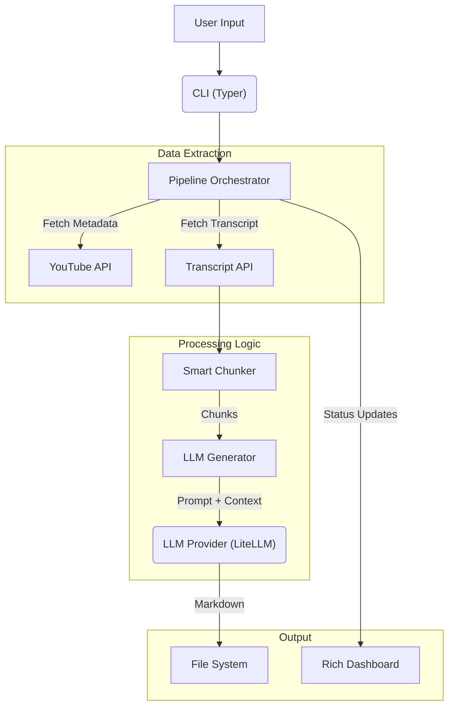

# Architecture & Design

`yt-study` is engineered for reliability, concurrency, and modularity.

## High-Level Data Flow

## Core Components

### 1. Pipeline Orchestrator (`pipeline/orchestrator.py`)
The heart of the application. It uses `asyncio.Semaphore` to manage a pool of worker tasks. It ensures that downloading 50 videos doesn't crash your system or get you rate-limited immediately.

It dynamically initializes the **Dashboard** with the exact number of needed workers (e.g., 1 row for a single video, 5 rows for a playlist), preventing UI clutter.

### 2. Smart Chunker (`llm/generator.py`)
LLMs have context limits. The chunker uses a recursive strategy to split transcripts:
1.  Try splitting by **Sentence boundaries** (`. `).
2.  If a sentence is too long, split by **Newlines**.
3.  If still too long, split by **Spaces**.
4.  Hard split as a last resort.

It calculates token counts using model-specific tokenizers via `litellm`.

### 3. LLM Provider (`llm/providers.py`)
A wrapper around `litellm`. It handles:
-   API Key validation.
-   Retry logic (exponential backoff) for rate limits.
-   Response cleaning (stripping markdown fences).

### 4. YouTube Parsers (`youtube/`)
-   **`transcript.py`**: Robust fetcher that prioritizes manual captions -> auto-generated -> translated. It includes specific handling for `FetchedTranscriptSnippet` objects and `YouTubeIPBlockError` detection.
-   **`parser.py`**: Regex-based URL validation for Videos, Shorts, and Playlists.

## Tech Stack

-   **Language**: Python 3.10+
-   **CLI Framework**: [Typer](https://typer.tiangolo.com/)
-   **TUI/Formatting**: [Rich](https://github.com/Textualize/rich)
-   **LLM Interface**: [LiteLLM](https://docs.litellm.ai/)
-   **YouTube Data**: [pytubefix](https://github.com/JuanBindez/pytubefix) & [youtube-transcript-api](https://github.com/jdepoix/youtube-transcript-api)
-   **Testing**: Pytest, Pytest-Asyncio, Ruff, Mypy
