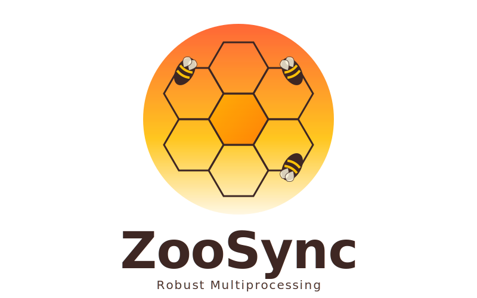

<p align="center">
  <picture>
    <source media="(prefers-color-scheme: dark)" srcset="docs/assets/logo-dark.svg">
    <source media="(prefers-color-scheme: light)" srcset="docs/assets/logo-light.svg">
    
  </picture>
</p>

<p align="center">
High-Performance Multiprocessing Primitives for Python, written in Rust
</p>

<p align="center">
ZooSync provides robust, crash-safe, and zero-copy synchronization primitives backed by Shared Memory (POSIX shm) and Linux Futexes.
</p>

<p align="center">
  <a href="docs/user-guide.md"><b>📖 User Guide</b></a>
</p>

## 🚀 Usage Examples

### Install

```bash
pip install zoosyncmp
```

#### or with uv:

```bash
uv add zoosyncmp
```

### Process Pool

```python
from zoosync import ZooPool

# 8x faster than ProcessPoolExecutor for small tasks
with ZooPool(num_workers=4) as pool:
    # Processing data in parallel with zero IPC overhead
    results = pool.map(lambda x: x*x, range(100))
```

### Lock (Crash-Safe)
```python
from zoosync import ZooLock, LockRecovered

# If a process kills -9 while holding this, the next one recovers it!
lock = ZooLock("my_db_lock")

try:
    with lock:
        # Critical Section
        pass
except LockRecovered:
    print("Previous owner died! State recovered.")
```

### Zero-Copy Queue
```python
from zoosync import ZooQueue

# Ring Buffer in Shared Memory
q = ZooQueue("video_stream", size_mb=100)

# Producer
q.put_bytes(b"frame_data")

# Consumer (Zero-Copy View)
view, cursor = q.recv_view()
# process 'view' directly without copying...
q.commit_read(cursor)
```

## 💡 When to use ZooSync?

| ✅ Use ZooSync when... | ❌ Stick to `multiprocessing` when... |
| :--- | :--- |
| You need **high throughput** (GB/s) between processes. | You are sending small, infrequent messages. |
| You are working with **large data** like Video Frames or Numpy Arrays. | You need to support **Windows**. |
| You require **latency < 1ms** for IPC. | You prefer pure Python standard libraries without binary extensions. |
| You need **crash-safety** (if a worker dies, the lock is released). | You need dynamic buffer resizing (ZooQueue is fixed-size). |

## 📚 Documentation

### Guides
*   **[User Guide](docs/user-guide.md)**: Getting started and common patterns.
*   **[Adapters](docs/adapters.md)**: Integration with Numpy, PyArrow, and Protobuf.
### Features
*   **[Robust Locks](docs/locks.md)**: Crash-safe mutexes that recover from dead workers.
*   **[Zero-Copy Queues](docs/queues.md)**: high-throughput IPC ring buffers.
*   **[ZooPool](docs/pool.md)**: High-performance process pool.

## 📊 Benchmarks

Results from a MacBook Pro M1 8GB RAM (2020):

| Benchmark | `multiprocessing` | `ZooSync` | Speedup |
| :--- | :--- | :--- | :--- |
| **Lock Contention** | 281k ops/s | **1.22M ops/s** | **4.3x** |
| **Queue Throughput** | 4.1 GB/s | **32.6 GB/s** | **7.9x** |
| **Pool Overhead** | 14k tasks/s | **114k tasks/s** | **8.1x** |

### Architecture (ADRs)
*   [001: Hybrid Architecture](docs/adr/001-hybrid-architecture.md)
*   [002: Robust Mutexes](docs/adr/002-robust-mutexes.md)
*   [003: Shared Memory Ring Buffer](docs/adr/003-shm-ring-buffer.md)

### Compatibility

| OS | Lock | Queue | Pool |
| :--- | :--- | :--- | :--- |
| Linux | ✅ | ✅ | ✅ |
| macOS | ✅ | ✅ | ✅ |
| Windows | ❌ | ❌ | ❌ |

## License

MIT
